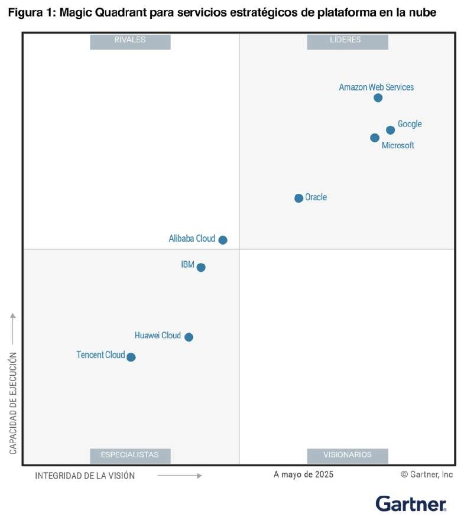
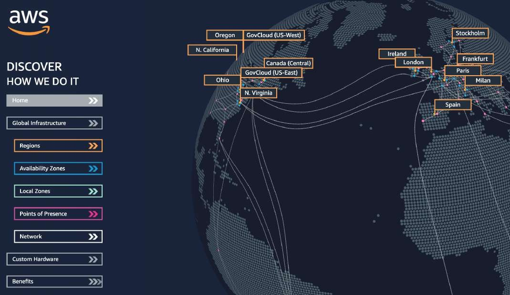
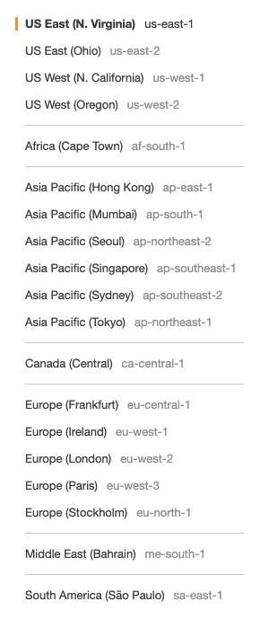
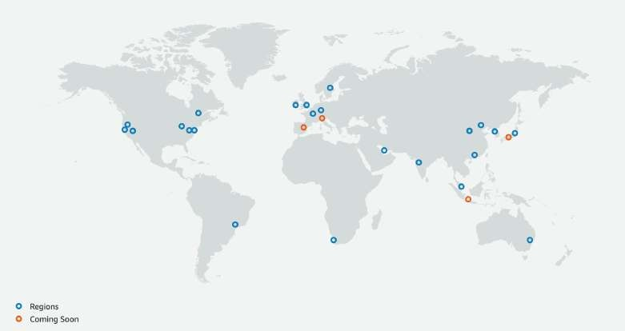
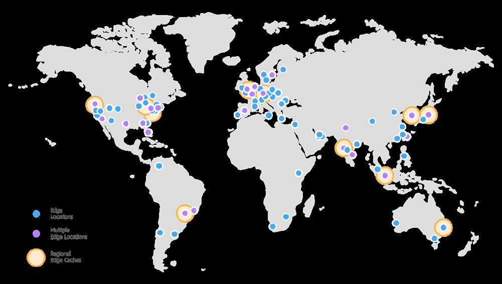

# Fundamentos e Infraestructura Global de AWS

Comprender la infraestructura física y lógica de Amazon Web Services (AWS) es el primer paso crítico para diseñar arquitecturas de alta disponibilidad, tolerancia a fallos, bajo costo y baja latencia, principios fundamentales evaluados rigurosamente en el examen **AWS Certified Solutions Architect - Associate (SAA-C03)**.

---

## 1. Evolución y Posicionamiento de AWS Cloud

La computación en la nube moderna nació de la necesidad de desacoplar y estandarizar la infraestructura tecnológica interna de Amazon. 

- **2002**: Primeros lanzamientos y pruebas de conceptos de infraestructura interna desacoplada.
- **2003**: Definición de la visión técnica: transformar la infraestructura en un catálogo de servicios estandarizados y comercializables.
- **2004**: Lanzamiento público del primer servicio en la nube: **Amazon SQS (Simple Queue Service)**, introduciendo arquitecturas desacopladas basadas en mensajería.
- **2006**: Relanzamiento formal de AWS como plataforma integral con **Amazon SQS**, **Amazon S3 (Simple Storage Service)** y **Amazon EC2 (Elastic Compute Cloud)**.
- **2007**: Expansión internacional con la apertura de la primera región europea (Irlanda).

Con una cuota de mercado sólida, más de 128 mil millones de dólares en ingresos anuales y más de 15 años consecutivos como líder en el Cuadrante Mágico de Gartner para *Strategic Cloud Platform Services*, AWS sustenta cargas de trabajo empresariales modernas, pipelines masivos de Big Data e Inteligencia Artificial generativa.

### Casos de Uso Empresariales
- **Empresariales y Misión Crítica**: Modernización de ERPs, bases de datos transaccionales de alto rendimiento y centros de datos híbridos.
- **Disaster Recovery (DR) y Respaldo**: Almacenamiento elástico y estrategias multirregionales (Backup & Restore, Pilot Light, Warm Standby, Multi-Region Active-Active).
- **Big Data, Analítica e IA**: Ingesta masiva en tiempo real, lagos de datos (Data Lakes) y entrenamiento/inferencia de modelos de Machine Learning.
- **Aplicaciones Web, Móviles y Gaming**: Arquitecturas serverless y microservicios con escalado horizontal automático y distribución global.

---

## 2. Componentes de la Infraestructura Global de AWS

La infraestructura global de AWS se divide jerárquicamente en entidades geográficas y funcionales diseñadas para garantizar resiliencia, redundancia y proximidad:

1. **AWS Regions (Regiones)**
2. **AWS Availability Zones - AZs (Zonas de Disponibilidad)**
3. **AWS Data Centers (Centros de Datos)**
4. **AWS Edge Locations / Points of Presence - PoP (Puntos de Presencia)**

---

## 3. AWS Regions (Regiones)

Una **Región de AWS** es una ubicación física en el mundo compuesta por un clúster geográfico de múltiples Zonas de Disponibilidad (AZs) completamente aisladas entre sí.

- **Nomenclatura estándar**: Sigue la convención `área-dirección-número` (ejemplos: `us-east-1` [N. Virginia], `eu-west-3` [París], `ap-southeast-2` [Sídney]).
- **Aislamiento absoluto**: Cada región es completamente independiente para evitar que un incidente catastrófico en una región afecte a las demás.

### Criterios de Selección de una Región

Para el examen SAA-C03, seleccionar la región adecuada no es una decisión arbitraria; responde a compromisos estrictos de arquitectura:

1. **Cumplimiento Normativo y Soberanía de Datos (Compliance & Data Residency)**:
   - Los datos almacenados en una región **nunca se replican ni se transfieren fuera de ella sin el consentimiento explícito** del cliente (mediante configuración explícita como S3 Cross-Region Replication o réplicas de lectura RDS interregionales).
   - Regulaciones clave: GDPR en la Unión Europea, HIPAA en EE. UU.
2. **Latencia y Proximidad al Usuario Final**:
   - Elegir la región geográficamente más cercana a la base principal de usuarios minimiza el RTT (*Round-Trip Time*).
3. **Disponibilidad de Servicios**:
   - No todos los servicios ni todos los tipos/familias de instancias EC2 están disponibles de inmediato en todas las regiones. Los nuevos servicios suelen debutar primero en regiones insignia (`us-east-1`, `us-west-2`, `eu-west-1`).
4. **Estructura de Precios (Cost Optimization)**:
   - Los costos de cómputo, almacenamiento y transferencia de datos varían sustancialmente entre regiones debido a factores locales (impuestos, costos energéticos, hardware). Por ejemplo, `us-east-1` suele ser más económica que `sa-east-1` (São Paulo).

> **💡 SAA-C03 Exam Tip:**  
> Si una pregunta de examen plantea que una empresa financiera o de salud exige que ningún registro o respaldo salga de una frontera nacional específica por motivos de auditoría, **el requerimiento de gobernanza y soberanía de datos (Compliance) anula cualquier consideración de costo o latencia**. Además, recuerda: AWS **jamás** mueve tus datos entre regiones de forma automática.

---

## 4. Availability Zones (Zonas de Disponibilidad)

Una **Zona de Disponibilidad (AZ)** está compuesta por uno o varios centros de datos físicos discretos, cada uno equipado con infraestructura independiente (suministro eléctrico redundante, generadores diésel en sitio, conectividad de red dedicada y refrigeración autónoma).

- **Estructura por región**: Cada región posee un mínimo estricto de **3 AZs** (y un máximo de hasta 6 en regiones maduras como `us-east-1`).
- **Nomenclatura**: Se identifican con el código de la región seguido de una letra minúscula (ejemplo: `ap-southeast-2a`, `ap-southeast-2b`, `ap-southeast-2c`).
- **Distancia física balanceada**: Las AZs de una misma región se encuentran a decenas de kilómetros de distancia entre sí (suficientemente separadas para aislarse de desastres naturales como inundaciones, incendios o apagones de red eléctrica), pero a menos de 100 km (~60 millas) para mantener una latencia de red ultrabaja en un solo dígito de milisegundos (< 1-2 ms).
- **Interconexión privada**: Se comunican mediante una red de fibra óptica dedicada, redundante y de gran ancho de banda propiedad de AWS.

> **💡 SAA-C03 Exam Tip:**  
> Recuerda que los nombres lógicos de las AZs (ej. `us-east-1a`) están asignados de manera aleatoria e independiente a cada cuenta de AWS para equilibrar la carga física de los centros de datos. Si dos cuentas de AWS necesitan coordinar recursos dentro del mismo centro de datos físico exacto (por ejemplo, para instancias EC2 en un clúster de HPC con latencia extremadamente baja), debes utilizar el **AZ ID** inmutable (ej. `use1-az1`) y no el nombre lógico de la AZ.

---

## 5. Points of Presence (Edge Locations y Cachés Regionales)

Los **Puntos de Presencia (PoP)** constituyen la capa de entrega de contenido en el borde (*Edge*) de AWS, compuesta por más de 450 Edge Locations y más de una decena de Regional Edge Caches distribuidos en más de 90 ciudades.

- Su objetivo fundamental es **acercar el contenido estático y dinámico a la ubicación del usuario final**, reduciendo drásticamente la latencia mediante almacenamiento en caché y aceleración de red.
- Servicios principales que operan sobre Edge Locations:
  - **Amazon CloudFront**: CDN global para entrega de contenido y protección DDoS.
  - **AWS Global Accelerator**: Enruta el tráfico TCP/UDP sobre la red troncal privada de AWS usando IPs Anycast.
  - **Amazon Route 53**: Servicio de DNS autoritativo distribuido globalmente.
  - **AWS WAF**: Inspección y mitigación de amenazas web (inyección SQL, XSS, rate-limiting) directamente en el borde antes de alcanzar el backend.

---

## 6. Alcance de los Servicios: Globales vs Regionales

Un principio de diseño esencial para el arquitecto de soluciones es distinguir la superficie de falla y el alcance de configuración de cada servicio de AWS.

### Tabla Comparativa de Alcance de Servicios

| Criterio | Servicios Globales | Servicios Regionales |
| :--- | :--- | :--- |
| **Definición** | Se administran y operan a nivel mundial desde un único plano de control global; no requieren seleccionar región en la consola. | Operan, se configuran y se aíslan dentro de una región específica de AWS. |
| **Servicios representativos** | • **IAM** (Identity and Access Management) • **Route 53** (DNS global) • **CloudFront** (CDN) • **AWS WAF** (alcance CloudFront) • **AWS Organizations** • **AWS Shield Advanced** | • **Amazon EC2** (Cómputo IaaS) • **Amazon S3** (Buckets con namespace global, pero anclados a una región) • **AWS Lambda** (FaaS) • **Amazon RDS / Aurora** (Bases de datos relacionales) • **Amazon VPC** (Redes virtuales) • **AWS Elastic Beanstalk** (PaaS) |
| **Radio de impacto (Blast Radius)** | Un problema global podría impactar a todas las regiones, aunque AWS diseña particiones aisladas para mitigar esto. | Aislado a la región. Una falla en `us-east-1` no afecta a los recursos en `eu-west-1`. |
| **Estrategia SAA-C03** | Utilizados para gobernanza transversal, resolución DNS inicial y aceleraciónperimétrica. | La alta disponibilidad debe diseñarse implementando arquitecturas **Multi-AZ** o **Multi-Region**. |

> **💡 SAA-C03 Exam Tip:**  
> **Cuidado con las sutilezas de Amazon S3 y AWS WAF en las preguntas de examen**:
> - Los nombres de los buckets de **S3** deben ser globalmente únicos en todo el mundo, pero **S3 es un servicio estrictamente regional**: cada bucket reside físicamente en una región específica elegida durante la creación.
> - **AWS WAF** opera en dos modalidades: **Global** (cuando se asocia a distribuciones de Amazon CloudFront) y **Regional** (cuando se asocia a Application Load Balancers, API Gateways o AppSync en una región concreta). Identificar el componente a proteger define de inmediato si la regla debe ser regional o global.
