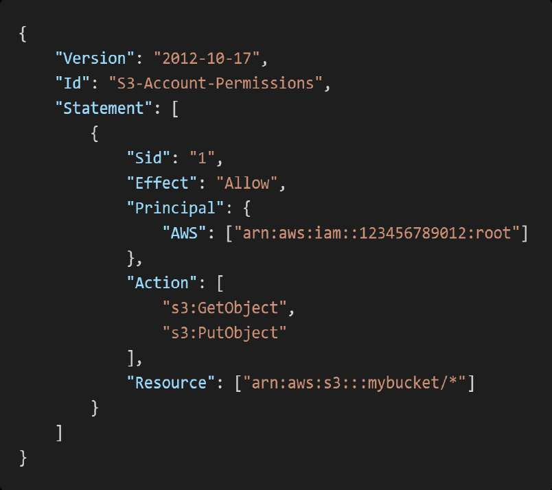
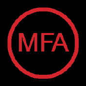
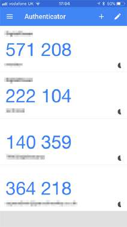
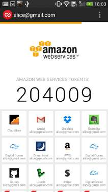
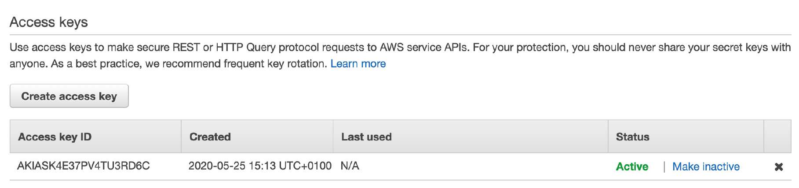
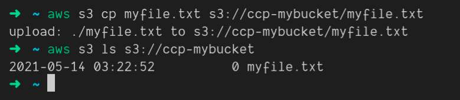
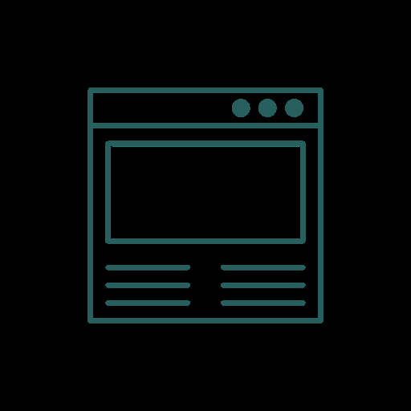

# AWS Identity & Access Management (AWS IAM)

**AWS Identity and Access Management (IAM)** es un servicio de infraestructura crítico y global que administra la autenticación (*quién eres*) y la autorización (*qué puedes hacer*) en los recursos de AWS. Para el examen **AWS Certified Solutions Architect - Associate (SAA-C03)**, dominar IAM es mandatorio, pues constituye la base de la seguridad del perímetro de control, la gobernanza multi-cuenta y el principio de mínimo privilegio.

---

## 1. Entidades Fundamentales de IAM: Usuarios, Grupos y Cuenta Root

IAM opera como un **servicio global**. Las configuraciones, usuarios y políticas existen transversalmente para todas las regiones de AWS dentro de una misma cuenta.

### Cuenta Root (Usuario Raíz)
- Se crea automáticamente al abrir la cuenta de AWS utilizando una dirección de correo electrónico y contraseña maestra.
- **Acceso irrestricto**: Posee acceso total a todos los recursos, configuraciones de facturación, cierre de cuenta y cambio de planes de soporte empresarial.
- **Regla de oro de seguridad**: **No debe usarse para tareas cotidianas ni operativas**. Debe asegurarse inmediatamente con autenticación multifactor (MFA) física o de hardware, bloquear sus credenciales y delegar la administración a usuarios o roles federados de IAM.

### Usuarios de IAM (IAM Users)
- Representan una persona física o una aplicación externa que interactúa con AWS.
- Pueden poseer dos tipos de credenciales de acceso:
  - **Contraseña de consola**: Para interactuar mediante la interfaz gráfica web (*AWS Management Console*).
  - **Access Keys (Access Key ID + Secret Access Key)**: Para llamadas de API, AWS CLI o SDKs.
- Por defecto, un usuario recién creado tiene denegado el acceso a todo (**Zero Trust / Implicit Deny**).

### Grupos de IAM (IAM Groups)
- Colecciones lógicas de usuarios de IAM utilizadas para simplificar la gestión masiva de permisos.
- **Límites arquitectónicos esenciales**:
  - Los grupos **solo pueden contener usuarios**; no pueden contener otros grupos (no existe el anidamiento ni la herencia de grupos).
  - Un usuario puede pertenecer a múltiples grupos (hasta un límite de 10 grupos por usuario por defecto).
  - Los grupos no son identidades autenticables (no tienen credenciales de inicio de sesión ni pueden ser identificados como `Principal` en una política de recursos).


---

## 2. Políticas de IAM y Evaluación de Permisos

Una **política de IAM** es un documento JSON que formaliza los permisos concedidos o denegados a una identidad (política basada en identidad) o a un recurso (política basada en recurso).

### Estructura de un Documento de Política JSON
- **`Version`**: Define la versión sintáctica del lenguaje de políticas. Debe fijarse siempre en `"2012-10-17"` (no usar fechas actuales, ya que versiones anteriores como `"2008-10-17"` carecen de soporte para variables de política y comodines avanzados).
- **`Id`**: Identificador alfanumérico opcional de la política.
- **`Statement`**: Bloque obligatorio que contiene una o varias declaraciones individuales compuestas por:
  - **`Sid` (Statement ID)**: Identificador opcional para documentar la sentencia.
  - **`Effect`**: Determina si se permite (`"Allow"`) o se deniega (`"Deny"`).
  - **`Principal`**: Cuenta, usuario, rol o servicio al que aplica la regla (obligatorio en políticas basadas en recursos como S3 Bucket Policies; omitido en políticas adjuntas directamente a identidades de IAM).
  - **`Action`**: Lista de llamadas a la API de AWS que se autorizan o bloquean (ej. `["s3:GetObject", "ec2:Describe*"]`).
  - **`Resource`**: ARN (*Amazon Resource Name*) del recurso específico sobre el cual aplica la acción (ej. `arn:aws:s3:::mi-bucket/*`).
  - **`Condition`**: Restricciones contextuales opcionales bajo las cuales la política es válida (ej. exigir MFA, restringir por bloque CIDR de IP origen o imponer cifrado TLS).

```json
{
    "Version": "2012-10-17",
    "Statement": [
        {
            "Sid": "ReadOnlyEC2AndELB",
            "Effect": "Allow",
            "Action": [
                "ec2:Describe*",
                "elasticloadbalancing:Describe*"
            ],
            "Resource": "*"
        },
        {
            "Sid": "RequireTLSRequestsOnly",
            "Effect": "Deny",
            "Action": "s3:*",
            "Resource": "arn:aws:s3:::datos-confidenciales/*",
            "Condition": {
                "Bool": {
                    "aws:SecureTransport": "false"
                }
            }
        }
    ]
}
```




### Tipos de Políticas y Herencia
1. **Managed Policies (Políticas Administradas por AWS)**: Creadas y mantenidas por AWS (ej. `AdministratorAccess`, `ReadOnlyAccess`).
2. **Customer Managed Policies (Políticas Administradas por el Cliente)**: Creadas por el usuario en su cuenta, reutilizables y con control de versiones.
3. **Inline Policies (Políticas en Línea)**: Documentos JSON incrustados directamente y de forma estricta en un único usuario, grupo o rol. Si se elimina la identidad, la política se destruye. (Antipatrón: usar administradas siempre que sea posible).


> **💡 SAA-C03 Exam Tip:**  
> **Lógica de evaluación de políticas en AWS**:  
> 1. Por defecto, toda solicitud inicia con una **Denegación Implícita (*Implicit Deny*)**.  
> 2. Una política con un **Permiso Explícito (*Explicit Allow*)** autoriza la acción.  
> 3. Sin embargo, un **Rechazo Explícito (*Explicit Deny*) anula absolutamente cualquier Allow**, sin importar la procedencia (ya sea por política de grupo, rol, Service Control Policy [SCP] o política de bucket). Si una sola política dice `Deny`, la petición queda bloqueada.

---

## 3. Seguridad de Acceso: Políticas de Contraseñas y MFA

### Política de Contraseñas de Cuenta
AWS permite aplicar parámetros estrictos de higiene de seguridad para contraseñas de consola de IAM:
- Longitud mínima de caracteres.
- Complejidad: mezcla obligatoria de mayúsculas, minúsculas, dígitos y símbolos.
- Expiración forzada periódica (rotación programada de credenciales).
- Prevención de reutilización de contraseñas previas.
- Habilitar que los propios usuarios de IAM puedan cambiar su contraseña.

### Multi-Factor Authentication (MFA)
MFA añade una capa crítica de seguridad requiriendo un factor de conocimiento (*password*) y un factor de posesión (*token o dispositivo*).




### Comparativa de Métodos MFA en AWS

| Tipo de Dispositivo MFA | Opciones Representativas | Ventajas Clave | Casos de Uso SAA-C03 |
| :--- | :--- | :--- | :--- |
| **Virtual MFA App** | Google Authenticator, Microsoft Authenticator, Authy | Gratuito, despliegue inmediato en teléfonos inteligentes. Soporta múltiples tokens en una app. | Acceso general de desarrolladores y operadores cotidianos de IAM. |
| **FIDO / WebAuthn / Clave U2F de Hardware** | YubiKey | Alta resistencia a phishing, hardware criptográfico dedicado, soporte multi-cuenta. | Administradores de infraestructura y usuarios con privilegios elevados. |
| **Hardware Key Fob (Llavero Físico)** | Gemalto (SafeNet) | Generador de tokens OTP físico e independiente fuera de redes móviles o internet. | Cuentas corporativas reguladas y protección exclusiva de la **Cuenta Root**. |
| **Hardware Token para Entornos Regulados** | SurePassID | Cumplimiento de estándares gubernamentales de alta seguridad. | Implementaciones en **AWS GovCloud (US)** y entornos militares/defensa. |





---

## 4. Vías de Acceso: Consola, AWS CLI y AWS SDK

Los usuarios y servicios interactúan con los servicios de AWS a través de llamadas HTTPS a las API REST públicas subyacentes.

1. **AWS Management Console**: Acceso web protegido por usuario, contraseña y MFA.
2. **AWS Command Line Interface (AWS CLI)**: Herramienta de código abierto basada en Python que permite controlar y automatizar la nube mediante comandos en la terminal.
3. **AWS Software Developer Kit (AWS SDK)**: Bibliotecas optimizadas por lenguaje de programación (Python/Boto3, Java, JavaScript/Node.js, Go, .NET, C++) que gestionan serialización JSON, reintentos automáticos (*exponential backoff*) y firma de solicitudes criptográficas (*SigV4*).

### Claves de Acceso (Access Keys)
- Compuestas por:
  - **Access Key ID**: Equivale al identificador público de usuario (prefijo usual `AKIA...` para usuarios IAM).
  - **Secret Access Key**: Equivale a la contraseña secreta. Solo es visible una vez al momento de la creación.
- **Riesgo crítico**: Si una clave de acceso se filtra en un repositorio público (ej. GitHub), la cuenta puede ser comprometida en segundos por bots maliciosos.







> **💡 SAA-C03 Exam Tip:**  
> **Antipatrón clásico de examen**: Guardar credenciales estáticas (`Access Key ID` y `Secret Access Key`) en el código fuente de una aplicación o codificarlas en el archivo de configuración de una instancia EC2.  
> La **única respuesta arquitectónicamente correcta** para dar acceso a servicios que corren sobre AWS (EC2, ECS, Lambda) es **adjuntar un Rol de IAM (*IAM Role*)**, el cual suministra credenciales temporales que se rotan de forma automática mediante AWS STS (*Security Token Service*).

---

## 5. Roles de IAM (IAM Roles)

Un **IAM Role** es una identidad de AWS que no tiene credenciales a largo plazo (no tiene contraseñas ni claves de acceso fijas). En su lugar, cualquier entidad de confianza que asuma el rol obtiene **credenciales de seguridad temporales** válidas por períodos configurables (de 15 minutos a 12 horas).

### Componentes de un Rol
1. **Trust Policy (Política de Confianza)**: Documento JSON que define qué entidad o servicio tiene permiso de asumir el rol (`sts:AssumeRole`). Ejemplo: el servicio `ec2.amazonaws.com`.
2. **Permissions Policy (Política de Permisos)**: Define los permisos sobre los recursos de AWS que adquiere la entidad mientras porta el rol.
3. **Instance Profile**: Contenedor lógico que permite pasar un rol de IAM a una instancia EC2 al momento de su lanzamiento.

### Casos de Uso Principales
- **Cargas de trabajo en AWS**: Asignar permisos a instancias EC2, tareas ECS o funciones AWS Lambda.
- **Acceso Cruzado entre Cuentas (Cross-Account Access)**: Permitir que usuarios de la Cuenta A administren recursos en la Cuenta B sin duplicar usuarios ni exponer credenciales.
- **Federación de Identidades**: Delegar autenticación a proveedores externos mediante SAML 2.0 u OpenID Connect (OIDC) (ej. Microsoft Entra ID / Active Directory, Google, Okta).


---

## 6. Auditoría y Herramientas de Seguridad en IAM

El mantenimiento del principio de mínimo privilegio (*Least Privilege*) requiere auditoría continua para eliminar permisos y credenciales obsoletos.

### Comparativa: IAM Credentials Report vs IAM Access Advisor

| Característica | IAM Credentials Report | IAM Access Advisor |
| :--- | :--- | :--- |
| **Nivel de Alcance** | **Nivel de cuenta completo** (Account-level). | **Nivel de entidad individual** (Usuario, Grupo, Rol o Política). |
| **Formato de Salida** | Archivo `.csv` descargable que detalla el estado de todos los usuarios de la cuenta. | Pestaña gráfica interactiva dentro de la consola de IAM. |
| **Métricas Clave** | • Antigüedad de contraseñas.<br>• Estado y fecha de rotación de Access Keys (Key 1 y Key 2).<br>• Si el usuario tiene o no MFA habilitado.<br>• Fecha del último uso de credenciales. | • Servicios permitidos por las políticas asignadas.<br>• Fecha y hora exacta del último acceso (*Last accessed timestamp*) a cada servicio.<br>• Servicios con permisos concedidos que **nunca** se han utilizado. |
| **Objetivo en SAA-C03** | Auditorías de cumplimiento general, detección de cuentas sin MFA y rotación de claves inactivas (> 90 días). | Refinamiento de políticas para aplicar el **Principio de Mínimo Privilegio**, eliminando permisos concedidos que no se usan. |

---

## 7. Buenas Prácticas de IAM (Checklist para el Examen)


1. **Aislar la Cuenta Root**: Usarla exclusivamente para crear el primer usuario/rol administrador, configurar la facturación y habilitar MFA físico; jamás para despliegues cotidianos.
2. **Un Usuario Físico = Un Usuario IAM**: No compartir cuentas ni credenciales genéricas entre desarrolladores.
3. **Asignación de Permisos mediante Grupos**: Asignar políticas a grupos y colocar a los usuarios dentro de ellos para evitar divergencias de configuración individual.
4. **Imponer MFA de Manera Estricta**: Obligatorio en la cuenta Root y en todas las identidades con privilegios administrativos o de producción.
5. **Favorecer Roles de IAM sobre Credenciales Estáticas**: Nunca colocar `access_key` o `secret_key` en archivos de código, contenedores o instancias EC2.
6. **Rotación Periódica de Claves**: Rotar las claves de acceso activas al menos cada 90 días mediante pipelines o automatizaciones.
7. **Auditoría Continua**: Generar periódicamente el **Credentials Report** para eliminar accesos obsoletos y usar **Access Advisor** para revocar permisos nunca ejercidos.
