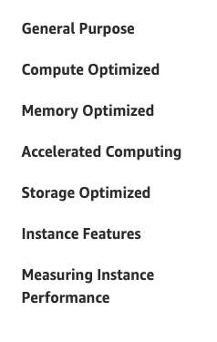
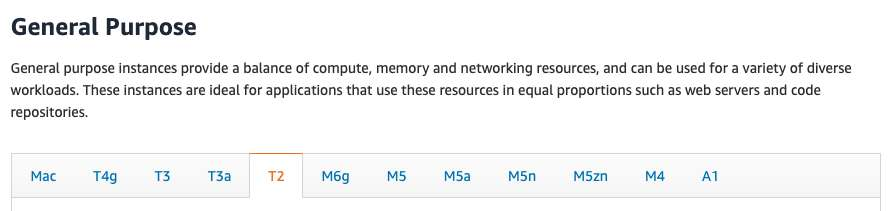
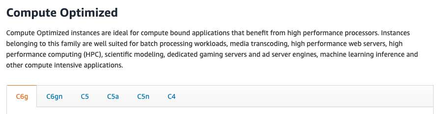
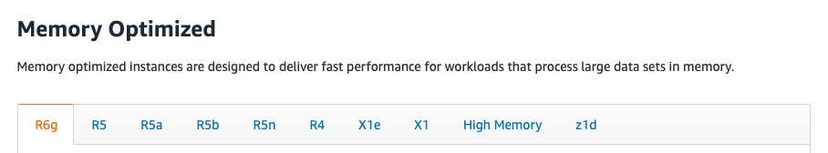
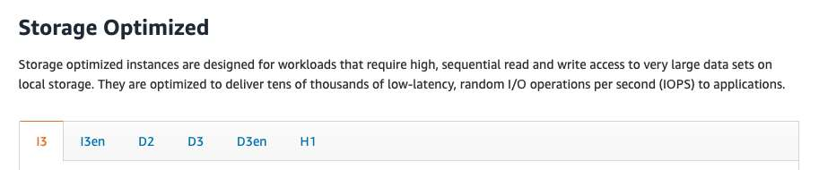
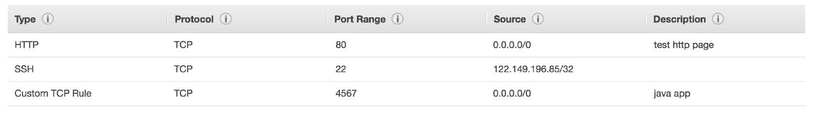
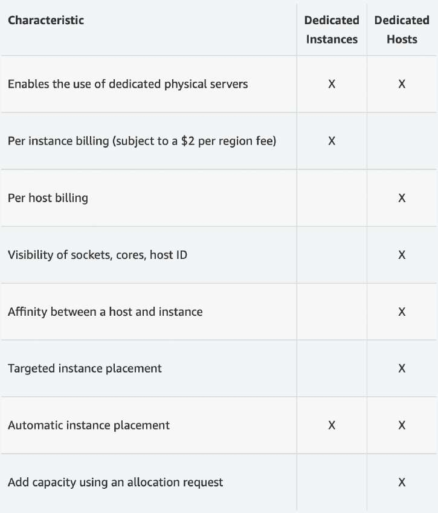
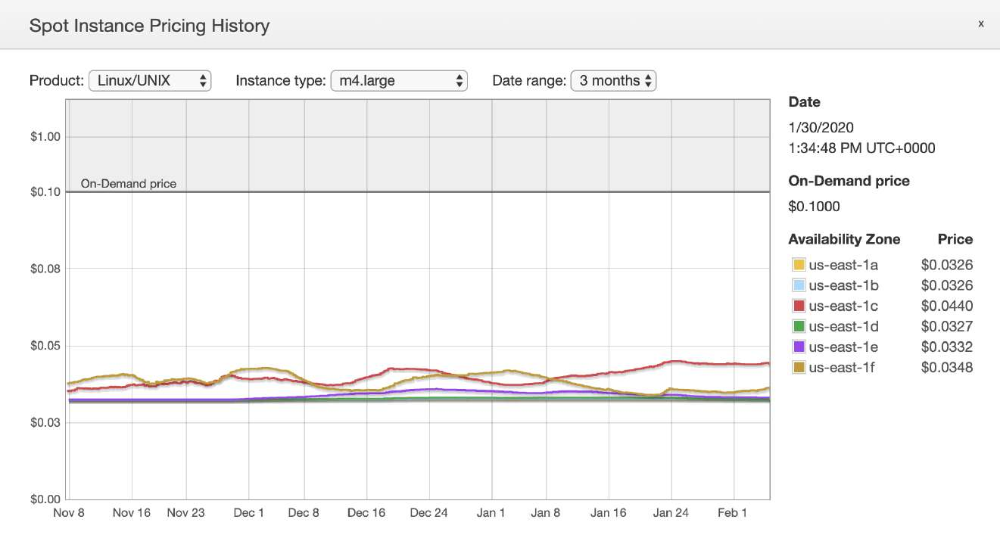
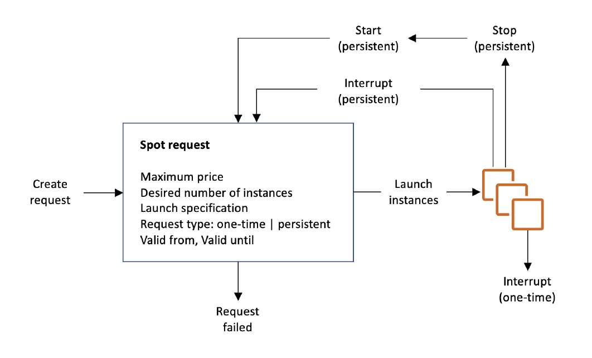
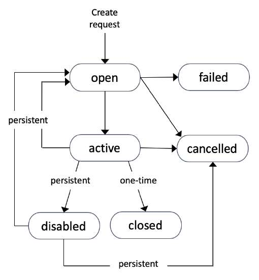

# Amazon EC2 - Conceptos Básicos y Modelos de Cómputo

**Amazon Elastic Compute Cloud (Amazon EC2)** es el servicio central de Infraestructura como Servicio (IaaS) en AWS. Proporciona capacidad de cómputo escalable y redimensionable en la nube, eliminando la necesidad de invertir en hardware local. En el examen **AWS Certified Solutions Architect - Associate (SAA-C03)**, EC2 es evaluado profundamente en cuanto a selección de tipos de instancia, dimensionamiento, modelos de compra para optimización de costos, mecanismos de conectividad y seguridad a nivel de red con Security Groups.

---

## 1. Fundamentos de Amazon EC2

Amazon EC2 permite desplegar y administrar servidores virtuales elásticos (*instancias*). La solución comprende una suite de componentes clave:
- **Cómputo virtual**: Instancias EC2 configurables en vCPUs y memoria RAM.
- **Almacenamiento en bloque persistente y efímero**: **Amazon EBS (Elastic Block Store)** para discos virtuales persistentes en red, o **EC2 Instance Store** para discos NVMe/SSD de conexión física y alta velocidad de E/S pero naturaleza efímera.
- **Almacenamiento de archivos compartidos**: **Amazon EFS** (para instancias Linux concurrentes) o **Amazon FSx**.
- **Distribución de carga de red**: **Elastic Load Balancing (ELB)** para distribuir el tráfico uniformemente.
- **Elasticidad y escalado dinámico**: **Auto Scaling Groups (ASG)** para ajustar automáticamente el número de instancias según métricas de demanda o programadas.

### Parámetros de Configuración de una Instancia
Al instanciar un servidor virtual en EC2, el arquitecto define:
- **Sistema Operativo (AMI - Amazon Machine Image)**: Linux (Amazon Linux 2023, Ubuntu, RHEL, SUSE), Windows Server o macOS.
- **Familia y Tamaño de Cómputo**: Proporción balanceada entre vCPU, memoria RAM y arquitectura del procesador (x86_64 vs. AWS Graviton ARM de 64 bits).
- **Almacenamiento**: Tipo de volumen raíz y volúmenes adjuntos (EBS gp3/io2 o Instance Store).
- **Red y Conectividad**: VPC, Subred (pública o privada), asignación de IPv4 pública/elástica y optimización de ancho de banda de red (Enhanced Networking / ENA).
- **Firewall perimetral**: Asociación de uno o varios **Security Groups**.
- **Bootstrap automatizado**: Inyección de scripts de inicialización mediante **EC2 User Data**.

---

## 2. Automatización del Arranque: EC2 User Data

**EC2 User Data** es un mecanismo de *bootstrapping* que permite ejecutar comandos de configuración automatizada al aprovisionar una máquina por primera vez.

- **Ciclo de vida**: Por defecto, el script de User Data se ejecuta **una única vez durante el primer arranque** de la instancia. Si la instancia se detiene (*stop*) y se reinicia (*start*), el script no vuelve a ejecutarse (a menos que se configure explícitamente mediante directivas avanzadas de cloud-init).
- **Nivel de privilegios**: En instancias Linux, se ejecuta automáticamente con privilegios de **`root`**, por lo que no es necesario anteponer el comando `sudo`.
- **Casos de uso comunes**:
  - Aplicar parches y actualizaciones de seguridad del sistema operativo (`dnf update -y` o `yum update -y`).
  - Instalar paquetes, motores de contenedores (Docker) o servidores web (Apache, Nginx).
  - Descargar artefactos de código o configuraciones desde repositorios o buckets de Amazon S3.

> **💡 SAA-C03 Exam Tip:**  
> Si una pregunta de examen describe una flota de cientos de instancias EC2 que tardan demasiado tiempo en ponerse en estado saludable dentro de un Auto Scaling Group porque el script de User Data descarga e instala dependencias pesadas en cada arranque, la solución recomendada es **crear una Golden AMI pre-horneada (Golden Image)** con todo el software ya preinstalado, utilizando el User Data únicamente para inyectar configuraciones dinámicas de último momento.

---

## 3. Tipos y Familias de Instancias EC2

AWS clasifica las instancias en familias optimizadas para cargas de trabajo específicas. La nomenclatura estándar sigue el formato:

$$\mathbf{m5.2xlarge} \implies \text{Familia: } \mathbf{m} \;|\; \text{Generación: } \mathbf{5} \;|\; \text{Tamaño: } \mathbf{2xlarge}$$

### Comparativa de Familias de Instancias

| Familia | Prefijos Comunes | Características Principales | Cargas de Trabajo Ideales (Examen SAA-C03) |
| :--- | :--- | :--- | :--- |
| **General Purpose (Propósito General)** | `t2`, `t3`, `t4g`, `m5`, `m6i`, `m7g` | Equilibrio homogéneo entre vCPU, memoria RAM, almacenamiento y rendimiento de red. Las familias `t` admiten ráfagas de CPU (*burstable*). | Servidores web y de aplicaciones de demanda balanceada, entornos de prueba y desarrollo, repositorios de código. |
| **Compute Optimized (Computación Optimizada)** | `c5`, `c6i`, `c7g` | Alta proporción de potencia de procesamiento y vCPU por GiB de RAM. Procesadores dedicados de alta frecuencia. | Procesamiento por lotes (*Batch*), transcodificación de vídeo/medios, inferencia de Machine Learning, servidores de juegos dedicados, HPC. |
| **Memory Optimized (Memoria Optimizada)** | `r5`, `r6g`, `x2gd`, `u-` (High Memory) | Gran capacidad de memoria RAM respecto a la cantidad de vCPU. | Bases de datos relacionales empresariales (Oracle, SQL Server, RDS), cachés en memoria distribuidas (**Redis**, **Memcached**), analítica en tiempo real (Apache Spark). |
| **Storage Optimized (Almacenamiento Optimizado)** | `i3`, `i4i`, `d2`, `d3` | Rendimiento masivo de lectura/escritura secuencial y aleatoria (I/O) sobre terabytes de datos en almacenamiento NVMe SSD local o HDD denso. | Almacenes de datos NoSQL distribuidos (**Cassandra**, **MongoDB**), sistemas OLTP de muy alta frecuencia, data warehouses y sistemas de archivos distribuidos (Hadoop HDFS). |

---

## 4. Grupos de Seguridad (Security Groups)

Un **Security Group** opera como un firewall virtual con estado (*stateful*) que controla el tráfico entrante (*Inbound*) y saliente (*Outbound*) a nivel de la interfaz de red elástica (ENI) de la instancia EC2.

### Reglas y Comportamiento Crítico
- **Solo reglas de permiso (*Allow Rules*)**: Los grupos de seguridad **no admiten reglas de denegación explícita (*Deny*)**. Todo tráfico no autorizado por una regla de `Allow` se descarta implícitamente.
- **Inspección con estado (*Stateful Firewall*)**:
  - Si se permite una conexión entrante en un puerto determinado, la respuesta saliente correspondiente se autoriza **automáticamente**, sin importar las reglas de salida existentes.
  - A la inversa, si se autoriza una conexión saliente, el tráfico de retorno entrante se autoriza sin restricciones.
- **Configuración por defecto**:
  - Todo el tráfico entrante (*Inbound*) está **bloqueado por defecto**.
  - Todo el tráfico saliente (*Outbound*) está **permitido por defecto** (`0.0.0.0/0`).
- **Ámbito**: Un Security Group está restringido estrictamente a una **única VPC** (y región). Puede vincularse simultáneamente a múltiples instancias dentro de dicha VPC.

### Referencia Cruzada entre Security Groups
En lugar de autorizar bloques de direcciones IP estáticas (CIDR), un Security Group puede referenciar **otro Security Group** como origen (*Source*) o destino.

- Esta es la arquitectura estándar en tres capas (*3-Tier Architecture*):
  - Capa Web (ALB): Acepta tráfico de internet (`0.0.0.0/0`) en puertos 80 y 443.
  - Capa de Aplicación (EC2): Su Security Group solo autoriza tráfico HTTP/TCP si el origen es el **Security Group del ALB**.
  - Capa de Base de Datos (RDS): Su Security Group solo autoriza tráfico en el puerto 3306 (MySQL) o 5432 (PostgreSQL) si el origen es el **Security Group de la Capa de Aplicación**.

### Puertos de Red Comunes en el Examen SAA-C03
- **Puerto 22**: SSH (Secure Shell) para administración remota de Linux / SFTP.
- **Puerto 80**: HTTP (tráfico web sin cifrar).
- **Puerto 443**: HTTPS (tráfico web cifrado mediante TLS/SSL).
- **Puerto 3389**: RDP (Remote Desktop Protocol) para administración remota de instancias Windows Server.

> **💡 SAA-C03 Exam Tip:**  
> **Diagnóstico de conectividad en el examen**:  
> - Si al intentar conectar a una instancia EC2 la conexión devuelve **`Connection Timeout` (Tiempo de espera agotado)**, el problema reside en el filtrado de red: un **Security Group** bloquea el puerto de entrada o la tabla de enrutamiento carece de ruta hacia el Internet Gateway.  
> - Si la respuesta es inmediata con **`Connection Refused` (Conexión rechazada)**, la petición atravesó el firewall pero no hay ningún proceso o servicio escuchando en ese puerto dentro del sistema operativo, o el servicio colapsó.

---

## 5. Métodos de Conexión a Instancias EC2

Para conectarse a instancias EC2, existen tres mecanismos principales evaluados en la certificación:

1. **SSH tradicional (Linux/macOS) / PuTTY (Windows)**:
   - Requiere un par de claves (*Key Pair*) en formato `.pem` (o `.ppk` para PuTTY).
   - El Security Group debe permitir tráfico entrante en el **puerto 22** desde la IP pública del operador (`/32`).
2. **EC2 Instance Connect**:
   - Permite acceso SSH directo desde el navegador mediante la consola de AWS o AWS CLI.
   - Suministra una clave pública efímera por medio de la API de AWS que expira en 60 segundos.
   - **Requisito**: Sigue requiriendo que la instancia tenga IP pública y que el Security Group admita el **puerto 22** abierto para los rangos de IP de EC2 Instance Connect de la región.
3. **AWS Systems Manager Session Manager (SSM)** *(El estándar empresarial para el examen)*:
   - Permite abrir una terminal segura mediante el navegador o CLI **sin abrir el puerto 22 en el Security Group**.
   - No requiere IP pública ni claves SSH locales.
   - Requiere el agente SSM instalado y un **Rol de IAM** con la política `AmazonSSMManagedInstanceCore` asignado a la instancia.

---

## 6. Modelos de Compra de Instancias EC2

Seleccionar el modelo de compra adecuado es el pilar principal del pilar de **Optimización de Costos** (*Cost Optimization*) del AWS Well-Architected Framework.

### Tabla Comparativa de Modelos de Compra

| Modelo de Compra | Descuento Típico | Compromiso Requerido | Flexibilidad | Casos de Uso Óptimos en SAA-C03 |
| :--- | :--- | :--- | :--- | :--- |
| **Bajo Demanda (On-Demand)** | 0% (Tarifa base por segundo u hora) | Ninguno (Facturación continua mientras corre). | Máxima: inicio y terminación inmediata. | Cargas de trabajo de corta duración, impredecibles, picos estacionales o nuevas aplicaciones sin perfil de demanda conocido. |
| **Instancias Reservadas (RI) Estándar** | Hasta ~72% | Compromiso fijo de **1 o 3 años** (Sin pago inicial, pago parcial o total). | Baja: tipo de instancia, SO y región fijados. | Cargas de trabajo en estado estable (*Steady-state*), servidores web permanentes y bases de datos RDS con consumo previsible 24/7. |
| **Instancias Reservadas Convertibles** | Hasta ~66% | Compromiso de **1 o 3 años**. | Media: permite cambiar familia de instancia, SO, hipervisor y tipo de tenencia. | Cargas estables que prevén migrar a nuevas familias de procesadores o cambiar de sistema operativo a futuro. |
| **Compute / EC2 Savings Plans** | Hasta ~72% | Compromiso de gasto monetario fijo (ej. $15/hora) durante **1 o 3 años**. | Muy Alta: absorbe cambios de familia, SO, región e incluso servicios (EC2, Fargate, Lambda). | Estrategias globales de reducción de costos a nivel corporativo en entornos dinámicos. |
| **Instancias Spot** | Hasta ~90% | Ninguno. AWS puede reclamar la instancia con un preaviso de **2 minutos**. | Mínima garantía de disponibilidad continua. | Procesamiento batch por lotes, pipelines de renderizado, Big Data (EMR), pruebas distribuidas y contenedores sin estado (*Stateless*). **Inadecuado para bases de datos o servicios de misión crítica.** |
| **Dedicated Hosts (Hosts Dedicados)** | Tarifa por servidor físico completo | Bajo demanda o reserva de 1/3 años. | Servidor físico aislado dedicado al cliente con visibilidad de sockets físicos y núcleos. | Requisitos estrictos de cumplimiento normativo y licencias corporativas por socket/núcleo (**BYOL - Bring Your Own License** como Microsoft SQL Server u Oracle). |
| **Dedicated Instances (Instancias Dedicadas)** | Ligero recargo sobre bajo demanda | Ninguno o reservado. | Hardware aislado a nivel de cuenta; no garantiza permanecer en el mismo servidor físico tras reinicios. | Cumplimiento normativo que prohíbe multi-tenancy a nivel de hipervisor sin requerimientos de licencia por socket. |
| **Capacity Reservations (Reservas de Capacidad)** | Tarifa On-Demand regular (se use o no) | Sin compromiso temporal específico. Se reserva en una **AZ concreta**. | Garantía de disponibilidad física de cómputo en una zona específica. Se factura independientemente de si la instancia está corriendo. | Cargas críticas para eventos estacionales masivos (ej. Black Friday) o planes de continuidad de negocio y Disaster Recovery en una AZ específica. |

---

## 7. Instancias Spot y Flotas Spot (Spot Fleets)

Las **Spot Instances** aprovechan la capacidad de cómputo ociosa de los centros de datos de AWS con descuentos de hasta el 90%.

### Mecánica de Interrupción
- Si la demanda de AWS aumenta y el precio Spot excede el precio máximo definido por el usuario (o no hay capacidad disponible), la instancia recibe un aviso de terminación a través del servicio de metadatos de la instancia (`instance metadata service - IMDS`) con **2 minutos de margen** antes de ser detenida (*stop*) o terminada (*terminate*).
- **Procedimiento de cancelación de solicitudes Spot**:
  - Cancelar únicamente la *Spot Request* detiene futuras solicitudes, pero **no termina las instancias Spot activas**.
  - Para finalizar los servidores por completo, primero se debe cancelar la solicitud Spot y luego **terminar manualmente las instancias asociadas**.

### Flotas Spot (Spot Fleets)
Una **Spot Fleet** es una colección coordinada de instancias Spot (y opcionalmente instancias On-Demand) que busca cumplir una capacidad de procesamiento objetivo (*Target Capacity*) distribuyendo la carga en múltiples pools de lanzamiento (combinaciones de tipo de instancia, sistema operativo y AZ).

#### Estrategias de Asignación en Flotas Spot:
1. **`lowestPrice`**: Lanza instancias del pool con el costo más bajo. Optimiza gasto pero tiene mayor probabilidad de interrupciones si ese pool se satura.
2. **`diversified`**: Distribuye equitativamente las instancias en todos los pools configurados, garantizando máxima resiliencia y supervivencia de la flota ante interrupciones.
3. **`capacityOptimized`**: Selecciona los pools que tienen la mayor disponibilidad de capacidad de hardware ociosa, reduciendo al mínimo la probabilidad de interrupciones.
4. **`priceCapacityOptimized` *(Recomendada por AWS)***: Prioriza primero los pools con capacidad óptima confirmada y, dentro de ellos, selecciona los de menor precio. Es la estrategia ideal para la mayoría de cargas productivas tolerantes a interrupciones.

> **💡 SAA-C03 Exam Tip:**  
> Cuando una pregunta de examen exija la **arquitectura más costo-eficiente para una aplicación web orientada al público con picos de tráfico pero que debe mantener alta disponibilidad sin caerse**: la solución estándar consiste en un **Auto Scaling Group combinado con un Launch Template que use una estrategia mixta**: una base de capacidad mínima cubierta por **On-Demand o Savings Plans** (para garantizar operatividad del servicio base) y escalar los picos elásticos utilizando **Spot Instances** distribuidas mediante `priceCapacityOptimized`.
