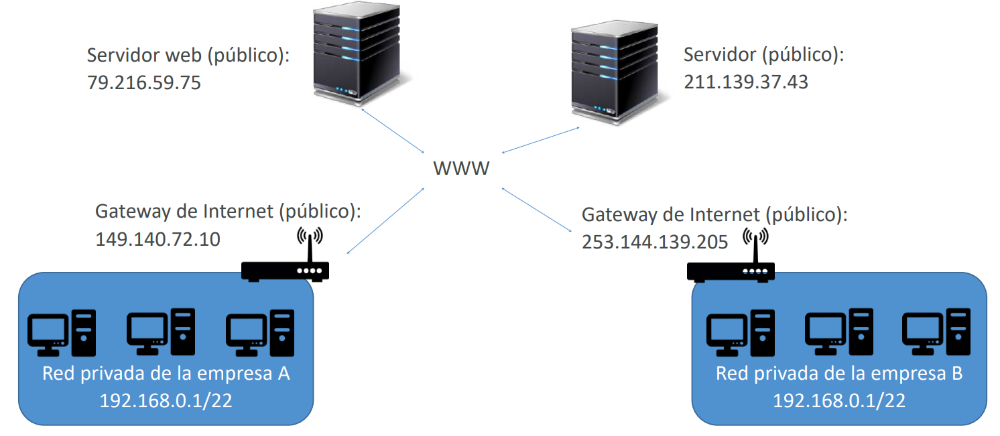
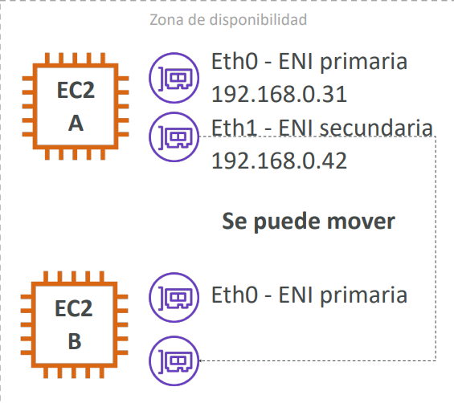
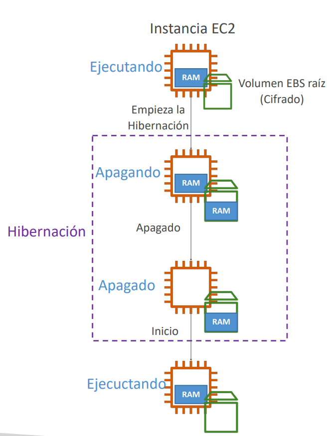

# Amazon EC2 - Nivel Associate: Redes, Ubicación y Ciclo de Vida Avanzado

Este módulo profundiza en las capacidades intermedias y avanzadas de **Amazon Elastic Compute Cloud (EC2)** requeridas para el examen **AWS Certified Solutions Architect - Associate (SAA-C03)**. Cubre el direccionamiento IP público vs. privado, el uso adecuado de Elastic IPs, el desacoplamiento con Elastic Network Interfaces (ENI), las estrategias de colocación mediante Placement Groups y la optimización del tiempo de arranque mediante EC2 Hibernate.

---

## 1. Direccionamiento IPv4: IP Privada vs. IP Pública

En arquitecturas de red sobre **Amazon VPC**, cada instancia EC2 interactúa mediante dos tipos principales de direccionamiento IPv4:

### IP Privada (Private IPv4)
- **Ámbito interno**: Identifica de forma unívoca a la instancia dentro de la red privada (VPC o redes conectadas mediante VPC Peering / Direct Connect / VPN).
- **Permanencia**: Se asigna a través de la interfaz de red elástica (ENI) y **se mantiene constante** cuando la instancia se detiene (*stop*) y se vuelve a iniciar (*start*).
- **Rangos estándar (RFC 1918)**:
  - `10.0.0.0/8`
  - `172.16.0.0/12`
  - `192.168.0.0/16`

### IP Pública (Public IPv4)
- **Ámbito global**: Permite identificar y alcanzar la instancia desde la Internet pública (WWW).
- **Efimeridad**: Proviene del pool de direcciones públicas de AWS. **Cuando la instancia se detiene (*stop*) y se reinicia (*start*), la IP pública se libera y se asigna una IP pública completamente nueva**.
- Para que una instancia se comunique directamente hacia/desde internet requiere una IP pública, residir en una subred pública y contar con una ruta activa (`0.0.0.0/0`) hacia un **Internet Gateway (IGW)**.

---

## 2. Direcciones IP Elásticas (Elastic IPs)

Una **Elastic IP (EIP)** es una dirección IPv4 pública estática y reservada para tu cuenta de AWS que no cambia tras reiniciar o detener una instancia.

### Características y Comportamiento Clave
- **Remapeo instantáneo**: Permite enmascarar fallos de software o de una instancia reasociando rápidamente la dirección IP a otra instancia de reemplazo en la misma región.
- **Cuota por defecto**: Limitada a **5 Elastic IPs por región** por cuenta (ampliable mediante solicitud de servicio).
- **Modelo de cobro (FinOps)**:
  - AWS cobra por las direcciones IP públicas IPv4 activas, pero históricamente **penaliza con un costo mayor a las Elastic IPs que NO están asociadas** a una instancia en ejecución para evitar el acaparamiento ocioso de direcciones IPv4.

> **💡 SAA-C03 Exam Tip:**  
> **Antipatrón de arquitectura en el examen**: Asociar Elastic IPs fijas directamente a múltiples instancias EC2 individuales para exponer aplicaciones web al público.  
> La solución recomendada según las mejores prácticas de AWS consiste en:
> 1. Colocar las instancias EC2 en subredes privadas.
> 2. Exponer un **Application Load Balancer (ALB)** o **Network Load Balancer (NLB)** al público.
> 3. Asignar un registro DNS con **Amazon Route 53** (usando registros tipo `Alias` que apuntan al DNS name del balanceador). Esto elimina la dependencia rígida de direcciones IP fijas en los servidores de cómputo.

---

## 3. Interfaces de Red Elásticas (Elastic Network Interfaces - ENI)

Una **ENI** es un componente virtual lógico que representa una tarjeta de red (NIC) dentro de una VPC.

### Atributos de una ENI
- Una dirección IPv4 privada principal (Primary Private IPv4) y una o más IPv4 privadas secundarias.
- Una dirección IPv4 pública o Elastic IP asociada a la IPv4 privada.
- Una dirección MAC física virtual inmutable.
- Uno o más **Security Groups** vinculados directamente a la interfaz.
- Flag de verificación de origen/destino (*Source/Dest Check*), fundamental para configurar appliances de red o instancias NAT.

### Desacoplamiento y Failover con ENIs
- Cada instancia EC2 nace con una interfaz de red primaria por defecto (**`eth0`**), la cual no se puede desacoplar de la instancia.
- Sin embargo, se pueden crear **ENIs secundarias (`eth1`, `eth2`)**, adjuntarlas dinámicamente (*hot-attach*) y moverlas entre instancias en la **misma Zona de Disponibilidad (AZ)**.
- **Caso de uso SAA-C03**: Diseñar soluciones de failover de bajo costo para licencias de red o servicios de administración heredados. Si el servidor activo falla, la ENI secundaria (con su IP privada fija y Elastic IP asociada) se desprende y se asocia a la instancia de reserva.

---

## 4. Grupos de Ubicación (Placement Groups)

Los **Placement Groups** permiten influir y controlar la disposición física de las instancias EC2 sobre el hardware subyacente de los centros de datos de AWS para satisfacer requisitos extremos de latencia de red, rendimiento o tolerancia a fallos.

### Tabla Comparativa de Placement Groups

| Estrategia | Disposición Física del Hardware | Alcance Geográfico | Límites Principales | Casos de Uso Críticos en SAA-C03 |
| :--- | :--- | :--- | :--- | :--- |
| **Cluster (Clúster)** | Empaqueta las instancias dentro de un **mismo rack físico** en centros de datos adyacentes. | **Única AZ** (No puede extenderse entre AZs). | Riesgo correlacionado: si el rack falla, todas las instancias caen juntas. | Computación de Alto Rendimiento (**HPC**), pipelines de Big Data de rápida finalización, simulaciones científicas con tráfico inter-nodo de **baja latencia y alto ancho de banda (hasta 100 Gbps con ENA)**. |
| **Spread (Distribuido)** | Coloca estrictamente cada instancia en **hardware físico, racks y fuentes de alimentación independientes**. | Puede abarcar **múltiples AZs** dentro de la misma región. | **Máximo estricto de 7 instancias por AZ** por grupo de colocación. | Aplicaciones críticas de alta disponibilidad y misión crítica donde ninguna instancia debe compartir fallo de hardware con otra (ej. nodos maestros de bases de datos). |
| **Partition (Partición)** | Divide el grupo en particiones lógicas aisladas entre sí. Las instancias de una partición **no comparten racks** con instancias de otras particiones. | Puede abarcar **múltiples AZs** dentro de la misma región. | Hasta **7 particiones por AZ**. Puede escalar a cientos de instancias EC2. | Cargas de trabajo distribuidas conscientes de la topología (*topology-aware*): clústeres de **Apache Kafka, Hadoop HDFS, Apache Cassandra y HBase**. Las instancias conocen su ID de partición vía metadatos. |

> **💡 SAA-C03 Exam Tip:**  
> - Si la pregunta menciona **"latencia de red ultrabaja en microsegundos"**, **"alto rendimiento entre nodos"** o **"trabajo de HPC/Big Data completado lo antes posible"** $\implies$ La respuesta es **Cluster Placement Group**.  
> - Si la pregunta menciona **"reducir al mínimo el riesgo de fallos correlacionados de hardware en un grupo pequeño de instancias de misión crítica"** $\implies$ La respuesta es **Spread Placement Group** (recuerda el límite de 7 instancias por AZ).  
> - Si la pregunta menciona **"distribuir cientos de instancias para Kafka o Cassandra evitando que fallen múltiples particiones en el mismo rack"** $\implies$ La respuesta es **Partition Placement Group**.

---

## 5. Hibernación de EC2 (EC2 Hibernate)

Tradicionalmente, el ciclo de vida de una instancia EC2 comprende:
- **Stop**: La instancia se detiene, el cómputo se libera (deja de cobrarse por vCPU/RAM), pero los volúmenes EBS persisten intactos. Al encenderse, el sistema operativo realiza un arranque completo en frío y las cachés en RAM deben reconstruirse.
- **Terminate**: La instancia se destruye y los volúmenes EBS marcados con `DeleteOnTermination=true` (generalmente el volumen raíz) se eliminan permanentemente.

### ¿Qué es EC2 Hibernate?
**EC2 Hibernate** preserva el estado completo de la memoria RAM escribiéndolo directamente en un archivo dentro del volumen EBS raíz antes del apagado.

1. Al entrar en hibernación, la RAM se congela y se descarga al disco EBS raíz.
2. Al reanudar la instancia, el sistema operativo no pasa por el proceso de arranque en frío (*cold boot*), sino que carga el archivo de hibernación directamente a la memoria física.
3. La aplicación vuelve a estar operativa instantáneamente, manteniendo abiertas conexiones, estados en memoria y cachés precalentadas.

### Requisitos y Limitaciones Técnicas para el Examen
- **Cifrado obligatorio**: El **volumen EBS raíz debe estar cifrado (KMS)** obligatoriamente para garantizar la seguridad de los datos confidenciales volcados desde la RAM.
- **Tamaño de RAM**: La memoria RAM de la instancia debe ser **inferior a 150 GB**.
- **Familias compatibles**: Soportado en instancias populares (C3, C4, C5, M4, M5, R4, R5, T2, T3, etc.). **No se admite en instancias Bare Metal**.
- **Modelos de compra**: Disponible para instancias On-Demand, Reservadas y Spot.
- **Límite de duración**: Una instancia **no puede permanecer en hibernación por más de 60 días**.
- **Espacio en disco**: El volumen EBS raíz debe tener suficiente almacenamiento libre para alojar el volcado completo del tamaño de la memoria RAM.

> **💡 SAA-C03 Exam Tip:**  
> Ante un escenario donde una aplicación requiere **"un tiempo de arranque muy prolongado porque tarda minutos en cargar modelos o cachés en memoria"** y la empresa busca **"detener instancias fuera de horario laboral para ahorrar costos, pero recuperando la disponibilidad casi instantánea por la mañana"**, la solución arquitectónica precisa es habilitar **EC2 Hibernate**, asegurando previamente que el volumen raíz EBS esté debidamente **cifrado**.
