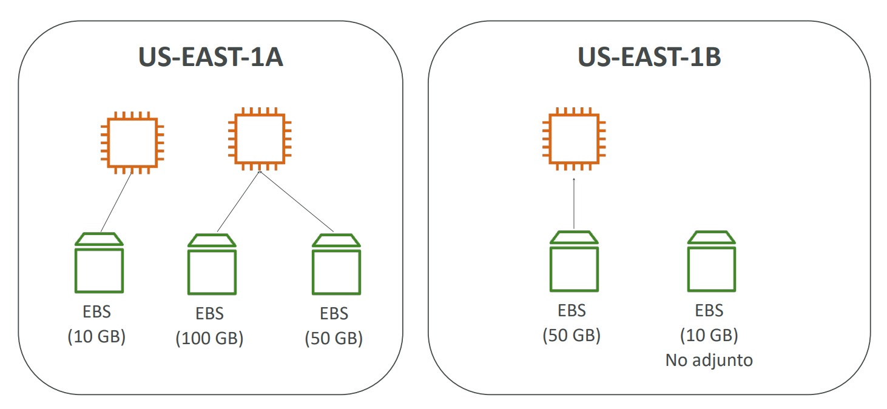
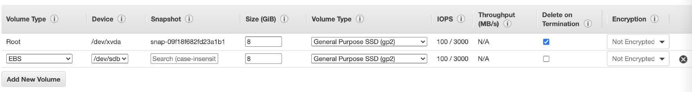
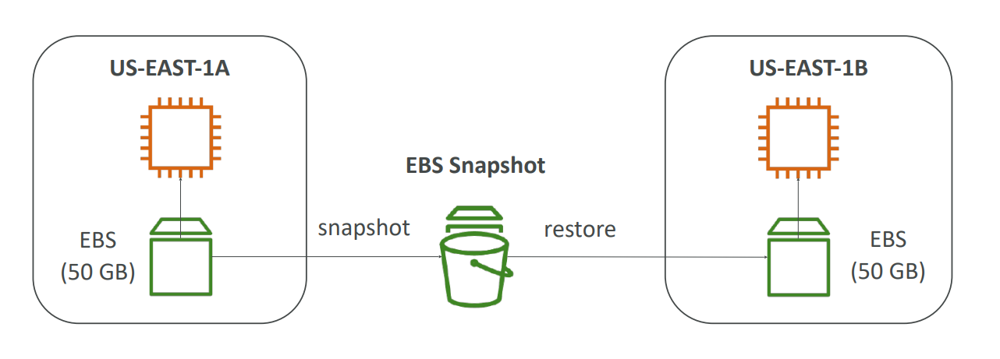
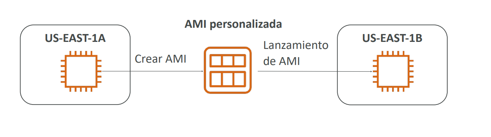
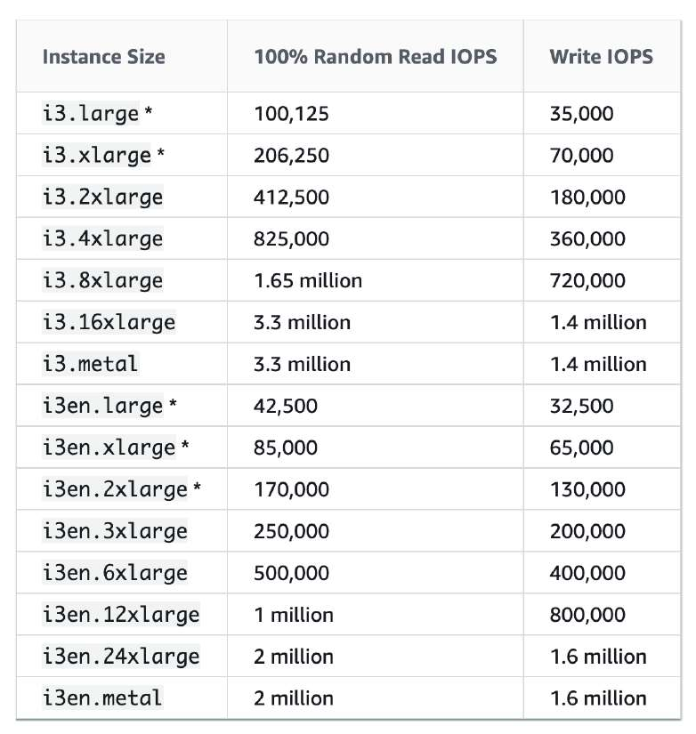
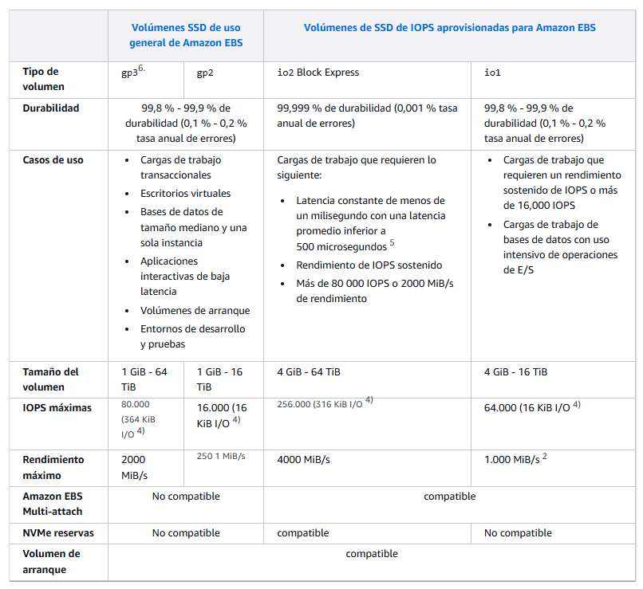
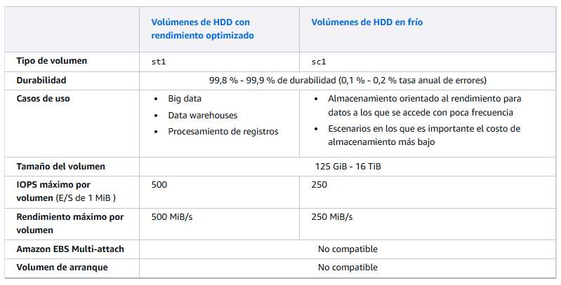
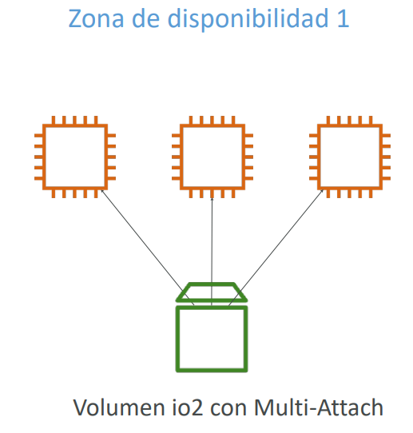
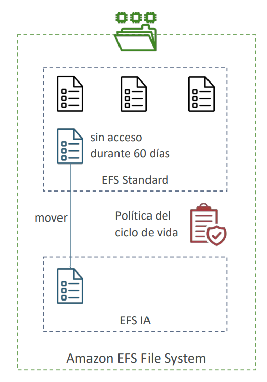
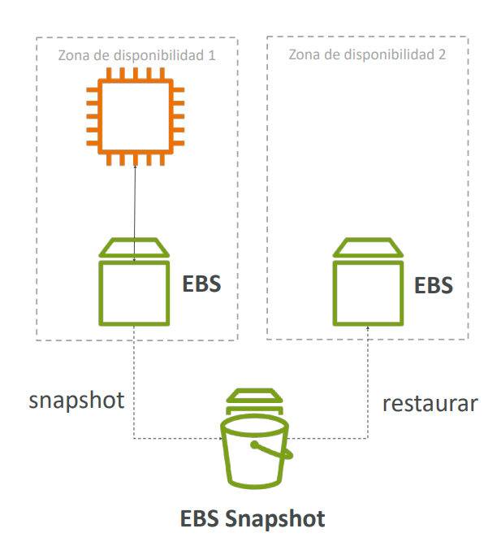

# Amazon EC2 - Almacenamiento: EBS, Instance Store y EFS

En arquitecturas sobre AWS, desacoplar el procesamiento (cómputo en Amazon EC2) de la capa de persistencia de datos es un principio fundamental del Well-Architected Framework. Este módulo aborda las tres tecnologías primarias de almacenamiento para EC2 evaluadas en el examen **AWS Certified Solutions Architect - Associate (SAA-C03)**:
1. **Amazon EBS (Elastic Block Store)**: Almacenamiento en bloque en red persistente.
2. **EC2 Instance Store**: Almacenamiento en bloque físico y efímero de ultrabaja latencia.
3. **Amazon EFS (Elastic File System)**: Sistema de archivos compartido en red compatible con POSIX y multi-AZ.

---

## 1. Amazon EBS (Elastic Block Store)

Un volumen **EBS** es un dispositivo de almacenamiento en bloque virtualizado que opera a través de la red privada interna de AWS. Funciona análogamente a un disco duro o unidad de estado sólido conectada por red.

### Características y Comportamiento Crítico
- **Ámbito por Zona de Disponibilidad (AZ-locked)**: Un volumen EBS se crea y reside exclusivamente en una AZ específica (ej. `us-east-1a`). **No puede montarse directamente en una instancia de otra AZ (`us-east-1b`)**.
- **Independencia del ciclo de vida**: El almacenamiento persiste aunque la instancia EC2 se detenga (*stop*).
- **Atributo `DeleteOnTermination`**:
  - Para el **volumen raíz (*Root Volume*)**, este atributo viene **habilitado por defecto (`true`)**; por tanto, al terminar la instancia, el volumen raíz se destruye.
  - Para cualquier **volumen de datos adicional adjunto**, el atributo viene **deshabilitado por defecto (`false`)**, preservando los datos tras la terminación.
- **Migración entre AZs y Regiones**: Para trasladar un volumen a otra AZ o región, se debe tomar un **Snapshot**, transferirlo (si es a otra región) y restaurarlo como un volumen nuevo en la AZ de destino.

---

## 2. Snapshots de EBS y Gestión del Ciclo de Vida

Un **EBS Snapshot** es una copia de respaldo point-in-time incremental almacenada internamente en **Amazon S3** (gestionado por AWS de forma transparente).

- **Naturaleza incremental**: Solo los bloques modificados desde la última instantánea se respaldan y facturan.
- **Rendimiento de E/S**: Tomar una instantánea consume IOPS del volumen; no es obligatorio desmontar el volumen, pero se recomienda pausar escrituras en bases de datos para garantizar consistencia.

### Capacidades Avanzadas de Snapshots para el Examen
1. **EBS Snapshot Archive**:
   - Mueve snapshots de retención a largo plazo a un nivel de almacenamiento hasta un **75% más económico**.
   - **Tiempo de restauración**: Tarda entre **24 y 72 horas** en descongelarse al tier estándar antes de poder crear un volumen.
2. **Papelera de Reciclaje (Recycle Bin for Snapshots)**:
   - Protege contra eliminaciones accidentales o maliciosas configurando reglas de retención (de 1 día a 1 año) para recuperar snapshots borrados.
3. **Fast Snapshot Restore (FSR)**:
   - Elimina la latencia de inicialización (*pre-warming*) al restaurar instantáneas en nuevos volúmenes, garantizando rendimiento máximo inmediato de IOPS.

---

## 3. Amazon Machine Images (AMI)

Una **AMI** empaqueta el sistema operativo, configuraciones, parches y software preinstalado para aprovisionar instancias idénticas en segundos.

- **Ámbito regional**: Una AMI reside en una región específica. Para usarla en otra región, debe **copiarse explícitamente** hacia la región de destino.
- **Proceso de creación**: Genera automáticamente snapshots subyacentes de todos los volúmenes EBS adjuntos. Se recomienda detener la instancia antes de generar la AMI para garantizar consistencia del sistema de archivos.

---

## 4. EC2 Instance Store (Almacenamiento Efímero Local)

A diferencia de EBS (que se conecta vía red), un **EC2 Instance Store** consiste en discos físicos de estado sólido (NVMe SSD o HDD) conectados directamente a la placa madre del servidor físico host donde reside la instancia.

- **Rendimiento extremo**: Ofrece millones de IOPS y latencias en microsegundos, superando a cualquier volumen de red.
- **Naturaleza estrictamente efímera**:
  - Si la instancia se **reinicia (*reboot*)**, los datos **se conservan**.
  - Si la instancia se **detiene (*stop*)**, se **termina (*terminate*)** o el hardware subyacente sufre una falla, **todos los datos del Instance Store se pierden irremediablemente**.
- **Responsabilidad compartida**: La tolerancia a fallos y copias de seguridad corren 100% por cuenta del arquitecto (ej. replicación a nivel de software en HDFS o Cassandra).

> **💡 SAA-C03 Exam Tip:**  
> Si una pregunta de examen describe una aplicación distribuida de procesamiento en memoria o búferes de transcodificación que requiere **"el rendimiento de E/S más alto posible al menor costo, tolerando la pérdida de datos de nodos individuales"**, la respuesta correcta es **EC2 Instance Store**.  
> Por el contrario, si los datos deben preservarse tras un apagado preventivo para ahorrar costos, **jamás** elijas Instance Store.

---

## 5. Tipos de Volúmenes EBS

EBS ofrece diversas familias optimizadas según balance de costo, IOPS y Throughput:

### Tabla Comparativa de Familias EBS

| Tipo de Volumen | Nombre API | Capacidad Máxima | IOPS Máximos | Throughput Máx. | Volumen de Arranque (Boot)? | Casos de Uso en SAA-C03 |
| :--- | :--- | :--- | :--- | :--- | :--- | :--- |
| **General Purpose SSD (gp3)** | `gp3` | 1 GiB - 16 TiB | 16,000 IOPS | 1,000 MiB/s | **Sí** | **Opción predeterminada para el 90% de cargas de trabajo**: Servidores web, entornos de pruebas, escritorios virtuales y volúmenes raíz. Permite escalar IOPS y Throughput independientemente del tamaño en GB. |
| **General Purpose SSD (gp2)** | `gp2` | 1 GiB - 16 TiB | 16,000 IOPS | 250 MiB/s | **Sí** | Versión anterior. Las IOPS están ligadas al tamaño (3 IOPS por GiB, alcanzando 16,000 IOPS a partir de 5.334 GiB). |
| **Provisioned IOPS SSD (io2 Block Express)** | `io2` | 4 GiB - 64 TiB | **256,000 IOPS** | **4,000 MiB/s** | **Sí** | Cargas de misión crítica de latencia sub-milisegundo: **Grandes bases de datos OLTP (Oracle, SAP HANA, Microsoft SQL Server)**. Admite Multi-Attach. Durabilidad del 99.999%. |
| **Throughput Optimized HDD** | `st1` | 125 GiB - 16 TiB | 500 IOPS | 500 MiB/s | **No** | Cargas secuenciales masivas con acceso frecuente: **Big Data, Hadoop HDFS, Kafka, Data Warehousing, procesamiento de logs**. |
| **Cold HDD** | `sc1` | 125 GiB - 16 TiB | 250 IOPS | 250 MiB/s | **No** | Datos de acceso infrecuente donde el costo mínimo por GB es el requerimiento principal (archivos históricos y logs fríos). |

### EBS Multi-Attach (Familias io1 / io2)
- Permite adjuntar un único volumen EBS de alto rendimiento de forma concurrente a **hasta 16 instancias EC2 dentro de la misma AZ**.
- **Requisito arquitectónico**: La aplicación o el sistema de archivos debe ser consciente del clúster (*Cluster-Aware Filesystem* como GFS2 u OCFS2) para evitar corrupción de datos por escrituras simultáneas (antipatrón: usar sistemas de archivos estándar como EXT4 o XFS).

---

## 6. Cifrado de Volúmenes EBS (EBS Encryption)

El cifrado de EBS se implementa mediante claves administradas en **AWS KMS (Key Management Service)** utilizando el algoritmo **AES-256**.

- **Alcance de la protección**: Cifra datos en reposo dentro del volumen, datos en tránsito entre la instancia y el volumen, todas las instantáneas derivadas y todos los volúmenes clonados a partir de dichas instantáneas.
- **Rendimiento**: Implementado a nivel de hardware por la infraestructura AWS Nitro; tiene un impacto inapreciable en la latencia.

### Flujo de Cifrado de un Volumen no Cifrado
No es posible cifrar directamente un volumen EBS existente *in situ*. Para cifrarlo se debe ejecutar el siguiente procedimiento:
1. Tomar una instantánea (*Snapshot*) del volumen sin cifrar.
2. Copiar la instantánea marcando la opción de **habilitar cifrado con una clave KMS**.
3. Crear un nuevo volumen EBS a partir de la copia cifrada de la instantánea.
4. Adjuntar el nuevo volumen cifrado a la instancia EC2.

> **💡 SAA-C03 Exam Tip:**  
> Si una política corporativa de cumplimiento exige que **"todos los volúmenes EBS futuros creados en la cuenta deben estar cifrados obligatoriamente sin excepción"**, no intentes crear scripts manuales de remediación: la respuesta del examen es habilitar la opción a nivel de cuenta: **"Always encrypt new EBS volumes" (EBS Encryption by default)** en los ajustes regionales de EC2.

---

## 7. Amazon EFS (Elastic File System)

**Amazon EFS** es un sistema de archivos de red completamente administrado basado en el protocolo **NFSv4.1/NFSv4.0**, compatible con el estándar **POSIX** para instancias Linux.

- **Capacidad elástica automática**: Crece y decrece dinámicamente según la cantidad de datos almacenados (escala a petabytes de forma automática; no requiere aprovisionar capacidad previa).
- **Acceso concurrente Multi-AZ**: Cientos o miles de instancias EC2 distribuidas en **múltiples Zonas de Disponibilidad (AZs)** pueden montar y escribir en el mismo sistema de archivos simultáneamente a través de **EFS Mount Targets** ubicados en cada subred.
- **Compatibilidad**: Diseñado exclusivamente para sistemas operativos basados en Linux (no compatible con Windows; para Windows el equivalente es **Amazon FSx for Windows File Server**).

### Modos de Rendimiento y Clases de Almacenamiento en EFS
- **Modos de Rendimiento (Performance Modes)**:
  - **General Purpose**: Optimizado para latencias bajas de operación por archivo (servidores web, CMS como WordPress, gestión documental).
  - **Max I/O**: Diseñado para cargas de trabajo altamente paralelas que sacrifican latencia individual en favor de un throughput masivo agregado (Big Data, procesamiento genómico o renderizado).
- **Clases de Almacenamiento (Lifecycle Management)**:
  - **EFS Standard**: Almacenamiento de acceso frecuente con réplica Multi-AZ.
  - **EFS Infrequent Access (EFS-IA)**: Hasta un 92% más económico que Standard. Las políticas de ciclo de vida mueven archivos automáticamente tras $N$ días sin accesos (ej. 7, 30, 60 o 90 días). Aplica una tarifa por GiB leído al recuperar datos.
  - **EFS One Zone / One Zone-IA**: Almacenamiento confinado a una única AZ para entornos de desarrollo y ahorro adicional de costos.

---

## 8. Comparativa Maestra: EBS vs. Instance Store vs. EFS

| Característica | Amazon EBS | EC2 Instance Store | Amazon EFS |
| :--- | :--- | :--- | :--- |
| **Nivel de Abstracción** | Dispositivo en bloque (Block Storage) por red. | Dispositivo en bloque físico local. | Sistema de archivos en red (NFS / POSIX). |
| **Persistencia** | Alta durabilidad persistente. Sobrevive a detenciones (*stop*). | **Efímero**. Los datos se destruyen al detener o terminar la instancia. | Alta durabilidad distribuida en múltiples AZs. Totalmente persistente. |
| **Alcance de Conexión** | Bloqueado a una **única AZ**. (1 instancia a la vez, o hasta 16 con io2 Multi-Attach). | Confinado a la **instancia física host**. | **Multi-AZ**. Cientos de instancias Linux simultáneas en distintas AZs. |
| **Escalabilidad** | Capacidad fija aprovisionada por adelantado. | Capacidad fija según el tamaño del tipo de instancia. | **Completamente elástica**. Crece y decrece bajo demanda sin aprovisionamiento. |
| **Rendimiento de E/S** | Hasta 256,000 IOPS (io2 Block Express). | **Millones de IOPS** con latencia en submilisegundos/microsegundos. | Hasta 10+ GB/s de throughput con escalado de clientes concurrentes. |
| **Costo Relativo** | Moderado (pago por GB aprovisionado e IOPS). | Incluido en el precio de la instancia EC2. | Mayor costo por GB (~3x frente a EBS gp3), pero reducible drásticamente con **EFS-IA**. |
| **Caso de Uso Ideal en Examen** | Volúmenes de arranque del sistema operativo, bases de datos relacionales tradicionales. | Cachés temporales, búferes de memoria, nodos de clústeres distribuidos con replicación propia. | Sitios web con balanceador y múltiples servidores web (CMS/WordPress), repositorios compartidos de código o datos de entrenamiento de IA en Linux. |
