# Alta Disponibilidad y Escalabilidad: Elastic Load Balancing y Auto Scaling Groups

El diseño de arquitecturas altamente disponibles, tolerantes a fallos y elásticas es uno de los pilares fundamentales del **AWS Well-Architected Framework** y representa una porción sustancial de las evaluaciones del examen **AWS Certified Solutions Architect - Associate (SAA-C03)**. 

Este módulo aborda los dos mecanismos arquitectónicos esenciales para lograrlo: **Elastic Load Balancing (ELB)** para desacoplar el tráfico y distribuir peticiones, y **Auto Scaling Groups (ASG)** para ajustar dinámicamente la capacidad de cómputo según la demanda real.

---

## 1. Fundamentos: Escalabilidad vs. Alta Disponibilidad

Es mandatorio para el examen distinguir con precisión conceptual los diferentes patrones de crecimiento y resiliencia:

### Escalabilidad Vertical (*Scale Up / Scale Down*)
- Consiste en incrementar o reducir la potencia de hardware de una única instancia (vCPU, memoria RAM, rendimiento de red o almacenamiento).
- Ejemplo: Migrar de una instancia `t2.micro` (1 vCPU, 1 GiB RAM) a una `m5.4xlarge` (16 vCPU, 64 GiB RAM).
- **Limitaciones**: Posee un techo físico insuperable (*límite de hardware*) y casi siempre requiere una ventana de inactividad (*downtime*) para redimensionar la máquina. Común en bases de datos relacionales no distribuidas tradicionales.

### Escalabilidad Horizontal (*Scale Out / Scale In* = Elasticidad)
- Consiste en aumentar o reducir el **número total de instancias o nodos** que ejecutan la aplicación en paralelo.
- Ejemplo: Pasar de 2 instancias a 20 instancias EC2 idénticas detrás de un balanceador de carga durante un pico de tráfico.
- **Ventajas**: Sin límite teórico estricto; ideal para sistemas distribuidos y aplicaciones web sin estado (*Stateless*).

### Alta Disponibilidad (High Availability - HA)
- Consiste en garantizar que el sistema permanezca operativo y accesible ante la falla imprevista de un componente de infraestructura.
- **Implementación física en AWS**: Desplegar la misma aplicación en **al menos dos Centros de Datos / Zonas de Disponibilidad (Multi-AZ)** distintas.
- Puede ser:
  - **HA Activa**: Múltiples instancias procesando tráfico simultáneamente en distintas AZs (balanceadas por un ELB).
  - **HA Pasiva (Standby/Failover)**: Una instancia primaria activa en la AZ 1 y una instancia réplica pasiva en la AZ 2 lista para tomar el control en segundos (ej. Amazon RDS Multi-AZ).

---

## 2. Elastic Load Balancing (ELB)

Un **Load Balancer** es un punto de entrada gestionado que distribuye el tráfico de red de manera uniforme hacia un conjunto de servidores backend (instancias EC2, tareas de contenedores ECS, funciones Lambda o direcciones IP privadas).

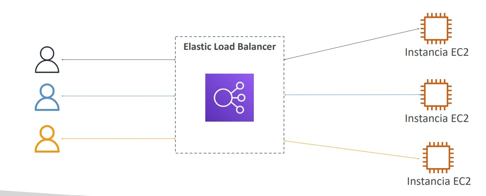

### Beneficios Clave para Arquitecturas Cloud
- **Punto único de acceso**: Expone un nombre de dominio DNS público o interno fijo (`*.elb.amazonaws.com`).
- **Health Checks automáticos**: Monitorea continuamente la salud del backend mediante solicitudes periódicas (`/health` en HTTP/HTTPS o handshakes TCP). Si una instancia devuelve un código distinto de 200 OK (o el rango configurado), se marca como `Unhealthy` y el balanceador redirige el tráfico a los nodos sanos.
- **Terminación SSL/TLS**: Descarga el procesamiento criptográfico de certificados HTTPS en el balanceador.
- **Separación de capas**: Los clientes solo interactúan con el balanceador en la subred pública; las instancias EC2 residen de forma segura en subredes privadas.

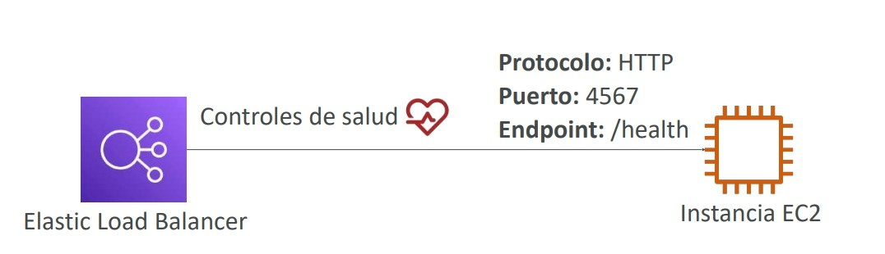

### Cadena de Seguridad con Security Groups
Para aislar las instancias backend, se implementa una referencia cruzada estricta:
1. **Security Group del ELB**: Permite tráfico entrante en puertos 80/443 desde `0.0.0.0/0` (Internet).
2. **Security Group de las Instancias EC2**: Permite tráfico entrante en el puerto de la aplicación **únicamente si el origen es el Security Group del ELB**, bloqueando cualquier acceso directo desde internet.

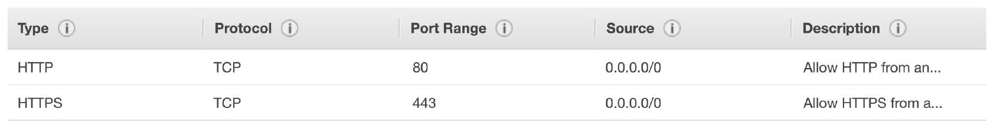

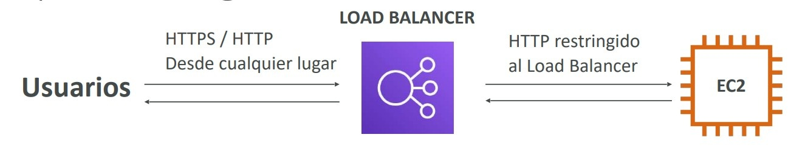

---

## 3. Tipos de Load Balancers en AWS

AWS ofrece cuatro familias de balanceadores gestionados. Para el examen SAA-C03, el foco evaluativo está centrado en **ALB**, **NLB** y **GWLB** (el Classic Load Balancer - CLB se considera tecnología de generación previa en desuso).

### Tabla Comparativa de Load Balancers

| Característica                  | Application Load Balancer (ALB)                                                                    | Network Load Balancer (NLB)                                                                    | Gateway Load Balancer (GWLB)                                            | Classic Load Balancer (CLB)      |
| :------------------------------ | :------------------------------------------------------------------------------------------------- | :--------------------------------------------------------------------------------------------- | :---------------------------------------------------------------------- | :------------------------------- |
| **Capa OSI**                    | **Capa 7 (Aplicación)**                                                                            | **Capa 4 (Transporte)**                                                                        | **Capa 3 (Red)**                                                        | Capa 4 y Capa 7 (Legacy)         |
| **Protocolos Soportados**       | HTTP, HTTPS, WebSocket, gRPC, HTTP/2                                                               | TCP, UDP, TLS                                                                                  | Paquetes IP puros (Protocolo **GENEVE** puerto 6081)                    | HTTP, HTTPS, TCP, SSL            |
| **Rendimiento / Latencia**      | Latencia en milisegundos (~10-20 ms). Millones de solicitudes.                                     | **Rendimiento extremo**, millones de peticiones por segundo con **latencia en microsegundos**. | Inspección en línea de alto throughput transparente.                    | Moderado (Generación previa).    |
| **Direccionamiento IP**         | Nombre DNS dinámico (las IPs del ALB cambian elásticamente).                                       | **Dirección IP estática por AZ** y soporte para **Elastic IP**.                                | Dirección IP privada interna.                                           | Nombre DNS dinámico.             |
| **Tipos de Target Groups**      | • Instancias EC2 • Tareas ECS • Funciones AWS Lambda • IPs Privadas                       | • Instancias EC2 • IPs Privadas • **Application Load Balancer**                          | • Instancias EC2 • IPs Privadas (Appliances virtuales de seguridad)  | Solo instancias EC2 directas.    |
| **Capacidades de Enrutamiento** | Basado en URL Path (`/api`, `/users`), Hostname (`app1.domain.com`), Query Strings y HTTP Headers. | Enrutamiento puro a nivel de capa de transporte (puerto y protocolo).                          | Inspección y desvío de tráfico de red a appliances de firewall/IDS/IPS. | Solo balanceo básico por puerto. |
| **Cabeceras de Rastreo**        | Inyecta `X-Forwarded-For`, `X-Forwarded-Port`, `X-Forwarded-Proto`.                                | Preserva la IP de origen del cliente a nivel de paquete de forma nativa.                       | Encapsula el paquete original dentro de un túnel GENEVE.                | `X-Forwarded-For`.               |

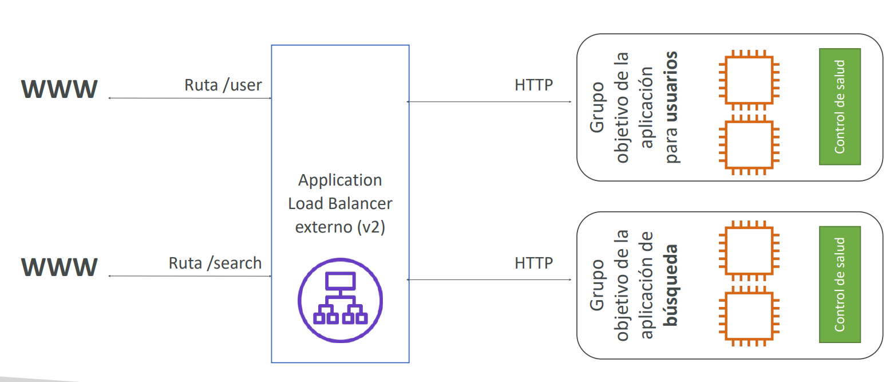

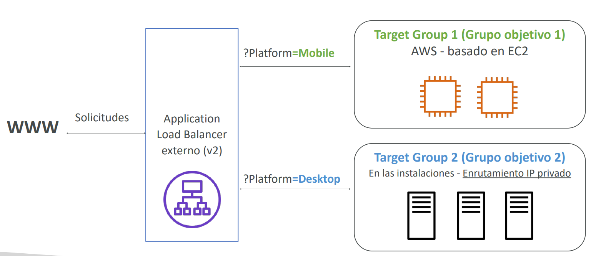

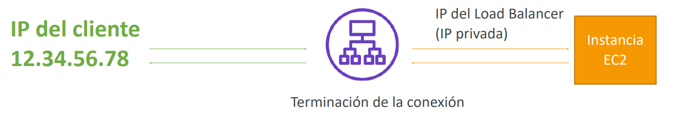

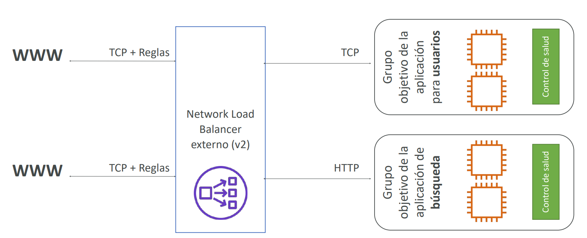

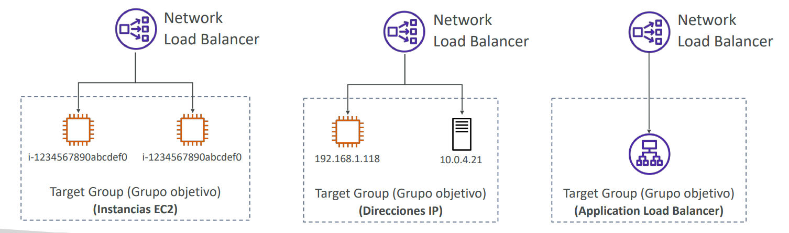

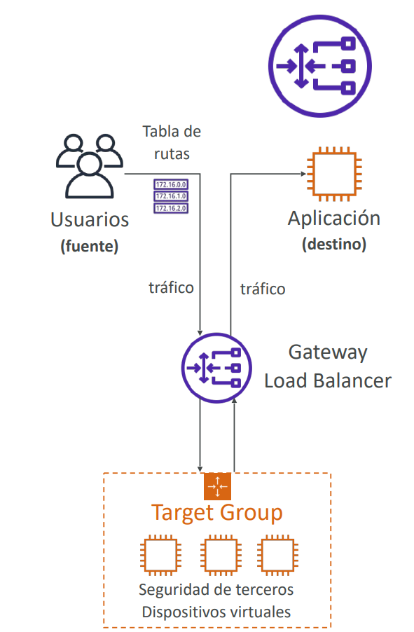

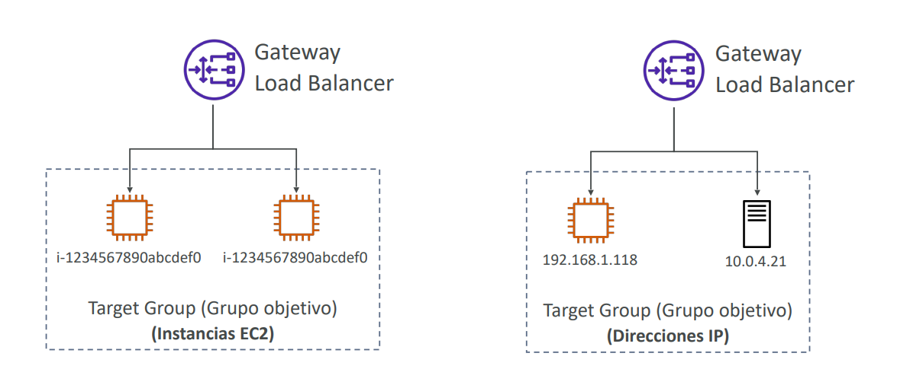

> **💡 SAA-C03 Exam Tip:**  
> **Palabras clave para identificar el Load Balancer correcto**:
> - Si el examen pide **"enrutar microservicios basados en la ruta del URL"**, **"redireccionar HTTP a HTTPS"** o **"usar contenedores ECS con puertos dinámicos"** $\implies$ **ALB**.
> - Si el escenario exige **"asignar una IP pública estática / Elastic IP para que clientes externos la añadan a una lista blanca de firewall corporativo (allowlist)"** o **"latencia ultrabaja extrema para protocolos TCP/UDP o juegos"** $\implies$ **NLB**.
> - Si la empresa necesita **"desplegar y escalar una flota de firewalls virtuales de terceros (Palo Alto, Check Point) o sistemas IDS/IPS para inspeccionar todo el tráfico entrante a la VPC"** $\implies$ **Gateway Load Balancer (GWLB)** operando en capa 3 con protocolo GENEVE.

---

## 4. Configuraciones Avanzadas de Balanceadores

### Sticky Sessions (Persistencia de Sesión)
- Permite que las solicitudes subsiguientes de un mismo cliente se enruten siempre hacia la misma instancia EC2 backend.
- **Tipos de cookies en ALB**:
  - **Cookies basadas en la aplicación**: Generadas por la propia aplicación web o generadas por el ALB con el nombre reservado `AWSALBAPP`.
  - **Cookies basadas en la duración**: Generadas por el balanceador con una expiración fija (nombre reservado `AWSALB`).
- **Compromiso arquitectónico**: Puede generar un desbalanceo de carga (*hot spotting*) si un número desproporcionado de usuarios queda anclado a un único servidor.

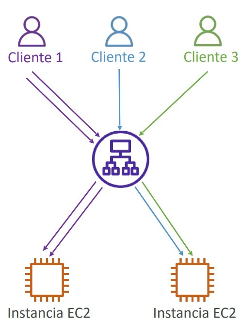
### Cross-Zone Load Balancing (Balanceo entre Zonas)
- **Con Cross-Zone**: Cada nodo del balanceador distribuye el tráfico uniformemente entre **todas** las instancias backend registradas en todas las Zonas de Disponibilidad.
- **Sin Cross-Zone**: Cada nodo del balanceador solo envía tráfico a las instancias de su propia AZ, provocando una distribución desigual si una AZ tiene menos servidores.
- **Comportamiento por tipo**:
  - **ALB**: **Siempre habilitado** por defecto; no se puede desactivar y **no tiene costo adicional** por transferencia inter-AZ.
  - **NLB / GWLB**: **Deshabilitado por defecto**. Si se habilita, aplica un costo por transferencia de datos inter-AZ.

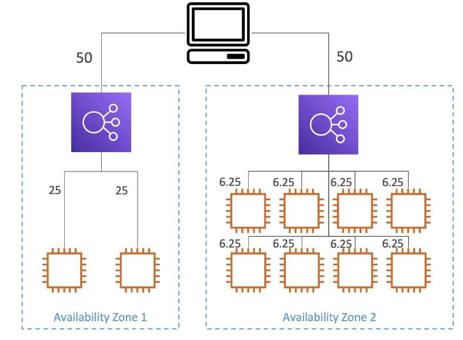

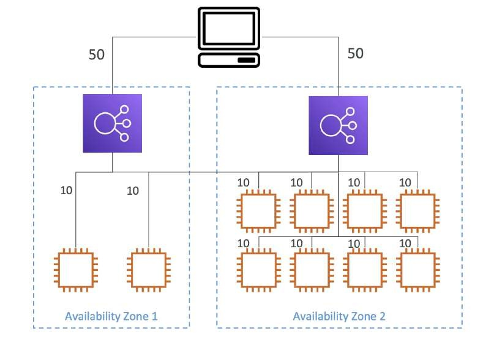
### Certificados SSL/TLS y Server Name Indication (SNI)
- Los balanceadores integran certificados emitidos o importados en **AWS Certificate Manager (ACM)**.
- **Server Name Indication (SNI)**: Extensión de TLS que permite al cliente indicar el nombre de host (*hostname*) al inicio del handshake TLS.
- Esto permite cargar **múltiples certificados SSL/TLS en un único ALB o NLB** para servir a distintos dominios (ej. `api.empresa.com`, `tienda.empresa.com` y `portal.otrodominio.com`) sin requerir un balanceador independiente para cada dominio.

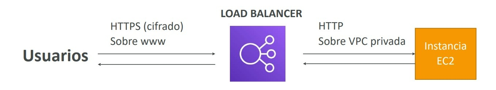

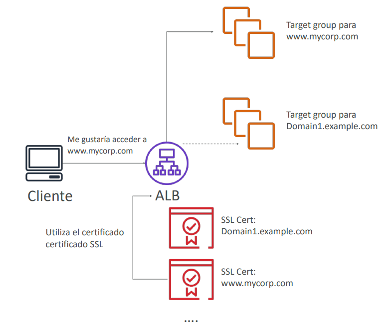

### Connection Draining / Deregistration Delay
- Tiempo de gracia (configurable entre 1 y 3600 segundos; por defecto **300 segundos**) concedido a las instancias que están pasando a estado de desregistro (*deregistering*) o no saludables para que **completen las solicitudes en vuelo** antes de cortar abruptamente la conexión.

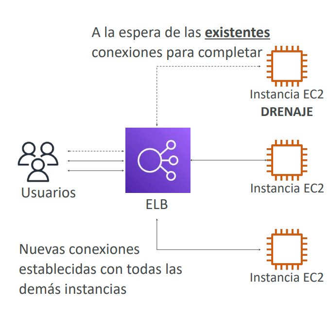

---

## 5. Auto Scaling Groups (ASG)

Un **Auto Scaling Group (ASG)** automatiza la elasticidad horizontal de Amazon EC2, aprovisionando nuevas instancias cuando la demanda se incrementa y terminando instancias redundantes cuando la demanda cae.

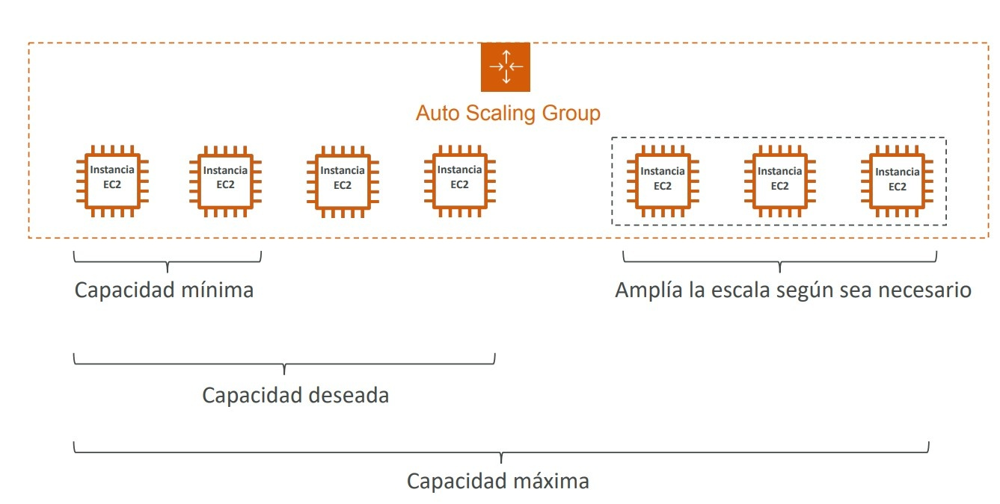

### Parámetros de Capacidad de un ASG
- **Minimum Size (Capacidad Mínima)**: Umbral mínimo de instancias en ejecución en todo momento (incluso ante fallos).
- **Desired Capacity (Capacidad Deseada)**: Número de instancias activas operando en condiciones estándar.
- **Maximum Size (Capacidad Máxima)**: Límite superior estricto que el grupo jamás sobrepasará durante eventos de escalado.

### Reemplazo de Instancias y Health Checks
- Si una instancia falla sus comprobaciones de estado de hardware EC2 o sus comprobaciones de salud del **ELB (ELB Health Checks)**, el ASG la termina automáticamente y lanza una nueva instancia de reemplazo para mantener la capacidad deseada.

### Plantillas de Lanzamiento (Launch Templates)
Las antiguas *Launch Configurations* están obsoletas. Los ASG modernos exigen **Launch Templates**, las cuales admiten:
- Versiones de plantillas (*versioning*).
- Parámetros completos de cómputo: AMI, tipo de instancia, pares de claves SSH, Security Groups y volumen EBS.
- **Estrategias de compra combinadas**: Capacidad base con instancias On-Demand / Savings Plans y escalado de picos con **Spot Instances**.

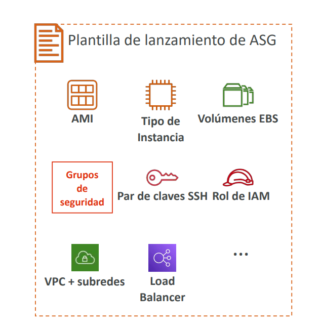

---

## 6. Políticas de Escalado Dinámico y Predictivo

El escalado se orquesta mediante métricas agregadas recopiladas por **Amazon CloudWatch**.
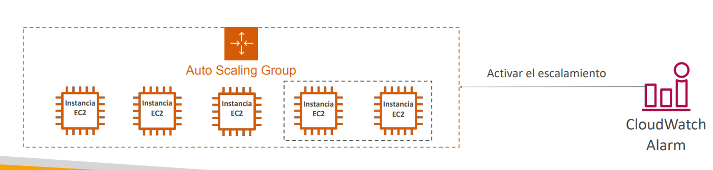

### Modalidades de Políticas de Escalado
1. **Target Tracking Scaling (Seguimiento de Objetivos)**:
   - La opción más sencilla y recomendada por AWS. Se define una métrica y un valor deseado, y el ASG ajusta la capacidad automáticamente para mantener ese número.
   - Ejemplo: *Mantener la utilización media de CPU del grupo al 50%* o *Mantener `ALBRequestCountPerTarget` en 1000*.
2. **Step / Simple Scaling (Escalado por Pasos)**:
   - Reacciona a alarmas discretas de CloudWatch mediante incrementos o decrementos porcentuales o fijos.
   - Ejemplo: *Si CPU > 70%, agregar 2 instancias; si CPU > 85%, agregar 4 instancias*.
3. **Scheduled Scaling (Escalado Programado)**:
   - Anticipa patrones predecibles de consumo basados en el calendario.
   - Ejemplo: *Subir la capacidad deseada a 20 instancias los viernes a las 18:00 horas para un sitio de venta de entradas*.
4. **Predictive Scaling (Escalado Predictivo)**:
   - Utiliza modelos de Machine Learning que analizan datos históricos de tráfico de semanas previas para aprovisionar capacidad por adelantado justo antes de que inicien los picos previstos.

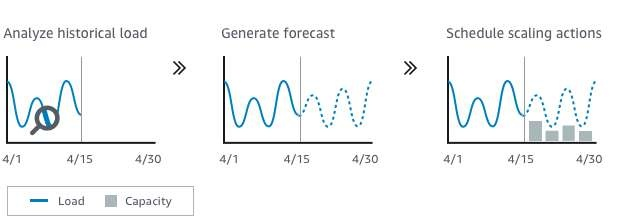

### Periodo de Enfriamiento (Scaling Cooldown)
- Intervalo de espera configurable (por defecto **300 segundos**) tras un evento de escalado durante el cual el ASG ignora nuevas alarmas para permitir que las métricas de CloudWatch y las nuevas instancias se estabilicen, evitando oscilaciones destructivas (*thrashing*).

> **💡 SAA-C03 Exam Tip:**  
> **Comportamiento de terminación por defecto de un Auto Scaling Group**:  
> Si un evento de *scale-in* reduce el número de instancias distribuidas en varias Zonas de Disponibilidad:  
> 1. El ASG identifica primero **la AZ que tiene la mayor cantidad de instancias**.  
> 2. Si hay múltiples instancias en esa AZ, termina la que tenga la **Launch Template o configuración más antigua**.  
> 3. Si comparten la misma versión, termina la instancia más próxima a su siguiente ciclo de facturación.  
> Este orden garantiza que la flota **siempre mantenga un equilibrio balanceado entre todas las Zonas de Disponibilidad**.
