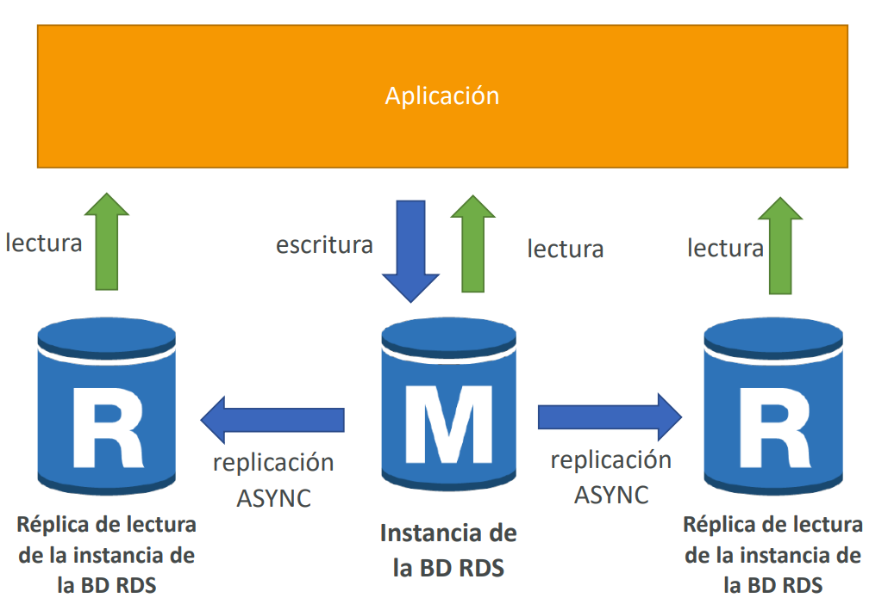
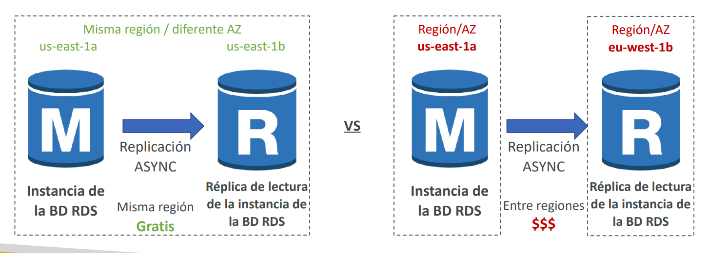
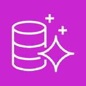
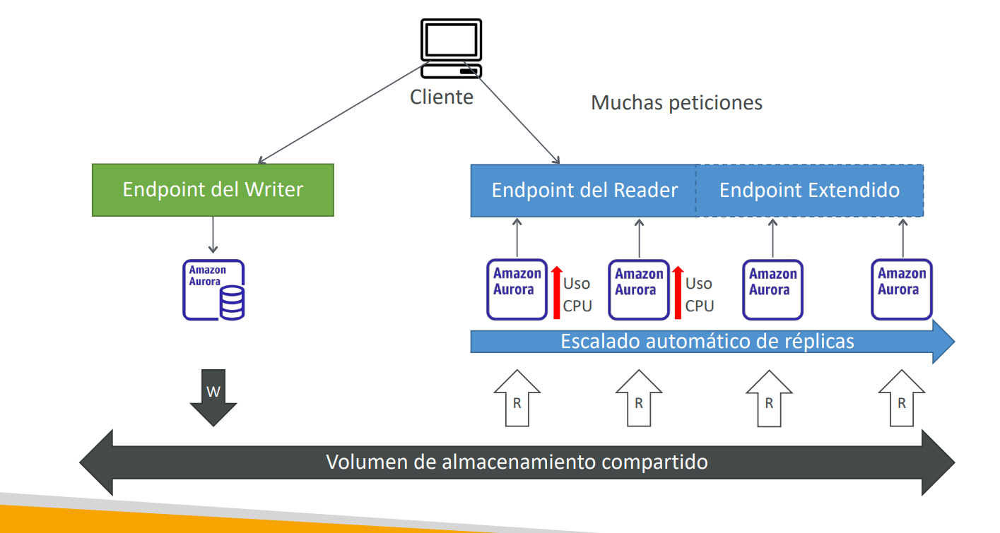
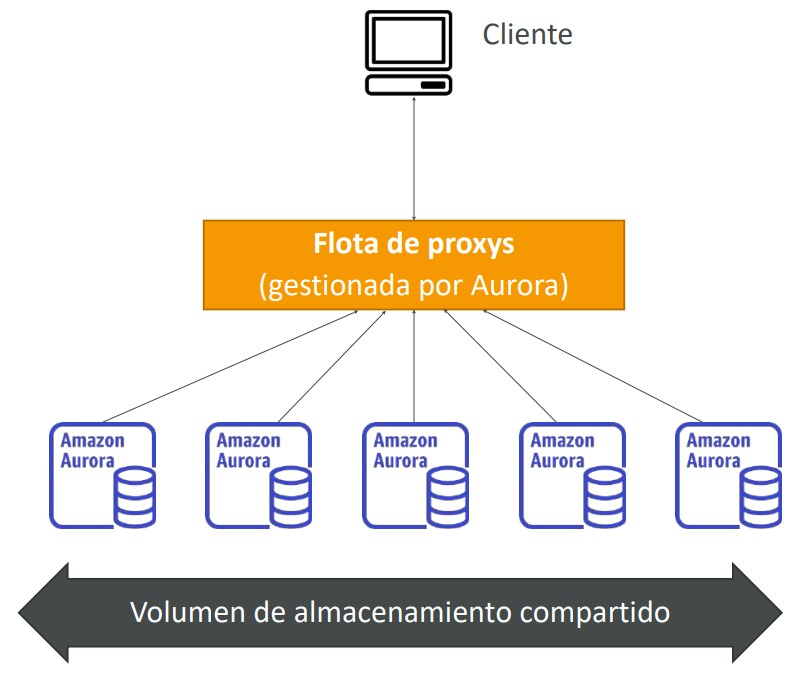
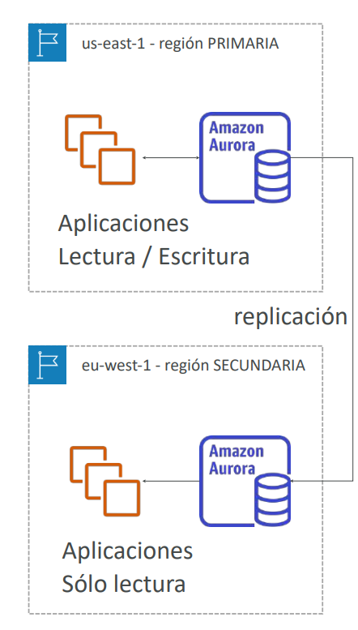
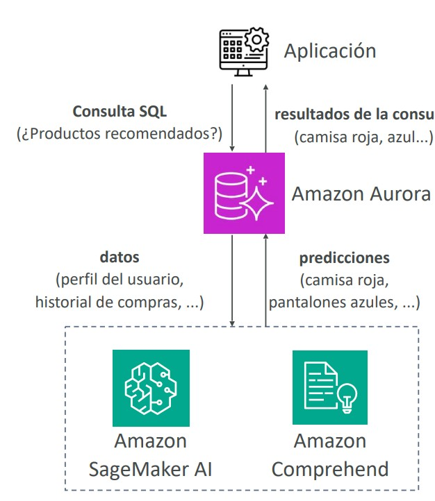
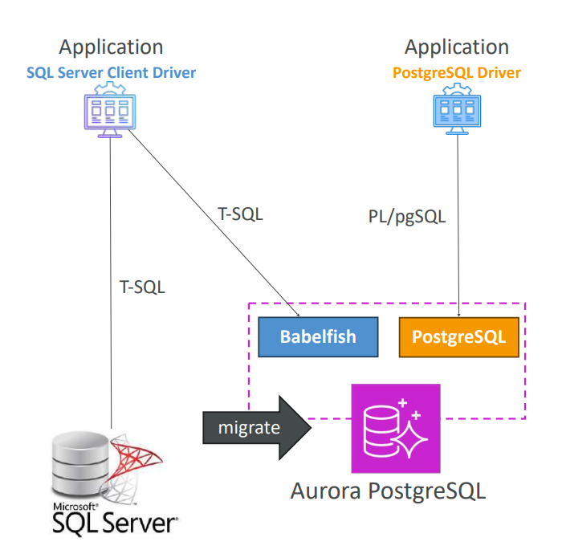
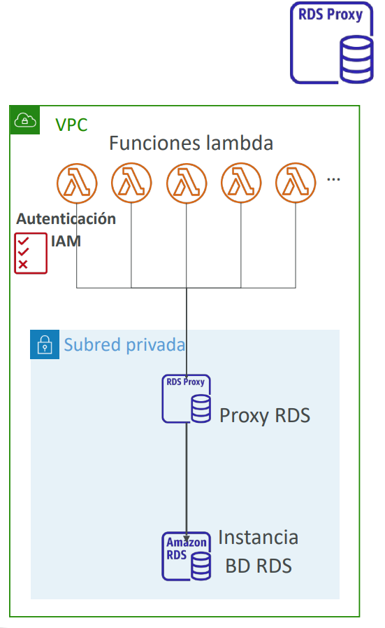
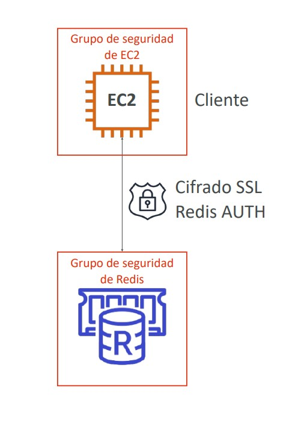

# Bases de Datos Relacionales y Caché en Memoria: RDS, Aurora y ElastiCache

En el examen **AWS Certified Solutions Architect - Associate (SAA-C03)**, el diseño de la capa de persistencia y aceleración de datos exige comprender en detalle las diferencias operativas, de resiliencia y de rendimiento entre **Amazon RDS**, **Amazon Aurora** y **Amazon ElastiCache**. Este módulo profundiza en los mecanismos de alta disponibilidad, réplicas de lectura, respaldos, seguridad y patrones de almacenamiento en caché.

---

## 1. Amazon RDS (Relational Database Service)

**Amazon RDS** es un servicio totalmente administrado para bases de datos relacionales tradicionales basadas en SQL. Soporta seis motores principales: **PostgreSQL**, **MySQL**, **MariaDB**, **Oracle**, **Microsoft SQL Server** y **Amazon Aurora**.

### RDS Administrado vs. Base de Datos Auto-hospedada en EC2
- **Responsabilidad de AWS en RDS**: Aprovisionamiento automático de hardware, parches del sistema operativo y del motor, copias de seguridad automáticas continuas con recuperación a un punto en el tiempo (*Point-in-Time Restore*), monitoreo con Amazon CloudWatch y gestión de fallas de almacenamiento sobre volúmenes Amazon EBS (`gp3`, `io2`).
- **Limitación intencional**: **No hay acceso SSH ni privilegios de administrador del sistema operativo (root)** a la instancia subyacente.
- **RDS Custom**: Opción especializada exclusivamente para **Oracle** y **Microsoft SQL Server** que permite acceso por SSH o AWS Systems Manager (SSM) al sistema operativo subyacente para instalar software de terceros o parches específicos del SO, permitiendo pausar temporalmente el modo de automatización de AWS.

---

## 2. Estrategias de Resiliencia y Escalado: Multi-AZ vs. Read Replicas

Una distinción crítica evaluada de forma reiterada en el examen SAA-C03 es la separación entre **Alta Disponibilidad / Recuperación de Desastres** y **Escalabilidad de Rendimiento de Lectura**.

### Tabla Comparativa: RDS Read Replicas vs. RDS Multi-AZ

| Característica | RDS Read Replicas | RDS Multi-AZ Deployment |
| :--- | :--- | :--- |
| **Propósito Primario** | **Escalabilidad horizontal de lecturas (SELECTs)**. | **Alta Disponibilidad y Recuperación de Desastres (HA/DR)**. |
| **Mecanismo de Replicación** | **Asíncrona (ASYNC)**. Existe un pequeño retraso de réplica (*Replication Lag*); consistencia eventual. | **Síncrona (SYNC)**. Cero pérdida de datos (RPO = 0) ante fallos. |
| **Capacidad y Límites** | Hasta **15 réplicas de lectura** por base de datos maestra. Pueden crearse dentro de la misma AZ, entre AZs o **Cross-Region**. | Exactamente **1 instancia primaria activa** y **1 instancia en espera pasiva (Standby)** en una AZ distinta. |
| **Endpoint de Conexión** | Cada réplica tiene su **propio endpoint DNS individual**. La aplicación debe dirigir las consultas SELECT al endpoint de la réplica. | **Un único endpoint DNS global**. La aplicación nunca cambia su cadena de conexión durante un failover. |
| **Comportamiento ante Fallos** | No hay failover automático hacia la réplica a menos que se promueva manualmente o mediante scripts. | **Failover automático e inadvertido en 60-120 segundos**. AWS actualiza el registro CNAME del endpoint para que apunte a la instancia standby. |
| **Costo de Red Inter-AZ** | **Gratis** si la réplica reside en la misma región (incluso en diferente AZ). Aplica costo si es **Cross-Region**. | El tráfico síncrono inter-AZ está incluido en el costo del servicio Multi-AZ. |

> **💡 SAA-C03 Exam Tip:**  
> - Si el problema describe: *"La base de datos de producción experimenta una sobrecarga severa debido a un reporte analítico o dashboard de BI que ejecuta consultas pesadas"* $\implies$ La solución es crear una **Read Replica** y apuntar la herramienta de reportes a su endpoint dedicado.  
> - Si el problema exige: *"Garantizar que la base de datos se recupere automáticamente ante la pérdida de un centro de datos completo sin intervención humana ni cambios de código"* $\implies$ La solución es **RDS Multi-AZ**.  
> - Recuerda: **La instancia secundaria en espera (Standby) de un RDS Multi-AZ clásico NO puede usarse para lecturas**, solo está en modo pasivo.

---

## 3. Amazon Aurora

**Amazon Aurora** es un motor de base de datos relacional de nivel empresarial optimizado para la nube, compatible de forma nativa con **MySQL** (hasta 5x más rápido) y **PostgreSQL** (hasta 3x más rápido).

### Arquitectura de Almacenamiento Compartido de Aurora
- **Quórum y Replicación Nativa**: Aurora no utiliza volúmenes EBS individuales convencionales. En su lugar, utiliza un volumen de almacenamiento compartido virtualizado que distribuye **6 copias de los datos a lo largo de 3 Zonas de Disponibilidad (2 copias por AZ)**.
  - Se requieren 4 de 6 copias para confirmar una escritura exitosa.
  - Se requieren 3 de 6 copias para servir una lectura.
- **Autocuración (*Self-Healing*)**: Los bloques de datos dañados se reparan automáticamente en segundo plano mediante replicación peer-to-peer.
- **Autoexpansión del disco**: Crece dinámicamente en fragmentos de 10 GB hasta **256 TB** de almacenamiento sin necesidad de intervención ni aprovisionamiento previo.

### Endpoints en un Clúster de Aurora
Un clúster de Aurora expone distintos puntos de enlace DNS para la aplicación:
1. **Writer Endpoint**: Apunta siempre a la instancia primaria activa que procesa todas las transacciones de escritura (INSERT, UPDATE, DELETE).
2. **Reader Endpoint**: Balancea automáticamente las conexiones de solo lectura (SELECT) entre todas las réplicas de lectura de Aurora (hasta 15 réplicas con un retraso inferior a 10 ms).
3. **Custom Endpoints**: Permiten agrupar un subconjunto específico de réplicas de lectura (ej. instancias más potentes como `db.r5.2xlarge`) dedicadas a cargas analíticas pesadas, aislándolas del tráfico de lectura del resto de la aplicación.

### Variantes Avanzadas de Aurora
- **Aurora Serverless (v2)**: Escala automáticamente la capacidad de cómputo en fracciones de segundo (medida en ACUs - Aurora Capacity Units) en respuesta a la demanda real. Ideal para cargas esporádicas, intermitentes o impredecibles.
- **Aurora Global Databases**:
  - Cuenta con 1 región primaria de lectura/escritura y hasta 10 regiones secundarias de solo lectura.
  - La replicación interregional tarda **menos de 1 segundo**.
  - En caso de contingencia o desastre regional, una región secundaria se promueve a primaria con un **RTO < 1 minuto**, convirtiéndola en la opción predilecta para Disaster Recovery multirregional con mínima pérdida de datos.
- **Aurora Clone**: Permite crear un clon independiente de un clúster productivo en segundos mediante el principio de *Copy-on-Write* (sin consumir almacenamiento adicional hasta que haya modificaciones), ideal para pruebas de staging o QA.
- **Babelfish para Aurora PostgreSQL**: Interpreta comandos T-SQL de Microsoft SQL Server directamente en Aurora PostgreSQL, reduciendo la fricción al migrar aplicaciones heredadas.

---

## 4. Respaldos y Restauración en RDS y Aurora

- **Respaldos Automatizados (Automated Backups)**:
  - Realizan una copia completa diaria del volumen de base de datos durante la ventana de mantenimiento y capturan logs de transacciones cada 5 minutos.
  - Permiten restaurar a cualquier segundo específico dentro del periodo de retención (de 1 a 35 días).
  - En Aurora no pueden desactivarse; en RDS se desactivan configurando la retención en 0 días.
- **Instantáneas Manuales (Manual DB Snapshots)**:
  - Disparadas manualmente por el administrador y persisten indefinidamente hasta ser borradas explícitamente.
- **Regla de Oro de Restauración**: **Restaurar un respaldo o snapshot siempre crea una instancia de base de datos COMPLETAMENTE NUEVA** con su propio endpoint DNS.

---

## 5. Amazon RDS Proxy

**Amazon RDS Proxy** es un proxy de base de datos completamente administrado y serverless que optimiza el pool de conexiones hacia instancias RDS y clústeres de Aurora.

### Problema que Resuelve y Casos de Uso Críticos
- En arquitecturas basadas en microservicios o computación serverless (**AWS Lambda**), miles de funciones concurrentes pueden abrir conexiones de base de datos independientes en milisegundos, agotando la memoria RAM y colapsando el pool de conexiones de la base de datos relacional.
- RDS Proxy **mantiene y reutiliza un pool persistente de conexiones abiertas**, protegiendo a la base de datos contra sobrecargas.
- **Reducción de tiempos de conmutación por error**: Reduce el tiempo de failover de RDS Multi-AZ y Aurora en hasta un **66%**, ya que las aplicaciones mantienen su sesión con el proxy mientras este redirige internamente hacia la nueva instancia primaria.
- **Seguridad**: Centraliza la autenticación mediante **IAM** y recupera credenciales de base de datos seguras almacenadas en **AWS Secrets Manager**, sin que la función Lambda deba almacenar credenciales estáticas.
- **Aislamiento de red**: El proxy reside estrictamente dentro de la VPC y **nunca es accesible públicamente**.

> **💡 SAA-C03 Exam Tip:**  
> Si una pregunta de examen involucra **funciones AWS Lambda conectándose a una base de datos Amazon RDS o Aurora** y experimenta fallos de conexión por saturación (*Connection Pool Exhaustion*) o demoras durante la reconexión tras un failover Multi-AZ, **la respuesta indiscutible es desplegar Amazon RDS Proxy**.

---

## 6. Amazon ElastiCache

**Amazon ElastiCache** es un servicio totalmente administrado de almacenamiento de datos y caché en memoria compatible con los motores **Redis (y Valkey)** y **Memcached**. Ofrece latencias de respuesta en **submilisegundos** para cargas con operaciones de lectura intensivas.

### Patrones Arquitectónicos de Caché
1. **Cache-Aside / Lazy Loading (Carga Perezosa)**:
   - La aplicación consulta primero a ElastiCache.
   - Si los datos están presentes (*Cache Hit*), los devuelve de inmediato.
   - Si no están (*Cache Miss*), consulta la base de datos relacional (RDS), escribe el resultado en ElastiCache para futuras consultas y lo retorna al cliente.
   - Requiere gestionar TTL (*Time To Live*) para evitar datos obsoletos.
2. **Write-Through (Escritura Directa)**:
   - Cada vez que se actualiza o inserta un dato en la base de datos, se escribe simultáneamente en la caché, garantizando que los datos nunca queden desactualizados.
3. **Session Store (Gestión de Sesiones)**:
   - Almacena cookies y estados de sesión de usuarios HTTP de manera centralizada en ElastiCache, permitiendo que la capa de cómputo EC2 sea completamente sin estado (*Stateless*).

---

## 7. Comparativa Maestra: ElastiCache Redis vs. Memcached

| Característica | Amazon ElastiCache for Redis | Amazon ElastiCache for Memcached |
| :--- | :--- | :--- |
| **Alta Disponibilidad** | **Multi-AZ con conmutación automática por error (Auto-Failover)**. | **No nativa**. Si un nodo falla, sus datos en caché se pierden. |
| **Persistencia de Datos** | **Sí**, admite persistencia en disco (AOF - Append Only File y RDB Snapshots). | **No**, puramente volátil en memoria RAM. |
| **Réplicas de Lectura** | Soporta réplicas de lectura para escalar lecturas y ofrecer alta disponibilidad. | No soporta réplicas (utiliza fragmentación simple de nodos / *sharding*). |
| **Estructuras de Datos** | Complejas: Strings, Hashes, Lists, Sets y **Sorted Sets (Conjuntos Ordenados)**. | Pares clave-valor simples (Strings/Objetos). |
| **Arquitectura de Procesamiento** | Monohilo por núcleo (*Single-threaded*). | **Multihilo (*Multi-threaded*)**, aprovecha múltiples núcleos de CPU por nodo. |
| **Seguridad de Autenticación** | Soporta **Redis AUTH** (contraseña/token) y autenticación mediante **IAM**. Cifrado TLS en tránsito y en reposo. | Soporta autenticación basada en **SASL**. |
| **Casos de Uso SAA-C03** | • **Tablas de clasificación en tiempo real (Leaderboards)** usando *Sorted Sets*. • Almacenamiento de sesiones con tolerancia a fallos. • Mensajería Pub/Sub y datos geoespaciales. | Caché de objetos simple y particionada para servidores web donde la pérdida de la caché no afecte la integridad del sistema. |

> **💡 SAA-C03 Exam Tip:**  
> - Si el examen describe una aplicación de juegos que necesita **"una tabla de clasificación (*leaderboard*) en tiempo real de máxima puntuación que mantenga elementos ordenados automáticamente"**, la respuesta es **ElastiCache for Redis utilizando Sorted Sets**.  
> - Si el escenario requiere una caché **"altamente disponible con soporte de failover Multi-AZ y persistencia de respaldo"**, la respuesta es invariablemente **Redis**; Memcached nunca califica para alta disponibilidad nativa.
