# Amazon Route 53: DNS Global, Políticas de Enrutamiento y Arquitecturas Híbridas

**Amazon Route 53** es un servicio de Sistema de Nombres de Dominio (DNS) en la nube altamente disponible, escalable y autoritativo. En el examen **AWS Certified Solutions Architect - Associate (SAA-C03)**, Route 53 es un servicio neurálgico evaluado en escenarios de enrutamiento inteligente de tráfico global, failover activo-pasivo y activo-activo, comprobaciones de salud (Health Checks), diferencias entre CNAME y Alias Records, y conectividad DNS híbrida mediante **Route 53 Resolver Endpoints**.

Es el único servicio de AWS que ofrece un **Acuerdo de Nivel de Servicio (SLA) de disponibilidad del 100%**.

---

## 1. Fundamentos de DNS y Terminología Esencial

El DNS traduce nombres de host comprensibles para personas (ej. `api.midominio.com`) en direcciones IP numéricas requeridas por las máquinas (`192.0.2.44`).

### Estructura Jerárquica de Nombres
$$\underbrace{\text{http://}}_{\text{Protocolo}} \overbrace{\underbrace{\text{api.}}_{\text{Subdominio}} \underbrace{\text{midominio.}}_{\text{SLD}} \underbrace{\text{com.}}_{\text{TLD}}}^{\text{FQDN (Fully Qualified Domain Name)}} \underbrace{\text{.}}_{\text{Raíz}}$$

- **Top-Level Domain (TLD)**: Dominio de nivel superior gestionado por IANA/ICANN (ej. `.com`, `.org`, `.io`, `.gov`).
- **Second-Level Domain (SLD)**: Dominio de segundo nivel registrado por el usuario o empresa (ej. `amazon.com`, `google.com`).
- **Domain Registrar (Registrador de Dominios)**: Entidad acreditada ante la cual se compra y registra la titularidad de un dominio (ej. Amazon Registrar Inc., GoDaddy).
- **Servidor de Nombres Autoritativo (Authoritative Name Server)**: Servidor que posee la copia definitiva y oficial de los registros DNS de una zona determinada; el cliente o administrador tiene control directo para modificar dichos registros.

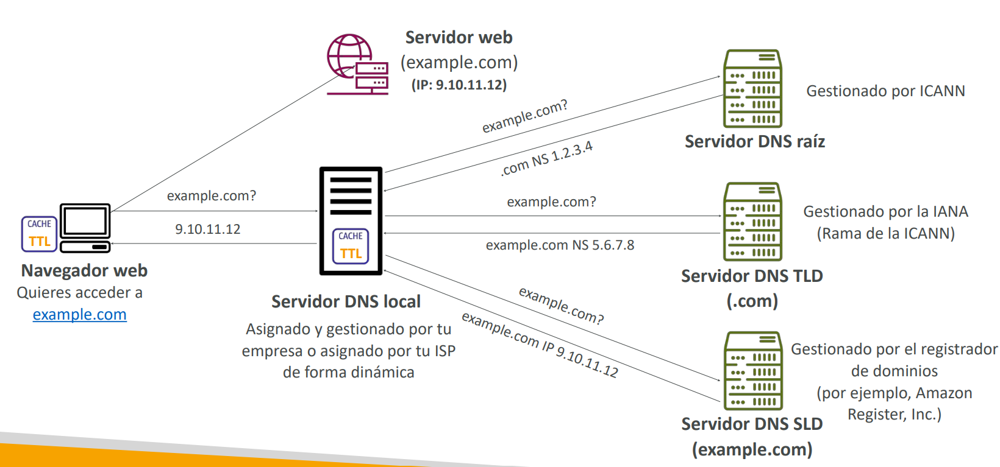

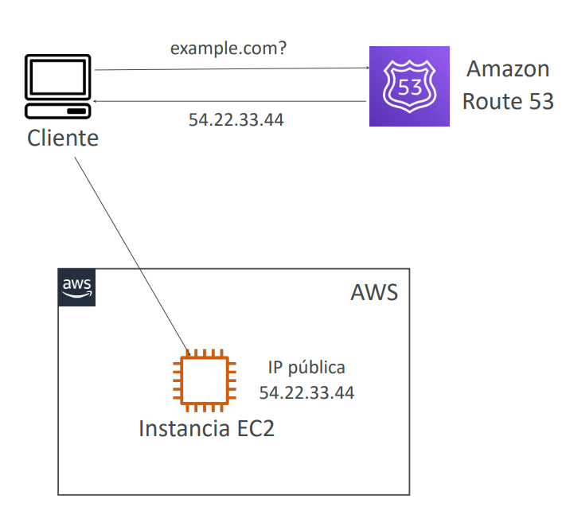

---

## 2. Tipos de Registros DNS y Zonas Hospedadas (Hosted Zones)

Una **Hosted Zone (Zona Hospedada)** es un contenedor de registros DNS que define cómo dirigir el tráfico de un dominio específico y sus subdominios.

- **Public Hosted Zone (Zona Pública)**: Registros accesibles desde la Internet pública para enrutar tráfico hacia servidores web, balanceadores o servicios SaaS.
- **Private Hosted Zone (Zona Privada)**: Registros accesibles **exclusivamente dentro de una o varias VPCs asociadas** (ej. `db.produccion.internal`), protegiendo la topología y nombres internos de la red corporativa.

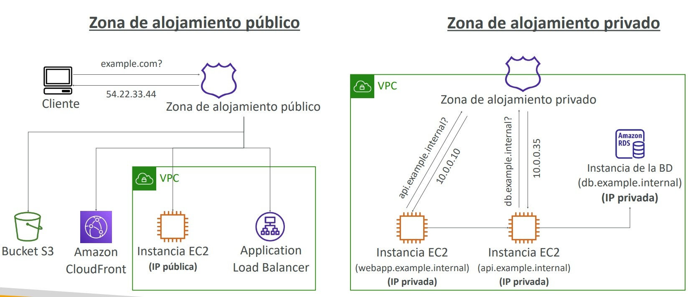

### Registros DNS Clave
- **A**: Asocia un nombre de host a una dirección **IPv4** (ej. `app.dominio.com` $\to$ `54.22.33.44`).
- **AAAA**: Asocia un nombre de host a una dirección **IPv6**.
- **CNAME**: Asocia un nombre de host a **otro nombre de host** (ej. `www.dominio.com` $\to$ `app.dominio.com`). **Limitación estricta**: No puede crearse para el vértice de la zona o dominio raíz (*Zone Apex*, ej. `dominio.com`).
- **NS**: Servidores de nombres autoritativos asignados a la zona alojada.
- **TTL (Time to Live)**: Tiempo en segundos durante el cual los clientes y resolvers intermedios almacenan la respuesta DNS en caché. Un TTL alto reduce costos y consultas pero retrasa la propagación de cambios; un TTL bajo permite cambios rápidos a costa de más consultas.

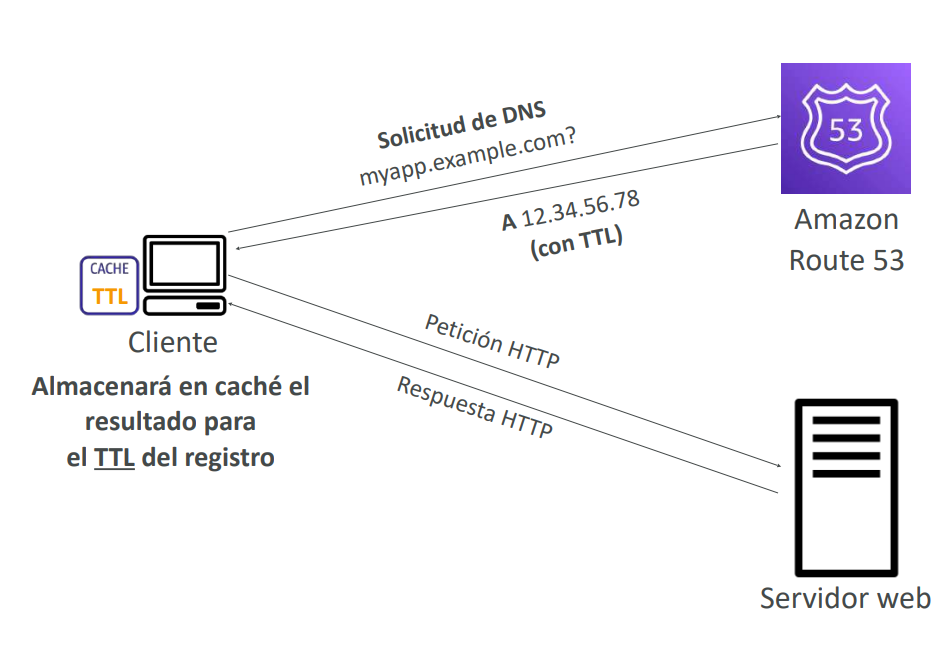

---

## 3. CNAME vs. Alias Records (El Favorito del SAA-C03)

Los recursos de AWS (como Application Load Balancers o CloudFront) exponen nombres de dominio gestionados dinámicos (ej. `my-alb-1234.us-east-1.elb.amazonaws.com`) cuyas direcciones IP subyacentes cambian elásticamente.

### Tabla Comparativa: CNAME vs. Alias Record

| Criterio | CNAME Record | Alias Record (Nativo de AWS) |
| :--- | :--- | :--- |
| **Definición** | Estándar de la industria DNS para mapear un hostname a otro hostname. | Extensión propietaria de Route 53 que apunta directamente a un recurso de AWS. |
| **Soporte de Dominio Raíz (Zone Apex)** | **NO**. No se puede crear un CNAME para `ejemplo.com` (solo para subdominios como `www.ejemplo.com`). | **SÍ**. Funciona tanto para el dominio raíz (`ejemplo.com`) como para subdominios. |
| **Costo de Consultas DNS** | Se cobra por cada consulta DNS procesada. | **Completamente gratuito** cuando apunta a recursos de AWS seleccionados. |
| **Seguimiento de Cambios de IP** | Requiere una resolución DNS recursiva adicional (más latencia). | **Reconoce instantáneamente** cualquier cambio de IP interna del recurso de AWS subyacente. |
| **Manejo de TTL** | Configurable manualmente de forma obligatoria. | **Gestionado automáticamente** por Route 53 (no se configura manualmente). |
| **Health Checks Nativos** | Opcional con integración externa. | Admite comprobaciones de salud nativas integradas (*Evaluate Target Health*). |
| **Destinos Válidos** | Cualquier nombre de host en internet. | • **Application / Network Load Balancers** • **Distribuciones de CloudFront** • **Buckets de Amazon S3 configurados como Static Website** • **AWS Global Accelerator** • **Amazon API Gateway** • **VPC Interface Endpoints** *(Nota: NO aplica directamente para nombres DNS de instancias EC2 sueltas)*. |

> **💡 SAA-C03 Exam Tip:**  
> Si una pregunta de examen te pide mapear el **dominio raíz / Zone Apex (ejemplo: `miempresa.com`)** hacia un **Application Load Balancer o una distribución de CloudFront**, la opción CNAME siempre será **incorrecta**. La única respuesta arquitectónicamente válida es un **Registro Alias de tipo A**.

---

## 4. Políticas de Enrutamiento (Routing Policies)

Las políticas de enrutamiento determinan cómo responde Route 53 a las solicitudes de resolución DNS entrantes. **El DNS no procesa ni reenvía tráfico de red en sí; únicamente devuelve la dirección o dirección IP adecuada al cliente**.

### 1. Simple Routing
- Enruta tráfico a un único recurso o devuelve una lista de valores múltiples (direcciones IP) en orden aleatorio para que el cliente elija uno.
- **No admite comprobaciones de salud (Health Checks)**. Si una IP cae, Route 53 la seguirá devolviendo.

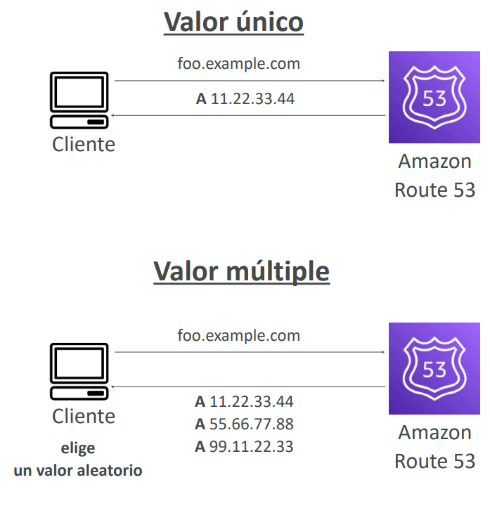

### 2. Weighted Routing (Enrutamiento Ponderado)
- Distribuye porcentualmente las respuestas DNS asignando pesos numéricos relativos a cada registro.
$$\text{Tráfico para recurso } i = \frac{\text{Peso}_i}{\sum \text{Pesos Totales}}$$
- Si se asigna un peso de `0`, Route 53 deja de enviar tráfico a ese recurso. Si todos los registros tienen peso `0`, se devuelven todos por igual.
- **Casos de uso**: Despliegues Canary / Blue-Green y pruebas A/B de nuevas versiones de software.

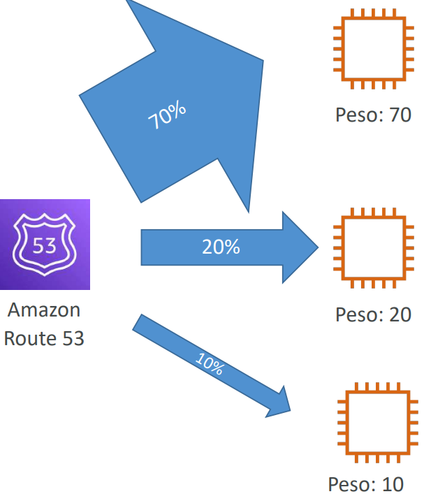

### 3. Latency-Based Routing (Enrutamiento Basado en Latencia)
- Dirige al usuario hacia la **Región de AWS que proporcione la menor latencia de red estimada** calculada periódicamente entre la ubicación del usuario y los centros de datos de AWS.
- Admite comprobaciones de salud para conmutación por error automática entre regiones.

### 4. Failover Routing (Conmutación por Error Activo-Pasivo)
- Requiere asociar un **Health Check** obligatorio.
- Devuelve la dirección del recurso **Primario** mientras esté saludable; si el chequeo falla, Route 53 conmuta automáticamente y responde con el recurso **Secundario (Disaster Recovery)**.

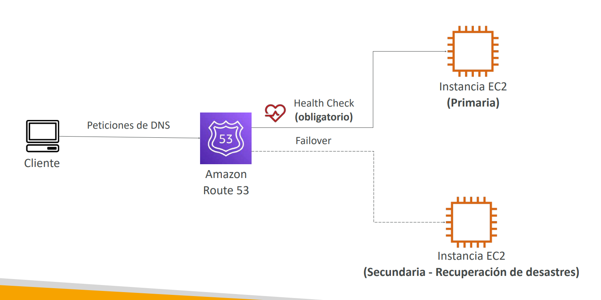

### 5. Geolocation Routing (Enrutamiento por Geolocalización)
- Resuelve consultas en función de la **ubicación geográfica real del usuario** (continente, país o estado en EE. UU.).
- **Regla obligatoria**: Se debe configurar un registro **"Default"** para resolver consultas de clientes provenientes de ubicaciones que no coincidan explícitamente con ninguna regla.
- **Casos de uso**: Localización de idiomas, restricciones de licencias de contenido por país o soberanía de datos.

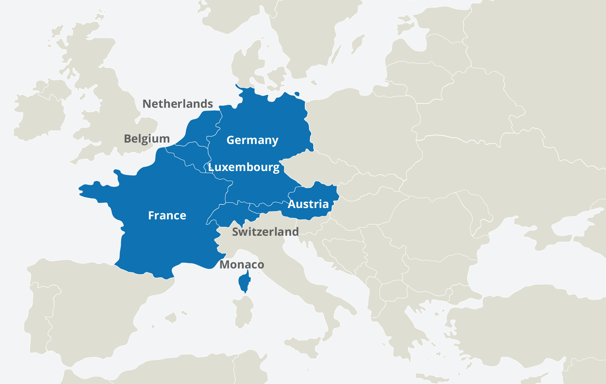

### 6. Geoproximity Routing (Enrutamiento por Geoproximidad)
- Enruta el tráfico en función de la proximidad geográfica entre los usuarios y los recursos, pero permite expandir o contraer dinámicamente el área de cobertura usando un parámetro llamado **Bias (Sesgo)**.
  - Bias positivo (1 a 99): Amplía el área de influencia geográfica, atrayendo más tráfico hacia el recurso.
  - Bias negativo (-1 a -99): Reduce el área de influencia.
- Requiere el uso de **Route 53 Traffic Flow**.

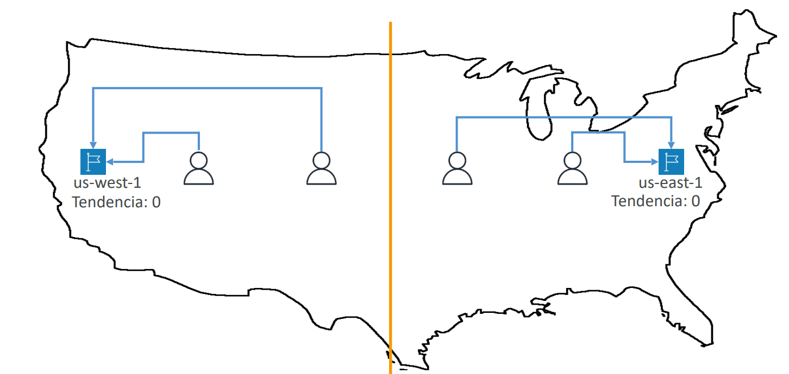

### 7. IP-Based Routing (Enrutamiento Basado en IP)
- Resuelve consultas basándose en el bloque CIDR de la dirección IP pública del cliente (o de su resolver DNS local).
- **Casos de uso**: Optimizar rutas para ISPs específicos o reducir costos de tránsito corporativo enrutando clientes empresariales a endpoints dedicados.

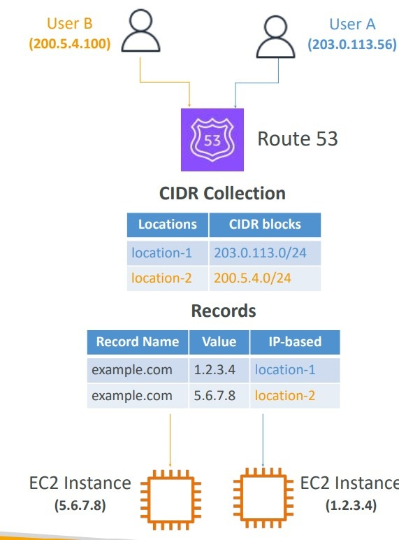

### 8. Multi-Value Answer Routing (Respuesta Multivalor)
- Devuelve hasta **8 registros de direcciones IP saludables** seleccionadas aleatoriamente por consulta.
- Se integra con Health Checks (a diferencia del Simple Routing), garantizando que solo se devuelvan recursos saludables al cliente.
- **Nota arquitectónica**: No sustituye a un Elastic Load Balancer (el cliente decide cómo conectarse a la lista de IPs recibida).

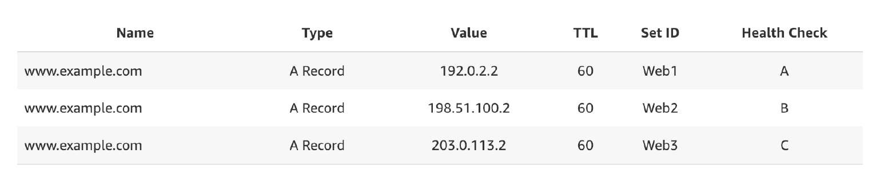

> **💡 SAA-C03 Exam Tip:**  
> **No confundas Geolocation con Latency-Based Routing**:
> - Si el requerimiento pide: *"Garantizar que los usuarios de Alemania vean el contenido en alemán o cumplan normativas europeas"* $\implies$ La respuesta es **Geolocation Routing**.
> - Si pide: *"Dirigir a los clientes al backend con el menor tiempo de respuesta y menor RTT"* $\implies$ La respuesta es **Latency-Based Routing** (un usuario en Alemania podría ser enrutado a Irlanda o EE. UU. si esa ruta ofrece menor latencia en ese instante).

---

## 5. Health Checks de Route 53

Route 53 utiliza una red distribuida de aproximadamente 15 verificadores de salud globales externos para monitorear la disponibilidad de endpoints.

### Tipos de Health Checks
1. **Endpoint Health Checks**: Realizan peticiones periódicas (intervalo estándar de 30s o rápido de 10s) vía HTTP, HTTPS o TCP hacia un recurso público. Se consideran saludables si responden con códigos 2xx o 3xx dentro de los primeros 5120 bytes de respuesta.
2. **Calculated Health Checks**: Combinan el estado de hasta 256 chequeos "hijo" (*child checks*) utilizando operadores lógicos (`AND`, `OR`, `NOT`) para determinar si el chequeo "padre" pasa. Útil para mantenimientos escalonados.
3. **CloudWatch Alarm Health Checks**: Monitorean el estado de una alarma de CloudWatch en lugar de un endpoint directo.

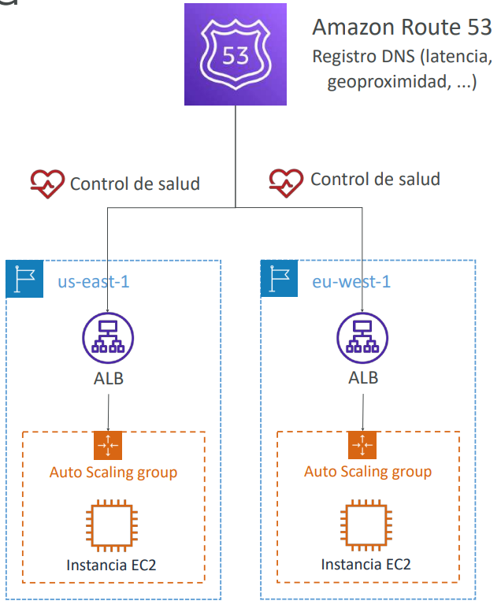

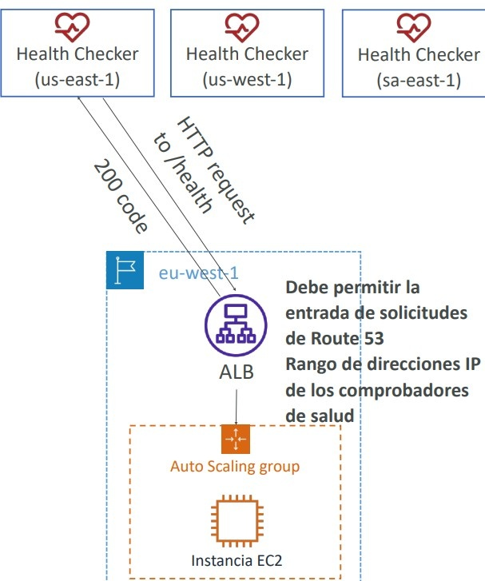

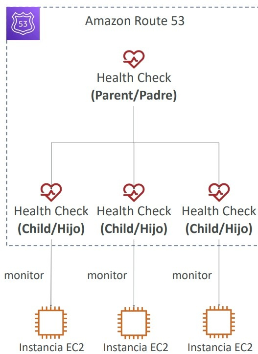

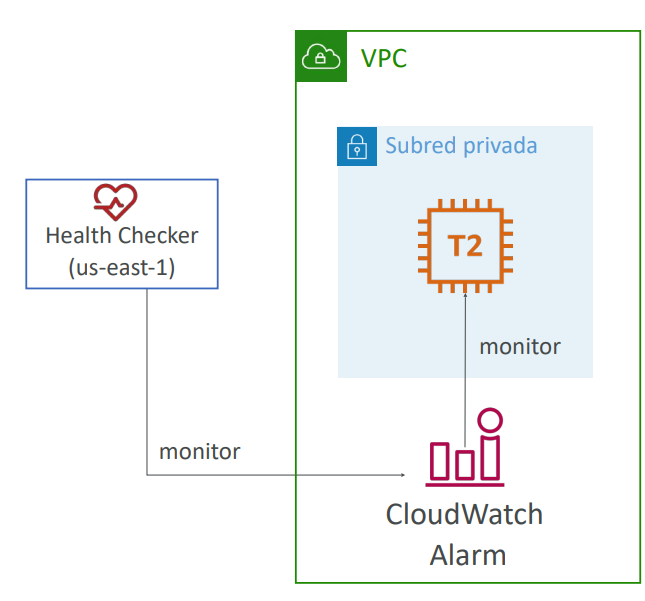

> **💡 SAA-C03 Exam Tip:**  
> Los verificadores de salud de Route 53 residen en la Internet pública fuera de tu VPC y **no pueden acceder a subredes privadas**. Para monitorear una base de datos o servidor alojado en una subred privada o en una red on-premises, la solución oficial es **crear una alarma de CloudWatch que evalúe la métrica interna y asociar el Health Check de Route 53 a dicha alarma de CloudWatch**.

---

## 6. Integración con Registradores de Terceros

Es posible adquirir el registro de un dominio en un proveedor externo (como GoDaddy) y delegar el servicio de resolución autoritativo a Route 53:
1. Crear una **Public Hosted Zone** en Amazon Route 53 con el nombre exacto del dominio.
2. Copiar los 4 registros **NS (Name Servers)** generados por Route 53.
3. Ingresar al panel del registrador externo y reemplazar los servidores de nombres predeterminados por los 4 servidores NS de Route 53.

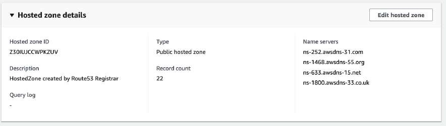

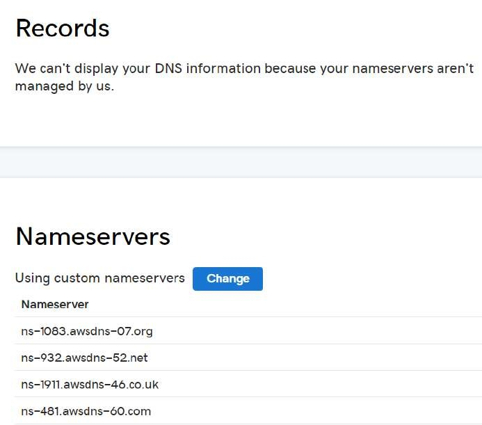

---

## 7. Arquitecturas Híbridas: Route 53 Resolver Endpoints

En arquitecturas híbridas (red local conectada a AWS mediante **AWS Direct Connect** o **AWS Site-to-Site VPN**), los servidores on-premises y las instancias EC2 en VPCs privadas necesitan resolver nombres de dominio cruzados de manera bidireccional.

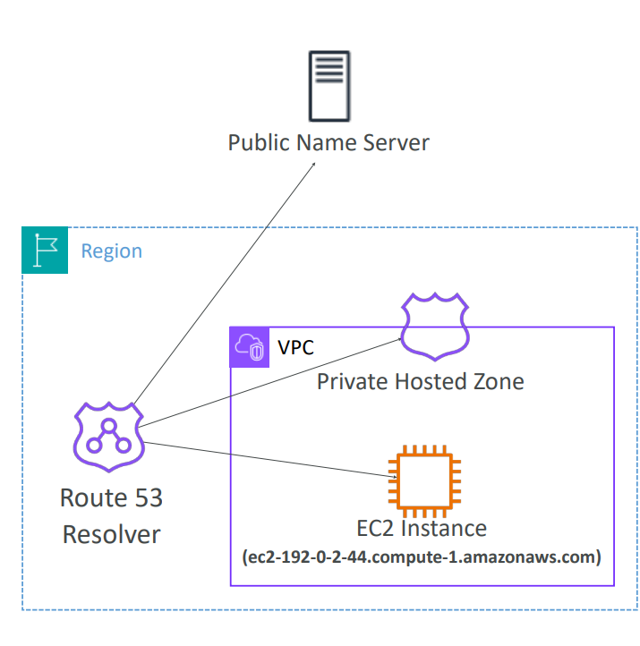

### Comparativa: Inbound vs. Outbound Resolver Endpoints

| Componente | Dirección del Flujo de Consulta | Objetivo Arquitectónico | Mecánica Operativa |
| :--- | :--- | :--- | :--- |
| **Inbound Resolver Endpoint** | **On-Premises $\longrightarrow$ AWS VPC** | Permite que los clientes y servidores locales de tu centro de datos resuelvan nombres de dominios privados en AWS (ej. `app.aws.internal` alojados en Private Hosted Zones). | Se crea una tarjeta de red virtual (ENI) con una **IP privada de la VPC**. Los servidores DNS locales configuran un reenvío condicional (*conditional forwarder*) hacia esa IP privada. |
| **Outbound Resolver Endpoint** | **AWS VPC $\longrightarrow$ On-Premises** | Permite que instancias EC2 y cargas en la VPC resuelvan nombres de dominios corporativos locales (ej. `crm.empresa.local`). | Se definen **Reglas de Reenvío de Route 53 Resolver (*Resolver Rules*)**. Si la consulta coincide con el dominio on-premises, Route 53 la redirige a través de la ENI de salida hacia los resolvers DNS locales a través del túnel VPN o Direct Connect. |

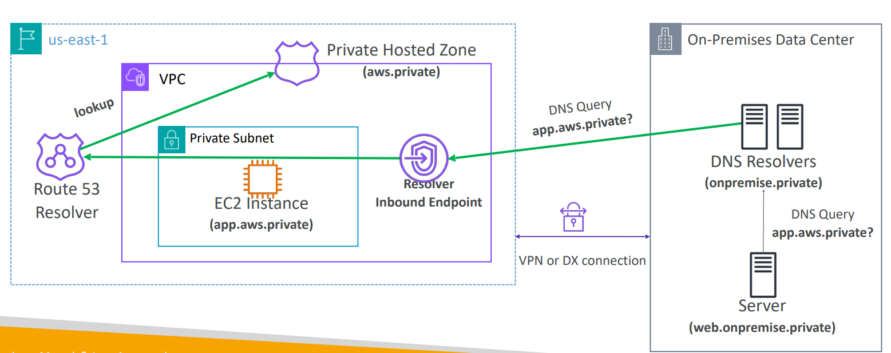

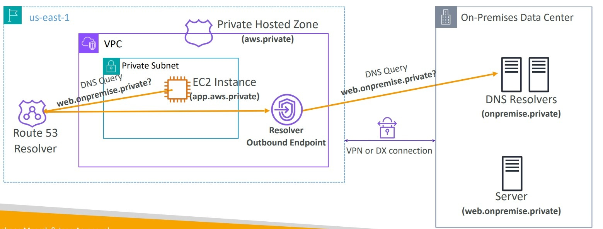
