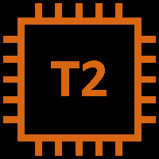
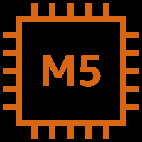
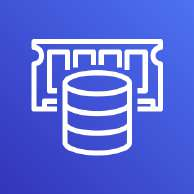
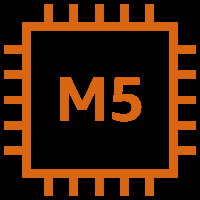
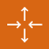
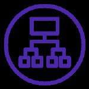
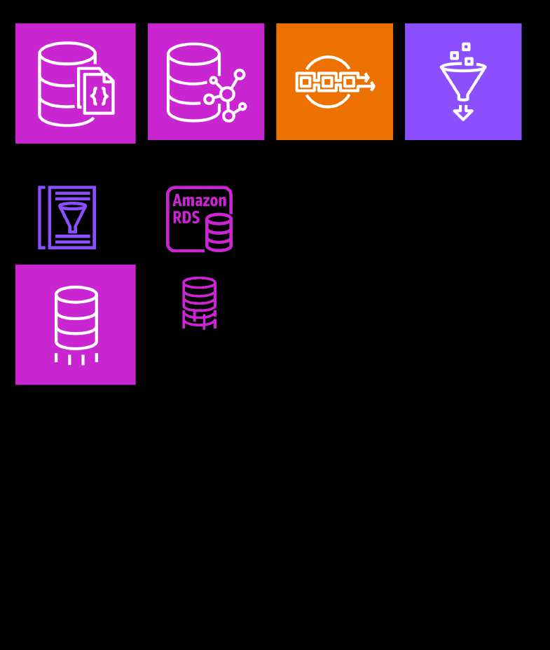
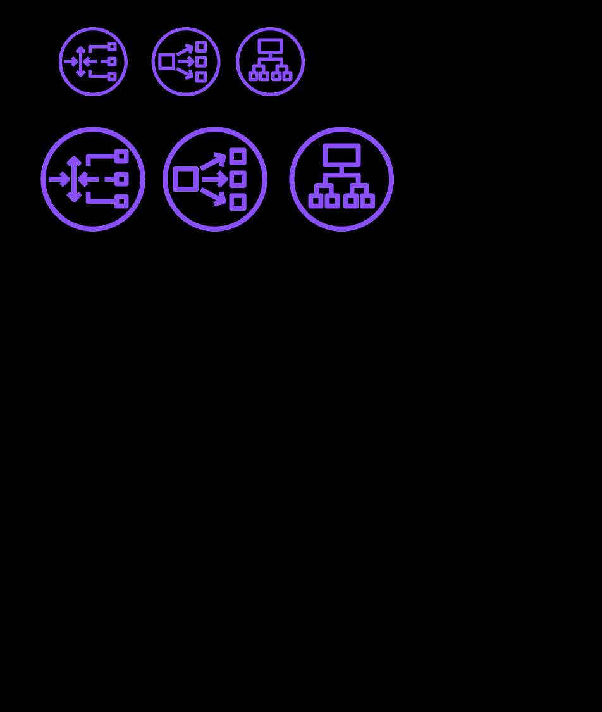
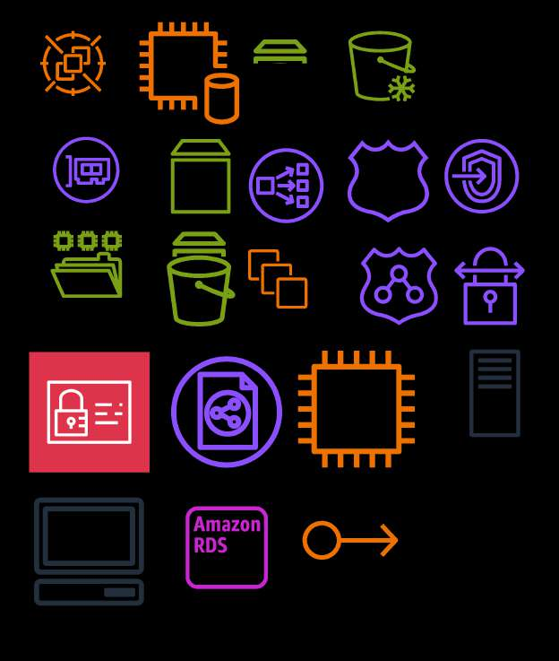

# Arquitectura de Soluciones Clásicas: Patrones Web, Multi-AZ y Elastic Beanstalk

En el examen **AWS Certified Solutions Architect - Associate (SAA-C03)**, los escenarios de arquitectura clásica integran todos los bloques fundamentales de cómputo, red, almacenamiento, balanceo y bases de datos para resolver problemas empresariales reales. 

Este módulo analiza la evolución desde aplicaciones monolíticas simples hasta **arquitecturas empresariales elásticas y sin estado de tres capas (3-Tier Architectures)**, el desacoplamiento de capas web y de trabajadores (*workers*), la aceleración del aprovisionamiento con **Golden AMIs**, y la orquestación simplificada mediante **AWS Elastic Beanstalk**.

---

## 1. Patrón 1: Aplicación Web Sin Estado (WhatIsTheTime.com)

Analizamos el ciclo de diseño de una aplicación que devuelve la hora actual (puramente computacional, sin base de datos ni persistencia de estado).

### Evolución Arquitectónica Paso a Paso
1. **Inicio Básico (Single Instance Monolith)**:
   - Una única instancia EC2 en una subred pública asociada a una **Elastic IP (IPv4 fija)**.
   - *Problema*: Punto único de fallo (SPOF) y límites estrictos de capacidad de cómputo.
2. **Escalado Vertical**:
   - Detener la instancia para redimensionar de `t2.micro` a `m5.large`.
   - *Problema*: Genera **tiempo de inactividad (*downtime*)** durante la modificación del tamaño y tiene un techo de hardware insuperable.
3. **Escalado Horizontal con DNS**:
   - Múltiples instancias EC2 públicas con registros DNS de tipo A en Route 53.
   - *Problema*: Al caer o terminarse una instancia, los clientes siguen recibiendo su IP en caché debido al TTL de DNS, provocando fallos de conexión masivos.
4. **Escalado Horizontal con Elastic Load Balancer (ELB)**:
   - Se introducen instancias EC2 alojadas en **subredes privadas**.
   - Se expone un **Application Load Balancer (ALB)** público que realiza **Health Checks** activos. Si un servidor falla, el balanceador desvía el tráfico inmediatamente.
   - El dominio público en Route 53 se resuelve mediante un **Registro Alias de tipo A** apuntando al ALB.
5. **Elasticidad Automatizada con Auto Scaling Groups (ASG)**:
   - Se reemplaza la gestión manual de instancias por un **ASG** que aprovisiona y termina servidores automáticamente según métricas de demanda (ej. uso de CPU al 50%).
6. **Alta Disponibilidad Multi-AZ**:
   - El ASG y el ALB se distribuyen a lo largo de **al menos 2 o 3 Zonas de Disponibilidad (AZs)**.
   - *Optimización de costos*: La capacidad base mínima permanente se cubre con **Instancias Reservadas / Savings Plans**, y los picos elásticos se atienden con instancias On-Demand o Spot.

> **💡 SAA-C03 Exam Tip:**  
> Si una pregunta de examen describe una aplicación web que al escalar horizontalmente presenta fallas intermitentes donde algunos usuarios intentan acceder a instancias que acaban de ser terminadas por el Auto Scaling, **la causa raíz es usar registros DNS tipo A múltiples con TTL prolongado en lugar de un Application Load Balancer**. El ALB aísla a los clientes finales de los ciclos de vida efímeros de las instancias EC2 mediante Target Groups y Deregistration Delay.

---

## 2. Patrón 2: Aplicación Web Con Estado (MyClothes.com)

Un sitio de comercio electrónico requiere persistir el carrito de compras y los perfiles de usuario, evitando que una sesión se pierda si una instancia EC2 backend se reinicia o es destruida por el Auto Scaling Group.

### Estrategias de Manejo de Estado (Pros y Contras)
1. **Sticky Sessions (Sesiones Persistentes en el Balanceador)**:
   - El balanceador envía al mismo cliente a la misma instancia backend mediante una cookie.
   - *Desventaja*: Si la instancia falla o escala hacia dentro (*scale-in*), el usuario pierde su carrito. Además, genera sobrecarga desbalanceada (*hot spotting*).
2. **Cookies en el Navegador del Cliente**:
   - Todo el contenido del carrito viaja codificado en la cookie HTTP del usuario.
   - *Desventaja*: Sobrecarga el tráfico de red en cada solicitud, está limitado a 4 KB de tamaño y expone riesgos de manipulación de datos en el cliente.
3. **Persistencia Centralizada en Memoria (Amazon ElastiCache / DynamoDB)** *(El Estándar Recomendado)*:
   - Las instancias EC2 se vuelven **completamente sin estado (*Stateless*)**.
   - Solo viaja una cookie con un `session_id` ligero. Las instancias leen y escriben el carrito y estado de sesión directamente en un clúster de **Amazon ElastiCache for Redis** (o Amazon DynamoDB).
   - Cualquier instancia EC2 en cualquier AZ puede atender a cualquier usuario en cualquier momento.

### Escalabilidad de la Capa de Datos
- **Almacenamiento de Perfiles de Usuario**: Base de datos relacional administrada en **Amazon RDS Multi-AZ** para garantizar tolerancia a fallos.
- **Escalado de Lecturas**:
  - Implementar **RDS Read Replicas** para separar consultas analíticas y de catálogo.
  - Implementar un patrón de caché **Cache-Aside / Write-Through** con **Amazon ElastiCache** frente a RDS para servir consultas repetitivas con latencia en submilisegundos.

---

## 3. Seguridad Perimetral: Arquitectura de 3 Capas (3-Tier Web App)

El aislamiento de red de una arquitectura web clásica de 3 capas se formaliza mediante subredes y **referencias cruzadas entre Security Groups**:

### Matriz de Seguridad de Security Groups (Examen SAA-C03)

| Capa de Arquitectura | Tipo de Subred | Reglas de Entrada (Inbound Rules) | Origen Permitido (Source) |
| :--- | :--- | :--- | :--- |
| **1. Capa Perimetral (ALB)** | **Pública** | Puertos 80 (HTTP) y 443 (HTTPS) | `0.0.0.0/0` (Internet abierta). |
| **2. Capa de Aplicación (EC2 ASG)** | **Privada** | Puerto de la aplicación (ej. 80 / 8080) | **Exclusivamente el Security Group del ALB**. |
| **3. Capa de Caché (ElastiCache)** | **Privada (Datos)** | Puerto 6379 (Redis) o 11211 (Memcached) | **Exclusivamente el Security Group de las EC2**. |
| **4. Capa de Base de Datos (RDS / Aurora)**| **Privada (Datos)** | Puerto 3306 (MySQL) o 5432 (PostgreSQL) | **Exclusivamente el Security Group de las EC2**. |

---

## 4. Patrón 3: Sitios Web Distribuidos con Archivos Compartidos (MyWordPress.com)

Un CMS como WordPress requiere gestionar simultáneamente dos tipos de persistencia:
1. **Datos relacionales (Posts, comentarios, usuarios)**: Se almacenan óptimamente en **Amazon Aurora MySQL Multi-AZ** con réplicas de lectura.
2. **Archivos multimedia subidos por usuarios (Imágenes de posts, temas, plugins)**: Deben estar accesibles de manera idéntica y concurrente para todas las instancias EC2 del clúster.

### Comparativa de Persistencia de Archivos: EBS vs. EFS

| Solución de Disco | Comportamiento en Arquitectura Multi-Instancia | Veredicto en SAA-C03 |
| :--- | :--- | :--- |
| **Amazon EBS** | Los volúmenes EBS están anclados a una **única AZ** y generalmente a una sola instancia. Si una instancia en la AZ-1 recibe una imagen, las instancias en la AZ-2 no tienen acceso a ella. | **Antipatrón para CMS distribuidos**. Provoca inconsistencia inmediata entre servidores web. |
| **Amazon EFS** | Sistema de archivos de red compatible con **POSIX montable concurrentemente en cientos de instancias EC2 a través de múltiples Zonas de Disponibilidad (Multi-AZ)**. | **Solución estándar recomendada**. Todas las instancias leen y escriben sobre el mismo directorio `/var/www/html/wp-content/uploads`. |

> **💡 SAA-C03 Exam Tip:**  
> Cuando una pregunta plantee una flota de instancias EC2 en un Auto Scaling Group que ejecutan una aplicación web heredada que necesita **compartir y escribir archivos en un sistema de archivos común compatible con llamadas POSIX en múltiples Zonas de Disponibilidad**, la respuesta correcta es **Amazon EFS** (o Amazon S3 si la aplicación puede modificarse mediante API SDK, pero si el código espera un sistema de archivos montado tradicional, la respuesta es EFS).

---

## 5. Estrategias de Aprovisionamiento Rápido de Cómputo

Cuando un Auto Scaling Group lanza instancias en respuesta a un pico repentino de tráfico, el tiempo de preparación (*bootstrapping*) determina si la aplicación absorbe la carga o colapsa:

- **Enfoque 1: EC2 User Data Puro**:
  - Descarga e instala paquetes, librerías y dependencias en cada arranque.
  - *Problema*: Tarda entre 5 y 15 minutos en completar el inicio, aumentando la ventana de latencia y riesgo.
- **Enfoque 2: Golden AMI (Imagen Dorada)**:
  - Se aprovisiona una instancia, se preinstalan todas las dependencias estáticas, parches y binarios, y se crea una AMI personalizada.
  - *Ventaja*: El tiempo de arranque se reduce a segundos (< 1 minuto).
- **Enfoque Híbrido (Mejor Práctica)**:
  - Utilizar una **Golden AMI** para el 95% del software base inmutable, complementada con un script de **User Data muy breve** que inyecta únicamente parámetros de configuración dinámicos (variables de entorno, endpoints de base de datos o secretos desde AWS Secrets Manager).

---

## 6. AWS Elastic Beanstalk

**AWS Elastic Beanstalk** es una plataforma como servicio (**PaaS**) orientada a desarrolladores que automatiza el despliegue completo de aplicaciones web en AWS.

### Conceptos Clave
- **Control total de la infraestructura**: A diferencia de otras soluciones PaaS cerradas, Elastic Beanstalk aprovisiona recursos nativos de AWS (EC2, ASG, ALB, CloudWatch, RDS) dentro de tu cuenta. El arquitecto conserva el acceso administrativo total para ajustar cualquier parámetro.
- **Modelo de precios**: **El servicio Elastic Beanstalk en sí es completamente gratuito**; únicamente se factura el consumo de los recursos subyacentes creados (instancias EC2, balanceadores, almacenamiento EBS).
- **Plataformas soportadas**: Java, .NET, Node.js, PHP, Python, Ruby, Go y entornos de contenedores **Docker** (contenedor único o multicontenedor).

### Modos de Entorno en Elastic Beanstalk
1. **Web Tier (Nivel Web)**:
   - Expone un Application Load Balancer que recibe peticiones HTTP/HTTPS públicas y las distribuye a un Auto Scaling Group de instancias EC2.
2. **Worker Tier (Nivel de Trabajador)**:
   - Diseñado para procesamiento asíncrono y tareas pesadas en segundo plano.
   - Integra de forma nativa una cola **Amazon SQS**. Las instancias EC2 ejecutan un demonio (*SQS daemon*) que extrae mensajes de la cola y escala el número de workers automáticamente en función de la métrica de mensajes acumulados en la cola SQS.

> **💡 SAA-C03 Exam Tip:**  
> **Antipatrón crítico de base de datos en Elastic Beanstalk**:  
> Aunque Elastic Beanstalk permite aprovisionar una base de datos Amazon RDS directamente desde su consola de configuración de entorno, **esto solo se recomienda para desarrollo o pruebas**.  
> En entornos de **producción**, la base de datos RDS debe crearse **de forma independiente fuera de Elastic Beanstalk**. Si la base de datos se crea dentro de Beanstalk, **quedará vinculada al ciclo de vida del entorno y será eliminada si el entorno de Elastic Beanstalk es destruido**.
