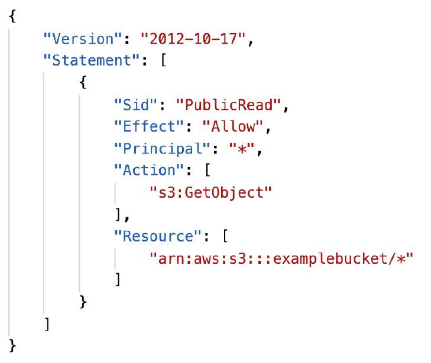
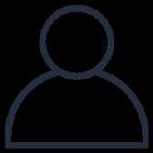
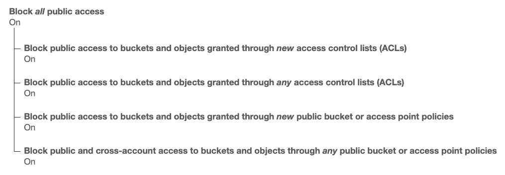
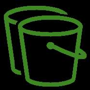
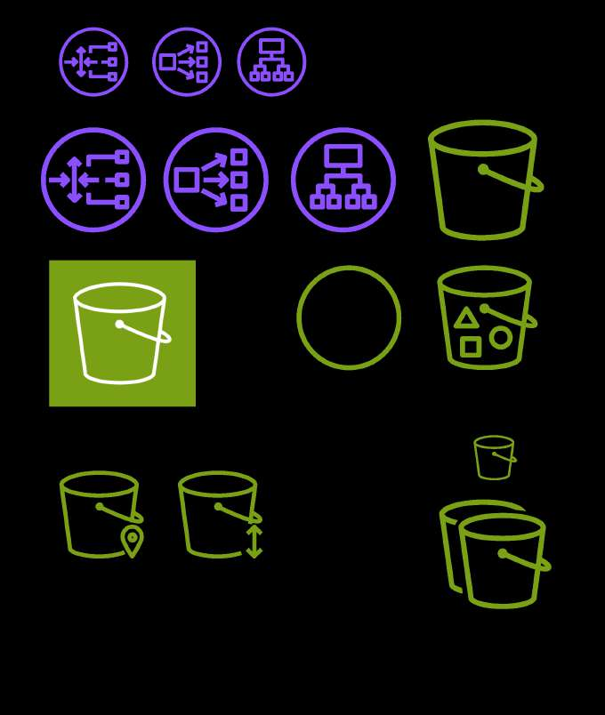

# Amazon S3: Almacenamiento de Objetos, Seguridad y Clases de Almacenamiento

**Amazon Simple Storage Service (Amazon S3)** es el servicio fundacional de almacenamiento de objetos gestionado en la nube de AWS. Proporciona almacenamiento de escala infinita, alta durabilidad y rendimiento para copias de seguridad, data lakes de análisis masivo, alojamiento de sitios web estáticos y arquitecturas orientadas a eventos.

Para el examen **AWS Certified Solutions Architect - Associate (SAA-C03)**, dominar Amazon S3 es indispensable: se evalúan sus convenciones de nombres, la anatomía de los objetos, el control de acceso y seguridad (Bucket Policies, IAM, Block Public Access), el versionado, la replicación (CRR y SRR) y, de forma prioritaria, la selección costo-eficiente de sus **Clases de Almacenamiento (Storage Classes)**.

---

## 1. Fundamentos: Buckets y Objetos

Amazon S3 almacena datos como **objetos** dentro de contenedores lógicos denominados **buckets**.

### Reglas de Nomenclatura de Buckets
- **Namespace Globalmente Único**: El nombre del bucket debe ser único entre **todas las cuentas de AWS y en todas las regiones del mundo**.
- **Anclaje Regional**: Aunque el namespace sea global, cada bucket se crea físicamente en una **región específica de AWS** seleccionada por el arquitecto (afectando costos, latencia y leyes de soberanía de datos).
- **Convenciones obligatorias**:
  - Longitud de entre **3 y 63 caracteres**.
  - Solo letras minúsculas, números y guiones (`-`).
  - **No** se permiten mayúsculas ni guiones bajos (`_`).
  - No puede formatearse como una dirección IP (ej. `192.168.5.1`).
  - Debe comenzar y terminar con una letra minúscula o un número.
  - No debe comenzar con `xn--` ni terminar con `-s3alias`.

### Anatomía de los Objetos en S3
- **Clave del Objeto (*Key*)**: Es la ruta completa del archivo dentro del bucket. En S3 **no existen directorios físicos reales**; la apariencia de carpetas en la consola es una abstracción visual basada en prefijos separados por barras oblicuas (`/`).
  - Ejemplo: en `s3://mi-data-lake/logs/2026/enero/app.log`, la clave completa es `logs/2026/enero/app.log` y el prefijo es `logs/2026/enero/`.
- **Límites de Tamaño**:
  - Tamaño máximo por objeto individual: **50 TB**.
  - **Límite de subida en un solo PUT**: **5 GB**.
  - **Multipart Upload (Subida Multiparte)**: **Obligatoria para cualquier archivo superior a 5 GB** (y recomendada para cualquier archivo mayor a 100 MB para paralelizar transferencias y tolerar fallos de red).
- **Metadatos y Etiquetas**: Pares clave-valor asignados al objeto (del sistema o definidos por el usuario) y hasta 10 etiquetas (*tags*) por objeto utilizadas para políticas de ciclo de vida y control de acceso.

---

## 2. Seguridad en Amazon S3: Políticas y Control de Acceso

La autorización en Amazon S3 se evalúa mediante una combinación de políticas de identidad y políticas basadas en recursos. Un usuario tiene acceso si:
1. Su política de IAM o la política del Bucket otorgan un **`Allow` explícito**.
2. **NO existe ninguna denegación explícita (`Explicit Deny`)** en ninguna política vinculada.

### Mecanismos de Seguridad
- **Políticas de IAM (Identity-Based)**: Asignadas a usuarios, grupos o roles de IAM para definir qué llamadas de API pueden ejecutar sobre recursos de S3.
- **Políticas de Bucket (Resource-Based)**: Documentos JSON adjuntos directamente al bucket de S3. Permiten:
  - Otorgar acceso público anónimo (ej. para sitios web estáticos).
  - Configurar **acceso cruzado entre cuentas de AWS (*Cross-Account Access*)** sin requerir que los usuarios externos asuman un rol de IAM.
  - Imponer políticas de seguridad obligatorias (como forzar conexiones cifradas mediante HTTPS/TLS con `"aws:SecureTransport": "false"`).
- **S3 Block Public Access**: Protección a nivel de cuenta o de bucket que anula cualquier configuración o política permisiva, bloqueando accidentalmente la exposición pública de datos sensibles.

### Alojamiento de Sitios Web Estáticos
- S3 puede hospedar sitios web estáticos (HTML, CSS, JS, imágenes).
- **Formato del endpoint web**:
  - `http://<bucket-name>.s3-website-<region>.amazonaws.com` o
  - `http://<bucket-name>.s3-website.<region>.amazonaws.com`
- **Requisito**: Si un usuario recibe un error **`403 Forbidden`**, se debe deshabilitar *S3 Block Public Access* y adjuntar una Bucket Policy que otorgue permiso explícito `s3:GetObject` a cualquier principal (`*`).

> **💡 SAA-C03 Exam Tip:**  
> Si una pregunta de examen plantea que una compañía exige por auditoría que **"ningún objeto subido a un bucket de S3 viaje sin cifrado en tránsito"**, la solución consiste en agregar una **Bucket Policy con un `Effect: Deny`** para la acción `s3:*` condicionado a la clave `"Bool": { "aws:SecureTransport": "false" }`. Cualquier solicitud sobre HTTP sin TLS será rechazada de inmediato.

---

## 3. Versionado de Objetos en S3 (S3 Versioning)

El versionado se activa a nivel de bucket y preserva todas las iteraciones históricas de un archivo:
- **Protección contra borrados y sobreescrituras accidentales**:
  - Si se sobrescribe un archivo con el mismo nombre, S3 genera un nuevo `Version ID` y conserva la versión previa.
  - Si un usuario elimina un archivo, S3 **no lo destruye**: inserta un **marcador de eliminación (*Delete Marker*)**. El archivo parece eliminado, pero recuperar la versión original consiste en borrar dicho marcador de eliminación.
- **Eliminación permanente**: Solo se destruye un objeto si se ejecuta un borrado especificando el `Version ID` exacto (acción que puede protegerse mediante **MFA Delete**).
- **Irreversibilidad**: Una vez habilitado, el versionado **no se puede deshabilitar**; únicamente se puede **suspender** (los objetos nuevos tendrán versión `null`, pero las versiones previas permanecen).

---

## 4. Replicación en S3: CRR vs. SRR

Permite copiar objetos de forma asíncrona entre diferentes buckets de S3.

### Requisitos Obligatorios para Replicación
1. **El Versionado debe estar habilitado tanto en el bucket de origen como en el de destino**.
2. S3 debe contar con un **Rol de IAM** con permisos para leer del origen y escribir en el destino.

### Modalidades de Replicación
- **Cross-Region Replication (CRR)**: Replicación entre buckets ubicados en diferentes regiones de AWS.
  - Casos de uso: Cumplimiento normativo de residencia fuera de zona, latencia reducida para usuarios globales y Disaster Recovery multirregional.
- **Same-Region Replication (SRR)**: Replicación entre buckets de la misma región (misma cuenta o cuentas distintas).
  - Casos de uso: Agregación de logs de múltiples cuentas en un único bucket de auditoría o sincronización entre entornos de producción y desarrollo.

### Reglas Críticas de Replicación
- **Por defecto, solo se replican los objetos creados después de activar la regla**. Para sincronizar datos previos se debe utilizar **S3 Batch Replication**.
- **No existe replicación encadenada**: Si el Bucket A replica en B, y B replica en C, los objetos creados en A **no** se replicarán en C.
- Los borrados que especifican un `Version ID` no se replican al destino para evitar ataques maliciosos en cascada.

---

## 5. Clases de Almacenamiento de Amazon S3

AWS ofrece diversas clases diseñadas para optimizar el gasto de almacenamiento en función de los patrones de acceso de los datos.

### Tabla Comparativa Maestra de Clases de Almacenamiento en S3

| Clase de Almacenamiento | Durabilidad | Disponibilidad | Zonas de Disp. (AZs) | Tiempo de Recuperación | Cuota Mín. Retención Facturable | Casos de Uso Críticos en SAA-C03 |
| :--- | :--- | :--- | :--- | :--- | :--- | :--- |
| **S3 Standard** | 99.999999999% (11 9's) | 99.99% | $\ge 3$ AZs | Instantáneo | Ninguna | Datos de acceso frecuente, distribución web masiva, aplicaciones móviles, streaming activo. |
| **S3 Intelligent-Tiering** | 11 9's | 99.9% | $\ge 3$ AZs | Instantáneo | Ninguna (Aplica pequeña tarifa mensual por monitorización) | **Patrones de acceso desconocidos o cambiantes**. Mueve objetos automáticamente entre tiers sin penalización ni cobro por recuperación. |
| **S3 Standard-IA (Infrequent Access)** | 11 9's | 99.9% | $\ge 3$ AZs | Instantáneo | **30 días** (mínimo 128 KB facturable) | Datos de acceso poco frecuente pero que requieren disponibilidad inmediata ante desastres o auditorías. Tarifa por GB recuperado. |
| **S3 One Zone-IA** | 11 9's | **99.5%** | **1 AZ** | Instantáneo | **30 días** (mínimo 128 KB facturable) | Almacenamiento económico para copias de seguridad secundarias o datos fácilmente reproducibles. **Riesgo: si la AZ se destruye, los datos se pierden**. |
| **S3 Glacier Instant Retrieval** | 11 9's | 99.9% | $\ge 3$ AZs | **Milisegundos** | **90 días** (mínimo 128 KB facturable) | Archivos históricos a los que se accede una vez al trimestre pero requieren visualización inmediata en tiempo real (médicos, noticias). |
| **S3 Glacier Flexible Retrieval** | 11 9's | 99.99% | $\ge 3$ AZs | • **Expedited**: 1-5 min • **Standard**: 3-5 horas • **Bulk**: 5-12 horas | **90 días** | Respaldos a largo plazo donde no se requiere acceso instantáneo. La opción *Bulk* es gratuita. |
| **S3 Glacier Deep Archive** | 11 9's | 99.99% | $\ge 3$ AZs | • **Standard**: 12 horas • **Bulk**: 48 horas | **180 días** | **El almacenamiento más económico de todo AWS**. Retención regulatoria por 7 a 10 años (servicios financieros, registros de salud). |
| **S3 Express One Zone** | 11 9's | 99.95% | **1 AZ** | **Submilisegundo** (latencia de un solo dígito de ms) | Ninguna | Cargas de cómputo intensivas de alto rendimiento: **Entrenamiento de Machine Learning (SageMaker), análisis masivo (Athena, EMR)** y procesamiento financiero. Hasta 100,000 peticiones/seg. |

---

## 6. S3 Intelligent-Tiering: Niveles Automáticos

**S3 Intelligent-Tiering** es la única clase de almacenamiento en la nube que optimiza costos automáticamente moviendo objetos entre niveles de acceso según el tiempo que llevan sin ser consultados:
1. **Frequent Access Tier**: Nivel predeterminado para datos nuevos o accedidos recientemente.
2. **Infrequent Access Tier**: Se transfiere automáticamente tras **30 días consecutivos sin accesos** (ahorro ~40%).
3. **Archive Instant Access Tier**: Se transfiere automáticamente tras **90 días consecutivos sin accesos** (ahorro ~68%).
4. **Archive Access Tier (Opcional)**: Configurable entre 90 y más de 700 días (recuperación de 3 a 5 horas).
5. **Deep Archive Access Tier (Opcional)**: Configurable entre 180 y más de 700 días (recuperación de 12 horas).

> **💡 SAA-C03 Exam Tip:**  
> Si un escenario de examen describe un conjunto de datos masivo con **"patrones de acceso completamente impredecibles o que varían estacionalmente de forma desconocida"** y solicita la solución más costo-eficiente **sin riesgo de incurrir en tarifas punitivas por recuperación de datos y sin intervención operativa**, la respuesta correcta siempre es **S3 Intelligent-Tiering**.

---

## 7. Comparativa de Recuperación en Clases Glacier

> **💡 SAA-C03 Exam Tip:**  
> **Diferenciación crucial para el examen SAA-C03**:  
> - Si los datos archivados requieren **"acceso en milisegundos / tiempo real"** tras meses sin uso $\implies$ **S3 Glacier Instant Retrieval**.  
> - Si la empresa necesita archivar datos por **"cumplimiento legal estricto durante 7 a 10 años al menor costo posible absoluto, aceptando tiempos de recuperación de 12 a 48 horas"** $\implies$ **S3 Glacier Deep Archive**.
