# Amazon S3 Avanzado: Ciclo de Vida, Eventos, Rendimiento y Storage Lens

Amazon S3 no solo actúa como un almacén pasivo de objetos, sino como una plataforma analítica y de distribución de datos de alto rendimiento. En el examen **AWS Certified Solutions Architect - Associate (SAA-C03)**, el módulo avanzado de S3 evalúa la automatización de costos con **Reglas de Ciclo de Vida (Lifecycle Rules)**, la arquitectura orientada a eventos con **S3 Event Notifications** y **EventBridge**, la maximización del rendimiento mediante particionamiento por prefijos, subidas multiparte y **Transfer Acceleration**, y la gobernanza organizacional con **S3 Storage Lens** y **S3 Batch Operations**.

---

## 1. Automatización del Ciclo de Vida en S3 (Lifecycle Rules)

Las reglas de ciclo de vida automatizan la transición y eliminación de objetos para minimizar costos de almacenamiento sin intervención manual.

### Tipos de Acciones en Políticas de Ciclo de Vida
1. **Acciones de Transición (Transition Actions)**:
   - Definen cuándo mover objetos a clases de almacenamiento más económicas a medida que envejecen.
   - Ejemplos:
     - Mover de *S3 Standard* a *S3 Standard-IA* a los 30 o 60 días tras su creación.
     - Mover a *S3 Glacier Flexible Retrieval* o *Deep Archive* después de 90 o 180 días.
2. **Acciones de Expiración (Expiration Actions)**:
   - Configuran la eliminación definitiva de objetos tras un período de tiempo predeterminado.
   - Ejemplos:
     - Eliminar logs de acceso transcurridos 365 días.
     - Eliminar versiones no actuales (*Noncurrent Versions*) de objetos en buckets con versionado activo.
     - **Regla crítica de optimización de costos**: **Abortar y eliminar subidas multiparte incompletas (*Incomplete Multipart Uploads*)** transcurridos $N$ días (ej. 7 días), evitando cobros invisibles por partes huérfanas acumuladas.

### Filtrado y Alcance de las Reglas
Las reglas de ciclo de vida pueden aplicarse a:
- Todo el contenido del bucket.
- Un **prefijo específico** (ej. `s3://mi-bucket/logs/*` o `s3://mi-bucket/imagenes/`).
- **Etiquetas de objetos (*Object Tags*)** específicas (ej. `Entorno: Desarrollo` o `Departamento: Finanzas`).

> **💡 SAA-C03 Exam Tip:**  
> **Escenario de examen clásico**: Una aplicación genera imágenes temporales o miniaturas (*thumbnails*) que pueden regenerarse fácilmente a partir de fotos originales y solo se consultan durante 60 días.  
> La arquitectura más costo-eficiente y recomendada es:
> 1. Almacenar las imágenes originales en **S3 Standard**, transitando a **S3 Glacier Flexible Retrieval** a los 60 días.
> 2. Almacenar las miniaturas en **S3 One Zone-IA** (porque son recreables y se ahorra costo de replicación multi-AZ), configurando una regla de expiración para **eliminarlas automáticamente a los 60 días**.

---

## 2. Herramientas de Análisis y Modelos de Costo

### Amazon S3 Storage Class Analysis
- Analiza los patrones de acceso a los datos a lo largo del tiempo para recomendar cuándo es óptimo mover datos de **S3 Standard a S3 Standard-IA**.
- Genera informes diarios exportables en formato `.csv`.
- **Límites para el examen**: Aplica exclusivamente para transiciones hacia *Standard-IA*; no genera recomendaciones para *One Zone-IA* ni para familias *Glacier*.

### S3 Requester Pays (El Solicitante Paga)
- Por defecto, el propietario del bucket sufraga todos los costos de almacenamiento y los costos de transferencia de red saliente (*Data Transfer Out*).
- En buckets configurados con **Requester Pays**, **el usuario o cuenta que descarga el archivo asume los costos de la petición y del ancho de banda de red**. El propietario solo paga por el espacio de almacenamiento físico.
- **Requisito obligatorio**: El solicitante **debe estar autenticado en AWS** (no admite solicitudes anónimas). Ideal para datasets de investigación masivos o colaboración B2B.

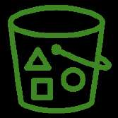

---

## 3. Arquitecturas Orientadas a Eventos: Notificaciones de S3

Amazon S3 puede emitir eventos en respuesta a acciones dentro de un bucket (ej. `s3:ObjectCreated`, `s3:ObjectRemoved`, `s3:ObjectRestore:Completed`, `s3:Replication:*`).

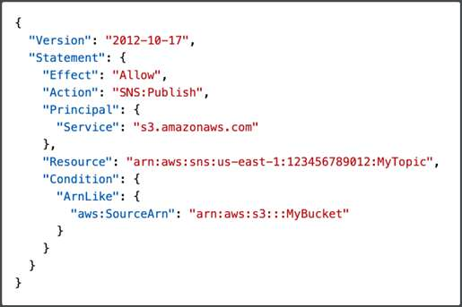
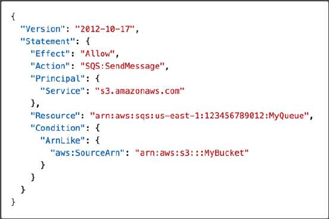
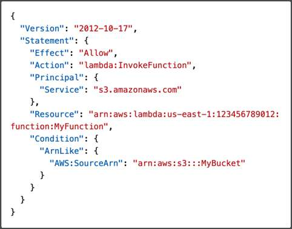
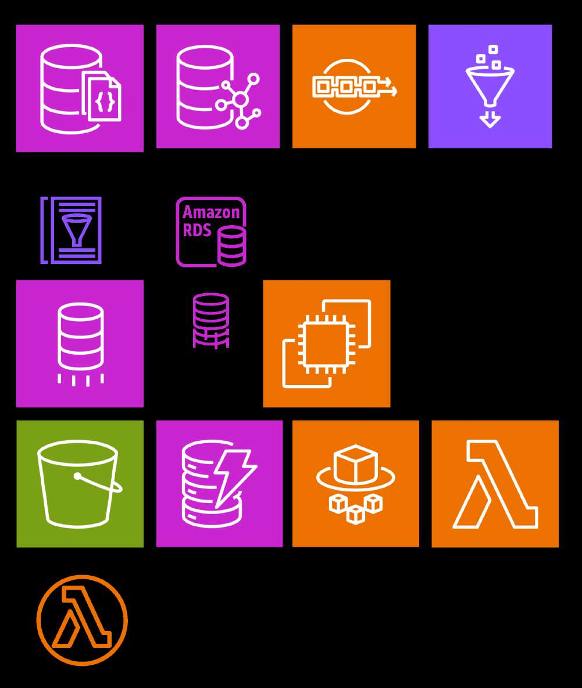
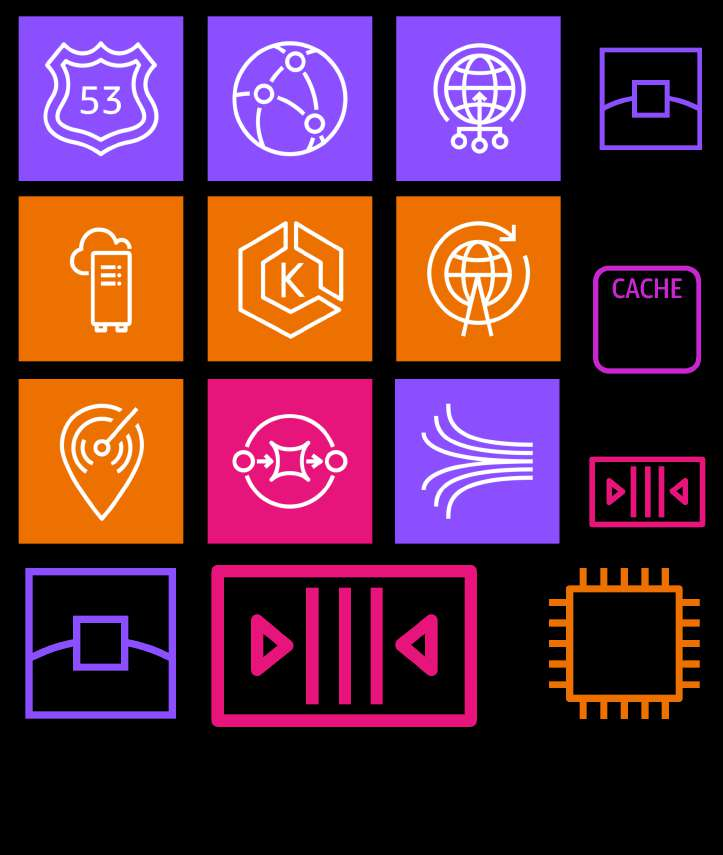

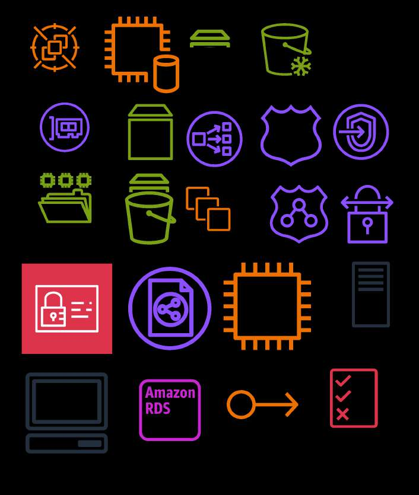

### Comparativa: S3 Event Notifications vs. Amazon EventBridge

| Criterio | S3 Event Notifications (Nativas) | S3 con Amazon EventBridge |
| :--- | :--- | :--- |
| **Destinos Soportados** | Exclusivamente 3 servicios directos: **Amazon SNS**, **Amazon SQS** y **AWS Lambda**. | **Más de 18 destinos de AWS** (Step Functions, Kinesis Data Streams, Kinesis Firehose, Lambda, Event Buses externos, etc.). |
| **Capacidades de Filtrado** | Filtrado básico por nombre de objeto (prefijo y sufijo, ej. `*.jpg`). | **Filtrado avanzado con reglas JSON** (por tamaño de objeto, metadatos, tipo de operación, tags, etc.). |
| **Gobernanza y Confiabilidad** | Entrega estándar basada en políticas de acceso del recurso de destino. | Soporta **repetición de eventos (*Event Replay*)**, archivado de eventos y desacoplamiento enterprise. |
| **Permisos Requeridos** | Requiere adjuntar una **Resource-Based Policy** en el destino (SNS Topic Policy, SQS Queue Policy o Lambda Resource Policy) autorizando al principal `s3.amazonaws.com`. | Gestionado a través de roles de ejecución de EventBridge y buses de eventos. |

> **💡 SAA-C03 Exam Tip:**  
> Si una pregunta exige enviar notificaciones de S3 a **múltiples destinos heterogéneos (como un flujo de AWS Step Functions y un stream de Amazon Kinesis Firehose)** o requiere **filtrar eventos por el tamaño exacto del archivo subido**, la opción correcta es **habilitar la integración de Amazon EventBridge en el bucket de S3**, ya que las notificaciones nativas de S3 carecen de ese nivel de filtrado y destinos.

---

## 4. Optimización de Rendimiento en Amazon S3

S3 escala horizontalmente de forma automática. Sin embargo, para cargas extremas de Big Data o analítica, existen técnicas fundamentales evaluadas en la certificación:

### 1. Métricas de Rendimiento por Prefijo
- Cada prefijo en un bucket de S3 soporta de manera nativa e independiente:
  - **3,500 peticiones por segundo para PUT/POST/COPY/DELETE**.
  - **5,500 peticiones por segundo para GET/HEAD**.
- **No existe límite en el número de prefijos**. Si distribuyes los archivos de forma homogénea en 10 prefijos independientes (ej. `bucket/prefijo1/`, `bucket/prefijo2/`, ...), puedes alcanzar **55,000 solicitudes GET por segundo**.

### 2. S3 Transfer Acceleration
- Acelera las transferencias de subida y bajada a larga distancia geográfica dirigiendo el tráfico hacia la **Edge Location de AWS más cercana** a través de la red de CloudFront.
- Desde la Edge Location, los datos viajan hacia el bucket de S3 a través de la **red troncal privada de fibra óptica de AWS**, evitando la congestión de la internet pública.
- Totalmente compatible con la carga multiparte.

### 3. S3 Byte-Range Fetches (Descarga por Rangos de Bytes)
- Permite solicitar segmentos específicos de un archivo mediante cabeceras HTTP `Range`.
- **Beneficios**:
  - **Paralelizar descargas masivas**: Descargar múltiples fragmentos de un archivo grande en paralelo acelera drásticamente la tasa de transferencia global.
  - **Resiliencia ante caídas**: Si un rango falla, solo se reintenta ese bloque específico.
  - **Lectura parcial rápida**: Recuperar únicamente la cabecera de un archivo (primeros $N$ bytes) sin descargar gigabytes de datos completos.

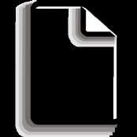

---

## 5. Operaciones Masivas: S3 Batch Operations

**S3 Batch Operations** permite gestionar y ejecutar acciones por lotes sobre miles de millones de objetos existentes con una única llamada de API o desde la consola de AWS.

- **Casos de uso clave en SAA-C03**:
  - **Cifrar masivamente objetos existentes** que se subieron sin cifrar antes de activar el cifrado por defecto.
  - Modificar metadatos, etiquetas (*tags*) o Access Control Lists (ACLs).
  - Copiar objetos en bloque entre diferentes buckets (ej. para migración de cuentas).
  - Restaurar masivamente objetos archivados en **Amazon S3 Glacier**.
  - Invocar una función **AWS Lambda** para ejecutar transformaciones personalizadas sobre cada objeto del inventario.
- **Flujo de trabajo**:
  1. Generar la lista de objetos objetivo utilizando **S3 Inventory** (o un manifiesto CSV).
  2. Filtrar los objetos requeridos (usando opcionalmente S3 Select).
  3. Crear el Job de S3 Batch Operations definiendo la acción, el rol de IAM correspondiente y los parámetros de ejecución. S3 se encarga de reintentos, seguimiento del progreso y generación de informes de auditoría.

---

## 6. Gobernanza y Métricas Organizacionales: S3 Storage Lens

**Amazon S3 Storage Lens** es la primera herramienta de analítica de almacenamiento en la nube que proporciona visibilidad centralizada a nivel de toda la organización de AWS (**AWS Organizations**).

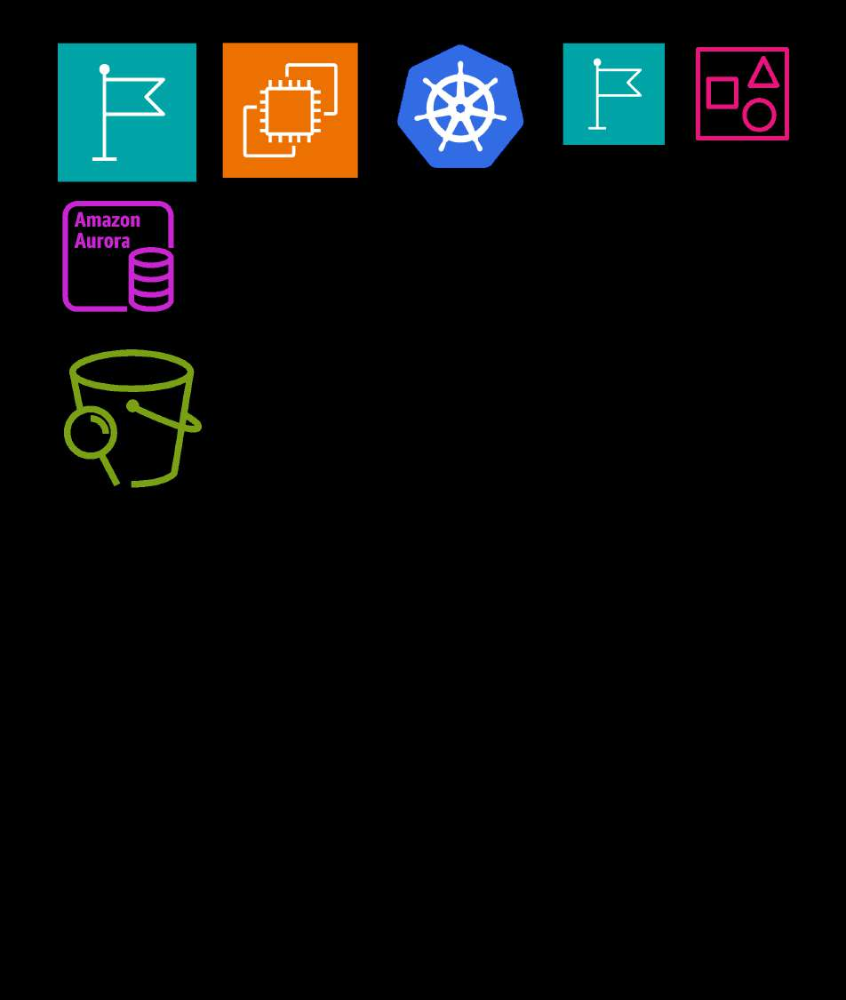

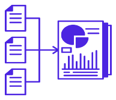

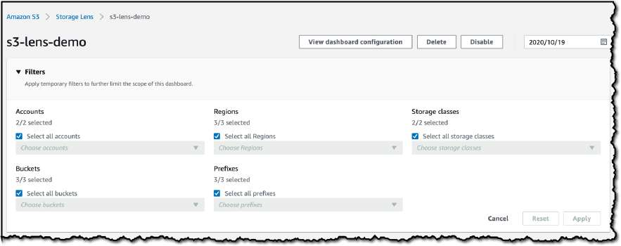
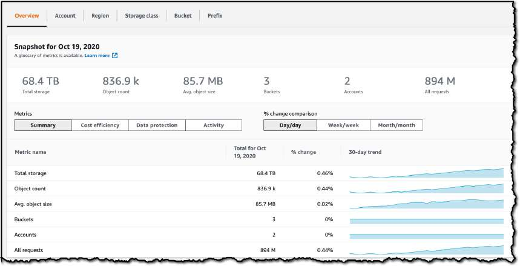

### Pilares de Métricas de Storage Lens
- **Optimización de Costos**: Detecta buckets con cargas multiparte incompletas de más de 7 días (`IncompleteMultipartUploadStorageBytes`), identifica volúmenes masivos de versiones no actuales y señala candidatos para clases de menor costo.
- **Protección de Datos y Seguridad**: Audita qué porcentaje de buckets tienen habilitado Versionado, MFA Delete, Cifrado con AWS KMS (`SSE-KMS`) y reglas de replicación entre regiones (CRR).
- **Gestión de Accesos**: Evalúa configuraciones de *Object Ownership* y bloqueos de acceso público.
- **Actividad y Rendimiento**: Mapea tasas de solicitudes (`AllRequests`, `GetRequests`, `PutRequests`) y códigos de estado de error (`403 Forbidden`, `404 Not Found`).

### Comparativa: Métricas Gratuitas vs. Avanzadas

| Característica | Storage Lens - Métricas Gratuitas | Storage Lens - Métricas Avanzadas (Pago) |
| :--- | :--- | :--- |
| **Disponibilidad** | Habilitadas automáticamente para todos los clientes de AWS. | Configuración opcional de pago por panel. |
| **Conjunto de Métricas** | ~28 métricas de uso y capacidad a nivel de bucket. | Métricas avanzadas de actividad (Get/Put), códigos de error HTTP (403/404) y protección de datos. |
| **Nivel de Agregación** | Organización, Cuentas, Regiones y Buckets. | Permite **agregación granular a nivel de prefijo**. |
| **Historial de Consultas** | Disponible durante **14 días**. | Disponible durante **15 meses** (ideal para análisis de tendencias anuales). |
| **Integraciones** | Consola de S3 y exportación de informes diarios a S3 (CSV / Parquet). | Publicación directa y sin costo adicional de métricas en **Amazon CloudWatch**. |

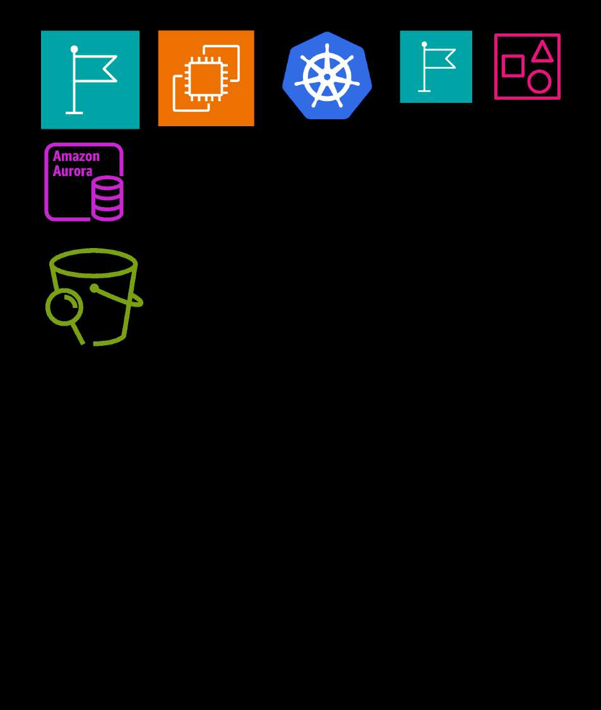
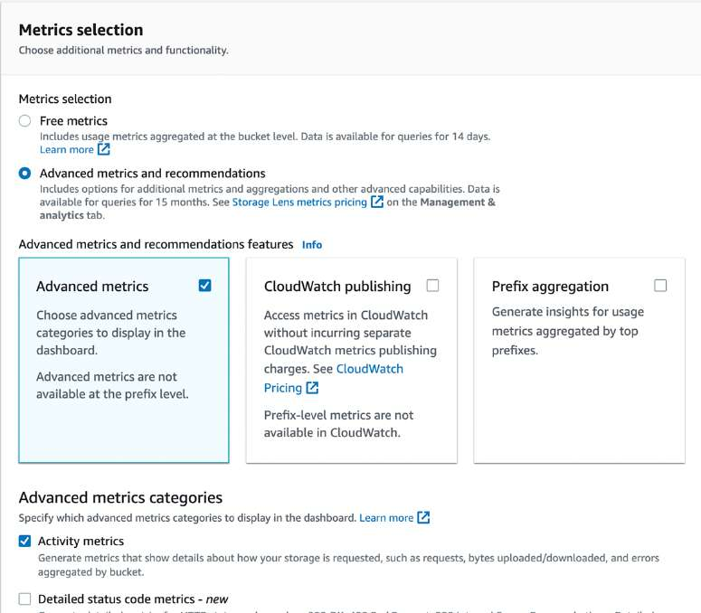

> **💡 SAA-C03 Exam Tip:**  
> Si una organización con decenas de cuentas de AWS necesita **"identificar de forma centralizada qué buckets carecen de cifrado SSE-KMS o tienen costos excesivos por cargas multiparte huérfanas sin inspeccionar bucket por bucket individualmente"**, la respuesta es **S3 Storage Lens con el panel a nivel de organización de AWS Organizations**.
