# Amazon S3 Seguridad: Cifrado, Gobernanza, Puntos de Acceso y Cumplimiento

La seguridad y protección de datos en **Amazon Simple Storage Service (Amazon S3)** es una de las áreas más rigurosamente evaluadas en el examen **AWS Certified Solutions Architect - Associate (SAA-C03)**. 

Este módulo cubre en profundidad los cuatro modelos de cifrado en reposo (SSE-S3, SSE-KMS, SSE-C y cifrado del lado del cliente), la imposición de cifrado en tránsito (TLS), la compartición de recursos de origen cruzado (**CORS**), la protección contra borrado accidental (**MFA Delete**), URLs pre-firmadas, registros de auditoría (**S3 Server Access Logs**), inmutabilidad de datos (**WORM con S3 Object Lock y Glacier Vault Lock**), y la descentralización de permisos mediante **S3 Access Points** y **S3 Object Lambda**.

---

## 1. Cifrado en Reposo de Objetos en S3 (Server-Side Encryption)

S3 ofrece cuatro métodos de cifrado para proteger los datos en reposo:


### Tabla Comparativa de Métodos de Cifrado en S3

| Método                                                                     | Gestión de la Clave                                                              | Algoritmo                                                             | Cabecera HTTP Requerida en `PUT`                                                                    | Ventajas y Cuotas Críticas en SAA-C03                                                                                                                                                                                                 |
| :------------------------------------------------------------------------- | :------------------------------------------------------------------------------- | :-------------------------------------------------------------------- | :-------------------------------------------------------------------------------------------------- | :------------------------------------------------------------------------------------------------------------------------------------------------------------------------------------------------------------------------------------ |
| **SSE-S3** *(Cifrado del lado del servidor con claves gestionadas por S3)* | Administrada, rotada y propiedad 100% de AWS S3.                                 | AES-256                                                               | `"x-amz-server-side-encryption": "AES256"`                                                          | **Habilitado por defecto** para todos los buckets nuevos y existentes sin costo adicional. Cero sobrecarga administrativa.                                                                                                            |
| **SSE-KMS** *(Cifrado con claves de AWS KMS)*                              | Administrada por el usuario dentro de **AWS Key Management Service (KMS)**.      | KMS Customer Managed Key (CMK) o AWS Managed Key (`aws/s3`)           | `"x-amz-server-side-encryption": "aws:kms"`                                                         | Permite **auditoría completa de uso de claves en AWS CloudTrail** y control granular mediante KMS Key Policies. **Impacto en cuotas**: Genera llamadas a `kms:GenerateDataKey` y `kms:Decrypt`, consumiendo cuota por segundo de KMS. |
| **SSE-C** *(Cifrado con claves provistas por el cliente)*                  | El cliente administra la clave fuera de AWS. **AWS jamás almacena la clave**.    | Clave provista por el cliente en cada petición.                       | `"x-amz-server-side-encryption-customer-algorithm"` y `"x-amz-server-side-encryption-customer-key"` | **Obligatorio el uso estricto de HTTPS**. Si el cliente pierde la clave criptográfica, los datos almacenados en S3 son irrecuperables.                                                                                                |
| **Client-Side Encryption**                                                 | El cliente cifra los datos localmente en su entorno **antes** de enviarlos a S3. | Gestionado por bibliotecas del cliente (Amazon S3 Encryption Client). | Ninguna en S3 (S3 solo recibe un archivo de bytes ya cifrado).                                      | Control absoluto del ciclo criptográfico de extremo a extremo. S3 actúa como almacenamiento ciego.                                                                                                                                    |


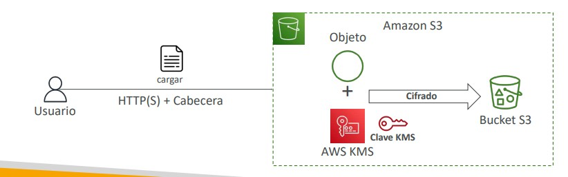

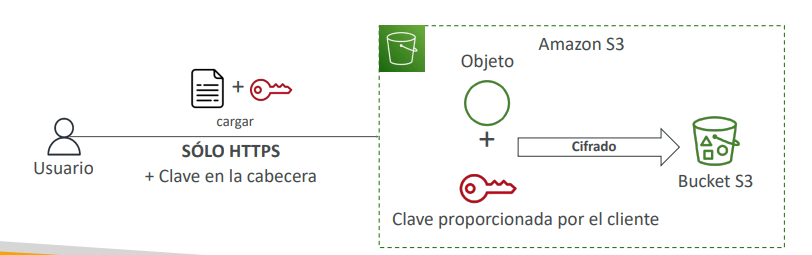

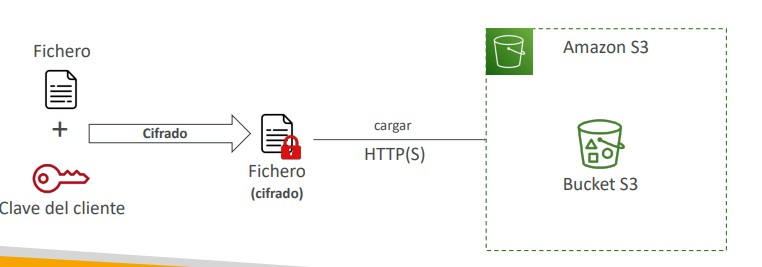

> **💡 SAA-C03 Exam Tip:**  
> **Cuotas de API y cuellos de botella con SSE-KMS**:  
> Si una aplicación con alta tasa de tráfico experimenta errores HTTP **`503 Slow Down`** o **`KMS ThrottlingException`** al descargar o subir miles de objetos por segundo en un bucket con SSE-KMS, la causa raíz es alcanzar los límites de llamadas de API por segundo de AWS KMS (`GenerateDataKey` / `Decrypt`).  
> La solución de arquitectura recomendada es **habilitar S3 Bucket Keys**, lo que reduce el tráfico hacia KMS en hasta un 99% al reutilizar claves intermedias en S3.

---

## 2. Cifrado en Tránsito y Políticas de Exigencia

S3 expone endpoints seguros bajo TLS/HTTPS y endpoints en texto claro bajo HTTP.
- **Forzado mediante Bucket Policy**: Las políticas de bucket se evalúan antes de las opciones de cifrado por defecto.
- Para garantizar el cumplimiento normativo que exige transporte cifrado, se deniega cualquier operación que no utilice HTTPS:

```json
{
  "Version": "2012-10-17",
  "Statement": [
    {
      "Sid": "EnforceTLSRequestsOnly",
      "Effect": "Deny",
      "Principal": "*",
      "Action": "s3:*",
      "Resource": [
        "arn:aws:s3:::mi-bucket",
        "arn:aws:s3:::mi-bucket/*"
      ],
      "Condition": {
        "Bool": {
          "aws:SecureTransport": "false"
        }
      }
    }
  ]
}
```

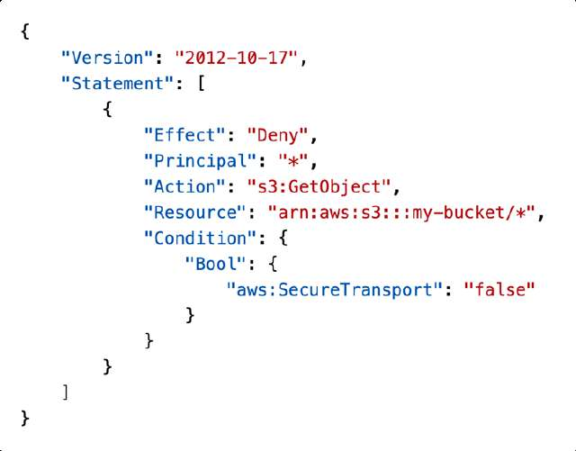

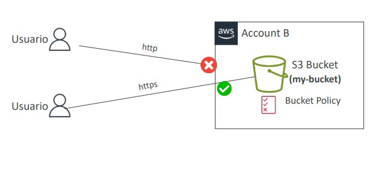

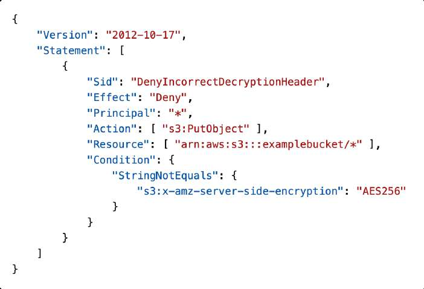

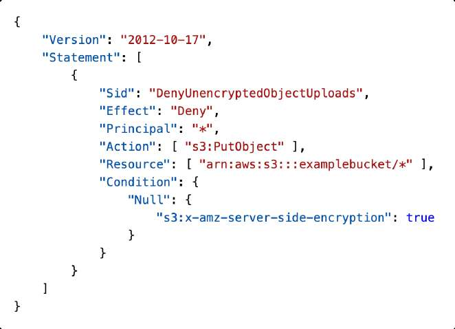

---

## 3. CORS (Cross-Origin Resource Sharing)

Un navegador web bloquea las solicitudes HTTP que intentan cargar recursos desde un **origen diferente** (combinación de esquema/protocolo, dominio/host y puerto) por la política de seguridad del mismo origen (*Same-Origin Policy*).

- Si un sitio web alojado en `http://bucket-html.s3-website.us-east-1.amazonaws.com` intenta cargar fuentes, scripts o imágenes desde `http://bucket-assets.s3-website.us-east-1.amazonaws.com`, el navegador lanzará un error de CORS en la consola del cliente.
- **Solución**: Habilitar una configuración de **CORS XML/JSON** en el bucket de destino (`bucket-assets`) especificando las cabeceras `Access-Control-Allow-Origin`, `Access-Control-Allow-Methods` (GET, PUT) y cabeceras permitidas.

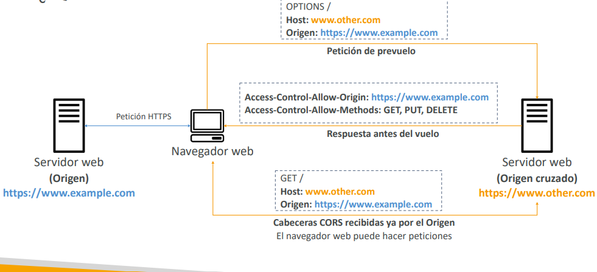


---

## 4. Auditoría, URLs Pre-firmadas y MFA Delete

### S3 Server Access Logs
- Registra de forma detallada cada petición realizada al bucket (autorizada o denegada), identificando el solicitante, IP, tipo de acción y códigos de respuesta.
- **Regla crítica de arquitectura**: **El bucket de destino donde se guardan los logs DEBE ser diferente al bucket monitorizado**, y residir en la misma región. Si se utiliza el mismo bucket, se genera un bucle recursivo infinito (*log loop*) que disparará el almacenamiento y los costos exponencialmente.


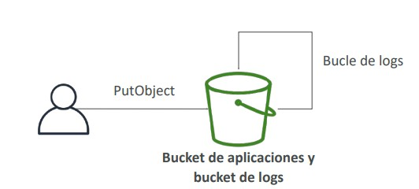

### URLs Pre-firmadas (Pre-Signed URLs)
- Permite al propietario de un objeto privado generar un enlace temporal que hereda sus propios permisos para conceder acceso de lectura (`GET`) o subida (`PUT`) a un usuario no autenticado.
- Caducidad: Configurable desde segundos hasta un máximo de 12 horas (vía consola) o 168 horas / 7 días (vía AWS CLI / SDK con credenciales de IAM de larga duración).
- Casos de uso: Permitir descargas de videos de pago a usuarios autenticados en una web o subida directa de archivos desde el navegador a S3 sin pasar por el servidor web backend.

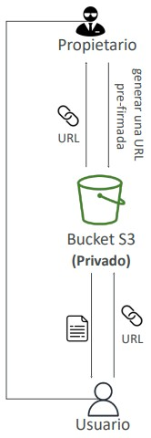

### MFA Delete
- Exige ingresar un token físico o virtual de autenticación multifactor (MFA) para dos operaciones destructivas críticas:
  1. **Eliminar permanentemente la versión de un objeto**.
  2. **Suspender el versionado en el bucket**.
- Requiere tener el **Versionado habilitado**.
- Solo puede configurarse y administrarse utilizando las credenciales de la **Cuenta Root mediante la AWS CLI**.


---

## 5. Inmutabilidad y Cumplimiento Normativo (WORM)

Para sectores altamente regulados (financiero, seguros, legal, médico), AWS ofrece modelos de escritura única y múltiples lecturas (**WORM - Write Once, Read Many**).

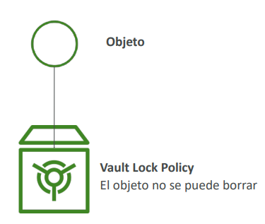

### S3 Object Lock vs. S3 Glacier Vault Lock

| Característica | S3 Object Lock | S3 Glacier Vault Lock |
| :--- | :--- | :--- |
| **Servicio Objetivo** | Amazon S3 (requiere **Versionado activado** en el bucket). | Bóvedas de archivo de **Amazon S3 Glacier**. |
| **Modos de Operación** | • **Compliance Mode (Modo Cumplimiento)**: Nadie, **absolutamente ni el usuario Root**, puede sobrescribir o borrar la versión protegida ni acortar el período de retención.<br>• **Governance Mode (Modo Gobernanza)**: Protege contra borrados accidentales de la mayoría de usuarios, pero usuarios autorizados con el permiso IAM `s3:BypassGovernanceRetention` pueden modificar o eliminar el objeto.<br>• **Legal Hold (Retención Legal)**: Bloqueo indefinido sin fecha de caducidad fijado con `s3:PutObjectLegalHold`. | Se define una política de bloqueo de bóveda en JSON (*Vault Lock Policy*). Al bloquearse, se vuelve **inmutable y permanente**, impidiendo cualquier modificación o eliminación futura. |
| **Casos de Uso SAA-C03** | Protección contra ransomware, ataques internos maliciosos y cumplimiento de normativas de registros financieros de la SEC (Rule 17a-4). | Retención obligatoria de archivos históricos inmutables a largo plazo (7-10 años). |

> **💡 SAA-C03 Exam Tip:**  
> Si una pregunta de examen exige que los registros financieros almacenados en S3 **"no puedan ser eliminados ni modificados por ningún usuario bajo ninguna circunstancia durante un periodo de 5 años, ni siquiera por el administrador de la cuenta o el usuario raíz (Root)"**, la solución es habilitar **S3 Object Lock en Compliance Mode**. Si se requiere permitir a un oficial de seguridad eliminar archivos en casos excepcionales, la opción es **Governance Mode**.

---

## 6. S3 Access Points y S3 Object Lambda

A medida que los data lakes crecen, una única Bucket Policy puede superar el límite máximo de tamaño de 20 KB de JSON debido a la complejidad de permisos de cientos de departamentos.


### S3 Access Points (Puntos de Acceso)
- Puntos de enlace con nombres DNS dedicados vinculados al bucket que poseen **su propia política de acceso independiente**.
- Permiten descentralizar la gobernanza: el equipo de Finanzas accede mediante un punto de acceso restringido al prefijo `/finanzas`, el equipo de Ventas mediante otro a `/ventas`, y Analítica a todo el bucket en solo lectura.
- **Puntos de acceso originados en VPC (*VPC Origin*)**: Se configuran para restringir el acceso al bucket exclusivamente a instancias dentro de una VPC privada a través de un **VPC Endpoint (Gateway o Interface)**, garantizando que el tráfico jamás transite por la internet pública.


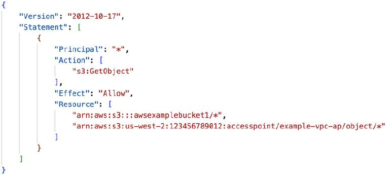

### S3 Object Lambda
- Permite insertar código personalizado de **AWS Lambda** para procesar, transformar o filtrar los datos devueltos por una llamada estándar `s3:GetObject` **antes de que los datos alcancen a la aplicación cliente**.
- Todo sobre una única copia del objeto en el bucket subyacente.
- **Casos de uso para el examen**:
  - **Redacción de PII (Información de Identificación Personal)**: Ocultar números de tarjetas de crédito o datos médicos cuando un analista o entorno de pruebas solicita el archivo.
  - **Conversión de formatos en vuelo**: Transformar dinámicamente archivos XML en JSON.
  - **Marcas de agua e imágenes**: Insertar marcas de agua personalizadas o redimensionar fotos según el usuario solicitante.

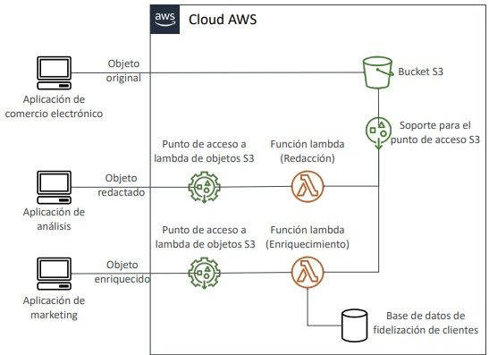

> **💡 SAA-C03 Exam Tip:**  
> Cuando una empresa solicita almacenar una única versión de archivos confidenciales en S3, pero exige que **"los analistas de datos reciban los archivos con los campos de tarjetas de crédito redactados/anonimizados, mientras que el departamento de auditoría legal debe recibir el archivo original intacto, sin crear buckets duplicados"**, la arquitectura óptima es utilizar **S3 Object Lambda**.
