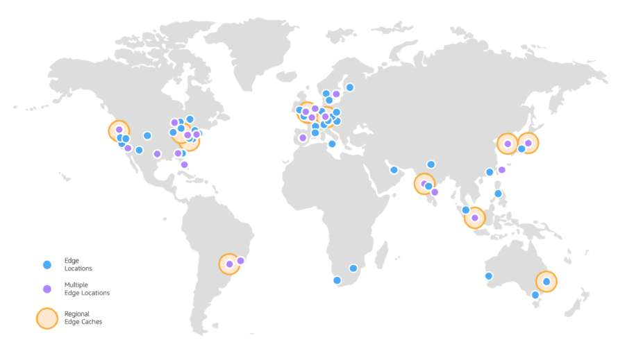
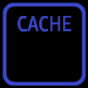
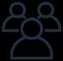
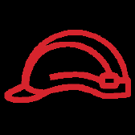
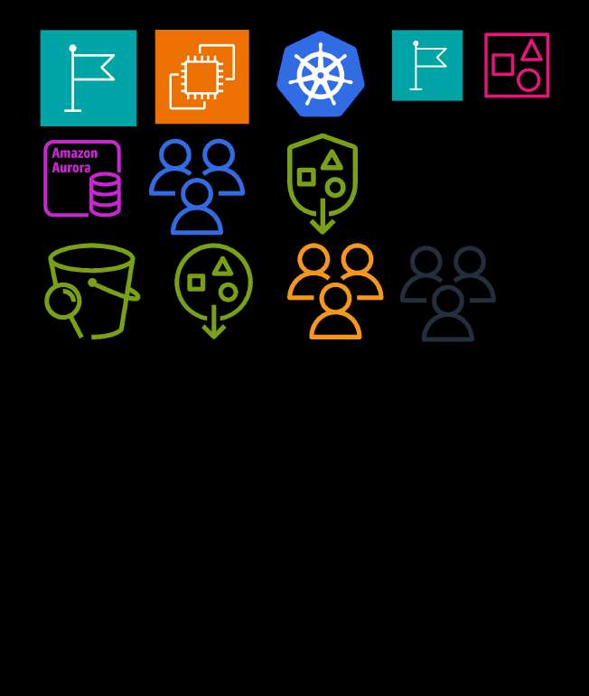
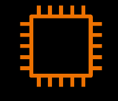
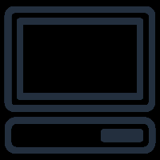

# Aceleración Global y Redes de Entrega: Amazon CloudFront y AWS Global Accelerator

En aplicaciones empresariales de alcance mundial, enrutar el tráfico de los usuarios a través de la Internet pública introduce una alta latencia debido a los múltiples saltos de red (*hops*) y riesgos de congestión entre proveedores de telecomunicaciones. 

Para resolver este desafío y garantizar alta disponibilidad, AWS proporciona dos servicios perimetrales esenciales evaluados en el examen **AWS Certified Solutions Architect - Associate (SAA-C03)**: **Amazon CloudFront** y **AWS Global Accelerator**. Comprender sus diferencias arquitectónicas, protocolos soportados y casos de uso es mandatorio para seleccionar la solución óptima.

---

## 1. Amazon CloudFront: Red de Entrega de Contenidos (CDN)

**Amazon CloudFront** es un servicio de CDN de nivel empresarial diseñado para acelerar la entrega de contenido estático y dinámico hacia usuarios de todo el mundo mediante una red perimetral distribuida de más de 400 **Edge Locations** y múltiples **Regional Edge Caches**.

### Tipos de Orígenes Soportados por CloudFront
Un origen es la ubicación raíz donde reside la versión original definitiva del contenido:
1. **Buckets de Amazon S3**:
   - Para distribuir archivos estáticos (imágenes, vídeos, scripts, estilos) y almacenarlos en caché en el borde.
   - Admite subida de archivos hacia S3 a través de CloudFront.
   - **Mecanismo de seguridad estándar**: Protegido mediante **Origin Access Control (OAC)** (reemplazo moderno del antiguo OAI - Origin Access Identity) para garantizar que el bucket solo sea accesible a través de la distribución de CloudFront.
2. **Orígenes Personalizados (HTTP/HTTPS)**:
   - **Application Load Balancer (ALB)** público.
   - Instancias EC2 públicas.
   - Buckets de S3 configurados como sitios web estáticos.
   - Cualquier servidor web on-premises accesible públicamente sobre HTTP/S.
3. **VPC Origins (Nativo para Recursos Privados)**:
   - Permite que CloudFront enrute tráfico directamente a recursos alojados en **subredes privadas dentro de una VPC** (Application Load Balancer interno, Network Load Balancer o instancias EC2 privadas) sin necesidad de exponerlos a Internet ni asignarles IPs públicas.

---

## 2. Comparativa Crítica: CloudFront vs. S3 Cross-Region Replication (CRR)

Ambas soluciones mejoran la accesibilidad geográfica de los datos, pero responden a patrones de arquitectura totalmente diferentes:

| Característica | Amazon CloudFront | S3 Cross-Region Replication (CRR) |
| :--- | :--- | :--- |
| **Arquitectura** | Red global de más de 400 **Edge Locations** con almacenamiento temporal en caché. | Replicación asíncrona permanente de bucket a bucket entre **regiones específicas de AWS**. |
| **Persistencia y TTL** | Los datos expiran según el **Time To Live (TTL)** configurado (ej. 24 horas) o hasta ser invalidados. | Copia persistente e independiente que reside indefinidamente en el bucket de destino. |
| **Tipo de Contenido Óptimo** | **Contenido estático de lectura frecuente** (fotos, vídeos, JS/CSS, HTML) distribuido a usuarios finales en todo el mundo. | **Datos de misión crítica y dinámicos** que deben estar físicamente replicados para Disaster Recovery o cumplimiento normativo en pocas regiones. |
| **Costo y Operación** | Pago por GB transferido fuera de CloudFront y número de solicitudes HTTP/S. | Pago por almacenamiento duplicado en el bucket de destino y transferencia de datos interregional. |

> **💡 SAA-C03 Exam Tip:**  
> - Si el examen describe: *"Una aplicación web multimedia experimenta picos mundiales de lectura de videos e imágenes y se busca minimizar la latencia de entrega global al menor costo"* $\implies$ La respuesta es **Amazon CloudFront**.  
> - Si describe: *"Una regulación financiera exige que todos los documentos almacenados en Europa tengan una réplica idéntica y permanente en una región de Estados Unidos con RPO en minutos para recuperación ante desastres"* $\implies$ La respuesta es **S3 Cross-Region Replication (CRR)**.

---

## 3. Seguridad Perimetral y Gestión de Caché en CloudFront

### Invalidaciones de Caché (Cache Invalidations)
- Cuando el contenido del origen se actualiza (ej. nuevo archivo `index.html`), CloudFront seguirá sirviendo la versión antigua en caché hasta que el TTL expire.
- Para forzar la actualización inmediata en todas las Edge Locations del mundo, se ejecuta una **Invalidación de CloudFront**.
- Se pueden invalidar rutas específicas (ej. `/images/banner.png`), directorios completos (`/images/*`) o todo el sitio (`/*`).
- *Nota FinOps*: Las primeras 1,000 rutas invalidadas al mes son gratuitas; después aplican un pequeño costo por ruta.

### Restricciones Geográficas (Geo Restriction)
- Permite crear una **Allowlist (Lista de permitidos)** o una **Blocklist (Lista de bloqueados)** a nivel de país para restringir el acceso a la distribución.
- CloudFront identifica la ubicación física del cliente comparando su IP contra una base de datos Geo-IP de terceros de alta precisión.
- Caso de uso: Cumplimiento de derechos de transmisión de contenido digital y regulaciones territoriales.

### Integración de Seguridad Perimetral
- CloudFront integra de forma nativa **AWS Shield Standard** (protección contra ataques DDoS SYN/UDP Floods en capas 3 y 4 sin costo adicional).
- Se complementa con **AWS WAF** para inspección profunda en Capa 7 (mitigación de SQLi, XSS, rate-limiting de IPs maliciosas y bots) directamente en el borde antes de que alcancen el backend.

---

## 4. AWS Global Accelerator

**AWS Global Accelerator** es un servicio de red que enruta el tráfico de los usuarios a través de la **red troncal privada de alta velocidad y libre de congestión de AWS**, optimizando la ruta hacia las aplicaciones para protocolos **TCP y UDP**.

### Arquitectura de Enrutamiento: Unicast vs. Anycast IP
- **IP Unicast**: Cada servidor posee una dirección IP única y distinta. El tráfico viaja por múltiples routers públicos hasta llegar a esa dirección específica.
- **IP Anycast**: Una misma dirección IP pública es anunciada globalmente desde múltiples ubicaciones geográficas simultáneamente. El cliente es dirigido a la **Edge Location físicamente más cercana** a través del protocolo BGP.

### Cómo Opera AWS Global Accelerator
1. Suministra **2 direcciones IP Anycast estáticas** que sirven como punto de entrada fijo para la aplicación a nivel mundial.
2. Los clientes externos se conectan al Edge Location más próximo mediante las IPs Anycast.
3. Desde el Edge Location, el tráfico ingresa de inmediato a la **red troncal privada de AWS** y transita directo hacia el endpoint de destino en la región correspondiente (ALB, NLB, EC2 o Elastic IP).
4. Realiza **Health Checks continuos** hacia los endpoints. Si una región completa o un balanceador falla, Global Accelerator ejecuta un **failover automático e inadvertido en menos de 1 minuto** hacia la región saludable más cercana.

> **💡 SAA-C03 Exam Tip:**  
> Si una pregunta de examen plantea una empresa corporativa cuyos clientes tienen firewalls estrictos que **solo permiten autorizar un par de direcciones IP estáticas en su lista blanca (allowlist)** y requieren **alta disponibilidad multirregional con conmutación rápida por error ante desastres**, la respuesta definitiva es **AWS Global Accelerator**. (CloudFront no asigna IPs estáticas fijas en el borde para listas blancas).

---

## 5. Comparativa Maestra: CloudFront vs. AWS Global Accelerator

Ambos servicios utilizan la red de Edge Locations de AWS y mitigan ataques con AWS Shield, pero sus propósitos y casos de uso difieren notablemente:

### Tabla Comparativa de Rendimiento y Casos de Uso

| Criterio | Amazon CloudFront | AWS Global Accelerator |
| :--- | :--- | :--- |
| **Capa del Modelo OSI** | **Capa 7 (Aplicación)**. | **Capa 4 (Transporte) y Capa 3 (Red)**. |
| **Protocolos Admitidos** | HTTP, HTTPS, WebSocket. | **TCP y UDP** (incluye HTTP/S, pero no está limitado a web). |
| **Mecanismo de Aceleración** | **Almacenamiento en caché en el borde (*Edge Caching*)** y optimización de conexiones TLS/TCP hacia el origen. | **Enrutamiento perimetral sobre red privada troncal de AWS** usando IPs Anycast (sin caché). |
| **Direccionamiento IP** | Nombre DNS dinámico (`*.cloudfront.net`). No ofrece IPs estáticas fijas para listas blancas. | Proporciona **2 direcciones IP Anycast estáticas globales fijas**. |
| **Tiempo de Conmutación por Error** | Basado en expiración de TTL y DNS resolvers intermedios (puede tardar minutos debido a la caché de clientes). | **Failover determinista instantáneo (< 1 minuto)** directamente a nivel de red troncal mediante comprobaciones de salud. |
| **Casos de Uso Ideales en SAA-C03** | • Sitios web estáticos y dinámicos. • Distribución de imágenes, vídeo bajo demanda (VOD) y streaming. • Aplicaciones web que requieren inspección HTTP y reglas de API en el borde. | • Aplicaciones **no HTTP**: Servidores de juegos multijugador (**UDP**), telefonía VoIP, streaming en vivo y dispositivos **IoT (MQTT)**. • Aplicaciones HTTP que requieren **direcciones IP estáticas fijas en allowlists**. • **Disaster Recovery multirregional activo-activo o activo-pasivo** de conmutación ultrarrápida. |

> **💡 SAA-C03 Exam Tip:**  
> **Regla de oro nemotécnica para preguntas de aceleración perimétrica**:
> - ¿La pregunta menciona **"Caché de contenido"**, **"Archivos estáticos/videos"**, o **"Protección de API web Layer 7"**? $\implies$ Elige **Amazon CloudFront**.
> - ¿La pregunta menciona **"Tráfico UDP"**, **"Protocolos que no son HTTP"**, **"Videojuegos en tiempo real"**, o **"IPs públicas estáticas fijas para listas blancas de clientes con failover rápido multirregional"**? $\implies$ Elige **AWS Global Accelerator**.
