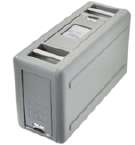
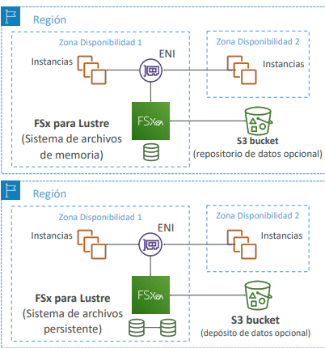
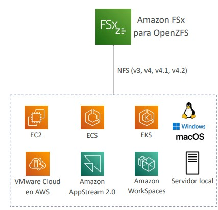
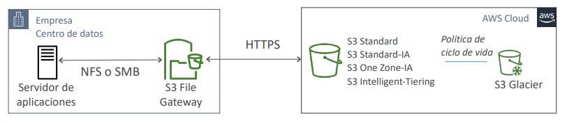
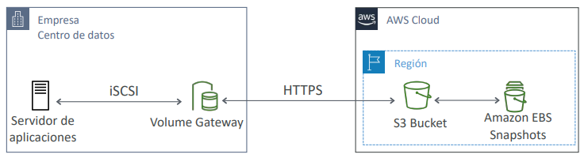
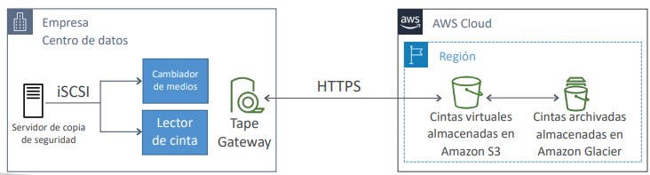
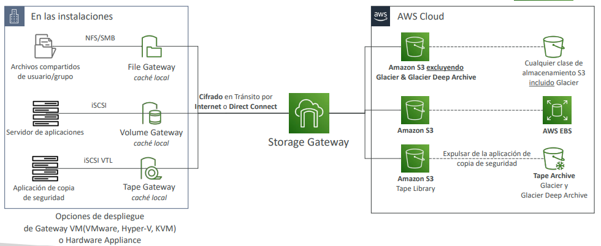
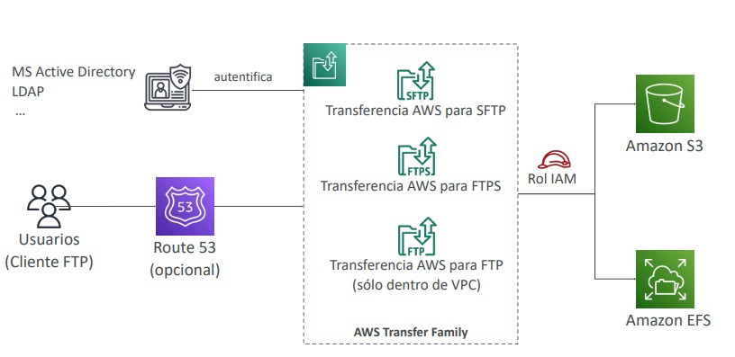
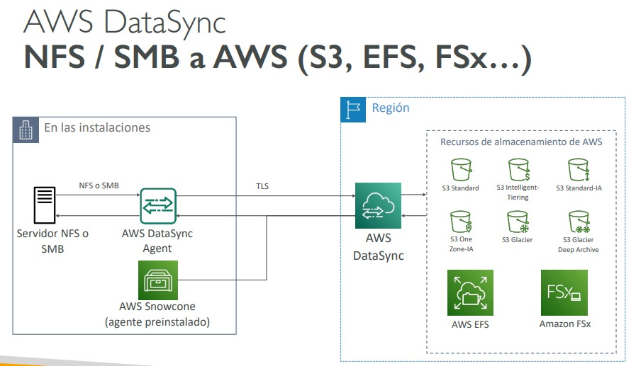
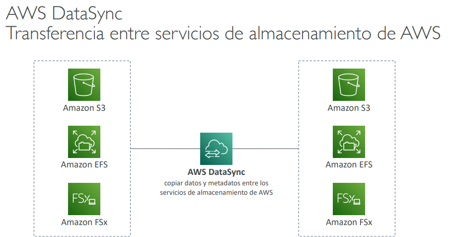

# Servicios Avanzados de Almacenamiento y Migración Híbrida en AWS

Más allá de Amazon S3 y EBS, las arquitecturas empresariales evaluadas en el examen **AWS Certified Solutions Architect - Associate (SAA-C03)** exigen integrar sistemas de archivos de nivel empresarial (**Amazon FSx**), soluciones de migración física masiva y cómputo perimetral (**AWS Snow Family**), integración de nube híbrida (**AWS Storage Gateway**), transferencia de archivos heredados (**AWS Transfer Family**) y pipelines de sincronización acelerada de datos (**AWS DataSync**).

---

## 1. Familia AWS Snow: Migración Física y Edge Computing

Cuando el volumen de datos alcanza decenas o cientos de terabytes (o petabytes), transferir datos a través de la Internet pública o incluso enlaces dedicados puede tomar semanas, meses o años debido al ancho de banda limitado y los costos de red.

$$\text{Regla empírica SAA-C03}: \text{Si transferir los datos por red toma más de } \mathbf{7 \text{ días}} \implies \text{Utilizar dispositivos de la Familia Snow}.$$

### Modelos de Dispositivos Snowball Edge
1. **Snowball Edge Storage Optimized**:
   - Equipado con hasta **210 TB de almacenamiento NVMe SSD** y 104 vCPUs.
   - Diseñado para migraciones masivas de datos hacia Amazon S3 y procesamiento analítico local.
2. **Snowball Edge Compute Optimized**:
   - Diseñado para cargas computacionales intensivas en el borde: 104 vCPUs, 416 GB de RAM y hasta 28 TB de almacenamiento SSD (con opción de GPUs).

### Capacidades de Edge Computing
- Permite ejecutar cómputo local en entornos remotos desconectados o con conectividad intermitente (barcos en alta mar, minas, zonas de desastre o transporte terrestre).
- Soporta instancias **Amazon EC2 compatibles** y funciones de **AWS Lambda** para preprocesamiento de datos, inferencia de Machine Learning y transcodificación de medios antes de enviar el dispositivo físico a AWS.

> **💡 SAA-C03 Exam Tip:**  
> **Limitación crítica de importación**: Un dispositivo AWS Snowball **no puede importar datos directamente hacia Amazon S3 Glacier**.  
> Para archivar datos provenientes de Snowball en Glacier:
> 1. Los datos se importan primero a **Amazon S3 Standard**.
> 2. Se configura una **S3 Lifecycle Rule** para realizar la transición inmediata de los objetos hacia *S3 Glacier Flexible Retrieval* o *Deep Archive*.

---

## 2. Amazon FSx: Sistemas de Archivos Administrados de Terceros

Amazon FSx ofrece sistemas de archivos nativos y de alto rendimiento optimizados para aplicaciones comerciales que dependen de características avanzadas de almacenamiento que Amazon EFS no cubre (como protocolos SMB, iSCSI, clustering Lustre o sistemas ZFS).

### Tabla Comparativa de Familias Amazon FSx

| Familia FSx | Protocolos Nativos | Sistema Operativo Compatible | Integración Clave / Características | Casos de Uso Críticos en SAA-C03 |
| :--- | :--- | :--- | :--- | :--- |
| **FSx for Windows File Server** | **SMB (v2.0 a v3.1.1)** y NTFS | Windows Server, Linux y macOS. | Integración nativa con **Microsoft Active Directory (AD)**, soporte de Microsoft DFS Namespaces, cuotas de usuario y Shadow Copies. | **Migración de aplicaciones empresariales Windows "Lift-and-Shift"**, directorios compartidos corporativos, CRM/ERP en Windows y SQL Server. |
| **FSx for Lustre** | Protocolo de archivos en paralelo Lustre | Linux (POSIX) | Millones de IOPS, cientos de GB/s con latencias en microsegundos. **Lectura y escritura bidireccional directa sobre Amazon S3**. | **Computación de Alto Rendimiento (HPC)**, modelado financiero, renderizado de vídeo, inferencia y entrenamiento masivo de Machine Learning. |
| **FSx for NetApp ONTAP** | **NFS, SMB e iSCSI** | Linux, Windows, macOS, VMware Cloud. | Desduplicación, compresión de bloques, snapshots instantáneos y niveles de almacenamiento automático (*Storage Tiering*). | Migración de arquitecturas de almacenamiento NAS o entornos locales basados en NetApp ONTAP hacia AWS sin reescribir código. |
| **FSx for OpenZFS** | NFS (v3, v4, v4.1, v4.2) | Linux, Windows, macOS, VMware Cloud. | Hasta 1,000,000 IOPS con latencia < 0.5 ms, snapshots y clonación instantánea puntual con tecnología *Copy-on-Write*. | Cargas de trabajo de análisis y desarrollo que requieren mover sistemas de archivos basados en ZFS hacia AWS con clonación ultrarrápida. |

### FSx for Lustre: Opciones de Despliegue
- **Scratch File System (Sistema Temporal)**:
  - Diseñado para procesamiento temporal de corta duración.
  - Los datos **no se replican**; si un servidor de archivos falla, los datos no persistidos se destruyen.
  - Ofrece velocidades 6 veces superiores (hasta 200 MB/s por TiB) al menor costo.
- **Persistent File System (Sistema Persistente)**:
  - Para procesamiento a largo plazo con datos sensibles.
  - Los datos se replican dentro de la misma Zona de Disponibilidad y sustituye automáticamente cualquier nodo fallido en minutos.

---

## 3. AWS Storage Gateway: El Puente de Almacenamiento Híbrido

**AWS Storage Gateway** conecta la infraestructura on-premises con el almacenamiento en la nube de AWS, permitiendo almacenar datos en Amazon S3 o EBS mientras proporciona acceso de baja latencia a los datos de uso frecuente en el centro de datos local mediante una máquina virtual (VMware ESXi, Hyper-V, KVM) o un appliance de hardware dedicado.

### Comparativa de los Tipos de Storage Gateway

| Tipo de Gateway                     | Protocolo Local                      | Backend de Almacenamiento en AWS                             | Funcionamiento Arquitectónico                                                                                                                                                     | Casos de Uso SAA-C03                                                                                                                             |
| :---------------------------------- | :----------------------------------- | :----------------------------------------------------------- | :-------------------------------------------------------------------------------------------------------------------------------------------------------------------------------- | :----------------------------------------------------------------------------------------------------------------------------------------------- |
| **S3 File Gateway**                 | **NFS y SMB**                        | **Amazon S3** (Standard, IA, One Zone, Intelligent-Tiering). | Mapea un recurso compartido de archivos local (share) directamente a un bucket de S3. Mantiene en caché local los archivos leídos y escritos recientemente.                       | Reemplazo de NAS local, respaldos directos a S3 sin cambiar protocolos de cliente corporativos e integración con Active Directory.               |
| **FSx File Gateway**                | **SMB**                              | **Amazon FSx for Windows File Server**                       | Proporciona una caché local en las instalaciones para acceder a recursos compartidos alojados en FSx for Windows en AWS con baja latencia.                                        | Sucursales u oficinas remotas que necesitan acceso ultrarrápido a un servidor de archivos FSx Windows centralizado en la nube.                   |
| **Volume Gateway (Cached Volumes)** | **iSCSI** (Bloque)                   | **Amazon S3 y Snapshots de EBS**                             | **El almacenamiento primario reside en Amazon S3**. Mantiene en la caché local únicamente los datos de lectura/escritura más recientes. Permite ahorrar espacio local sustancial. | Almacenamiento en bloque escalable para servidores de aplicaciones donde el almacenamiento local es limitado.                                    |
| **Volume Gateway (Stored Volumes)** | **iSCSI** (Bloque)                   | **Amazon S3 y Snapshots de EBS**                             | **Todo el conjunto de datos completo reside localmente en el centro de datos**. Se realizan copias de seguridad asíncronas periódicas a S3 en forma de snapshots de EBS.          | Recuperación ante desastres (DR) con acceso local a velocidad de LAN y respaldos remotos protegidos en AWS.                                      |
| **Tape Gateway (VTL)**              | **iSCSI VTL** (Virtual Tape Library) | **Amazon S3 y Amazon Glacier / Deep Archive**                | Emula una librería física de cintas magnéticas (lector y cambiador de medios) compatible con software de respaldo existente (Veeam, Commvault, Veritas, etc.).                    | **Sustitución de cintas físicas magnéticas por cintas virtuales en la nube sin cambiar los flujos de trabajo de copia de seguridad existentes**. |

> **💡 SAA-C03 Exam Tip:**  
> - Si el problema describe una empresa que realiza respaldos utilizando software corporativo y **cintas magnéticas físicas transportadas por mensajería a bodegas fuera de sitio**, y busca eliminar las cintas físicas sin cambiar su software de respaldo existente $\implies$ La respuesta es **Storage Gateway Tape Gateway (VTL)**.  
> - Si se requiere exponer un bucket de S3 como una **carpeta compartida montable por NFS o SMB con caché local** para servidores locales $\implies$ La respuesta es **S3 File Gateway**.

---

## 4. AWS Transfer Family

**AWS Transfer Family** es un servicio totalmente administrado y de alta disponibilidad (multi-AZ) que permite transferir archivos directamente hacia y desde **Amazon S3** o **Amazon EFS** utilizando los protocolos estándar de transferencia de archivos:
- **SFTP** (SSH File Transfer Protocol).
- **FTPS** (FTP sobre SSL/TLS).
- **FTP** (sin cifrar, únicamente admitido dentro de una VPC privada).

### Integración y Seguridad
- No requiere que los clientes externos instalen agentes ni cambien sus scripts tradicionales de transferencia.
- Permite mapear permisos mediante **Roles de IAM** para que los usuarios accedan únicamente a su prefijo asignado en S3.
- Se integra con proveedores de identidad corporativos: **Microsoft Active Directory**, LDAP, Okta o Amazon Cognito.

---

## 5. AWS DataSync

**AWS DataSync** es un servicio acelerado de transferencia de datos en línea diseñado para simplificar, automatizar y acelerar la sincronización y movimiento masivo de datos entre entornos on-premises y AWS, así como entre diferentes servicios de almacenamiento dentro de AWS.

### Características y Rendimiento de DataSync
- **Rendimiento hasta 10 veces más rápido** que herramientas tradicionales de copia (como rsync o cp) gracias a un protocolo propietario de transferencia de red optimizado.
- **Preservación estricta de metadatos**: Mantiene los permisos POSIX de NFS, marcas de tiempo, atributos de archivo y ACLs de Windows SMB.
- **Arquitectura de Agente**:
  - Para transferencias desde **on-premises / otras nubes hacia AWS**: Requiere desplegar un **Agente de DataSync** en la infraestructura local (máquina virtual o preinstalado en un dispositivo AWS Snowcone).
  - Para transferencias **dentro de AWS (de AWS a AWS)**: **No requiere agente**. Permite sincronizar directamente entre Amazon S3, Amazon EFS y todas las variantes de Amazon FSx.
- **Automatización**: Las tareas de sincronización pueden programarse para ejecutarse cada hora, diariamente o de forma periódica con límites configurables de consumo de ancho de banda (hasta 10 Gbps por agente).

> **💡 SAA-C03 Exam Tip:**  
> **Diferencia clave entre AWS DataSync y S3 File Gateway**:  
> - Utiliza **AWS DataSync** cuando el requerimiento sea **migrar, replicar o sincronizar periódicamente grandes lotes de datos** desde servidores NFS/SMB locales hacia S3, EFS o FSx de forma acelerada y programada.  
> - Utiliza **S3 File Gateway** cuando los servidores locales requieran **acceso continuo y en tiempo real como sistema de archivos montado (NFS/SMB) con una caché local persistente** hacia los datos en la nube.

---

## 6. Cuadro de Decisión Arquitectónica de Almacenamiento en AWS

| Necesidad de Almacenamiento | Servicio AWS Ganador |
| :--- | :--- |
| Almacenamiento de objetos escalable, ilimitado, accesible vía API/HTTP | **Amazon S3** |
| Archivo de datos a muy largo plazo al menor costo absoluto | **Amazon S3 Glacier Deep Archive** |
| Disco de arranque persistente de alto rendimiento para una instancia EC2 | **Amazon EBS (gp3 / io2)** |
| Almacenamiento de bloque físico efímero de ultrabaja latencia (microsegundos) | **EC2 Instance Store** |
| Sistema de archivos compartido multi-AZ montable en cientos de instancias Linux (POSIX) | **Amazon EFS** |
| Sistema de archivos empresarial compartido para Windows con Active Directory y SMB | **Amazon FSx for Windows File Server** |
| Computación de Alto Rendimiento (HPC), modelado y Machine Learning paralelo masivo | **Amazon FSx for Lustre** |
| Acceso híbrido on-premises a objetos de S3 mediante puntos de montaje NFS/SMB locales | **AWS Storage Gateway (S3 File Gateway)** |
| Reemplazo directo de respaldos basados en cintas magnéticas físicas (VTL) | **AWS Storage Gateway (Tape Gateway)** |
| Transferencia de datos mediante clientes y scripts heredados de SFTP/FTPS hacia S3/EFS | **AWS Transfer Family** |
| Sincronización programada y continua de datos locales NFS/SMB hacia S3/EFS/FSx | **AWS DataSync** |
| Migración física fuera de línea de cientos de Terabytes o Petabytes sin usar la red | **AWS Snowball Edge** |
