# Integración y Mensajería en AWS: SQS, SNS, Kinesis y Amazon MQ

El desacoplamiento de componentes es uno de los principios rectores más importantes del **AWS Well-Architected Framework**. En el examen **AWS Certified Solutions Architect - Associate (SAA-C03)**, las preguntas sobre integración de aplicaciones evalúan cuándo implementar modelos de colas punto a punto (**Amazon SQS**), modelos de publicación/suscripción (*Fan-Out* con **Amazon SNS**), ingesta masiva de streaming en tiempo real (**Amazon Kinesis Data Streams y Amazon Data Firehose**) y migración de brokers de mensajería heredados (**Amazon MQ**).

---

## 1. Comunicación Síncrona vs. Asíncrona (Desacoplamiento)

- **Comunicación Síncrona (App a App)**: El servicio emisor realiza una llamada directa (HTTP/REST) y queda bloqueado esperando la respuesta del receptor. Ante un pico repentino de tráfico, si el backend se satura, toda la cadena colapsa provocando pérdida de transacciones.
- **Comunicación Asíncrona / Basada en Eventos (App a Cola/Bus a App)**: El emisor deposita el mensaje en un búfer elástico y continúa su ejecución. El servicio receptor extrae los mensajes a su propio ritmo. Ambas capas escalan de forma 100% independiente.

---

## 2. Amazon SQS (Simple Queue Service)

**Amazon SQS** es un servicio de colas de mensajes administrado que opera bajo un modelo de extracción (*Pull model*): los consumidores sondean activamente la cola para recibir y procesar mensajes.

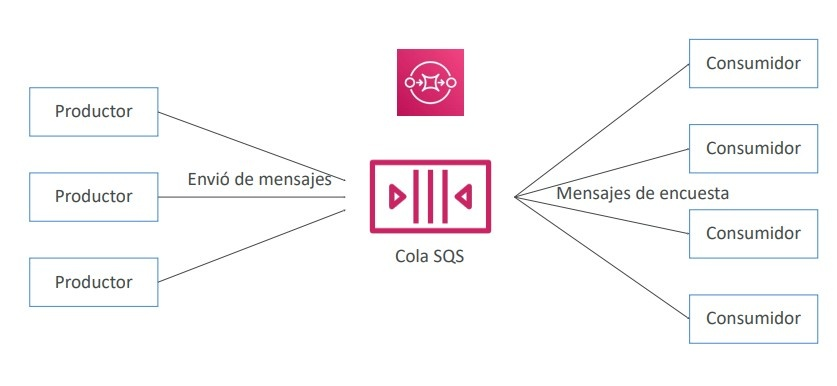

### Características Técnicas de las Colas Estándar
- **Rendimiento ilimitado**: Admite un número virtualmente infinito de transacciones por segundo.
- **Tamaño de mensaje**: Máximo de **256 KB** por mensaje individual (para cargas mayores se utiliza la *Amazon SQS Extended Client Library* almacenando el archivo en S3 y pasando el puntero por SQS).
- **Retención**: Configurable de **1 minuto a 14 días** (por defecto **4 días**).
- **Semántica de entrega**: **Al menos una vez (*At-least-once delivery*)**. Ocasionalmente pueden entregarse duplicados.
- **Ordenación**: Ordenación al mejor esfuerzo (*Best-effort ordering*).

### Mecanismos Operativos Clave
1. **Message Visibility Timeout (Tiempo de espera de visibilidad)**:
   - Ventana temporal (por defecto **30 segundos**; configurable de 0s a 12 horas) durante la cual un mensaje recibido por un consumidor se vuelve **invisible para los demás consumidores**.
   - Si el consumidor procesa el mensaje con éxito, llama a `DeleteMessage` y el mensaje se elimina.
   - Si el consumidor colapsa o no llama a `DeleteMessage` antes de que expire el tiempo de visibilidad, el mensaje vuelve a ser visible en la cola y otro consumidor lo procesará (generando un posible duplicado).
   - Un consumidor puede llamar a la API `ChangeMessageVisibility` para solicitar tiempo adicional si el procesamiento toma más de lo previsto.
2. **Long Polling (Sondeo Largo)**:
   - En lugar de retornar inmediatamente una respuesta vacía si la cola no tiene mensajes (*Short Polling*), el consumidor espera hasta **20 segundos** a que arribe un mensaje.
   - **Beneficios**: Reduce drásticamente las llamadas vacías a la API, optimiza costos monetarios y minimiza la latencia de procesamiento.
3. **Colas FIFO (First-In, First-Out)**:
   - Garantiza **estricto orden cronológico** y **entrega exactamente una vez (*Exactly-Once delivery*)** mediante deduplicación automática basada en *Message Deduplication ID* o hash SHA-256.
   - **Límites de rendimiento**: Hasta **300 mensajes/segundo** (o hasta **3,000 msg/s con procesamiento por lotes / batching**).

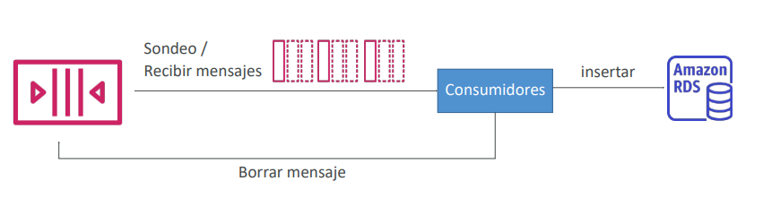

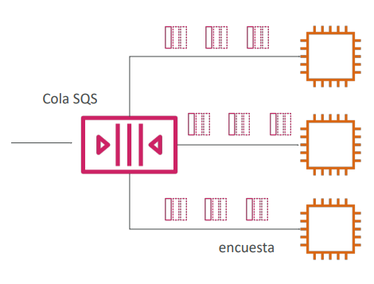

### Arquitectura de Amortiguación y Escalado: SQS + ASG
- Para evitar sobrecargar bases de datos relacionales durante picos masivos de escritura, se coloca una cola SQS como **búfer intermedio**.
- El backend en un Auto Scaling Group de instancias EC2 escala horizontalmente monitoreando la métrica de CloudWatch **`ApproximateNumberOfMessagesVisible`** dividida entre el número de instancias activas.

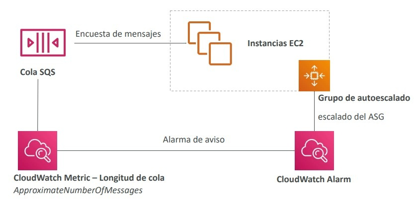

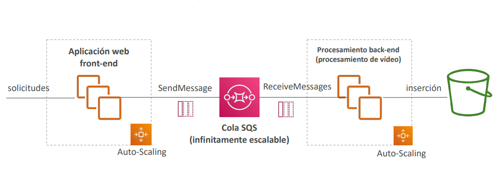

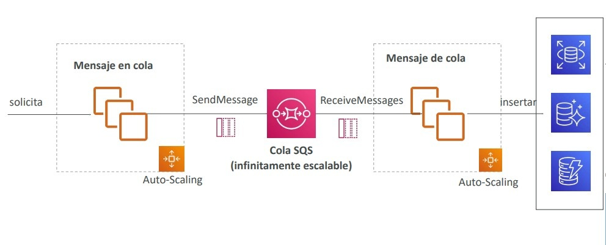

> **💡 SAA-C03 Exam Tip:**  
> Si una pregunta de examen indica que las instancias EC2 que procesan mensajes de una cola SQS **están procesando el mismo mensaje múltiples veces de forma duplicada porque tardan 45 segundos en completar la tarea**, la solución **no es agregar más instancias EC2 ni cambiar a una cola FIFO**; la solución es **incrementar el `Visibility Timeout` de la cola a un valor superior a 45 segundos (ej. 60 o 120 segundos)** o invocar `ChangeMessageVisibility`.

---

## 3. Amazon SNS (Simple Notification Service)

**Amazon SNS** es un servicio administrado de mensajería basado en el modelo **Publicación/Suscripción (*Pub/Sub - Push model*)**.

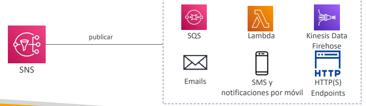

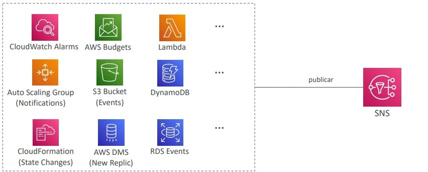

- **Mecánica**: Un productor publica un mensaje en un **SNS Topic**. El servicio distribuye y empuja (*push*) de forma inmediata una copia del mensaje a todos los suscriptores suscritos al tema.
- **Límites**: Hasta **12,500,000 suscripciones por tema** y hasta **100,000 temas por cuenta**.
- **Tipos de Suscriptores**:
  - Colas **Amazon SQS**
  - Funciones **AWS Lambda**
  - **Amazon Data Firehose**
  - Endpoints HTTP / HTTPS
  - Notificaciones Push móviles (Apple APNs, Google FCM)
  - Notificaciones por SMS y Correos Electrónicos (Email / Email-JSON).
- **SNS Message Filtering**: Políticas JSON asignadas a suscripciones individuales que filtran qué mensajes recibe cada suscriptor basándose en los atributos del mensaje, evitando que todos procesen todo.
- **SNS FIFO Topics**: Preservan el orden estricto y admiten deduplicación, pero **únicamente pueden tener colas SQS FIFO como suscriptores**.

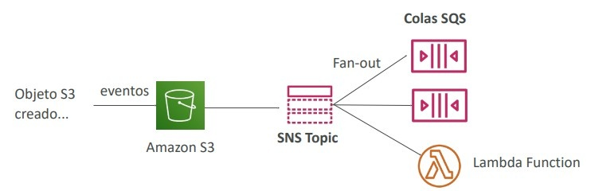

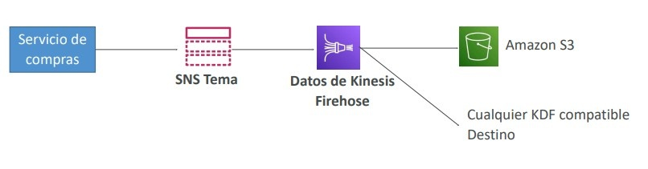

---

## 4. Patrón Arquitectónico Fan-Out (SNS + SQS)

El patrón **Fan-Out** es una de las soluciones arquitectónicas más evaluadas en el SAA-C03:

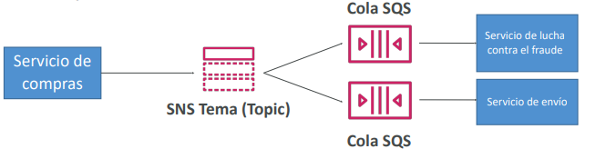

1. El emisor publica un único mensaje en un **SNS Topic**.
2. Múltiples colas **SQS** se suscriben a dicho Topic.
3. Cada cola SQS recibe una copia independiente del mensaje.
4. Diferentes servicios consumidores (ej. Servicio de Facturación, Servicio Antifraude y Servicio de Envíos) procesan los datos a su propia velocidad con capacidad de reintentos, persistencia y almacenamiento intermedio sin interferir entre sí.

> **💡 SAA-C03 Exam Tip:**  
> **Limitación de reglas en S3 resuelta con Fan-Out**:  
> En Amazon S3, **solo se puede configurar una única regla de notificación de eventos para la misma combinación de prefijo y tipo de evento**. Si necesitas que la subida de una imagen a S3 dispare el procesamiento en 5 sistemas desacoplados diferentes, **debes configurar la notificación de eventos de S3 hacia un SNS Topic y luego aplicar el patrón Fan-Out conectando múltiples colas SQS al Topic**.

---

## 5. Streaming en Tiempo Real: Amazon Kinesis

La familia **Amazon Kinesis** está diseñada para ingerir, procesar y analizar grandes volúmenes de datos continuos de streaming en tiempo real (telemetría IoT, logs de servidores, flujos de clics web e información financiera).

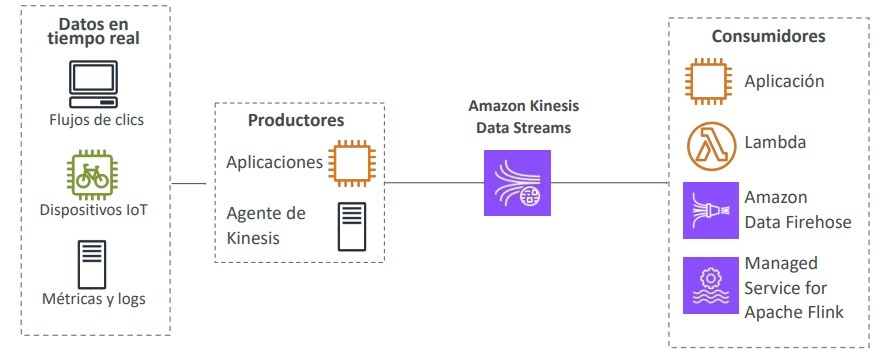

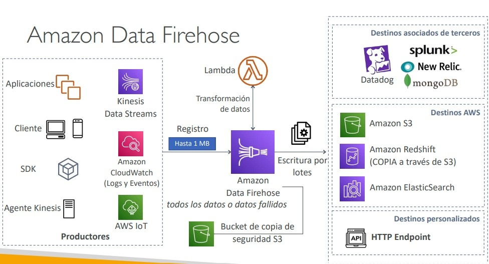

### Comparativa: Kinesis Data Streams vs. Amazon Data Firehose

| Característica | Amazon Kinesis Data Streams | Amazon Data Firehose *(antes Kinesis Firehose)* |
| :--- | :--- | :--- |
| **Nivel de Servicio** | Administrado; requiere diseñar productores y consumidores propios (SDK, KCL o Lambda). | **Totalmente serverless y automatizado**. Cero administración de infraestructura. |
| **Tiempo de Entrega** | **Tiempo real estricto (~200 ms)** de latencia. | **Casi en tiempo real (*Near real-time*)**. Introduce un búfer de agregación configurable (mínimo 60s o 1 MB). |
| **Capacidad y Escalado** | • **Modo Aprovisionado**: Capacidad definida por *Shards* (1 MB/s entrada, 2 MB/s salida por shard). • **Modo Bajo Demanda**: Escala automáticamente según picos de demanda. | Escala de forma automática e instantánea según el flujo entrante. |
| **Persistencia y Reproducción** | **Retención de datos de 1 a 365 días**. Permite que múltiples consumidores independientes lean y **reproduzcan (*Replay*)** los datos históricos. | **No almacena datos permanentemente**. Los datos se descartan tras ser entregados al destino. No admite replay. |
| **Destinos Soportados** | Aplicaciones personalizadas (EC2 con KCL), AWS Lambda, Kinesis Data Analytics, Data Firehose. | Carga directa en: **Amazon S3**, **Amazon Redshift** (vía S3 COPY), **Amazon OpenSearch**, Splunk, Datadog y HTTP Endpoints. |
| **Transformación de Datos** | A través de código en el consumidor o Apache Flink. | Soporta transformaciones en vuelo con **AWS Lambda** (ej. JSON a Parquet/ORC). |

---

## 6. Comparativa Maestra: SQS vs. SNS vs. Kinesis

| Parámetro | Amazon SQS | Amazon SNS | Amazon Kinesis Data Streams |
| :--- | :--- | :--- | :--- |
| **Modelo de Consumo** | **Pull (Sondeo por consumidores)**. | **Push (Empuje instantáneo a suscriptores)**. | **Pull estándar** (o Push mediante *Enhanced Fan-Out*). |
| **Destinatarios** | 1 consumidor procesa y elimina cada mensaje. | Múltiples suscriptores reciben una copia idéntica. | Múltiples aplicaciones leen concurrentemente del stream. |
| **Persistencia** | Hasta 14 días. El mensaje se borra tras procesarse. | **Efímero**. El mensaje se pierde si no se entrega al suscriptor. | **De 1 a 365 días**. Inmutable; permite **reproducción de eventos**. |
| **Capacidad de Ingesta** | Rendimiento ilimitado en estándar. | Rendimiento ilimitado. | Escalado por Shards o Modo On-Demand. |
| **Casos de Uso SAA-C03** | Desacoplamiento de microservicios, amortiguación de base de datos, colas de trabajo por lotes. | Notificaciones push a móviles, emails de alerta de CloudWatch, Fan-Out a colas. | **Pipelines de Big Data en tiempo real**, flujos de clics web, telemetría IoT con reprocesamiento. |

---

## 7. Amazon MQ: Migración de Protocolos Heredados

**Amazon MQ** es un servicio administrado de agentes de mensajes (*message broker*) para **Apache ActiveMQ** y **RabbitMQ**.

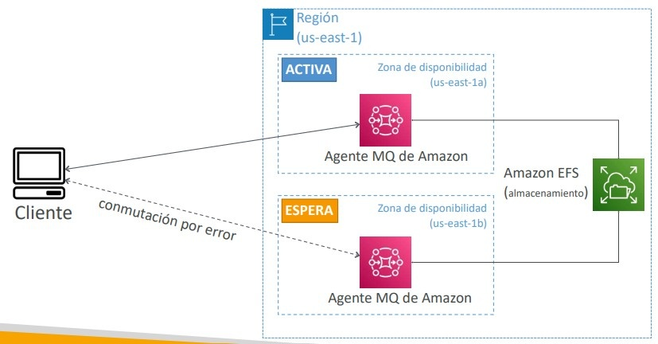

### SQS/SNS vs. Amazon MQ
- **SQS y SNS** son servicios nativos de AWS que operan sobre APIs propietarias HTTP/HTTPS. Ofrecen escala infinita sin aprovisionamiento de servidores.
- **Amazon MQ** está diseñado para migraciones corporativas *"Lift-and-Shift"* de aplicaciones heredadas que requieren protocolos abiertos estándar del sector:
  - **MQTT**
  - **AMQP**
  - **STOMP**
  - **OpenWire**
  - **WSS**
- Se aprovisiona sobre instancias dedicadas subyacentes. Para **Alta Disponibilidad**, utiliza una arquitectura **Multi-AZ Activa/En Espera (Active/Standby)** sincronizada mediante almacenamiento compartido sobre **Amazon EFS**, con conmutación por error automática ante incidentes.

> **💡 SAA-C03 Exam Tip:**  
> Si una empresa busca migrar a AWS una aplicación heredada local basada en Java que utiliza **JMS, MQTT o colas AMQP (ActiveMQ / RabbitMQ)** con el **mínimo esfuerzo de desarrollo y sin reescribir el código de la aplicación**, la respuesta es **Amazon MQ**. No elijas SQS ni SNS, ya que estos servicios exigirían reescribir los clientes para utilizar el SDK de AWS.
