# Contenedores en AWS: Docker, Amazon ECS, AWS Fargate, Amazon ECR y Amazon EKS

El despliegue de microservicios y aplicaciones empaquetadas en contenedores representa un componente sustancial del examen **AWS Certified Solutions Architect - Associate (SAA-C03)**. 

Este módulo evalúa la selección entre los dos orquestadores principales (**Amazon ECS** y **Amazon EKS**), los modelos de cómputo subyacente (**EC2 Launch Type vs. AWS Fargate Serverless**), la gestión y seguridad de imágenes con **Amazon ECR**, la diferenciación de roles de seguridad en IAM, la integración con balanceadores de carga y el almacenamiento persistente con **Amazon EFS** y controladores CSI.

---

## 1. Fundamentos: Docker vs. Máquinas Virtuales

Un contenedor empaqueta el código fuente, librerías, dependencias de tiempo de ejecución y configuraciones en un artefacto portable e inmutable.

- **Máquinas Virtuales Tradicionales (VMs)**: Cada VM corre sobre un hipervisor de hardware e incluye un sistema operativo invitado (*Guest OS*) completo e independiente (ocupando gigabytes y tardando minutos en arrancar).
- **Contenedores Docker**: Comparten el kernel del sistema operativo del servidor host (*Host OS*). Son ligeros (megabytes), consumen menos recursos y se inician en fracciones de segundo.

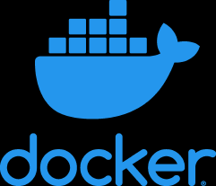

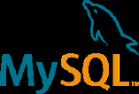

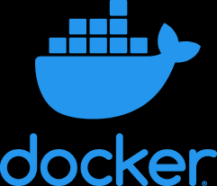

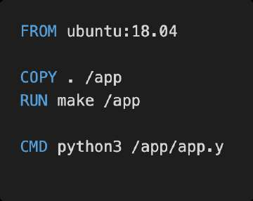

---

## 2. Amazon ECR (Elastic Container Registry)

**Amazon ECR** es un registro de contenedores Docker totalmente administrado, seguro y de alta disponibilidad respaldado internamente por **Amazon S3**.

- **Repositorios Públicos y Privados**: Admite repositorios privados por cuenta y la galería pública (*Amazon ECR Public Gallery*).
- **Seguridad**:
  - Control de acceso granular regulado estrictamente mediante **Políticas de IAM** y políticas de repositorio basadas en recursos.
  - Escaneo automático de vulnerabilidades de imágenes en busca de CVEs en el sistema operativo del contenedor.
  - Integración nativa con **AWS KMS** para cifrado en reposo.
- **Ciclo de vida de imágenes (*Lifecycle Policies*)**: Reglas para expirar y limpiar automáticamente imágenes antiguas o sin etiquetar (*untagged*), evitando costos innecesarios de almacenamiento.

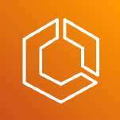

---

## 3. Amazon ECS (Elastic Container Service)

**Amazon ECS** es el orquestador de contenedores propietario de AWS, diseñado para ofrecer una integración profunda, rápida y altamente escalable con el resto del ecosistema de AWS.

### Conceptos Clave de ECS
- **Task Definition (Definición de Tarea)**: Documento JSON que actúa como el plano (*blueprint*) del contenedor. Especifica la imagen Docker de ECR, asignación de CPU y memoria, mapeo de puertos de red, variables de entorno y roles de IAM.
- **Task (Tarea)**: Instancia en ejecución individual de una Task Definition.
- **Service (Servicio ECS)**: Mantiene en ejecución un número deseado de tareas de forma continua, se integra con balanceadores de carga y reinicia tareas que fallen.

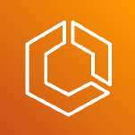

---

## 4. Comparativa de Modelos de Cómputo: EC2 Launch Type vs. AWS Fargate

Para ejecutar tareas en Amazon ECS (y pods en Amazon EKS), el arquitecto debe elegir entre dos modelos de infraestructura:

### Tabla Comparativa: ECS en EC2 vs. AWS Fargate

| Criterio | ECS en Amazon EC2 (Launch Type) | AWS Fargate (Serverless Launch Type) |
| :--- | :--- | :--- |
| **Administración de Servidores** | El cliente es responsable de aprovisionar, parchar el SO, mantener y configurar las instancias EC2 del clúster. | **100% Serverless**. No hay instancias EC2 que administrar, parchar ni dimensionar. |
| **Agente de ECS** | Requiere que cada instancia EC2 ejecute el *ECS Container Agent*. | AWS administra el entorno de ejecución de forma transparente. |
| **Dimensionamiento y Escala** | Doble capa de escalado: escalar el número de tareas ECS y escalar el **Auto Scaling Group** de instancias EC2 mediante *ECS Capacity Providers*. | **Escalado directo a nivel de tareas**. Solo se aumenta el número de tareas según memoria y vCPU requerida. |
| **Control del Sistema Operativo** | Acceso total al host (SSH, drivers de GPU específicos, configuración del kernel). | Sin acceso al servidor host subyacente. |
| **Modelo de Costos** | Se paga por las instancias EC2 aprovisionadas (corran o no contenedores). Admite Spot e Instancias Reservadas. | Se factura por segundo según la cantidad exacta de **vCPU y memoria RAM asignadas** a cada tarea. |
| **Casos de Uso SAA-C03** | Cargas de trabajo predecibles a gran escala, instancias con hardware especializado (GPUs para ML), o cuando se requiere control estricto del host. | **Recomendado por defecto en arquitecturas modernas de microservicios**: elimina sobrecarga operativa, ideal para cargas variables o esporádicas. |

> **💡 SAA-C03 Exam Tip:**  
> Si una pregunta de examen plantea desplegar microservicios en contenedores Docker y exige **"la menor sobrecarga de gestión operativa posible, sin administrar servidores ni parches de sistema operativo, pagando únicamente por la CPU y memoria consumida por las tareas"**, la respuesta es **Amazon ECS con tipo de lanzamiento AWS Fargate**.

---

## 5. Seguridad en ECS: Perfil de Instancia vs. Task Role

Una de las preguntas clásicas y con mayor probabilidad de confusión en el examen involucra la asignación correcta de permisos de IAM en ECS:

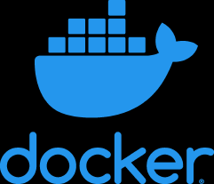

### Comparativa: EC2 Instance Profile vs. ECS Task Role

| Rol de IAM | A quién se adjunta | Para qué se utiliza |
| :--- | :--- | :--- |
| **EC2 Instance Profile (Role)** | A la **instancia EC2 host** (solo en EC2 Launch Type). | Utilizado por el **ECS Agent** a nivel de infraestructura para: registrar la instancia en el clúster ECS, enviar logs a CloudWatch y hacer pull de imágenes Docker desde Amazon ECR. |
| **ECS Task Role** | A la **Task Definition específica** (funciona en EC2 y Fargate). | Utilizado por la **aplicación que corre dentro del contenedor** para interactuar con otros servicios de AWS (ej. escribir en Amazon DynamoDB o descargar archivos de un bucket de S3). |

> **💡 SAA-C03 Exam Tip:**  
> Si la Tarea A necesita escribir en una tabla de DynamoDB y la Tarea B necesita leer de un bucket de Amazon S3 corriendo sobre la misma instancia EC2, **el principio de mínimo privilegio exige definir un ECS Task Role independiente para cada tarea en su respectiva Task Definition**. **Nunca** asignes permisos de aplicación al rol de la instancia EC2 host (*EC2 Instance Profile*), ya que todas las tareas en esa máquina compartirían indebidamente esos privilegios.

---

## 6. Red, Balanceo y Almacenamiento Persistente en ECS

### Integración con Load Balancers
- **Application Load Balancer (ALB)**: La opción recomendada para el 95% de casos web/microservicios (Capa 7).
  - Soporta **mapeo de puertos dinámico (*Dynamic Host Port Mapping*)**: Permite ejecutar múltiples contenedores idénticos de la misma tarea sobre una única instancia EC2 asignándoles puertos efímeros aleatorios; el ALB redirige el tráfico reconociendo el Target Group automáticamente.
- **Network Load Balancer (NLB)**: Para tráfico TCP/UDP de rendimiento extremo o integración con **AWS PrivateLink**.

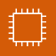

### Almacenamiento Persistente con Amazon EFS
- Por diseño, los contenedores son efímeros.
- Para proporcionar persistencia multi-AZ compartida entre tareas concurrentes, ECS permite montar sistemas de archivos **Amazon EFS** directamente en las definiciones de tareas.
- **Compatible tanto con EC2 Launch Type como con AWS Fargate**.
- *Nota arquitectónica*: Amazon S3 **no** se puede montar de forma nativa como un sistema de archivos en tareas ECS.

---

## 7. Escalado y Arquitecturas Orientadas a Eventos con ECS

### Auto Scaling de Tareas
- Gestionado a través de **Application Auto Scaling** utilizando métricas clave:
  - `ECSServiceAverageCPUUtilization`
  - `ECSServiceAverageMemoryUtilization`
  - `ALBRequestCountPerTarget`
- Modalidades: *Target Tracking Scaling*, *Step Scaling* y *Scheduled Scaling*.

### Integración con Amazon EventBridge
- **Ejecución basada en eventos o cron**: EventBridge puede disparar la ejecución de una tarea ECS en modo batch al ocurrir un evento en S3 o según un horario programado (*EventBridge Rule*).
- **Monitoreo de estado de tareas**: EventBridge captura eventos cuando un contenedor se detiene (*Task State Change*), permitiendo enviar alertas automáticas vía **Amazon SNS** a los administradores.

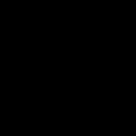

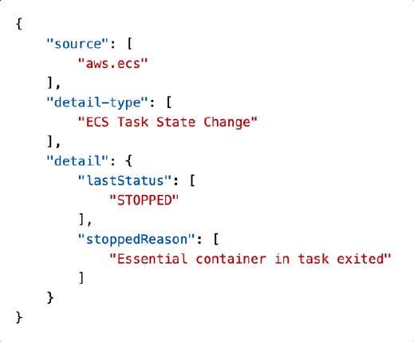
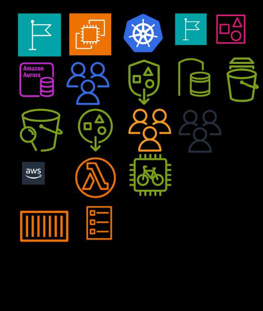

---

## 8. Amazon EKS (Elastic Kubernetes Service)

**Amazon EKS** es el servicio administrado de Kubernetes en AWS. Es la opción preferida por empresas que buscan estandarizar sus flujos de trabajo sobre el estándar abierto de facto de la industria (**Kubernetes**) o mantener una arquitectura híbrida multinube compatible con Google Cloud (GKE), Azure (AKS) o centros de datos on-premises.

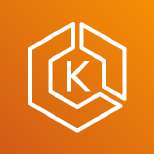
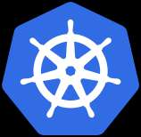

### Tipos de Nodos de Trabajo en EKS
1. **Managed Node Groups**: AWS crea, actualiza y gestiona las instancias EC2 del clúster dentro de un Auto Scaling Group automatizado.
2. **Self-Managed Nodes**: Nodos EC2 aprovisionados y mantenidos manualmente por el usuario utilizando la *Amazon EKS Optimized AMI*.
3. **AWS Fargate**: Ejecución serverless de pods de Kubernetes sin gestionar ningún nodo de cómputo subyacente.

### Almacenamiento Persistente en EKS (Controladores CSI)
EKS requiere definir un `StorageClass` que utiliza un controlador **Container Storage Interface (CSI)** para vincular volúmenes:
- **Amazon EBS CSI Driver**: Bloque persistente para un único Pod.
- **Amazon EFS CSI Driver**: Sistema de archivos compartido multi-AZ (compatible con pods en Fargate).
- **Amazon FSx for Lustre CSI Driver**: Computación paralela de alto rendimiento.

> **💡 SAA-C03 Exam Tip:**  
> **Criterio de decisión definitivo: ¿Amazon ECS o Amazon EKS?**  
> - Si el escenario solicita una plataforma de contenedores nativa de AWS, sencilla de aprender, con máxima integración con otros servicios y **sin mencionar Kubernetes** $\implies$ **Amazon ECS**.  
> - Si el escenario menciona explícitamente: *"La empresa ya utiliza clústeres de Kubernetes en sus instalaciones físicas y busca una arquitectura que permita portabilidad entre nubes (cloud-agnostic) reutilizando sus manifiestos YAML y herramientas existentes"* $\implies$ La respuesta es **Amazon EKS**.
