# Arquitecturas Serverless en AWS: Lambda, DynamoDB, API Gateway, Step Functions y Cognito

El paradigma **Serverless** traslada la responsabilidad de la administración, aprovisionamiento, parcheo y escalabilidad de la infraestructura directamente a AWS. El desarrollador solo despliega código, funciones o esquemas lógicos, pagando exclusivamente por el tiempo de ejecución y las solicitudes procesadas sin incurrir en costos por capacidad ociosa.

Para el examen **AWS Certified Solutions Architect - Associate (SAA-C03)**, este módulo es crucial: aborda el diseño de arquitecturas orientadas a eventos basadas en **AWS Lambda**, computación en el borde (**CloudFront Functions vs. Lambda@Edge**), bases de datos NoSQL de escala masiva con **Amazon DynamoDB** y su acelerador **DAX**, exposición de microservicios con **Amazon API Gateway**, orquestación de flujos de trabajo con **AWS Step Functions**, y federación de identidades con **Amazon Cognito**.

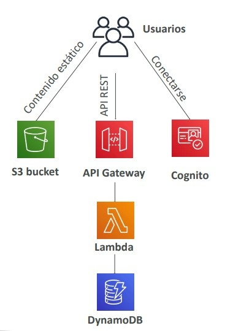

---

## 1. AWS Lambda: Computación Orientada a Eventos (FaaS)

**AWS Lambda** es un servicio de cómputo serverless que ejecuta código en respuesta a eventos provenientes de más de 200 servicios de AWS.

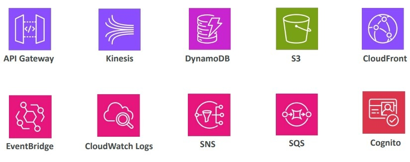

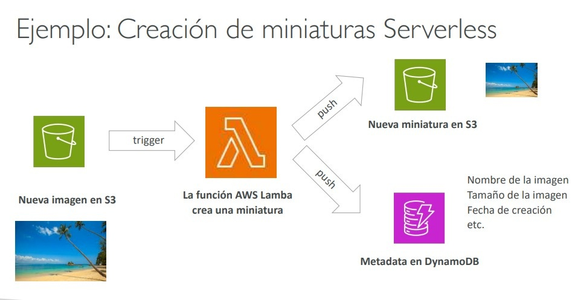

### Límites de Configuración Críticos para el Examen
- **Tiempo máximo de ejecución (Timeout)**: **900 segundos (15 minutos)**. Cualquier tarea que supere este tiempo colapsa; para procesos más largos se deben usar instancias EC2, contenedores ECS o AWS Step Functions.
- **Asignación de Memoria**: De **128 MB a 10,240 MB (10 GB)**. *(Nota clave: Al incrementar la memoria RAM, AWS asigna proporcionalmente más potencia de CPU y ancho de banda de red)*.
- **Almacenamiento efímero temporal (`/tmp`)**: De **512 MB a 10 GB**.
- **Límite de Concurrencia por Región**: **1,000 ejecuciones concurrentes** por defecto (ampliable solicitando aumento de cuota).
- **Tamaño de paquete de despliegue**: 50 MB comprimido (.zip), 250 MB sin comprimir (código + dependencias).

### Manejo de Concurrencia, Cold Starts y Throttling
1. **Cold Starts (Arranques en Frío)**:
   - Ocurren cuando una nueva instancia de ejecución debe inicializar el runtime, cargar librerías y ejecutar el código fuera del handler.
   - **Provisioned Concurrency (Concurrencia Aprovisionada)**: Precalienta entornos de ejecución para que las funciones respondan con latencia en milisegundos de un solo dígito sin sufrir cold starts.
   - **Lambda SnapStart** (para runtimes compatibles como Java): Toma un snapshot del estado de la memoria tras la inicialización y reanuda las funciones desde esa instantánea en milisegundos.
2. **Reserved Concurrency (Concurrencia Reservada)**:
   - Asigna un límite máximo garantizado a una función específica para evitar que sature la cuota regional de 1,000 ejecuciones y deje sin recursos al resto de funciones (*throttling*).
3. **Throttling (Estrangulamiento)**:
   - Invocación síncrona: Retorna un error HTTP **`429 Too Many Requests`**.
   - Invocación asíncrona: Lambda reintenta automáticamente con retroceso exponencial durante **hasta 6 horas**, enviando los eventos fallidos a una **Dead-Letter Queue (DLQ)** de SQS o SNS si está configurada.

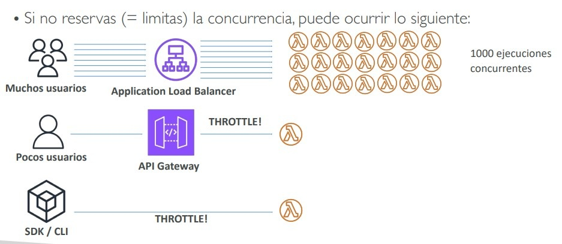

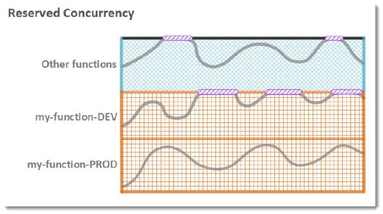
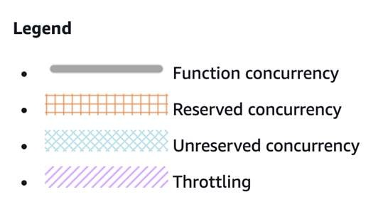

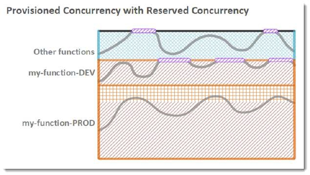
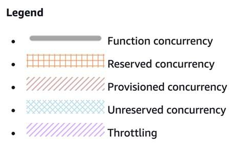

### Lambda en Amazon VPC
- Por defecto, Lambda corre en una VPC administrada por AWS con salida a Internet pública, pero **sin acceso a recursos privados** (RDS privado, ElastiCache o balanceadores internos).
- Para conectar Lambda a una base de datos privada:
  - Se debe configurar la función dentro de la **VPC del cliente**, asignándole subredes privadas y un **Security Group dedicado**.
  - Lambda utiliza interfaces de red elásticas gestionadas por AWS Nitro (**Hyperplane ENI**) que permiten arrancar en subredes privadas sin penalización de tiempo de conexión.
  - Para interactuar con bases de datos relacionales con alta concurrencia, **se debe intercalar Amazon RDS Proxy** para evitar agotar el pool de conexiones.

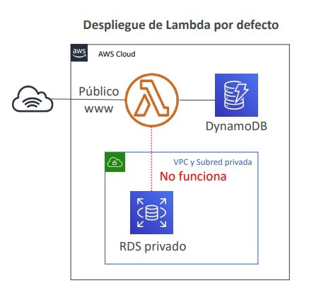

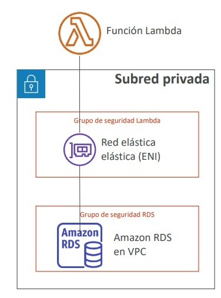

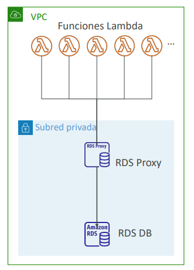

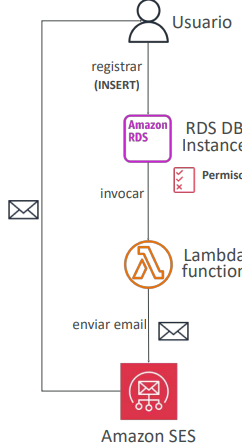

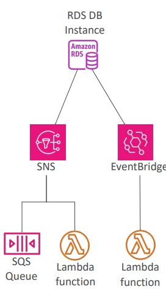

---

## 2. Computación en el Borde: CloudFront Functions vs. Lambda@Edge

Para ejecutar lógica computacional lo más cerca posible de los usuarios finales a través de la CDN, AWS ofrece dos tecnologías perimetrales:

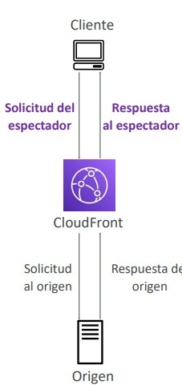

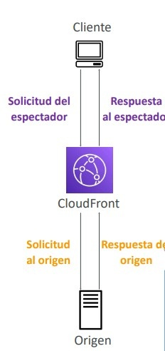

### Tabla Comparativa: CloudFront Functions vs. Lambda@Edge

| Característica | CloudFront Functions | Lambda@Edge |
| :--- | :--- | :--- |
| **Lenguajes Soportados** | **JavaScript (ECMAScript 5.1)** nativo. | **Node.js y Python**. |
| **Tiempo Máx. de Ejecución** | **Submilisegundo (< 1 ms)**. | **5 segundos** (Viewer Request/Response) o **30 segundos** (Origin Request/Response). |
| **Memoria RAM** | **2 MB** fijos. | De **128 MB hasta 10 GB**. |
| **Disparadores (Triggers)** | Solo 2: **Viewer Request** y **Viewer Response**. | 4 puntos del ciclo: **Viewer Request**, **Viewer Response**, **Origin Request** y **Origin Response**. |
| **Acceso al Cuerpo de Petición HTTP**| **No**. Solo procesa cabeceras, cookies, query strings y URLs. | **Sí**. Puede leer y transformar el cuerpo (*body*) HTTP. |
| **Acceso a Red / Internet Externa**| **No**. No puede realizar llamadas a APIs externas ni bases de datos. | **Sí**. Acceso completo a red para consultar DynamoDB, Secrets Manager o APIs de terceros. |
| **Escala y Volumen** | **Millones de solicitudes por segundo** al menor costo. | Miles de solicitudes por segundo. |
| **Casos de Uso SAA-C03** | • Normalización de claves de caché (reescritura de URL). • Manipulación e inserción de cabeceras HTTP de seguridad (HSTS, CSP). • Redirecciones simples de URL. • Validación básica de tokens JWT sin llamadas a red. | • Pruebas A/B complejas con backend dinámico. • Transformación y redimensionamiento de imágenes sobre la marcha con S3. • Autenticación y autorización avanzada con bases de datos externas en el borde. |

> **💡 SAA-C03 Exam Tip:**  
> Si la pregunta exige **"manipular cabeceras HTTP o normalizar la URL de caché para millones de peticiones por segundo con latencia submilisegundo al menor costo posible"** $\implies$ **CloudFront Functions**.  
> Si la función necesita **"acceso a la red externa, consultar una base de datos DynamoDB, tardar varios segundos o inspeccionar el cuerpo del mensaje HTTP"** $\implies$ **Lambda@Edge**.

---

## 3. Amazon DynamoDB: Base de Datos NoSQL Serverless

**Amazon DynamoDB** es una base de datos NoSQL clave-valor y de documentos totalmente administrada que ofrece latencias de **milisegundos de un solo dígito** a cualquier escala.

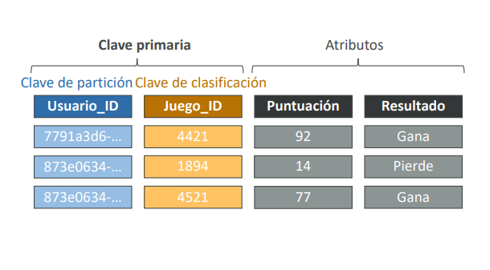

### Conceptos Fundamentales
- **Estructura**: Tablas formadas por Elementos (*Items*, hasta un máximo de **400 KB**) y Atributos.
- **Claves Primarias**:
  1. **Partition Key (Hash Key)**: Clave única utilizada por la función hash interna para distribuir los datos entre particiones físicas.
  2. **Partition Key + Sort Key (Composite Primary Key / Range Key)**: Permite almacenar múltiples registros con la misma Partition Key agrupados y ordenados por la Sort Key (ej. `Usuario_ID` [Hash] + `Fecha_Transacción` [Range]).

### Modos de Capacidad de Lectura/Escritura
1. **Provisioned Capacity Mode (Modo Aprovisionado)**:
   - Se definen **RCUs (Read Capacity Units)** y **WCUs (Write Capacity Units)**.
   - Admite Auto Scaling para ajustar RCUs/WCUs según la utilización.
   - **Más económico** cuando se conocen y planifican los patrones de tráfico estables.
2. **On-Demand Capacity Mode (Bajo Demanda)**:
   - Escala de forma instantánea ante cualquier pico impredecible sin planificación previa.
   - Se paga por petición de lectura/escritura realizada. Ideal para cargas de trabajo nuevas, variables o con tráfico nocturno nulo.

### Aceleración en Memoria: DynamoDB Accelerator (DAX)
- Clúster de caché en memoria administrado y de alta disponibilidad diseñado específicamente para DynamoDB.
- Reduce la latencia de lectura de milisegundos a **microsegundos**.
- **Transparente para la aplicación**: Compatible con las llamadas de API nativas de DynamoDB sin requerir reescribir la lógica de la aplicación (a diferencia de ElastiCache, que exige programar la lógica de Cache-Aside).

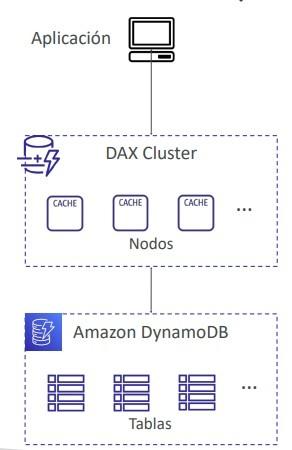

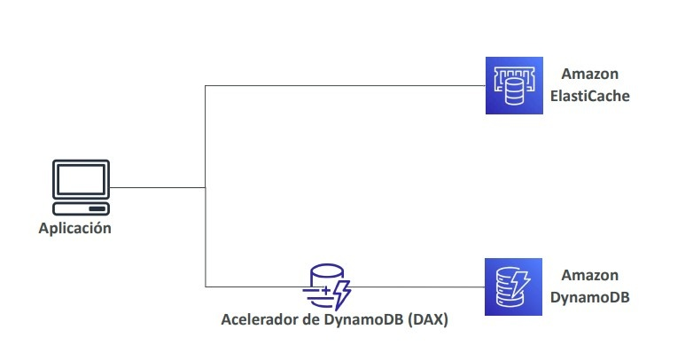

### Capacidades Avanzadas de DynamoDB
- **DynamoDB Streams**: Flujo ordenado de eventos a nivel de elemento (creaciones, modificaciones, borrados) con retención de **24 horas**. Dispara funciones **AWS Lambda** de forma reactiva (patrón CDC - *Change Data Capture*).
- **Global Tables**: Tablas con replicación **Multi-Región Activa-Activa totalmente bidireccional** con latencias de lectura y escritura locales en milisegundos. *Requisito obligatorio*: Tener habilitado DynamoDB Streams.
- **Time to Live (TTL)**: Marca de tiempo UNIX epoch que indica cuándo un elemento debe ser **eliminado automáticamente sin costo adicional de WCUs**. Ideal para sesiones web y datos efímeros.
- **Respaldos y Recuperación**: Point-in-Time Recovery (**PITR**) continuo para los últimos 35 días y respaldos bajo demanda administrados por **AWS Backup**.

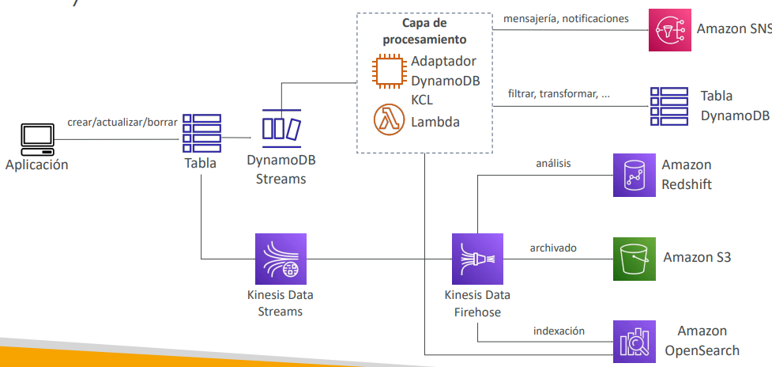

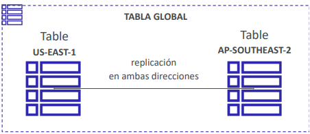

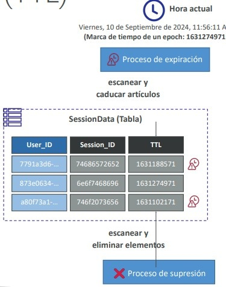

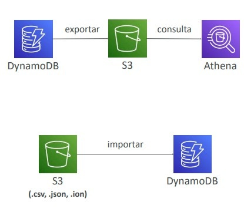

> **💡 SAA-C03 Exam Tip:**  
> - Si un sistema requiere **"latencia en microsegundos para lecturas repetitivas sobre DynamoDB sin alterar el código de la aplicación cliente"** $\implies$ La respuesta es **DynamoDB Accelerator (DAX)**.  
> - Si se requiere una base de datos NoSQL con **"acceso de lectura y escritura multirregional de baja latencia con sincronización activa-activa en múltiples continentes"** $\implies$ La respuesta es **DynamoDB Global Tables**.

---

## 4. Amazon API Gateway

**Amazon API Gateway** es un servicio totalmente administrado para crear, publicar, mantener, monitorear y proteger APIs REST, HTTP y WebSocket a cualquier escala.

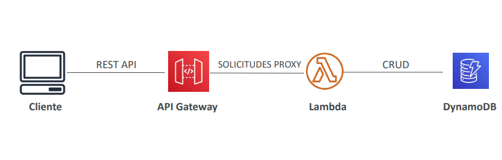

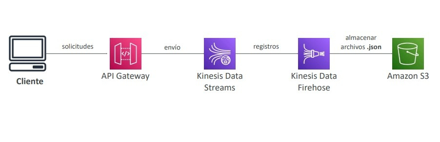

### Tipos de Endpoints de API Gateway
1. **Edge-Optimized (Predeterminado)**: Enruta las solicitudes a través de la red global de CloudFront Edge Locations para minimizar la latencia de clientes internacionales distribuidos.
2. **Regional**: Para clientes que residen dentro de la misma región de AWS (se puede asociar manualmente a una distribución propia de CloudFront para mayor control de caché).
3. **Private**: Accesible exclusivamente desde dentro de una **Amazon VPC** utilizando un **VPC Endpoint de interfaz (AWS PrivateLink)**.

### Seguridad y Control de Acceso
- **Autenticación**:
  - Roles y políticas de **IAM** (para microservicios internos en AWS).
  - **Amazon Cognito User Pools** (para usuarios de aplicaciones móviles y web).
  - **Lambda Authorizers** (antiguos Custom Authorizers: validan tokens Bearer/OAuth mediante código personalizado en Lambda).
- **Throttling y Planes de Uso**: Limita la tasa de peticiones (*Rate*) y cuotas (*Burst*) por cliente mediante API Keys para evitar saturación de los backends.

---

## 5. AWS Step Functions: Orquestación de Flujos de Trabajo

**AWS Step Functions** permite coordinar múltiples servicios de AWS y funciones Lambda mediante máquinas de estados visuales basadas en JSON (**Amazon States Language**).

- **Resuelve el antipatrón de encadenamiento de funciones**: Evita que una función Lambda invoque síncronamente a otra función Lambda esperando su respuesta (lo que duplicaría los costos de facturación por tiempo ocioso).
- **Características**:
  - Control de flujo secuencial, bifurcaciones condicionales, ejecución en paralelo (*Parallel State*) y mapas de iteración (*Map State*).
  - Gestión nativa de errores, reintentos con retroceso exponencial (*Retry*) y capturas de excepciones (*Catch*).
  - Soporta **aprobación humana (*Human Approval Tasks*)** deteniendo la ejecución durante días hasta recibir una señal externa vía token.

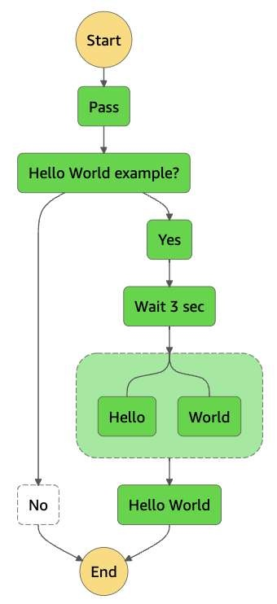

---

## 6. Amazon Cognito: Gestión de Identidad y Autenticación

Amazon Cognito proporciona autenticación, autorización y administración de usuarios para aplicaciones web y móviles a escala de millones de usuarios.

### Comparativa: Cognito User Pools vs. Cognito Identity Pools

| Característica | Cognito User Pools (CUP) | Cognito Identity Pools (Federated Identities) |
| :--- | :--- | :--- |
| **Función Primaria** | **Autenticación (Directorio de Usuarios)**. | **Autorización (Credenciales Temporales de AWS)**. |
| **Quién se Conecta** | Usuarios finales de aplicaciones web y móviles. | Usuarios autenticados (por CUP o terceros) o invitados (*unauthenticated*). |
| **Mecanismo de Salida** | Emite **Tokens JWT** (ID Token, Access Token, Refresh Token) tras el inicio de sesión. | Intercambia el token por **credenciales temporales de IAM (Access Key, Secret Key, Session Token)** vía AWS STS. |
| **Integraciones Clave** | Integra directamente con **API Gateway** y **Application Load Balancer (ALB)** para validar tokens. | Permite que las aplicaciones cliente accedan **directamente a recursos de AWS** (ej. subir archivos a un bucket de S3 o escribir en DynamoDB) sin pasar por un servidor backend. |
| **Proveedores Soportados** | Base de datos serverless de usuarios propia, proveedores sociales (Google, Facebook, Apple) y federación SAML 2.0 / OIDC. | Cognito User Pools, OpenID Connect, SAML, Google, Apple, etc. |

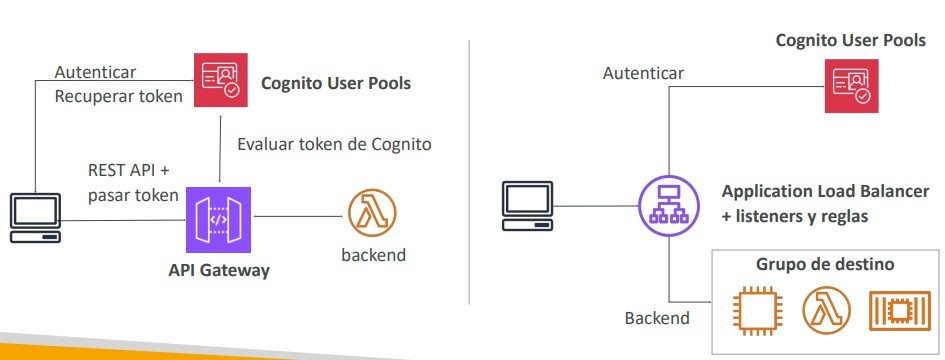

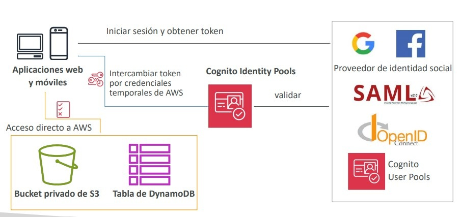

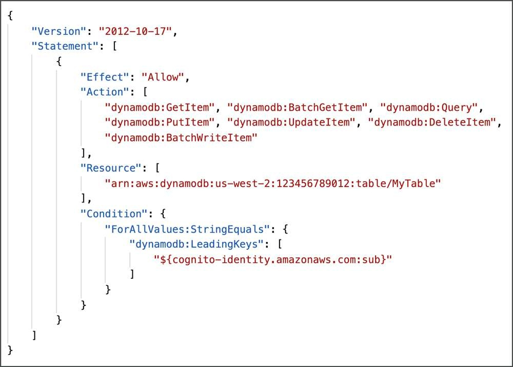

> **💡 SAA-C03 Exam Tip:**  
> **Patrón de Arquitectura Serverless Móvil**:  
> Una aplicación móvil permite a millones de usuarios subir fotos a su propia carpeta personal en un bucket de Amazon S3:  
> 1. El usuario se autentica en **Cognito User Pools**.  
> 2. El token JWT se intercambia en **Cognito Identity Pools** por credenciales temporales de IAM.  
> 3. La política de IAM asignada utiliza la variable de política **`${cognito-identity.amazonaws.com:sub}`** para restringir el acceso del usuario exclusivamente a su prefijo personal: `arn:aws:s3:::mi-bucket/${cognito-identity.amazonaws.com:sub}/*`.
