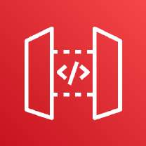
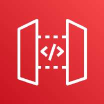
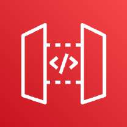
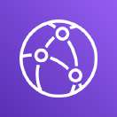
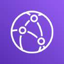
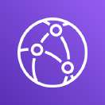
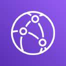
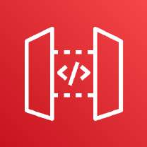
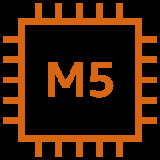

# Arquitecturas Sin Servidor en AWS (Serverless Architectures)

El paradigma *Serverless* (sin servidor) en AWS no significa la ausencia total de servidores, sino la delegación completa del aprovisionamiento, parcheo, escalado elástico y alta disponibilidad a la plataforma de AWS. El modelo de precios se rige estrictamente por consumo real (número de peticiones, tiempo de cómputo por milisegundo o datos transferidos), eliminando el coste por capacidad ociosa (*idle capacity*).

Para el examen **AWS Certified Solutions Architect - Associate (SAA-C03)**, es indispensable comprender cómo conectar e integrar múltiples servicios administrados (*building blocks*) para formar arquitecturas resilientes, escalables y costo-eficientes, así como identificar cuellos de botella y patrones de almacenamiento en caché.

---

## 1. Patrón de Arquitectura: Aplicación Móvil (*MyTodoList*)

Analizamos una arquitectura orientada a dispositivos móviles con altos requisitos de concurrencia de lectura, interacción directa con almacenamiento de objetos y autenticación delegada.

### 1.1 Requisitos de Diseño
- Exposición de endpoints bajo estándar REST mediante tráfico seguro HTTPS.
- Arquitectura 100% Serverless (cero administración de instancias).
- Acceso directo y seguro de los clientes móviles a sus propios directorios aislados en Amazon S3.
- Autenticación y gestión de usuarios completamente administrada sin servidores dedicados.
- Lecturas y escrituras elásticas sobre una base de datos NoSQL optimizada para volumen masivo de consultas de lectura.

---

### 1.2 Capa de API REST y Autenticación con Amazon Cognito

En lugar de exponer funciones AWS Lambda o bases de datos de forma directa a Internet, se implementa **Amazon API Gateway** como la puerta de enlace pública y capa de control:

1. El cliente móvil inicia sesión en **Amazon Cognito User Pools**, obteniendo tokens JWT (ID, Access y Refresh Tokens).
2. El cliente envía la solicitud REST HTTPS a API Gateway adjuntando el token en la cabecera `Authorization`.
3. API Gateway valida el token mediante un **Cognito Authorizer** nativo (o una función Lambda Authorizer) sin necesidad de ejecutar lógica de cómputo adicional.
4. Una vez validada la identidad, API Gateway enruta la petición hacia **AWS Lambda**, la cual interactúa con **Amazon DynamoDB** para registrar o consultar tareas.

---

### 1.3 Acceso Directo de Clientes a Amazon S3 mediante AWS STS y Cognito Identity Pools

Un antipatrón recurrente en arquitecturas cloud consiste en subir o descargar archivos pasando los binarios a través de API Gateway y AWS Lambda. Esto satura el límite de payload de API Gateway (10 MB), incrementa los tiempos de ejecución de Lambda y dispara los costos de transferencia.

La solución arquitectónica recomendada por AWS consiste en delegar el intercambio de credenciales:
1. El usuario se autentica en **Amazon Cognito User Pools**.
2. Los tokens JWT se intercambian en **Amazon Cognito Identity Pools (Federated Identities)**, el cual solicita credenciales temporales al servicio **AWS STS (Security Token Service)** mediante la asunción de un rol IAM (*AssumeRoleWithWebIdentity*).
3. El cliente móvil recibe credenciales temporales con permisos estrictamente limitados para interactuar de forma directa con el bucket de Amazon S3.
4. Mediante el uso de variables de política IAM como `${cognito-identity.amazonaws.com:sub}`, se restringe el acceso para que cada usuario únicamente pueda leer y escribir en su propio prefijo: `arn:aws:s3:::my-bucket/users/${cognito-identity.amazonaws.com:sub}/*`.

| Mecanismo de Subida | Cuándo Usarlo en SAA-C03 | Ventajas Principales | Limitaciones / Consideraciones |
| :--- | :--- | :--- | :--- |
| **Cognito Identity Pools + AWS STS** | Clientes móviles/web autenticados que requieren acceso granular frecuente a objetos propios en S3. | Acceso directo a S3 con políticas IAM dinámicas basadas en variables contextuales del usuario (`sub`). | Requiere configuración de Identity Pools y roles autenticados/no autenticados. |
| **S3 Presigned URLs** | Usuarios anónimos o autenticados que requieren subir/descargar un archivo específico de manera puntual. | Generación simple vía Lambda SDK; no expone credenciales AWS al cliente final. | La URL tiene un tiempo de expiración estricto y aplica a un objeto individual. |
| **API Gateway + Lambda Proxy** | Archivos muy pequeños (< 10 MB) con transformaciones o validaciones en vuelo inmediatas. | Todo pasa por una sola interfaz de API. | **Antipatrón para archivos medianos/grandes**; límite de 10 MB en payload y costo elevado. |

---

### 1.4 Optimización de Lecturas Masivas: DAX y Caché en API Gateway

Cuando el tráfico de la aplicación se inclina predominantemente hacia lecturas repetitivas (*read-heavy*), consultar directamente la base de datos incrementa las unidades de capacidad de lectura (RCU) y eleva la latencia.

1. **DynamoDB Accelerator (DAX):** Se despliega un clúster de caché en memoria (*in-memory*) administrado específicamente para DynamoDB. DAX reduce la latencia de respuesta de milisegundos a microsegundos, absorbiendo consultas repetidas de lectura (`GetItem`, `BatchGetItem`, `Query`) sin consumir RCUs de la tabla subyacente.
2. **Caché en API Gateway:** Permite almacenar en memoria las respuestas de métodos HTTP específicos por un tiempo de vida (TTL) configurable. Evita invocar la función Lambda y no genera consultas hacia DynamoDB para solicitudes idénticas.

> **💡 SAA-C03 Exam Tip:**
> - Si la pregunta pide reducir la latencia de lectura de DynamoDB de **milisegundos a microsegundos sin modificar el código de la aplicación**, la respuesta siempre es **DynamoDB Accelerator (DAX)** (se cambia únicamente el endpoint del SDK).
> - Si la pregunta busca **evitar por completo la ejecución de cómputo (Lambda)** para peticiones HTTP recurrentes, la solución es habilitar la **caché de API Gateway**.
> - Para permitir que usuarios de aplicaciones móviles accedan a sus propios archivos en S3 sin gestionar credenciales fijas, busca **Cognito Identity Pools + AWS STS** con políticas basadas en la variable `${cognito-identity.amazonaws.com:sub}`.

---

## 2. Patrón de Arquitectura: Sitio Web y Blog Global (*MyBlog.com*)

Este escenario aborda un portal público con requerimientos de distribución global, aceleración perimetral, baja latencia para lectores en múltiples continentes y procesamiento asíncrono dirigido por eventos (*Event-Driven Architecture*).

### 2.1 Distribución Segura de Contenido Estático

El frontend estático (HTML, CSS, JavaScript, imágenes) se aloja en un bucket de Amazon S3 configurado como origen privado detrás de una distribución de **Amazon CloudFront**:

1. Los usuarios se conectan al punto perimetral (*Edge Location*) más cercano geográficamente con mínima latencia y soporte HTTPS / TLS.
2. Para proteger el bucket S3 y evitar accesos directos no deseados a través de Internet, se configura **Origin Access Control (OAC)** (sucesor moderno de OAI).
3. La política de bucket de S3 restringe el acceso de lectura exclusivamente al servicio CloudFront mediante la condición `AWS:SourceArn` apuntando al ARN de la distribución.

---

### 2.2 Integración de API Pública y Tablas Globales

Para el contenido dinámico del blog (artículos, comentarios, perfiles):
- El cliente consume una API REST pública a través de **Amazon API Gateway**, respaldada por **AWS Lambda**.
- Debido a que el portal es de acceso público general, no requiere Cognito para lecturas anónimas, aunque puede implementarse para autenticación de escritores y administradores.
- Para garantizar lecturas y escrituras multirregión con latencia local y alta disponibilidad activa-activa, se emplean **DynamoDB Global Tables** (con replicación bidireccional multirregión totalmente administrada).

---

### 2.3 Procesamiento Asíncrono de Eventos y Notificaciones

#### Flujo de Envío de Correos Electrónicos (Onboarding / Suscripciones)
Al registrarse un nuevo usuario, el registro se inserta en DynamoDB. Desacoplar el envío de correos electrónicos del ciclo de vida síncrono de la API HTTP es esencial para evitar timeouts y fallos en cascada:
1. La inserción genera un registro ordenado a nivel de clave en **DynamoDB Streams**.
2. El stream invoca automáticamente una función **AWS Lambda**.
3. La función asume un **IAM Role** con permisos `ses:SendEmail` y utiliza el SDK de AWS para despachar el correo de bienvenida a través de **Amazon SES (Simple Email Service)**.

#### Flujo de Subida de Imágenes y Procesamiento de Miniaturas
1. Los autores suben imágenes de alta resolución a un bucket de S3 utilizando **S3 Transfer Acceleration** (que aprovecha los Edge Locations de CloudFront para enrutar el tráfico sobre la red troncal optimizada de AWS).
2. La carga del objeto dispara un evento en S3 (**S3 Event Notification**).
3. El evento puede invocar directamente una función Lambda o desacoplarse mediante **Amazon SQS** o **Amazon SNS** para garantizar tolerancia a fallos y amortiguar picos de carga.
4. La función Lambda procesa la imagen, genera la miniatura (*thumbnail*) y la almacena en un bucket de S3 secundario o en un prefijo optimizado para consumo público.

> **💡 SAA-C03 Exam Tip:**
> - Cuando una pregunta mencione **"reaccionar a cambios o mutaciones en DynamoDB"** (como registrar auditorías, enviar notificaciones o actualizar réplicas externas), el patrón canónico es **DynamoDB Streams + AWS Lambda**.
> - Para optimizar la velocidad de subida de archivos pesados desde clientes distribuidos globalmente hacia un único bucket S3, la opción predilecta es **S3 Transfer Acceleration**.
> - Recuerda que en preguntas modernas de SAA-C03, el mecanismo estándar de seguridad entre CloudFront y S3 es **Origin Access Control (OAC)**; **OAI (Origin Access Identity)** se considera heredado (*legacy*).

---

## 3. Patrones de Microservicios: Síncronos vs Asíncronos

La adopción de microservicios divide aplicaciones monolíticas en servicios autónomos con propósitos específicos, permitiendo ciclos de desarrollo ágiles y despliegues independientes.

### 3.1 Arquitectura Híbrida y Políglota de Microservicios

Cada microservicio puede implementar el stack tecnológico y la persistencia de datos que mejor se ajuste a sus necesidades:
- **Microservicio Serverless (API Gateway + Lambda + ElastiCache):** Ideal para APIs con cargas intermitentes o impredecibles y ejecución basada en eventos.
- **Microservicio Contenerizado (ALB + Amazon ECS / Fargate + DynamoDB):** Óptimo para servicios con procesamiento continuo de peticiones y alta densidad de contenedores.
- **Microservicio Tradicional (ALB + EC2 Auto Scaling + Amazon RDS):** Adecuado para migraciones *lift-and-shift* o cargas que requieren motores relacionales complejos.
- **Enrutamiento Global:** **Amazon Route 53** gestiona los registros DNS (`servicio1.ejemplo.com`, `servicio2.ejemplo.com`) permitiendo enrutar mediante políticas ponderadas (*weighted*), de latencia o basadas en geolocalización.

---

### 3.2 Comparativa de Patrones de Integración

| Criterio | Integración Síncrona | Integración Asíncrona (Event-Driven) |
| :--- | :--- | :--- |
| **Servicios Clave** | Amazon API Gateway, Application Load Balancer (ALB). | Amazon SQS, Amazon SNS, Amazon Kinesis, EventBridge. |
| **Mecanismo** | Solicitud-Respuesta inmediata (HTTP/HTTPS, gRPC). | Publicación de eventos / colas con procesamiento diferido. |
| **Acoplamiento** | Alto acoplamiento temporal (ambos servicios deben estar disponibles). | Totalmente desacoplado; amortigua picos (*load leveling*). |
| **Manejo de Errores** | Requiere lógica de reintentos (*exponential backoff*) en el cliente. | Reintentos automáticos, soporte nativo de Dead Letter Queues (DLQ). |
| **Desafío Principal** | Caídas en cascada si un servicio aguas abajo se degrada o satura. | Consistencia eventual y mayor complejidad en el seguimiento de transacciones distribuidas. |

---

## 4. Optimización y Descarga de Tráfico con Amazon CloudFront

Un patrón común evaluado en el examen SAA-C03 consiste en optimizar aplicaciones legacy o no-serverless que sufren por saturación de ancho de banda y altos costos de cómputo durante picos de demanda.

### 4.1 Escenario Problemático: Distribución de Software desde EC2 y EFS
- Una flota de instancias Amazon EC2 en un Auto Scaling Group (ASG) distribuye archivos de actualización de software alojados en un sistema de archivos compartido **Amazon EFS**.
- Cuando se publica una nueva actualización, miles de clientes descargan simultáneamente los mismos archivos estáticos y pesados.
- **Consecuencias:**
  - El ASG escala masivamente añadiendo decenas de instancias EC2 para gestionar el tráfico de red.
  - La transferencia de datos saliente (*Data Transfer Out* - DTO) desde EC2 genera costos elevados.
  - Se consume el throughput y las ráfagas de EFS (*burst credits*).

---

### 4.2 Solución Arquitectónica: Descarga a Nivel Perimetral con CloudFront

Se sitúa una distribución de **Amazon CloudFront** delante del Application Load Balancer / instancias EC2 sin alterar el código de la aplicación:

1. La primera petición para una actualización viaja al origen (instancias EC2) y recupera el archivo desde EFS.
2. CloudFront almacena en caché el archivo en su red de puntos de presencia mundiales (*Edge Locations*) respetando las cabeceras `Cache-Control`.
3. Todas las solicitudes subsiguientes de los millones de clientes globales son atendidas directamente desde la caché perimetral de CloudFront (*Cache Hit*).

#### Beneficios Clave:
- **Cero cambios en la arquitectura de la aplicación:** No se requiere reescribir software ni migrar el backend.
- **Reducción radical de costos:** El ASG se mantiene al mínimo de instancias ya que el cómputo y el ancho de banda se descargan (*offloaded*) a CloudFront.
- **Menor costo de Data Transfer Out:** La transferencia de datos saliente desde CloudFront hacia Internet es generalmente más económica que la transferencia directa desde Amazon EC2, y la transferencia de EC2 a CloudFront es gratuita.
- **Escalabilidad global instantánea:** Capacidad elástica administrada frente a picos extremos de tráfico.

> **💡 SAA-C03 Exam Tip:**
> Si un escenario de examen describe instancias EC2 que experimentan **alto uso de CPU y saturación de ancho de banda de red** debido a la entrega de **archivos estáticos repetitivos** (ej. parches de software, instaladores, catálogos en PDF), y exige una solución **"sin cambios de código" y "al menor costo"**, la respuesta es implementar **Amazon CloudFront como capa de caché perimetral frente al balanceador de carga o las instancias EC2**.

---

## 5. Resumen de Patrones Arquitectónicos para SAA-C03

| Escenario de Negocio | Componentes Recomendados | Justificación Técnica |
| :--- | :--- | :--- |
| **API Móvil con archivos privados** | API Gateway + Cognito (User & Identity Pools) + STS + Lambda + DynamoDB + S3 | Seguridad granular por usuario en S3 sin proxy de cómputo; autenticación administrada. |
| **Sitio Web Dinámico Multirregión** | CloudFront + S3 (OAC) + API Gateway + Lambda + DynamoDB Global Tables | Frontend perimetral de ultra baja latencia con backend activo-activo global. |
| **Acciones reactivas a cambios en BD** | DynamoDB Streams + AWS Lambda (+ Amazon SES / SNS / EventBridge) | Desacoplamiento total; procesamiento asíncrono dirigido por eventos en tiempo real. |
| **Descarga de tráfico estático en EC2** | Amazon CloudFront frente a ALB / EC2 | Almacenamiento en caché en el borde, reducción de costo de cómputo y ahorro en Data Transfer Out. |
