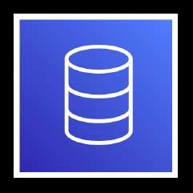
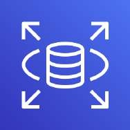
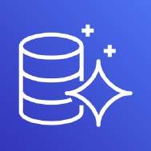
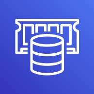
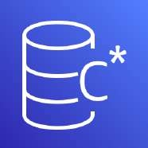
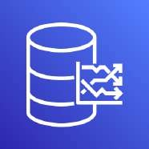
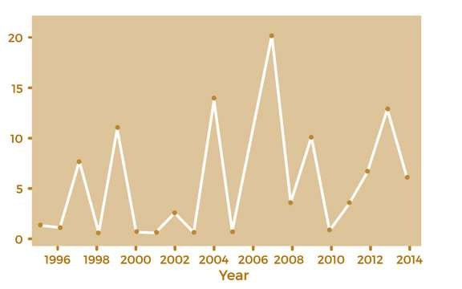
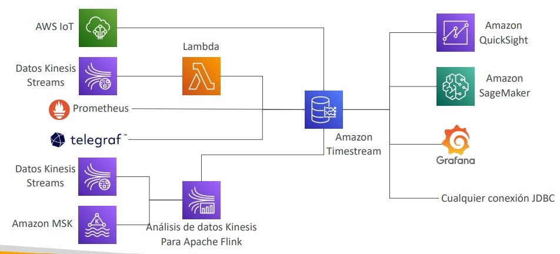

# Bases de Datos en AWS: Selección, Arquitectura y Servicios Administrados

Una de las competencias nodales evaluadas en el examen **AWS Certified Solutions Architect - Associate (SAA-C03)** es la capacidad de seleccionar la base de datos adecuada con base en las características del modelo de datos, patrones de acceso (*access patterns*), requerimientos de latencia, rendimiento transaccional (*throughput*), durabilidad y costo.

En AWS rige el principio del **diseño políglota de persistencia** (*Purpose-Built Databases*): en lugar de forzar un único motor relacional para todos los casos de uso, se implementa el motor especializado idóneo para cada carga de trabajo.

---

## 1. Criterios de Selección de Bases de Datos

Al evaluar preguntas de diseño de arquitectura para el examen, se deben ponderar las siguientes dimensiones críticas:

1. **Patrón de Operaciones:** ¿Lecturas masivas (*read-heavy*), escrituras intensivas (*write-heavy*) o equilibrado? ¿Cargas continuas o con fluctuaciones extremas e impredecibles?
2. **Modelo de Datos y Consultas:** ¿Estructurado (tablas con relaciones/JOINs), semiestructurado (documentos JSON), clave-valor, grafos con interconexiones densas o series temporales ordenadas cronológicamente?
3. **Requerimientos de Latencia:** ¿Submilisegundo (en memoria), milisegundo de un solo dígito o segundos tolerables para analítica por lotes (*batch*)?
4. **Escalabilidad y Operación:** ¿Aprovisionamiento tradicional de instancias (administración de cómputo y almacenamiento EBS) o escalado elástico Serverless bajo demanda?
5. **Costo y Licenciamiento:** ¿Eliminación de licencias comerciales (migración de Oracle/SQL Server a motores nativos cloud como Aurora) o pago estricto por petición/almacenamiento?

---

## 2. Motores Relacionales (RDBMS / OLTP)

### 2.1 Amazon RDS (Relational Database Service)
Servicio administrado para motores relacionales estándar: PostgreSQL, MySQL, MariaDB, Oracle y Microsoft SQL Server.

- **Arquitectura:** Requiere aprovisionar tipo y tamaño de instancia EC2 y almacenamiento Amazon EBS (gp2/gp3, io1/io2). Cuenta con autoescalado de almacenamiento (*Storage Auto Scaling*).
- **Alta Disponibilidad:** Despliegue **Multi-AZ** con replicación física síncrona a nivel de almacenamiento hacia una instancia en espera (*standby* pasiva). La conmutación por error (*failover*) es automática mediante cambio de CNAME DNS (60-120 segundos).
- **Escalabilidad de Lectura:** Soporte para hasta 15 **Read Replicas** con replicación asíncrona dentro de la misma región o entre regiones (*Cross-Region*).
- **Copias de Seguridad:** Backups automatizados continuos con retención configurable de 1 a 35 días, soportando Point-in-Time Recovery (PITR) con granularidad de segundos. Snapshots manuales que persisten independientemente de la instancia.
- **RDS Custom:** Opción especializada para Oracle y Microsoft SQL Server que brinda acceso privilegiado al sistema operativo subyacente (SSH / RDP) y personalización del motor para software empresarial empaquetado.

---

### 2.2 Amazon Aurora
Motor relacional nativo de la nube de AWS, compatible a nivel de API y binarios con PostgreSQL y MySQL. Ofrece hasta 5 veces el rendimiento de MySQL estándar y hasta 3 veces el de PostgreSQL.

- **Almacenamiento Desacoplado y Distribuido:** El motor separa la capa de cómputo de la capa de almacenamiento. El almacenamiento es compartido, elástico (crece automáticamente hasta 128 TB en incrementos de 10 GB), autoreparable (*self-healing*) y replica 6 copias de los datos a través de 3 Zonas de Disponibilidad (resiste la pérdida de 2 copias sin afectar escrituras y de 3 copias sin afectar lecturas).
- **Endpoints de Clúster:** 
  - *Cluster Endpoint* (escritor principal).
  - *Reader Endpoint* (balancea la carga automáticamente entre todas las réplicas de lectura).
  - *Custom Endpoints* (agrupa subconjuntos específicos de réplicas para cargas analíticas o reportes).
- **Aurora Serverless (v2):** Escala automáticamente la capacidad de cómputo en Aurora Capacity Units (ACUs) en fracciones de segundo para responder a cargas volátiles o intermitentes.
- **Aurora Global Databases:** Replicación de almacenamiento física entre regiones con latencia típicamente inferior a 1 segundo y RPO cercano a 0; permite recuperación ante desastres (*DR*) con conmutación en menos de 1 minuto y hasta 16 réplicas por región secundaria.
- **Aurora Database Cloning:** Crea nuevos clústeres a partir de un clúster existente mediante punteros *copy-on-write*, siendo instantáneo y sin costo adicional de almacenamiento hasta que se modifican datos.

---

## 3. Motores NoSQL, Clave-Valor y En Memoria

### 3.1 Amazon DynamoDB
Base de datos NoSQL propietaria de AWS, 100% Serverless, diseñada para ofrecer latencia constante de un solo dígito de milisegundos a cualquier escala.

- **Modelo de Datos:** Almacén de documentos (formato JSON) y pares clave-valor. Tamaño máximo de ítem: 400 KB.
- **Modos de Capacidad:**
  - *Provisioned Mode:* Capacidad fija de lecturas (RCU) y escrituras (WCU) con opción de Auto Scaling.
  - *On-Demand Mode:* Pago estricto por petición; escala instantáneamente ante picos de tráfico impredecibles sin planificación previa.
- **Alta Disponibilidad y Resiliencia:** Réplica automática de datos en 3 AZs. Integración con **DynamoDB Global Tables** (replicación activa-activa totalmente administrada entre múltiples regiones con resolución de conflictos basada en *last writer wins*).
- **Procesamiento de Eventos:** **DynamoDB Streams** captura un registro cronológico estricto de inserciones, actualizaciones y eliminaciones a nivel de ítem por hasta 24 horas, integrándose directamente con AWS Lambda para arquitecturas reactivas.
- **Caché con DAX:** **DynamoDB Accelerator (DAX)** es una caché en memoria administrada que reduce la latencia de lectura de milisegundos a microsegundos sin modificar la lógica del código de la aplicación.
- **Respaldo y Exportación:** Point-in-Time Recovery (PITR) hasta 35 días. Exportación nativa hacia Amazon S3 en formato JSON/Parquet sin consumir RCUs.

---

### 3.2 Amazon ElastiCache
Servicio administrado de almacenamiento en memoria (*in-memory*) que ofrece latencia de submilisegundos para lecturas intensivas.

- **Motores:**
  - *Redis OSS / Valkey:* Estructuras de datos ricas (hashes, listas, sets, sorted sets), soporte de clústeres (*sharding*), alta disponibilidad con Multi-AZ y failover automático, persistencia en disco (AOF/RDB) y replicación.
  - *Memcached:* Almacén puro de clave-valor multihilo, sin persistencia ni soporte nativo de replicación o failover; ideal para caché simple de fragmentos de HTML u objetos serializados.
- **Casos de Uso Típicos:** Almacenamiento de sesiones web distribuidas, tablas de clasificación (*leaderboards*), mitigación de cuellos de botella en bases de datos relacionales (*caching layer*).

---

### 3.3 Amazon DocumentDB (con compatibilidad con MongoDB)
Base de datos de documentos JSON no relacional, totalmente administrada, que implementa el mismo desacoplamiento de arquitectura que Amazon Aurora:
- Capa de almacenamiento distribuido replicado en 6 copias a través de 3 AZs.
- Autoescalado de almacenamiento en incrementos de 10 GB hasta 128 TB.
- Compatible con las herramientas y controladores cliente nativos de MongoDB.
- Soporta millones de solicitudes de lectura por segundo con hasta 15 réplicas de lectura.

---

### 3.4 Amazon Keyspaces (para Apache Cassandra)
Servicio de base de datos administrado y Serverless compatible con la API y el lenguaje de consulta CQL de Apache Cassandra:
- Elimina la necesidad de instalar, parchear, rebalancear nodos y administrar clústeres Cassandra en instancias EC2.
- Tablas replicadas automáticamente 3 veces a través de múltiples AZs.
- Capacidad provisionada o bajo demanda; soporte para PITR de hasta 35 días y cifrado por defecto.
- Ideal para cargas de trabajo IoT, telemetría y perfiles de dispositivos que ya utilicen CQL.

---

## 4. Motores Especializados: Grafos, Series Temporales y Objetos

### 4.1 Amazon Neptune (Base de Datos de Grafos)
Motor de base de datos de grafos altamente disponible y administrado, optimizado para almacenar y navegar relaciones complejas e interconectadas.

- **Casos de Uso Ideales:** Redes sociales (amigos, seguidores, interacciones), motores de recomendación en tiempo real, detección de fraude financiero y grafos de conocimiento.
- **Alta Disponibilidad:** Almacenamiento compartido replicado en 3 AZs con soporte para hasta 15 réplicas de lectura.
- **Compatibilidad:** Soporta marcos de grafos populares como Apache TinkerPop Gremlin y RDF / SPARQL de W3C.
- **Neptune Streams:** Secuencia ordenada en tiempo real de cada mutación en los datos del grafo. Expone una API REST HTTP para sincronizar cambios hacia otros almacenes de datos como OpenSearch, S3 o ElastiCache.

---

### 4.2 Amazon Timestream (Base de Datos de Series Temporales)
Motor Serverless diseñado específicamente para ingerir y procesar datos indexados por marcas de tiempo (*timestamps*) a escala masiva.

- **Rendimiento y Costos:** Ingiere billones de eventos al día; ofrece consultas hasta 1,000 veces más rápidas y a 1/10 del costo de una base de datos relacional para series temporales.
- **Ciclo de Vida Automático por Niveles (*Storage Tiering*):**
  - *Memory Store:* Retiene datos recientes para escrituras y consultas de ultra baja latencia.
  - *Magnetic Store:* Mueve automáticamente datos históricos hacia almacenamiento de costo optimizado con políticas de retención personalizadas.
- **Análisis y Consultas:** Compatibilidad con sintaxis SQL extendida para análisis de series temporales (interpolaciones, aproximaciones, funciones de ventana).
- **Integraciones:** Ingesta nativa desde AWS IoT Core, Amazon Kinesis Data Streams, Apache Flink y visualización con Amazon QuickSight y Grafana.

---

### 4.3 Amazon S3 como Almacén de Objetos Clave-Valor
Aunque es un servicio de almacenamiento de objetos, para el diseño de arquitecturas actúa como un almacén de clave-valor distribuido para objetos no estructurados de gran tamaño (hasta 5 TB):
- Excelente para archivos estáticos, data lakes, backups y contenido multimedia.
- Antipatrón si se intenta usar como base de datos transaccional con actualizaciones frecuentes de pequeños registros (para documentos JSON pequeños < 400 KB, la solución es DynamoDB).

---

## 5. Tabla Comparativa de Motores de Bases de Datos en AWS

| Servicio | Tipo de Datos | Lenguaje / API | Latencia Típica | Mecanismo de Escalado | Casos de Uso SAA-C03 |
| :--- | :--- | :--- | :--- | :--- | :--- |
| **Amazon RDS** | Relacional (OLTP) | SQL (MySQL, Postgres, Oracle, MSSQL) | Milisegundos | Vertical (tamaño instancia) + Read Replicas | Cargas relacionales tradicionales, transacciones ACID estrictas y JOINs complejos. |
| **Amazon Aurora** | Relacional (OLTP) | SQL (MySQL / Postgres) | Milisegundos | Desacoplado: Cómputo (Serverless/Replicas) + Storage (hasta 128 TB auto) | Rendimiento enterprise, tolerancia a fallos multi-AZ por defecto, BD global activa-pasiva rápida. |
| **Amazon DynamoDB** | NoSQL (Clave-Valor / Doc) | JSON / SDK API | Milisegundos (micro con DAX) | Serverless (Provisioned con autoescalado o bajo demanda) | Apps móviles, IoT, catálogos e-commerce, sesiones, escala masiva horizontal sin administración. |
| **Amazon ElastiCache** | En Memoria | Redis / Memcached API | Submilisegundos | Vertical + Sharding / Replicas (Redis) | Caché de consultas SQL, tablas de líderes, almacén de sesiones volátiles de ultra baja latencia. |
| **Amazon DocumentDB** | NoSQL (Documental) | MongoDB API | Milisegundos | Cómputo independiente + almacenamiento elástico hasta 128 TB | Migración de MongoDB a AWS totalmente administrado con alta disponibilidad. |
| **Amazon Neptune** | Grafos | Gremlin, SPARQL, openCypher | Milisegundos | Cómputo + Almacenamiento distribuido (hasta 15 réplicas) | Redes sociales, detección de fraude en transacciones, grafos de conocimiento e identidad. |
| **Amazon Keyspaces** | NoSQL (Columnas anchas) | CQL (Apache Cassandra) | Milisegundos | Serverless bajo demanda o provisionado | Migración de Cassandra a la nube sin gestionar servidores ni topologías de clúster. |
| **Amazon Timestream** | Series Temporales | SQL | Milisegundos | Serverless automático por capas (Memoria + Magnético) | Métricas de telemetría IoT, logs de infraestructura, monitoreo industrial en tiempo real. |

---

## 6. Escenarios de Decisión y Consejos de Examen

> **💡 SAA-C03 Exam Tip:**
> 1. **Detección de Fraude / Redes de Contactos:** Cuando la pregunta mencione *"relaciones complejas entre entidades"*, *"patrones de fraude interconectados"* o *"redes sociales"*, la respuesta inequívoca es **Amazon Neptune**.
> 2. **Sensores IoT con marcas de tiempo masivas:** Si el enunciado pide almacenar métricas de sensores con *timestamps*, retención por niveles de costo y análisis de tendencias temporales, descarta RDS/DynamoDB e inclínate por **Amazon Timestream**.
> 3. **Migración de software empaquetado heredado que requiere acceso a SO:** Si la aplicación comercial exige acceso administrativo a nivel de SO (RDP/SSH) o parches específicos del motor Oracle/SQL Server, la opción correcta es **RDS Custom** (no RDS estándar ni EC2 manual si se busca un servicio administrado).
> 4. **Milisegundos vs Microsegundos en DynamoDB:** Si un sistema que usa DynamoDB experimenta picos de lectura y necesita latencia de microsegundos sin reescribir consultas en la aplicación, el servicio a agregar es **DAX (DynamoDB Accelerator)**.
