# Datos y Análisis en AWS (Data & Analytics)

El diseño de soluciones de Big Data, almacenamiento analítico y procesamiento de flujos de datos en tiempo real representa un pilar crítico en el examen **AWS Certified Solutions Architect - Associate (SAA-C03)**. Un arquitecto de soluciones debe ser capaz de seleccionar las herramientas analíticas correctas ponderando el volumen, la velocidad, el esquema de datos, el costo de cómputo por consulta y los tiempos de latencia (tiempo real vs casi en tiempo real vs por lotes).

---

## 1. Amazon Athena: Consultas SQL Serverless sobre Data Lakes

**Amazon Athena** es un servicio de consultas interactivo y sin servidor (*Serverless*) basado en Presto/Trino que permite analizar datos directamente en **Amazon S3** utilizando lenguaje SQL estándar ANSI.

### 1.1 Características y Modelo de Precios
- **Sin Infraestructura:** Cero aprovisionamiento de clústeres, administración de sistemas operativos ni tiempos de configuración.
- **Formatos Soportados:** Datos estructurados y semiestructurados en CSV, JSON, Apache Parquet, Apache ORC y Apache Avro.
- **Modelo de Precios:** Se factura estrictamente por el volumen de datos escaneados (típicamente **$5.00 USD por TB escaneado**).
- **Integración con BI:** Se conecta de forma nativa con **Amazon QuickSight** para generación de paneles e informes.

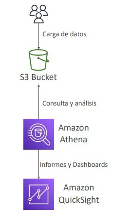

---

### 1.2 Estrategias de Optimización de Costos y Rendimiento en Athena
Debido a que el costo está directamente vinculado a los bytes leídos desde S3, las siguientes técnicas son esenciales:

1. **Uso de Formatos Columnares (Apache Parquet u ORC):** 
   - A diferencia de los formatos basados en filas (CSV, JSON), el almacenamiento en columnas permite que Athena lea únicamente las columnas solicitadas en la cláusula `SELECT`, reduciendo drásticamente el volumen escaneado (a menudo entre un 70% y un 90%).
   - Para transformar datos a Parquet u ORC se emplea **AWS Glue ETL**.
2. **Compresión de Datos:** Emplear algoritmos como Snappy, Gzip, ZSTD o LZ4. Menor tamaño en disco equivale a menor cantidad de datos escaneados y transferidos.
3. **Particionamiento de Datos en S3:**
   - Estructurar las rutas de S3 siguiendo una convención de particionado (ej. estilo Hive):  
     `s3://mi-bucket/logs/year=2026/month=03/day=15/`
   - Las consultas con cláusulas `WHERE` filtran directorios enteros sin necesidad de escanear el resto del bucket (*partition pruning*).
4. **Tamaño Óptimo de Archivos:** Evitar millones de archivos diminutos (pocos KB). Se recomiendan archivos consolidados superiores a **128 MB** para reducir la sobrecarga de metadatos de S3.

---

### 1.3 Consultas Federadas con Athena (Federated Query)
Permite ejecutar consultas SQL unificadas a través de múltiples fuentes de datos híbridas y multicloud sin necesidad de mover los datos previamente hacia S3:
- Utiliza **Athena Data Source Connectors** ejecutados sobre funciones **AWS Lambda**.
- Permite consultar fuentes relacionales (Amazon RDS, Aurora), NoSQL (DynamoDB, DocumentDB), cachés (ElastiCache) y bases de datos locales on-premises en una sola sentencia SQL combinada.
- Los resultados de la consulta federada se exportan y almacenan en Amazon S3.

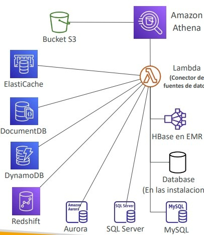

---

## 2. Amazon Redshift: Data Warehouse Empresarial (OLAP)

**Amazon Redshift** es un almacén de datos (*Data Warehouse*) relacional a escala de petabytes totalmente administrado, optimizado para procesamiento analítico en línea (**OLAP**) e inteligencia empresarial (BI).

### 2.1 Arquitectura del Clúster Redshift
- **Nodo Líder (*Leader Node*):** Recibe las conexiones de clientes SQL vía JDBC/ODBC, analiza, compila y planifica la ejecución paralela de las consultas, y agrega los resultados finales.
- **Nodos de Cálculo (*Compute Nodes*):** Ejecutan los planes compilados en paralelo (MPP - *Massively Parallel Processing*) sobre almacenamiento en columnas particionado por slices.
- **Tipos de Almacenamiento:** Instancias modernas de la familia `RA3` que desacoplan el cómputo del almacenamiento utilizando *Redshift Managed Storage (RMS)* respaldado por Amazon S3.

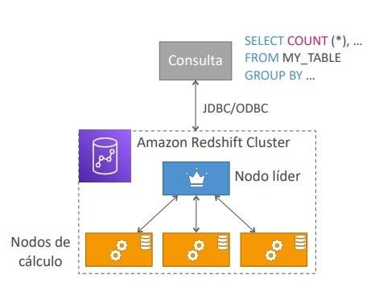

---

### 2.2 Respaldo, Recuperación y Alta Disponibilidad
- **Arquitectura de Zona:** Históricamente un clúster Redshift se aprovisiona en una única Zona de Disponibilidad (aunque hoy existe soporte para implementaciones Multi-AZ, el examen clásico enfatiza el modelo de snapshots).
- **Snapshots Automatizados y Manuales:** Snapshots incrementales almacenados internamente en S3 (retención de 1 a 35 días).
- **Replicación entre Regiones (Cross-Region Snapshot Copy):** Se puede configurar la copia automática de snapshots hacia otra región para planes de Disaster Recovery (DR).

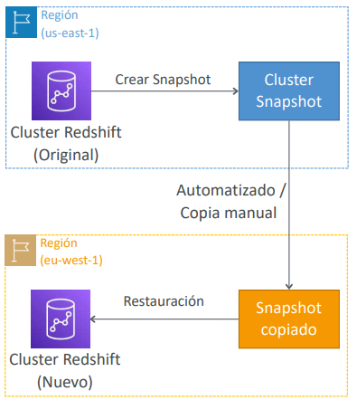

---

### 2.3 Patrones de Carga: El Comando COPY vs Inserciones SQL
- **Antipatrón:** Ejecutar sentencias individuales `INSERT INTO`. Provoca una degradación crítica del rendimiento debido a la sobrecarga transaccional de bloqueos en tablas columnares.
- **Mejor Práctica (Comando COPY):** Cargar datos masivos en paralelo desde Amazon S3, EMR o DynamoDB usando el comando `COPY`.
- **Enhanced VPC Routing:** Obliga a que todo el tráfico de red generado por el comando `COPY` o `UNLOAD` viaje exclusivamente a través de la VPC corporativa y sus VPC Endpoints, evitando circular por la Internet pública.

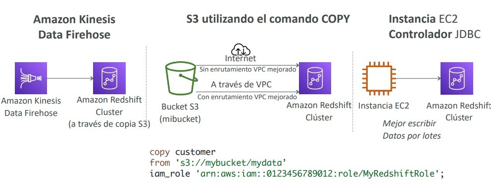

---

### 2.4 Redshift Spectrum: Consultas Directas sobre el Data Lake S3
Permite consultar conjuntos de datos masivos en S3 directamente desde un clúster Redshift sin necesidad de cargarlos en el almacenamiento interno del clúster:
- Requiere un clúster Redshift activo para orquestar la consulta.
- La ejecución se distribuye entre miles de nodos efímeros de Redshift Spectrum gestionados por AWS.
- Permite hacer JOINs en tiempo real entre tablas locales de alto rendimiento en Redshift y tablas masivas históricas almacenadas en S3.

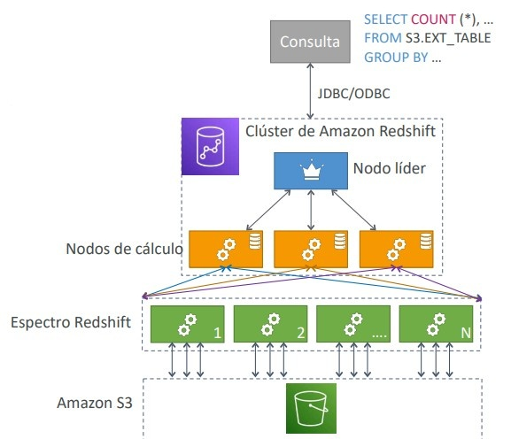

---

## 3. Comparativa: Amazon Athena vs Amazon Redshift

| Característica | Amazon Athena | Amazon Redshift |
| :--- | :--- | :--- |
| **Modelo Operativo** | 100% Serverless, sin clústeres que gestionar. | Clúster aprovisionado (instancias fijas o Serverless). |
| **Modelo de Cobro** | $5 por TB escaneado en S3. | Por hora de nodo aprovisionado o capacidad RPU. |
| **Tipo de Cargas** | Consultas ad-hoc, análisis de logs, reportes esporádicos. | Data Warehouse empresarial continuo, dashboards concurrentes de BI. |
| **Rendimiento Complejo** | Depende del particionado y formato en S3. | Ultra rápido gracias a MPP, claves de distribución y ordenación (*Sort/Dist Keys*). |
| **Almacenamiento Base** | Amazon S3 nativo. | Redshift Managed Storage (RMS) / EBS interno. |

---

## 4. Amazon OpenSearch Service: Búsqueda y Análisis de Logs

**Amazon OpenSearch Service** (sucesor de Amazon Elasticsearch Service) es un motor administrado de indexación, búsqueda de texto completo y análisis distribuido.

- **Capacidades de Búsqueda:** Búsqueda libre, coincidencias parciales (*fuzzy search*), agregaciones y autocompletado sobre documentos JSON.
- **OpenSearch Dashboards:** Interfaz visual para análisis exploratorio y monitoreo (sucesor de Kibana).
- **Patrones de Ingesta:**
  - *CloudWatch Logs a OpenSearch:* Vía Subscription Filters (con función Lambda intermedia en tiempo real o Kinesis Firehose en casi tiempo real).
  - *DynamoDB a OpenSearch:* Captura de mutaciones mediante **DynamoDB Streams + Lambda** para indexar registros y permitir búsqueda por cualquier campo no clave.
  - *Streaming en Vivo:* Ingesta continua desde Kinesis Data Streams o Managed Streaming for Apache Kafka (MSK).

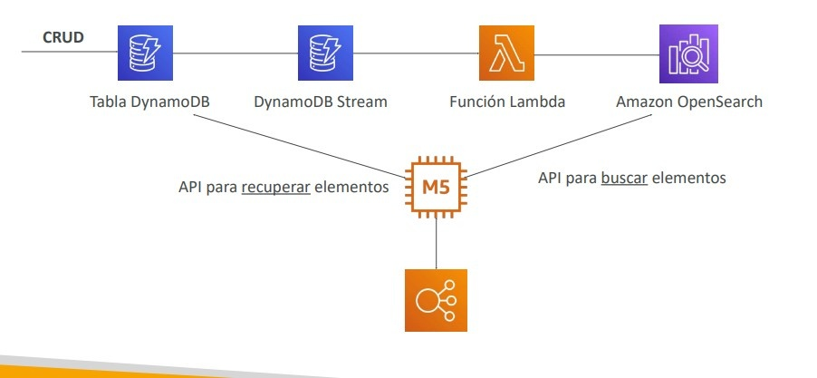

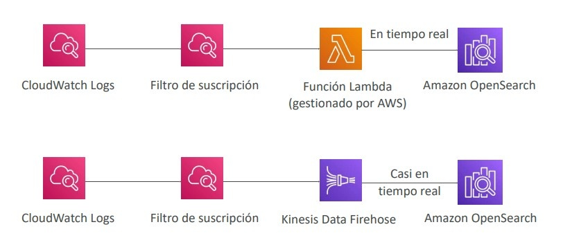

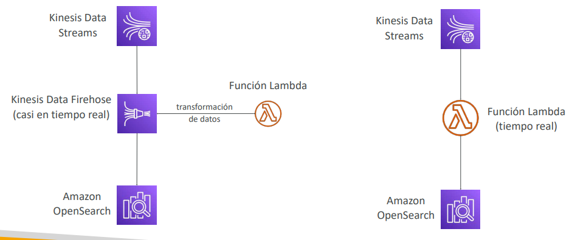

---

## 5. Amazon EMR (Elastic MapReduce): Procesamiento Big Data Distribuido

**Amazon EMR** simplifica la ejecución de marcos de procesamiento distribuido como **Apache Spark, Apache Hadoop, Presto, HBase y Apache Flink** a escala masiva.

### 5.1 Topología de Nodos en un Clúster EMR
1. **Master Node (Nodo Maestro):** Coordina los recursos del clúster, planifica las tareas y supervisa el estado general del clúster (instancia On-Demand o Reserved de larga duración).
2. **Core Node (Nodo Central):** Ejecuta tareas de cómputo y aloja datos en el sistema de archivos distribuido HDFS (*Hadoop Distributed File System*). Debe ser de larga duración (On-Demand) para prevenir pérdida de datos en HDFS.
3. **Task Node (Nodo de Tareas - Opcional):** Exclusivamente ejecuta tareas de cómputo; no almacena datos de HDFS. **Caso ideal para Instancias Spot**, ya que si una instancia Spot es terminada por AWS, las tareas simplemente se replanifican en otro nodo sin riesgo de corrupción de datos.

---

## 6. Amazon QuickSight: Business Intelligence Serverless

Servicio de BI escalable y basado en la nube con integración nativa de Machine Learning:
- **Motor SPICE:** *Super-fast, Parallel, In-memory Calculation Engine*. Memoria RAM de alto rendimiento para acelerar consultas analíticas sobre datos importados sin estresar la base de datos de origen.
- **Seguridad y Control de Acceso:** 
  - Gestión de usuarios y grupos interna en QuickSight (independiente de IAM).
  - La **Edición Enterprise** ofrece *Column-Level Security (CLS)* y *Row-Level Security (RLS)* para restringir visibilidad de datos sensibles según el perfil del usuario.
- **Dashboards:** Instantáneas interactivas de solo lectura que se publican y comparten con usuarios y grupos.

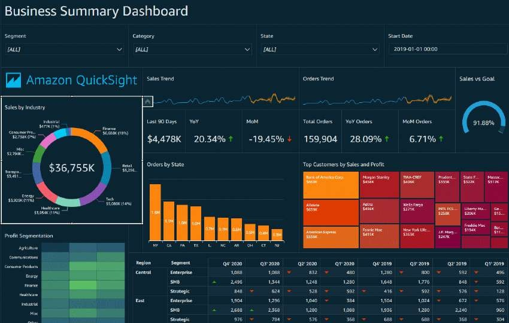

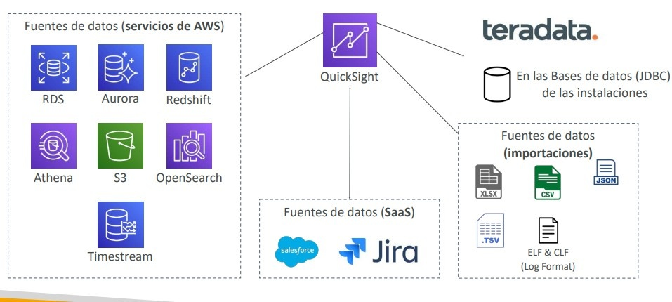

---

## 7. Gobernanza y ETL: AWS Glue y AWS Lake Formation

### 7.1 AWS Glue (ETL Serverless y Data Catalog)
Servicio administrado de extracción, transformación y carga (ETL) basado en Apache Spark:
- **Data Catalog:** Repositorio central de metadatos (definiciones de esquemas y tablas) para datos dispersos en S3, RDS, DynamoDB y fuentes JDBC.
- **Glue Crawlers:** Escanean repositorios de datos periódicamente, detectan esquemas automáticamente y pueblan o actualizan el Glue Data Catalog.
- **Glue Studio:** Interfaz gráfica para diseñar y orquestar flujos de trabajo ETL visualmente.
- **Job Bookmarks:** Mecanismo de persistencia de estado para evitar reprocesar datos históricos en ejecuciones sucesivas del trabajo ETL.

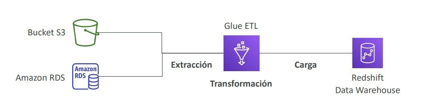

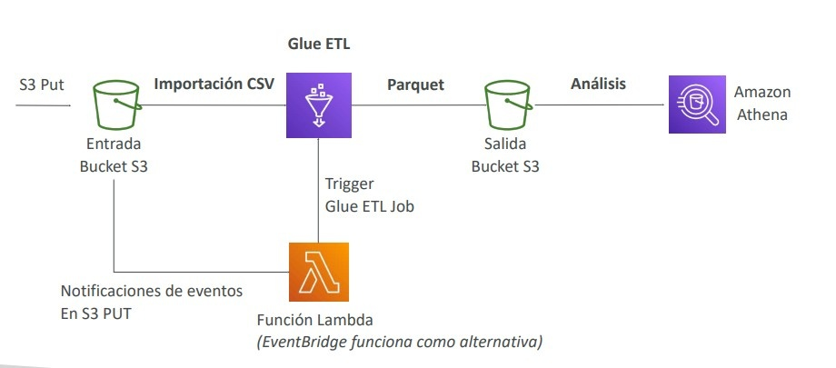

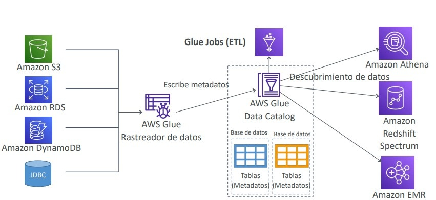

---

### 7.2 AWS Lake Formation
Construido sobre AWS Glue, permite orquestar, asegurar y gobernar un **Data Lake** centralizado en Amazon S3 en cuestión de días:
- Simplifica la recolección, limpieza y deduplicación de datos mediante algoritmos de Machine Learning (*FindMatches*).
- **Seguridad Granular Centralizada:** Define políticas de seguridad unificadas con control de acceso a nivel de fila y columna (*Row and Column-Level Security*) aplicadas automáticamente sobre herramientas como Athena, Redshift Spectrum y EMR.

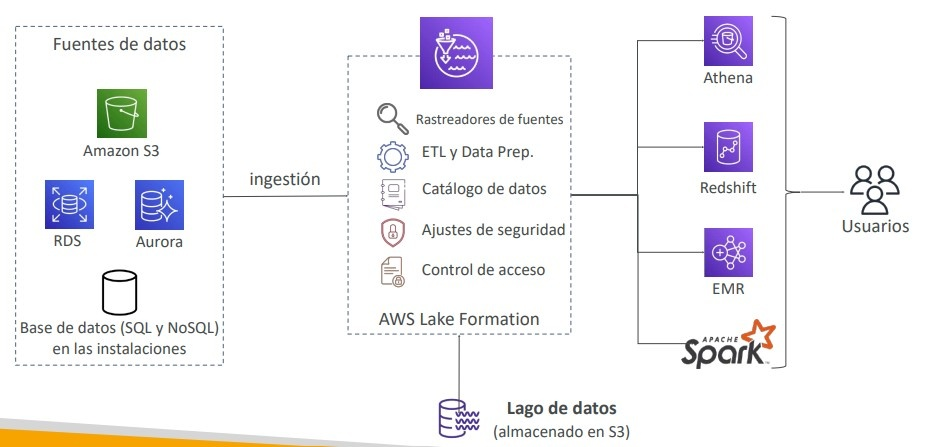

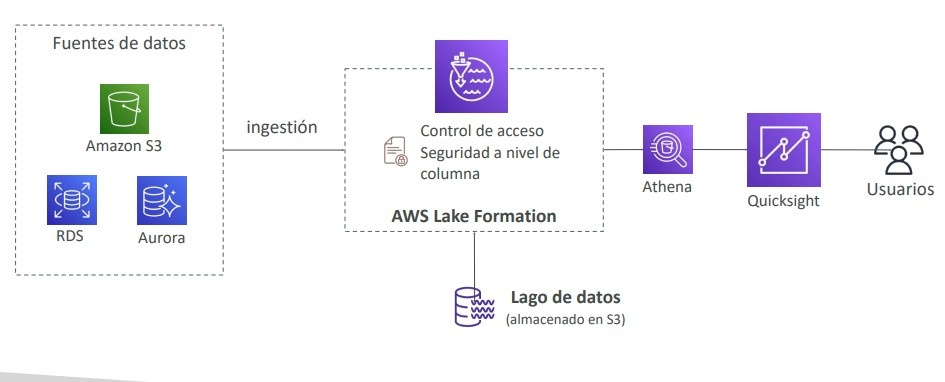

---

## 8. Procesamiento de Flujos: Amazon MSK y Managed Service for Apache Flink

### 8.1 Amazon MSK (Managed Streaming for Apache Kafka)
Servicio administrado que simplifica el despliegue y mantenimiento de clústeres Apache Kafka:
- Administra nodos broker y Zookeeper (o modo KRaft) en múltiples Zonas de Disponibilidad.
- Almacenamiento persistente en volúmenes Amazon EBS.
- **Amazon MSK Serverless:** Permite ejecutar Kafka ajustando dinámicamente el rendimiento y cómputo sin aprovisionar brokers individuales.

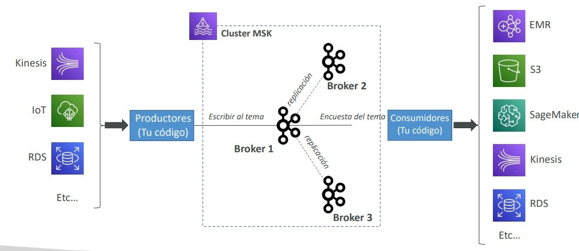

---

### 8.2 Comparativa: Kinesis Data Streams vs Amazon MSK

| Criterio | Amazon Kinesis Data Streams | Amazon MSK (Apache Kafka) |
| :--- | :--- | :--- |
| **Tamaño Máximo de Mensaje** | 1 MB por registro. | 1 MB por defecto (configurable a 10 MB o más). |
| **Unidad de Escalabilidad** | Shards (división y fusión) o Modo On-Demand. | Particiones por Topic y brokers aprovisionados / Serverless. |
| **Gestión de Infraestructura** | 100% nativo de AWS, serverless. | Clúster administrado dentro de VPC (o MSK Serverless). |
| **Compatibilidad Open Source** | Exclusivo de AWS (KCL / AWS SDK). | Estándar de la industria (ecosistema Kafka, conectores Kafka Connect). |
| **Cifrado en Tránsito** | TLS obligatorio por defecto. | TLS o PLAINTEXT configurable. |

---

### 8.3 Amazon Managed Service for Apache Flink
Anteriormente conocido como *Kinesis Data Analytics for Apache Flink*. Permite ejecutar aplicaciones complejas escritas en Java, Scala o SQL sobre flujos continuos en tiempo real:
- Consume datos desde **Amazon Kinesis Data Streams** y **Amazon MSK**.
- **Regla Crítica de Examen:** Apache Flink **NO puede leer directamente desde Amazon Kinesis Data Firehose** (Firehose es exclusivamente un destino de entrega o cargador).

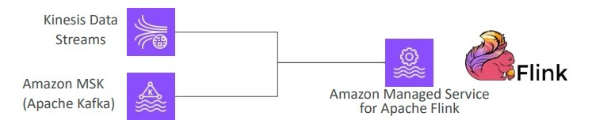

---

## 9. Arquitectura de Referencia: Pipeline de Ingestión y Análisis de Big Data Serverless

Una arquitectura común evalúa el ciclo de vida completo del dato desde la ingesta IoT hasta el dashboard de visualización:

1. **Ingesta:** Los dispositivos envían telemetría continua hacia **AWS IoT Core** o directamente a **Amazon Kinesis Data Streams**.
2. **Buffer y Entrega:** **Amazon Kinesis Data Firehose** consume desde Kinesis Streams y entrega los datos por lotes en un bucket de **Amazon S3** cada 60 segundos o al acumular un búfer de tamaño definido. En vuelo, una función **AWS Lambda** transforma y limpia el payload.
3. **Notificación y Procesamiento:** La llegada de nuevos objetos en S3 activa un evento hacia **Amazon SQS**, el cual desencadena una función Lambda para orquestar o registrar el lote.
4. **Análisis SQL:** **Amazon Athena** consulta los datos en S3 utilizando particionado y formato Parquet generado por Glue.
5. **Reportes y Visualización:** **Amazon QuickSight** consume las consultas de Athena aceleradas por SPICE, o bien los datos consolidados se cargan en **Amazon Redshift** para BI institucional.

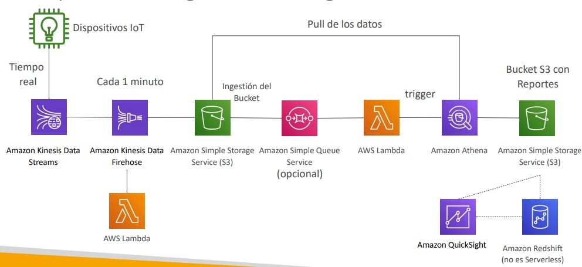

---

## 10. Consejos de Examen y Trampas Clásicas

> **💡 SAA-C03 Exam Tip:**
> 1. **Consultas SQL Ad-Hoc en S3 al Menor Costo:** Cuando el enunciado pida realizar análisis ocasionales o de auditoría con lenguaje SQL sobre archivos en S3 (ej. VPC Flow Logs, CloudTrail) sin aprovisionar infraestructura, la respuesta es siempre **Amazon Athena** con compresión y formato **Parquet**.
> 2. **Instancias Spot en Clústeres EMR:** Si una pregunta exige optimizar el costo de un clúster EMR sin arriesgar la persistencia de datos de HDFS, la recomendación técnica es usar **instancias On-Demand para Master Nodes y Core Nodes**, y reservar las **instancias Spot exclusivamente para Task Nodes**.
> 3. **Redshift Carga Lenta / Alto Costo:** Cargar datos en Redshift mediante comandos `INSERT` individuales es un antipatrón recurrente. La solución correcta para cargas masivas de alto rendimiento es el comando **`COPY` desde Amazon S3**.
> 4. **Gobernanza a Nivel de Columna:** Si el requerimiento exige aplicar permisos centralizados para que ciertos analistas no puedan ver columnas con datos de identificación personal (PII) al consultar con Athena o Redshift, la solución es **AWS Lake Formation** (o QuickSight Enterprise CLS si la visualización es directa).
