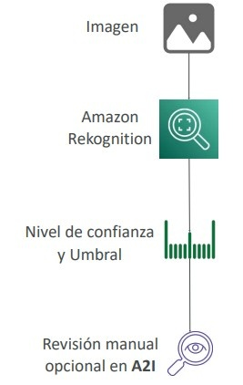
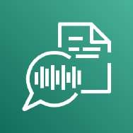
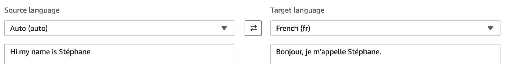
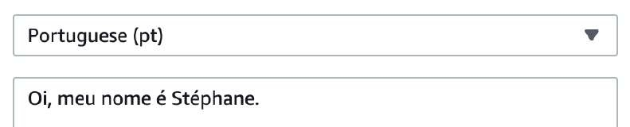
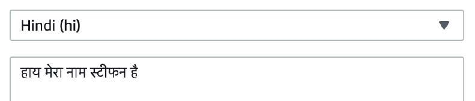
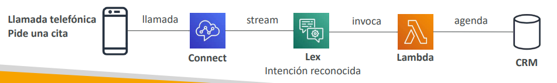
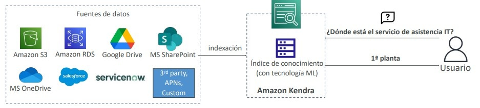
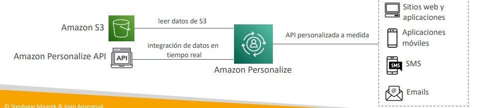
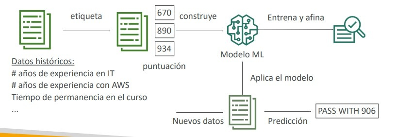

# Servicios de Machine Learning e Inteligencia Artificial en AWS

En el examen **AWS Certified Solutions Architect - Associate (SAA-C03)**, las preguntas sobre Machine Learning (ML) e Inteligencia Artificial (IA) no evalúan algoritmos matemáticos ni afinamiento de hiperparámetros profundos; evalúan la capacidad de seleccionar el **servicio de IA totalmente administrado (*turnkey AI service*)** adecuado para resolver un problema de negocio concreto sin necesidad de entrenar modelos desde cero, o bien identificar **Amazon SageMaker** cuando se requiere desarrollo y entrenamiento a medida.

---

## 1. Visión por Computadora y Análisis Multimedia

### 1.1 Amazon Rekognition
Servicio de visión artificial basado en Deep Learning para análisis de imágenes y vídeos almacenados en Amazon S3 o transmitidos en vivo mediante Kinesis Video Streams.

- **Funcionalidades Clave:**
  - **Detección de Objetos y Escenas:** Etiquetado automático de componentes en imágenes (*labels*).
  - **Análisis y Búsqueda Facial:** Detección de rostros, estimación de atributos (rango de edad, ojos abiertos, emociones) y comparación contra colecciones de rostros conocidos para verificación de identidad.
  - **Reconocimiento de Celebridades:** Identificación de figuras públicas para medios y catálogos.
  - **Detección de Texto (*Text in Image*):** Extrae texto incrustado en imágenes (señales viales, placas de matrícula).
  - **Seguimiento de Trayectorias (*Pathing*):** Rastreo de rutas de personas en eventos deportivos o tiendas comerciales.

---

### 1.2 Moderación de Contenido y Flujo con Amazon A2I
Rekognition detecta de manera automatizada contenido explícito, sugerente, violento o inapropiado:
- Permite definir un **Umbral Mínimo de Confianza (*Minimum Confidence Threshold*)**.
- Para casos ambiguos o de alta sensibilidad legal, se integra con **Amazon Augmented AI (A2I)**, el cual desvía automáticamente las imágenes dudosas hacia equipos de revisión humana antes de publicar el contenido.

---

## 2. Voz, Audio y Traducción

### 2.1 Amazon Transcribe (Voz a Texto - Speech-to-Text)
Convierte lenguaje hablado en texto escrito utilizando reconocimiento automático del habla (**ASR**):
- **Redacción de PII:** Identifica y oculta o enmascara automáticamente Información de Identificación Personal (números de Seguro Social, tarjetas de crédito, nombres).
- **Identificación Automática de Idioma:** Detecta el idioma predominante en archivos con pistas multilingües.
- **Transcripción de Llamadas:** Transcribe audio de centros de contacto y separa canales de audio por interlocutor (*Speaker Identification* / diarización).

---

### 2.2 Amazon Polly (Texto a Voz - Text-to-Speech)
Convierte cadenas de texto en audio realista utilizando tecnologías neuronales de síntesis de voz:
- **SSML (Speech Synthesis Markup Language):** Permite personalizar el tono, énfasis, pausas, pronunciación fonética, susurros o adoptar el estilo dinámico de presentador de noticias (*Newscaster style*).
- **Léxicos de Pronunciación (*Pronunciation Lexicons*):** Reglas para pronunciar correctamente acrónimos de la industria (ej. "AWS" -> "Amazon Web Services") o nombres corporativos estilizados.

---

### 2.3 Amazon Translate
Servicio de traducción automática neuronal que entrega traducciones de alta calidad, rápidas y fluidas entre decenas de idiomas:
- Ideal para traducir catálogos de e-commerce, sitios web dinámicos y comunicaciones de soporte al cliente en tiempo real.
- Permite terminología personalizada para preservar nombres de marcas y jerga corporativa sin traducir.

---

## 3. Interfaces Conversacionales y Centros de Contacto

### 3.1 Amazon Lex y Amazon Connect
- **Amazon Lex:** Servicio para construir interfaces conversacionales (chatbots) de voz y texto. Utiliza la misma tecnología de comprensión del lenguaje natural (NLU) y reconocimiento de habla (ASR) de Alexa.
  - Reconoce **Intenciones (*Intents*)**, captura variables en **Slots** y desencadena lógica de backend invocando funciones **AWS Lambda**.
- **Amazon Connect:** Centro de contacto virtual (*Contact Center*) en la nube, omnicanal y autoescalable.
  - Reemplaza PBX físicas tradicionales con ahorros de hasta un 80%.
  - Se integra de forma nativa con Amazon Lex para resolver peticiones de clientes de manera automatizada antes de transferir a un agente humano.

---

## 4. Procesamiento de Lenguaje Natural (NLP) y Búsqueda Inteligente

### 4.1 Amazon Comprehend y Comprehend Medical
Servicio Serverless de Procesamiento de Lenguaje Natural (**NLP**) que analiza texto no estructurado:
- **Funcionalidades:** Detección de idioma, extracción de entidades (personas, lugares, marcas), análisis de sentimientos (positivo, negativo, neutral, mixto), y modelado de temas (*Topic Modeling*).
- **Amazon Comprehend Medical:** Modelo especializado en documentación médica (recetas, notas clínicas, historias de salud) que detecta entidades biomédicas y resguarda Información Sanitaria Protegida (**PHI**) para cumplimiento normativo HIPAA a través de la API `DetectPHI`.

---

### 4.2 Amazon Kendra (Búsqueda Empresarial Cognitiva)
Motor de búsqueda corporativo impulsado por Machine Learning que comprende consultas en lenguaje natural:
- A diferencia de OpenSearch (que busca coincidencias léxicas/palabras clave), Kendra indexa el significado semántico y devuelve **respuestas directas a preguntas** (ej. extrae el párrafo exacto con la respuesta).
- **Conectores Nativos:** Se conecta e indexa automáticamente documentos en Amazon S3, SharePoint, Google Drive, Salesforce, RDS y sistemas locales.
- **Aprendizaje Continuo:** Reordena los resultados basándose en la retroalimentación de los clics de los usuarios (*Search Relevance Tuning*).

---

### 4.3 Comparativa: Amazon OpenSearch vs Amazon Kendra

| Criterio | Amazon OpenSearch Service | Amazon Kendra |
| :--- | :--- | :--- |
| **Enfoque Principal** | Indexación y búsqueda de texto completo, logs (ELK) y métricas. | Búsqueda cognitiva empresarial en lenguaje natural sobre documentos. |
| **Tipo de Respuesta** | Listado de documentos y coincidencias parciales de texto. | Respuesta precisa extraída del documento + extracto explicativo. |
| **Infraestructura** | Requiere aprovisionamiento y gestión de clústeres. | Totalmente gestionado / Serverless a nivel de índice de búsqueda. |
| **Conectores** | Ingesta vía Fluentd, Logstash, Kinesis, Lambda. | Conectores integrados listos para S3, SharePoint, Google Drive, etc. |

---

## 5. Extracción de Documentos y Recomendaciones

### 5.1 Amazon Textract
Servicio de reconocimiento óptico de caracteres (**OCR**) inteligente basado en ML que va más allá del simple texto plano:
- Extrae texto manuscrito, datos estructurados en **formularios (pares clave-valor)** y **tablas (filas y columnas)** a partir de PDFs, imágenes escaneadas o fotos.
- Evita el procesamiento manual o el etiquetado de plantillas rígidas para facturas, formularios de impuestos y pasaportes.

---

### 5.2 Amazon Personalize
Motor de personalización y recomendaciones en tiempo real basado en la misma tecnología desarrollada por Amazon.com:
- Ingesta datos históricos de interacciones desde Amazon S3 y eventos en tiempo real vía API.
- Genera recomendaciones a medida de productos, reclasificación de contenidos y campañas de marketing dirigido sin que los desarrolladores deban diseñar modelos de Machine Learning.

---

## 6. Modelado Personalizado: Amazon SageMaker

**Amazon SageMaker** es la plataforma integral y completamente administrada para que científicos de datos y desarrolladores puedan **preparar, construir, entrenar, afinar, evaluar y desplegar modelos propios de Machine Learning** a escala masiva.
- Proporciona entornos de notebooks administrados (Jupyter).
- Distribuye el entrenamiento sobre flotas optimizadas de cómputo y GPUs.
- Gestiona endpoints de inferencia elásticos en tiempo real o procesamiento por lotes (*Batch Transform*).

---

## 7. Matriz de Decisión de Servicios de IA/ML para SAA-C03

| Necesidad de la Carga de Trabajo | Servicio de AWS Recomendado |
| :--- | :--- |
| Detección de rostros, objetos y moderación de contenido en fotos/vídeo | **Amazon Rekognition** |
| Revisión humana para decisiones ambiguas de visión o NLP | **Amazon Augmented AI (A2I)** |
| Transcripción de audio a texto y redacción de PII | **Amazon Transcribe** |
| Generación de audio a partir de texto con voz humana (SSML) | **Amazon Polly** |
| Traducción fluida y multilingüe de documentos o texto en vivo | **Amazon Translate** |
| Construcción de chatbots y bots telefónicos conversacionales | **Amazon Lex** |
| Centro de contacto virtual en la nube | **Amazon Connect** |
| Análisis de sentimientos, detección de idiomas y entidades en texto | **Amazon Comprehend** |
| Extracción de PHI en historiales médicos bajo norma HIPAA | **Amazon Comprehend Medical** |
| Búsqueda semántica en lenguaje natural sobre documentos corporativos | **Amazon Kendra** |
| Extracción de texto estructurado en tablas y formularios escaneados | **Amazon Textract** |
| Recomendaciones personalizadas de productos en tiempo real | **Amazon Personalize** |
| Construcción, entrenamiento y despliegue de modelos ML desde cero | **Amazon SageMaker** |

---

## 8. Escenarios Típicos y Consejos de Examen

> **💡 SAA-C03 Exam Tip:**
> 1. **Textract vs Rekognition:**
>    - Si el enunciado habla de extraer texto de una **fotografía de la calle, una matrícula vehicular o una escena**, el servicio es **Amazon Rekognition**.
>    - Si el enunciado pide extraer **tablas, recibos, formularios o facturas escaneadas en formato PDF**, el servicio indiscutible es **Amazon Textract**.
> 2. **Comprehend vs Kendra:**
>    - Para clasificar comentarios de usuarios por **sentimiento (positivo/negativo)** o extraer temas, usa **Amazon Comprehend**.
>    - Para implementar un **buscador interno donde los empleados hagan preguntas en lenguaje natural** ("¿Cómo solicito vacaciones?") y obtengan la respuesta extraída de un manual en PDF, la respuesta es **Amazon Kendra**.
> 3. **Servicios de IA Preentrenados vs SageMaker:**
>    - Si una pregunta menciona que la empresa **"no cuenta con científicos de datos ni experiencia en Machine Learning"** y necesita una funcionalidad específica (voz, traducción, análisis de sentimientos, visión), **descarta de inmediato Amazon SageMaker** y elige el servicio administrado correspondiente (Polly, Transcribe, Translate, Rekognition, Comprehend).
