# Monitorización, Auditoría y Cumplimiento en AWS: CloudWatch, CloudTrail y AWS Config

Para el examen **AWS Certified Solutions Architect - Associate (SAA-C03)**, dominar la tríada operativa de observabilidad (**CloudWatch**), auditoría de gobernanza (**CloudTrail**) y cumplimiento normativo (**AWS Config**) es indispensable. Una confusión recurrente en las preguntas de opción múltiple radica en no distinguir con precisión qué servicio responde a las preguntas:
- **¿Cómo rinde el sistema?** $\rightarrow$ Amazon CloudWatch (Métricas, Logs, Alarmas).
- **¿Quién hizo qué, cuándo y desde dónde?** $\rightarrow$ AWS CloudTrail (Llamadas a la API y auditoría de identidad).
- **¿Cómo ha cambiado la configuración y cumple las reglas de la empresa?** $\rightarrow$ AWS Config (Evaluación de cumplimiento, historial de configuración y remediación).

---

## 1. Amazon CloudWatch: Métricas, Logs y Observabilidad

### 1.1 Métricas de CloudWatch y CloudWatch Metric Streams
CloudWatch recopila métricas operativas numéricas de prácticamente todos los servicios en AWS:
- **Conceptos Fundamentales:**
  - *Métrica:* Variable supervisada en el tiempo (`CPUUtilization`, `NetworkIn`, `DiskReadOps`).
  - *Namespace:* Contenedor de métricas (ej. `AWS/EC2`, `AWS/S3`).
  - *Dimensión:* Atributo par clave-valor que identifica unívocamente una métrica (ej. `InstanceId`, `AutoScalingGroupName`). Se admiten hasta 30 dimensiones por métrica.
  - *Resolución:* Estándar (intervalo de 1 o 5 minutos) o Alta Resolución (*High-Resolution Custom Metrics* con intervalos de 1, 5, 10 o 30 segundos).
- **CloudWatch Metric Streams:** Permite transmitir métricas continuamente con latencia de submilisegundo hacia destinos como **Amazon Kinesis Data Firehose** (y desde allí a S3, Redshift u OpenSearch) o plataformas SaaS de terceros (Datadog, Dynatrace, New Relic, Splunk).

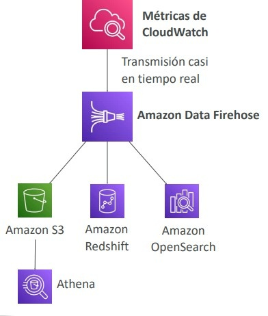

---

### 1.2 CloudWatch Logs y CloudWatch Logs Insights
- **Estructura Jerárquica:**
  - *Log Group:* Contenedor lógico que agrupa flujos de una misma aplicación o servicio (con políticas de retención de 1 día a indefinido y permisos IAM unificados).
  - *Log Stream:* Secuencia de eventos emitidos por un origen específico (ej. una instancia EC2, una tarea ECS o una función Lambda).
- **Cifrado y Seguridad:** Cifrado por defecto en reposo con soporte opcional de claves administradas por el cliente en **AWS KMS**.
- **CloudWatch Logs Insights:** Motor de consultas interactivo con sintaxis propia diseñada para filtrar, ordenar, calcular estadísticas y extraer campos JSON de logs sin aprovisionar servidores.

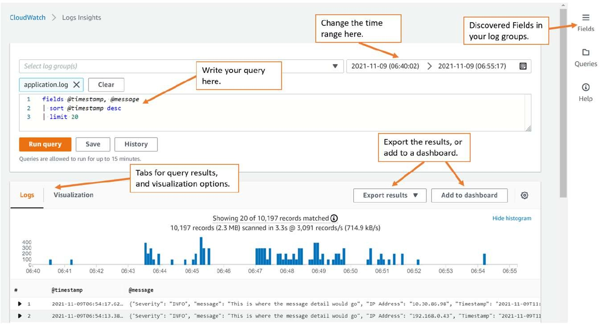

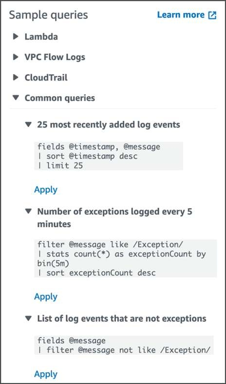

---

### 1.3 Exportación a S3 vs Suscripciones de CloudWatch Logs
Un concepto crítico evaluado en el examen es la diferencia en tiempo de entrega hacia Amazon S3 u otros destinos:
- **Exportación por Tareas (`CreateExportTask` hacia S3):** Proceso por lotes (*batch*); los datos pueden tardar **hasta 12 horas** en estar disponibles. **Antipatrón para análisis en tiempo real**.
- **Subscription Filters (Filtros de Suscripción):** Entrega en tiempo real o casi real directamente hacia **AWS Lambda**, **Amazon Kinesis Data Streams** o **Amazon Kinesis Data Firehose** (y de allí a S3 u OpenSearch).
- **Agregación Multi-Cuenta / Multi-Región:** Permite centralizar logs de múltiples cuentas en un único Kinesis Data Stream receptor mediante un rol IAM de asunción entre cuentas (*Cross-Account IAM Role*).

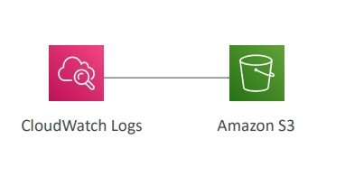

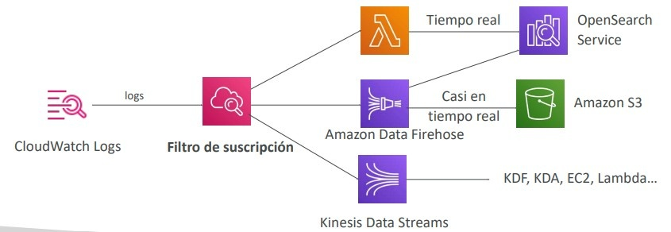

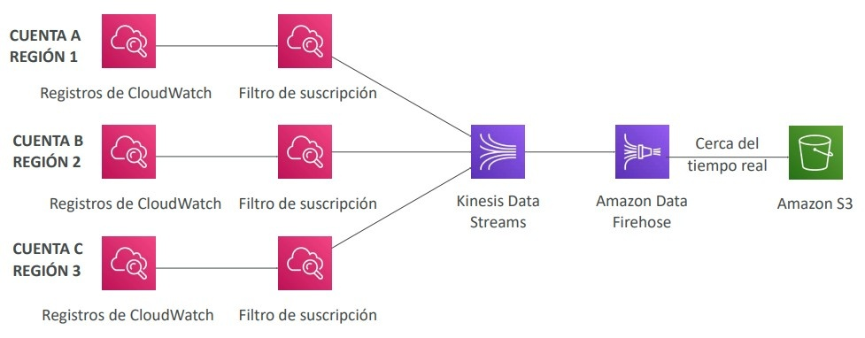

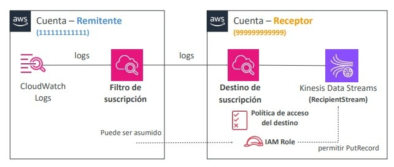

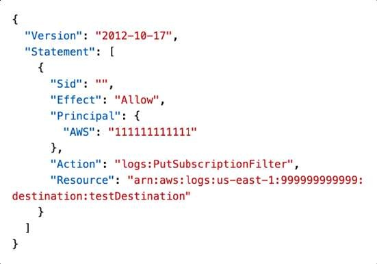
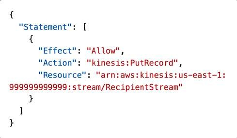

---

### 1.4 Agente Unificado de CloudWatch en EC2
Por defecto, las instancias EC2 solo envían métricas a nivel de hipervisor a CloudWatch (CPU, tráfico de red, IOPS de disco EBS y comprobaciones de estado).
- **Métricas a Nivel de Sistema Operativo:** Parámetros como **uso de memoria RAM**, espacio en disco en uso/libre, métricas de procesos y `netstat` **NO** se capturan de forma nativa.
- **Solución Obligatoria:** Instalar y configurar el **CloudWatch Unified Agent** en la instancia EC2 (o servidor on-premises), gestionando su configuración centralizadamente a través de **AWS Systems Manager Parameter Store**.

---

### 1.5 Alarmas de CloudWatch y Acciones Automatizadas
Una alarma pasa por tres estados: `OK`, `ALARM` e `INSUFFICIENT_DATA`.
- **Acciones Disponibles:**
  1. Enviar notificación a un tema de **Amazon SNS**.
  2. Ejecutar políticas de escalado en un **Auto Scaling Group (ASG)**.
  3. Ejecutar acciones directas sobre EC2: *Stop*, *Terminate*, *Reboot* o **EC2 Instance Recovery**.
- **Alarmas Compuestas (*Composite Alarms*):** Agrupan múltiples alarmas mediante operadores lógicos booleanos (`AND`, `OR`) para reducir el ruido y falsos positivos (ej. alertar solo si `CPU > 85%` **Y** `StatusCheckFailed_Instance = 1`).
- **EC2 Instance Recovery:** Si la comprobación de estado de hardware subyacente (**`StatusCheckFailed_System`**) falla, una alarma puede recuperar automáticamente la instancia trasladándola a un host físico sano conservando la misma IP privada, IP pública/elástica, metadatos y volúmenes EBS vinculados.

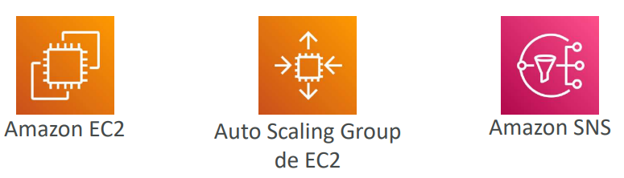

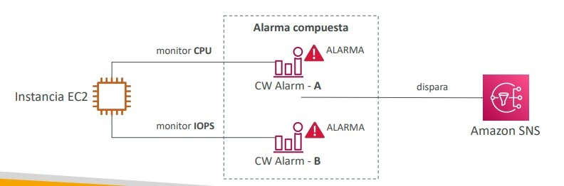

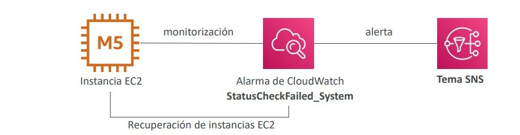

---

### 1.6 Monitoreo Especializado: CloudWatch Insights Family
- **CloudWatch Container Insights:** Métricas y diagnósticos especializados para clústeres en **Amazon ECS, Amazon EKS, Kubernetes en EC2 y AWS Fargate**.
- **CloudWatch Lambda Insights:** Métricas detalladas a nivel de entorno de ejecución serverless (arranques en frío /*cold starts*, uso de memoria y CPU, hilos de ejecución) implementadas mediante una capa (*Lambda Layer*).
- **CloudWatch Contributor Insights:** Identifica los N principales elementos contribuyentes (*Top-N contributors*) que impactan el rendimiento analizando logs de VPC, DNS o API Gateway (ej. IPs con más tráfico sospechoso, IDs de usuario con más errores HTTP 500).
- **CloudWatch Application Insights:** Descubre y configura dashboards automatizados respaldados por modelos analíticos de SageMaker para aplicaciones corporativas (Java, .NET, bases de datos).

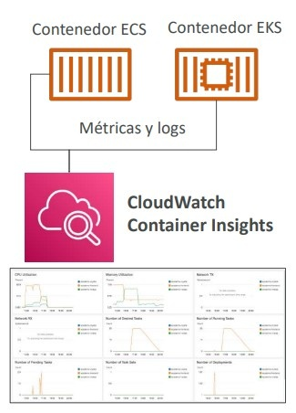
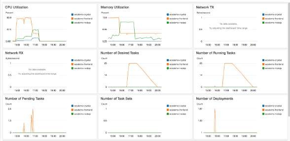

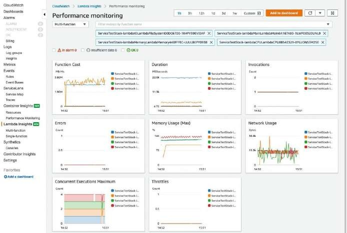

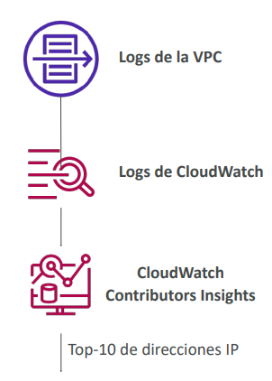

---

## 2. Amazon EventBridge (Arquitecturas Dirigidas por Eventos)

**Amazon EventBridge** (evolución de CloudWatch Events) actúa como un bus de eventos serverless que conecta emisores de eventos con múltiples destinos de procesamiento.

### 2.1 Tipos de Event Buses y Reglas
- **Default Event Bus:** Recibe eventos emitidos nativamente por los servicios de AWS.
- **Custom Event Bus:** Recibe eventos enviados por aplicaciones propias mediante la API `PutEvents`.
- **Partner Event Bus:** Recibe eventos directamente de proveedores SaaS de terceros (Zendesk, Datadog, Auth0, Shopify).
- **Reglas (*Rules*):** Filtran el JSON entrante y enrutan la carga útil a más de 20 destinos compatibles (AWS Lambda, colas SQS, temas SNS, Step Functions, Kinesis, ECS Tasks).
- **Programación Cron / Rate:** Ejecuta tareas periódicas recurrentes (reemplazo de servidores cron tradicionales).

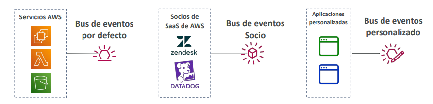

---

### 2.2 Características Empresariales de EventBridge
- **Políticas Basadas en Recursos:** Permiten autorizar que cuentas externas en AWS Organizations envíen eventos a un bus centralizado.
- **Archivado y Replay de Eventos (*Archive & Replay*):** Permite retener eventos de manera indefinida o por un TTL específico y **reproducir (*replay*)** eventos históricos para depuración o recuperación ante fallos.
- **Schema Registry:** Infiere automáticamente el esquema de los eventos JSON y genera código tipado (*bindings*) para Java, Python o TypeScript.

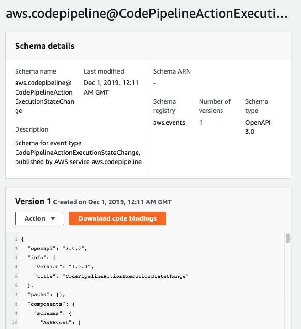

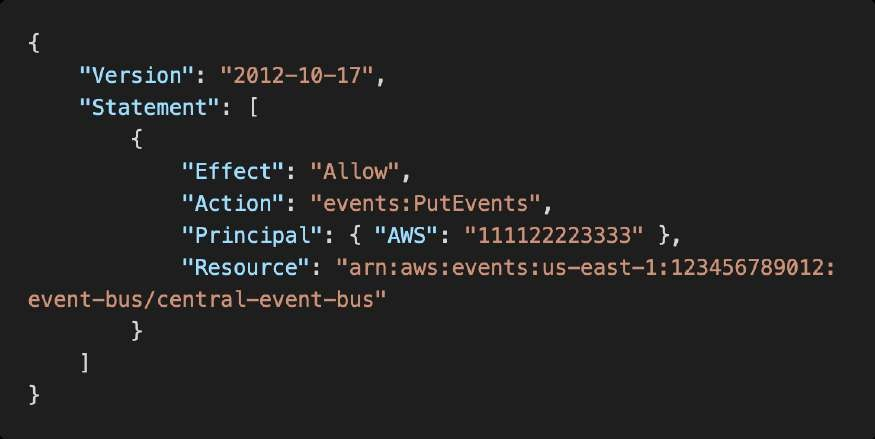
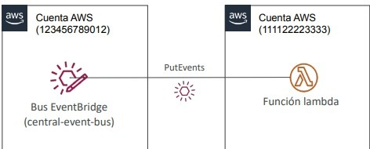

---

## 3. AWS CloudTrail: Auditoría de Gobernanza y Llamadas a la API

**AWS CloudTrail** registra todas las llamadas a la API realizadas en la cuenta de AWS por la Consola Web, SDKs, CLI o servicios internos de AWS.

### 3.1 Tipos de Eventos
1. **Management Events (Eventos de Gestión):** Operaciones del plano de control realizadas sobre recursos de la cuenta (ej. `CreateBucket`, `AttachRolePolicy`, `TerminateInstances`). Están **habilitados por defecto** sin costo adicional.
2. **Data Events (Eventos de Datos):** Operaciones a nivel del plano de datos (ej. `S3:GetObject`, `S3:PutObject`, ejecuciones de funciones Lambda `Invoke`). **Deshabilitados por defecto** debido al inmenso volumen transaccional; tienen costo adicional por evento.
3. **CloudTrail Insights:** Modela el comportamiento operativo normal de eventos de gestión y **detecta anomalías inusuales** (ej. ráfagas atípicas de llamadas IAM, picos en provisionamiento o superación de cuotas de servicio). Alerta vía Consola, S3 o EventBridge.

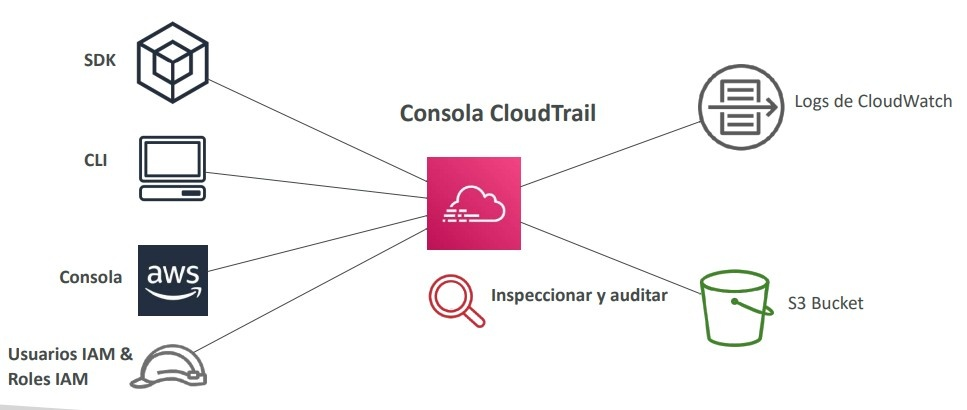

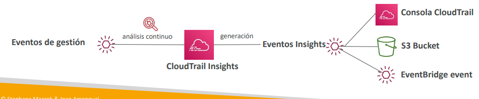

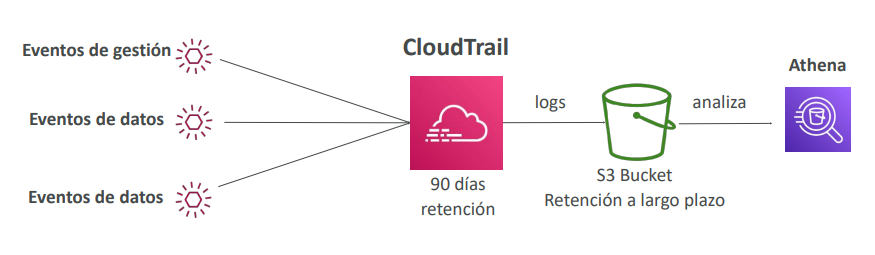

---

### 3.2 Retención y Reacción ante Eventos con EventBridge
- **Historial de Eventos (Event History):** Se conserva en la consola durante **90 días**.
- **Retención a Largo Plazo y Análisis Forense:** Configurar un **Trail Multi-Región** que entregue los logs en un bucket de **Amazon S3** (protegido con Object Lock y SSE-KMS) y consultar mediante **Amazon Athena**.
- **Intercepción y Alertas Inmediatas:** EventBridge puede escuchar llamadas a la API registradas por CloudTrail (ej. `DeleteTable`, `AuthorizeSecurityGroupIngress`, `StopLogging`) y disparar inmediatamente alertas SNS o funciones Lambda de remediación.

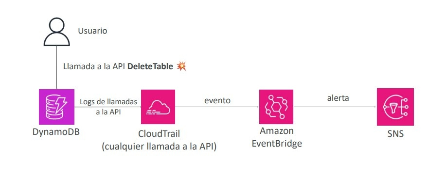

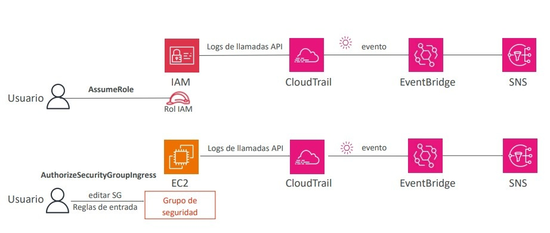

---

## 4. AWS Config: Evaluación de Cumplimiento y Gobernanza de Configuración

**AWS Config** evalúa, audita y registra continuamente los cambios en las configuraciones de los recursos de AWS frente a un conjunto de reglas deseadas.

### 4.1 Reglas y Cumplimiento (*Config Rules*)
- **Reglas Administradas (*Managed Rules*):** Reglas predefinidas por AWS (ej. verificar si todos los buckets S3 bloquean acceso público, si los volúmenes EBS están cifrados o si las claves de acceso IAM rotan cada 90 días).
- **Reglas Personalizadas (*Custom Rules*):** Lógica evaluativa programada en funciones **AWS Lambda**.
- **Modos de Disparo:** Basado en cambios en la configuración del recurso (*trigger on configuration change*) o programado a intervalos regulares.
- **Regla Crítica de Examen:** AWS Config **NO previene ni bloquea** que un usuario realice una configuración no permitida (no deniega llamadas a la API como lo haría una política IAM o una SCP de AWS Organizations); su función es **detectar el estado `NON_COMPLIANT` y registrar el historial**.

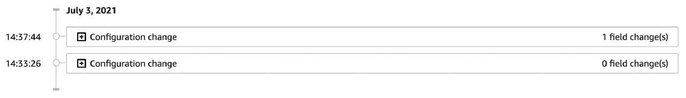
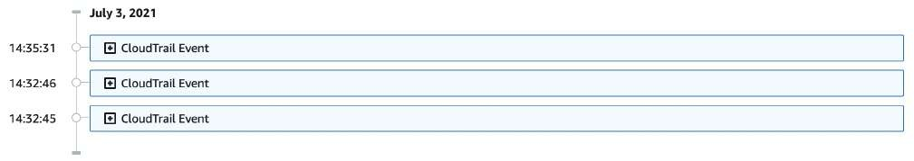
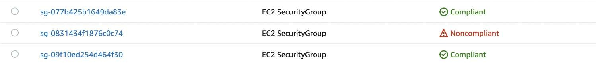

---

### 4.2 Remediación Automatizada (*Remediations*)
Cuando un recurso se marca como `NON_COMPLIANT`, AWS Config puede ejecutar acciones de remediación automática utilizando **SSM Automation Documents** (Documentos de Automatización de Systems Manager):
- Ejemplos: Desactivar claves de acceso IAM no conformes, habilitar cifrado en un bucket S3 o revocar reglas abiertas `0.0.0.0/0` en Security Groups.
- Permite configurar reintentos automáticos si la remediación inicial no restablece la conformidad.

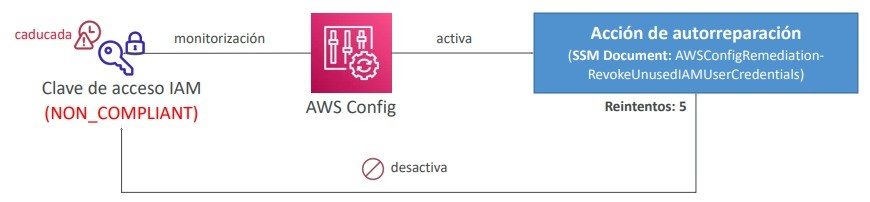

---

## 5. Tabla Comparativa Definitiva: CloudWatch vs CloudTrail vs AWS Config

| Dimensión | Amazon CloudWatch | AWS CloudTrail | AWS Config |
| :--- | :--- | :--- | :--- |
| **Pregunta Clave** | *¿Cómo está rindiendo y qué métricas/logs produce el sistema?* | *¿Quién realizó la llamada a la API y cuándo?* | *¿Cómo está configurado el recurso y cumple las políticas?* |
| **Foco Operativo** | Métricas operativas, rendimiento, logs de apps y alarmas. | Auditoría, seguridad, trazabilidad de acciones y gobernanza. | Cumplimiento normativo, auditoría de cambios y conformidad. |
| **Ámbito** | Regional (con opciones de agregación multi-cuenta). | Global / Multi-Región activado por defecto. | Regional (con soporte de agregadores multi-cuenta/región). |
| **Manejo de Respuestas** | Escala ASGs, envía notificaciones SNS, reinicia/recupera EC2. | Dispara eventos en EventBridge para auditoría y alertas. | Remedia automáticamente con SSM Automation Documents. |
| **Ejemplo en ALB** | Mide latencia de respuesta, recuento de peticiones y errores 5XX. | Registra la llamada `CreateLoadBalancer` y el usuario IAM autor. | Valida si el ALB tiene asignado un certificado SSL/TLS válido. |

---

## 6. Escenarios de Arquitectura y Consejos de Examen

> **💡 SAA-C03 Exam Tip:**
> 1. **Métricas de RAM en EC2:** Si una pregunta exige escalar un Auto Scaling Group o alertar en función del **consumo de memoria RAM o espacio libre en disco**, la respuesta correcta exige instalar el **CloudWatch Unified Agent** en las instancias (estas métricas nunca existen en CloudWatch básico).
> 2. **Auditoría de Recursos Eliminados:** Si un recurso crítico (ej. una tabla de DynamoDB o una instancia EC2) fue terminado inesperadamente y se requiere **identificar al usuario responsable y la dirección IP de origen**, la herramienta forense primaria es **AWS CloudTrail**.
> 3. **Detección vs Prevención de Reglas Inseguras:**
>    - Para **detectar y remediar** Security Groups que abren el puerto 22 a `0.0.0.0/0`, la solución es **AWS Config + SSM Automation Document**.
>    - Para **impedir (prevenir)** que los administradores puedan crear reglas o recursos prohibidos en cuentas subordinadas, se deben utilizar **Service Control Policies (SCPs)** en AWS Organizations, no AWS Config.
> 4. **Exportar Logs a S3 Rápidamente:** Desconfía de respuestas que propongan `CreateExportTask` de CloudWatch Logs si el requerimiento pide análisis en *tiempo real* o *casi tiempo real* (tarda hasta 12 horas). Elige **Subscription Filters hacia Kinesis Data Firehose**.
