# Identidad Avanzada en AWS: Gobernanza Multicuenta, Federación y Control de Acceso

El diseño de una arquitectura empresarial escalable en AWS exige ir más allá de la gestión básica de usuarios en una sola cuenta. Para el examen **AWS Certified Solutions Architect - Associate (SAA-C03)**, es indispensable dominar la administración centralizada multicuenta con **AWS Organizations**, el control estricto de privilegios con **Service Control Policies (SCPs)** y **Permission Boundaries**, la federación e inicio de sesión único con **IAM Identity Center**, las opciones de integración con **Microsoft Active Directory** y la gobernanza automatizada con **AWS Control Tower**.

---

## 1. AWS Organizations y Políticas de Control de Servicios (SCPs)

**AWS Organizations** es un servicio de gestión de cuentas global que permite consolidar múltiples cuentas de AWS bajo una única jerarquía administrativa.

### 1.1 Estructura Jerárquica y Beneficios
- **Management Account (Cuenta de Gestión / Raíz):** Cuenta principal que orquesta la organización, administra los métodos de pago y aplica políticas.
- **Member Accounts (Cuentas Miembro):** Cuentas subordinadas que solo pueden pertenecer a una organización a la vez.
- **Organizational Units (OUs):** Contenedores lógicos para agrupar cuentas miembro por entorno (Dev, Test, Prod), líneas de negocio (Ventas, Finanzas) o proyectos.
- **Facturación Consolidada (*Consolidated Billing*):** Un único método de pago centralizado con descuentos agregados por volumen en servicios como Amazon S3 y EC2, y compartición automática de Savings Plans e Instancias Reservadas entre todas las cuentas.

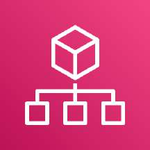

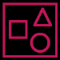

---

### 1.2 Service Control Policies (SCPs)
Las **SCPs** son barreras de contención (*guardrails*) que definen los permisos máximos que los usuarios y roles IAM pueden ejercer dentro de una cuenta u OU.

- **Reglas Críticas de Examen:**
  - Las SCPs actúan como un filtro restrictivo: **NO otorgan permisos por sí solas**; solo delimitan el perímetro de lo permitido (*allowlist*) o bloquean acciones específicas (*blocklist*).
  - Para que una acción esté permitida, debe concederse **tanto en la SCP como en la política IAM** de la entidad.
  - **Inmunidad de la Cuenta de Gestión:** Las SCPs **NUNCA aplican a la Management Account** ni a sus usuarios o roles; esta cuenta siempre conserva privilegios completos.
  - Afectan a **todos los usuarios y roles**, incluido el usuario `root` de las cuentas miembro.

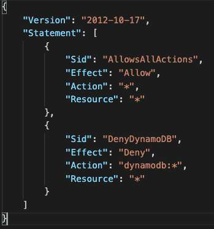
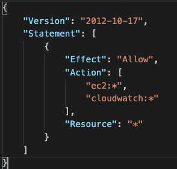

---

### 1.3 Políticas de Etiquetas (Tag Policies)
Permiten estandarizar y hacer cumplir esquemas de etiquetado en toda la organización:
- Definen las claves (*tag keys*) permitidas y sus valores válidos.
- Previenen operaciones de etiquetado no conformes en recursos compatibles.
- Facilitan la asignación de costos corporativos (*Cost Allocation Tags*) y la implementación de control de acceso basado en atributos (**ABAC**).

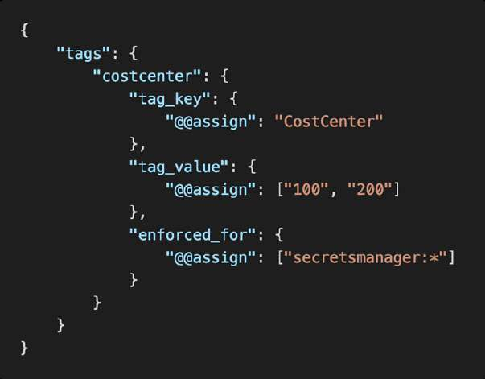

---

## 2. Condiciones Avanzadas de IAM y Políticas Basadas en Recursos

### 2.1 Claves de Condición Globales de IAM
Permiten añadir capas de seguridad contextuales dentro de bloques `Condition`:
- `aws:PrincipalOrgID`: Restringe el acceso a cualquier recurso (ej. bucket de S3) únicamente a directores pertenecientes a la Organización de AWS especificada, simplificando políticas de bucket sin tener que listar manualmente decenas de IDs de cuenta.
- `aws:SourceIP`: Restringe llamadas a la API a rangos específicos de direcciones IP públicas corporativas (no compatible con VPC Endpoints internos a menos que se use `aws:sourceVpc`).
- `aws:RequestedRegion`: Bloquea o restringe llamadas a la API fuera de regiones geográficas autorizadas.
- `aws:MultiFactorAuthPresent`: Exige autenticación multifactor (MFA) activa para autorizar operaciones sensibles (ej. `ec2:TerminateInstances` o `s3:DeleteObject`).

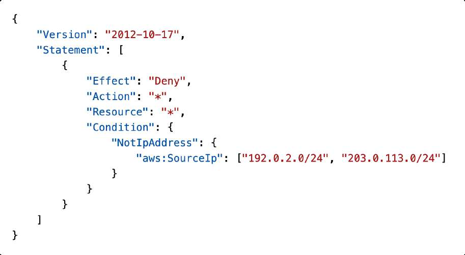
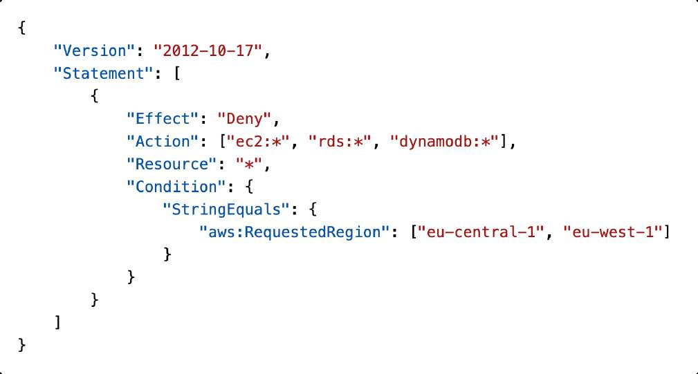

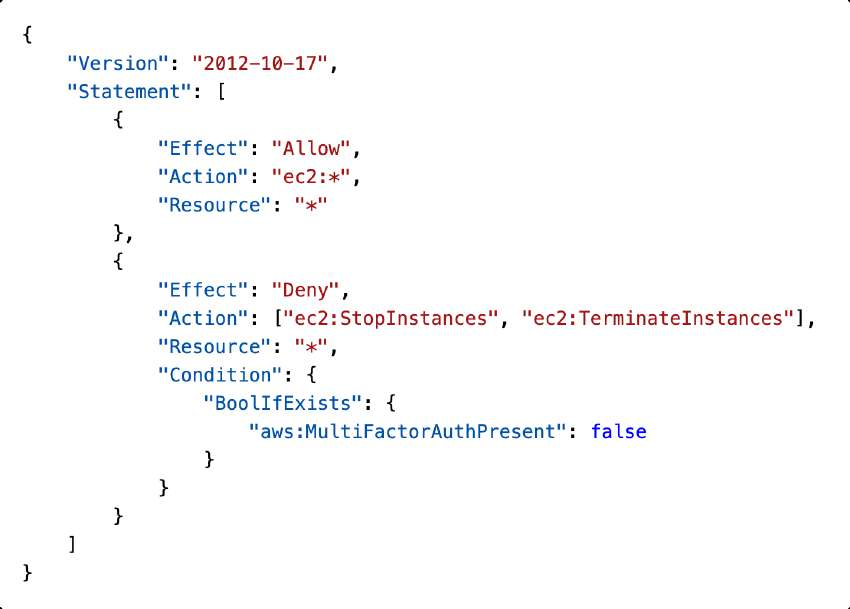
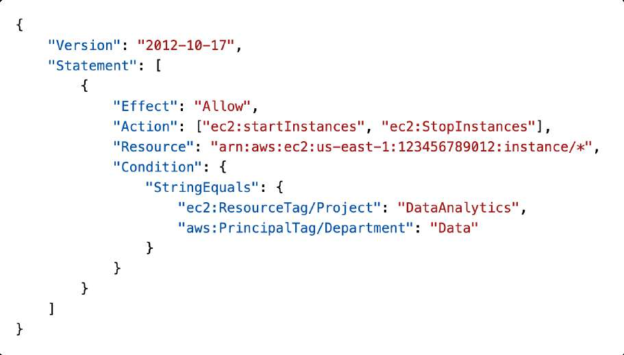

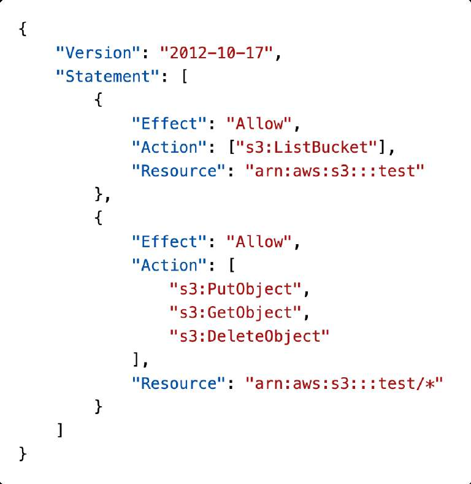

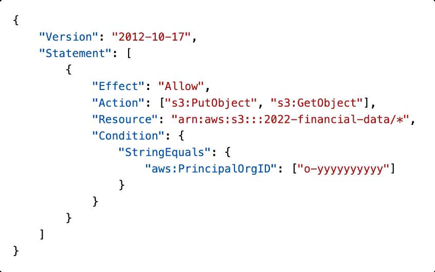

---

### 2.2 Acceso entre Cuentas: Roles IAM vs Políticas Basadas en Recursos

| Mecanismo | Comportamiento de Permisos | Cuándo Elegirlo en SAA-C03 |
| :--- | :--- | :--- |
| **Rol IAM de Cuenta Cruzada (`sts:AssumeRole`)** | El usuario **renuncia temporalmente a sus permisos originales** y asume exclusivamente los permisos del rol de la cuenta destino. | Cargas de trabajo que requieren interactuar temporalmente con otra cuenta, o cuando el servicio destino no soporta políticas de recursos. |
| **Política Basada en Recursos (ej. S3 Bucket Policy)** | El usuario **mantiene sus permisos originales** en la cuenta de origen mientras accede directamente al recurso en la cuenta destino. | Escenarios donde una entidad necesita combinar recursos de ambas cuentas en una misma acción (ej. leer de DynamoDB en Cuenta A y escribir en S3 de Cuenta B). |

---

## 3. Límites de Permisos de IAM (IAM Permission Boundaries)

Los **Permission Boundaries** son políticas administradas avanzadas que establecen los permisos máximos que una entidad (usuario o rol IAM) puede tener, sin importar qué políticas basadas en identidad se le adjunten posteriormente.

- **Fórmula de Evaluación:** El permiso efectivo es la **intersección lógica** entre la Política Basada en Identidad y el Permission Boundary.
- **Caso de Uso Primario:** Delegación segura de tareas administrativas a desarrolladores o administradores junior (ej. permitirles crear nuevos usuarios o roles IAM para sus aplicaciones imponiendo un Boundary que impida que se autoasignen privilegios de `AdministratorAccess`).

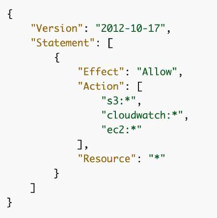
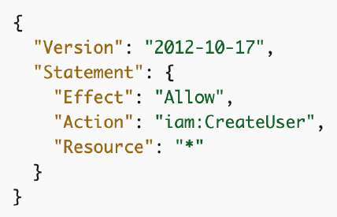

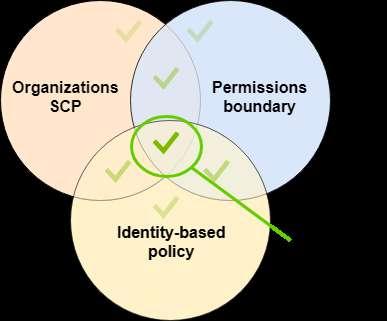

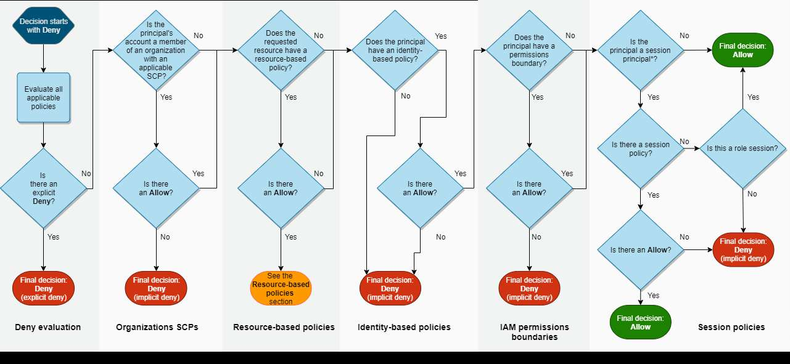

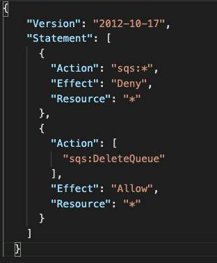

---

## 4. AWS IAM Identity Center (Sucesor de AWS Single Sign-On)

**IAM Identity Center** centraliza la autenticación y la gestión de acceso para todas las cuentas de **AWS Organizations** y aplicaciones en la nube compatibles con SAML 2.0 (Salesforce, Microsoft 365, Box, etc.).

### 4.1 Características Clave
- **Portal de Acceso Único:** Los usuarios inician sesión una sola vez a través de un portal web seguro y acceden a múltiples cuentas de AWS con los roles asignados.
- **Conjuntos de Permisos (*Permission Sets*):** Plantillas de políticas IAM asignadas a usuarios o grupos para definir sus niveles de acceso (ej. `ReadOnlyAccess`, `DatabaseAdmin`) en cuentas específicas.
- **Proveedores de Identidad (IdP) Soportados:**
  - Almacén de identidades integrado en IAM Identity Center.
  - Proveedores externos vía SAML 2.0 / SCIM (Okta, Ping Identity, OneLogin, Entra ID).
  - Directorios corporativos locales o en la nube mediante **AWS Directory Service**.
- **Control de Acceso Basado en Atributos (ABAC):** Utiliza atributos del perfil de usuario (ej. `CostCenter`, `Department`) para otorgar permisos dinámicos en AWS sin necesidad de actualizar políticas constantemente.

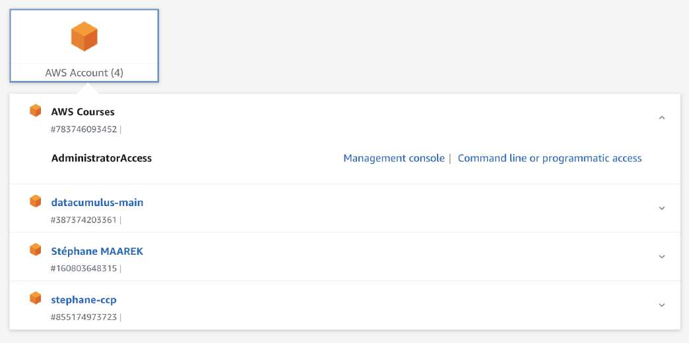
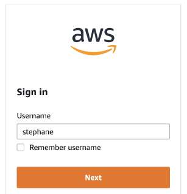
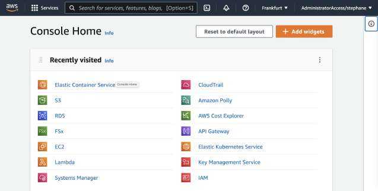

---

## 5. AWS Directory Service (Integración con Microsoft Active Directory)

Para empresas con infraestructura basada en Windows y Active Directory local, AWS ofrece tres alternativas de integración administrada:

### 5.1 Opciones de AWS Directory Service

| Servicio | Tipo de Implementación | Soporte de Confianza (*Trust*) con AD Local | Casos de Uso SAA-C03 |
| :--- | :--- | :--- | :--- |
| **AWS Managed Microsoft AD** | Controlador de dominio Windows Server real administrado por AWS en alta disponibilidad multi-AZ. | **Sí** (relaciones de confianza unidireccionales o bidireccionales de bosque/dominio). | Necesidad de unir instancias Windows EC2, RDS para SQL Server o migrar cargas enterprise conservando políticas de grupo (GPO). |
| **AD Connector** | Puerta de enlace proxy (*Directory Gateway*) que redirige peticiones de autenticación al AD local sin almacenar caché. | **No aplica** (es un proxy directo hacia el AD on-premises). | Empleados que inician sesión en la consola de AWS o Amazon WorkSpaces utilizando sus credenciales corporativas locales sin replicar datos en AWS. |
| **Simple AD** | Directorio independiente y económico basado en Samba 4. | **No** (incompatible con relaciones de confianza con AD local). | Directorio pequeño independiente para entornos de pruebas o proyectos nuevos sin infraestructura previa de Active Directory. |

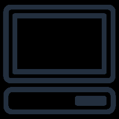

---

## 6. AWS Control Tower: Gobernanza Automatizada Multicuenta

**AWS Control Tower** automatiza la configuración de una zona de aterrizaje (*Landing Zone*) multicuenta segura y bien arquitectada sobre AWS Organizations:
- Implementa cuentas especializadas por defecto: **Log Archive Account** (para centralizar CloudTrail y CloudWatch) y **Audit / Security Tooling Account**.
- **Guardrails (Barreras de Protección):**
  - *Preventive Guardrails (Preventivos):* Implementados mediante **SCPs de AWS Organizations** para bloquear acciones que violen políticas (ej. impedir que las cuentas miembro desactiven CloudTrail o bloqueen el acceso a S3).
  - *Detective Guardrails (Detectivos):* Implementados mediante **AWS Config** para monitorear el cumplimiento de recursos y alertar/remediar automáticamente violaciones (ej. identificar y reportar volúmenes EBS sin cifrar o recursos sin etiquetas requeridas).

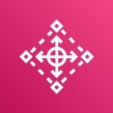

---

## 7. Consejos de Examen y Trampas Clásicas

> **💡 SAA-C03 Exam Tip:**
> 1. **SCP vs IAM Permissions:** Una SCP **nunca otorga permisos por sí misma**. Si un usuario tiene asignada una política IAM con `s3:FullAccess`, pero en la SCP de su OU no se permite Amazon S3, el usuario **no tendrá acceso**. Además, recuerda que las SCPs **no afectan a la Management Account**.
> 2. **Delegación Segura sin Escalamiento de Privilegios:** Cuando el enunciado pida permitir que los desarrolladores creen usuarios o roles IAM para sus aplicaciones, pero **evitando que puedan asignarse permisos de administrador**, la respuesta arquitectónica obligatoria es aplicar un **IAM Permission Boundary**.
> 3. **AD Connector vs AWS Managed Microsoft AD:**
>    - Si la empresa requiere autenticar usuarios corporativos en AWS **sin sincronizar ni replicar credenciales en la nube**, la solución es **AD Connector**.
>    - Si se requiere una **relación de confianza bidireccional (*forest trust*)** entre el Active Directory local y AWS para soportar autenticación Kerberos o RDS SQL Server, la solución es **AWS Managed Microsoft AD**.
> 4. **Restricción a Nivel de Organización:** Para asegurar que un bucket de Amazon S3 solo pueda ser accedido por cuentas que pertenezcan a la organización corporativa (evitando accesos accidentales externos), agrega la condición `"aws:PrincipalOrgID": "o-xxxxxxxxxx"` en la política del bucket.
