# Seguridad y Cifrado en AWS: KMS, Secretos, Certificados y Protección Perimetral

La seguridad es el pilar de mayor ponderación en el examen **AWS Certified Solutions Architect - Associate (SAA-C03)**. Un arquitecto debe dominar los tres estados de protección de datos: **cifrado en tránsito** (TLS/HTTPS con ACM), **cifrado en reposo del lado del servidor** (KMS, CloudHSM), y **cifrado del lado del cliente** (Encryption SDK). Asimismo, debe saber orquestar la defensa perimetral y contra ataques DDoS mediante **AWS WAF, AWS Shield y Firewall Manager**, así como la detección automatizada de amenazas y vulnerabilidades con **Amazon GuardDuty, Inspector y Macie**.

---

## 1. Fundamentos de Cifrado y Clasificación

- **Cifrado en Tránsito (*In-Flight / In-Transit*):** Protege contra ataques de tipo *Man-in-the-Middle* (MITM). Los datos se cifran con protocolos TLS/SSL antes de transmitirse y se descifran en el destino.
- **Cifrado del Lado del Servidor (*Server-Side Encryption - SSE*):** El cliente envía los datos en texto plano por canal seguro; el servicio de AWS (S3, EBS, RDS) los cifra al recibirlos antes de persistirlos en disco, utilizando una clave de datos (*Data Key*), y los descifra automáticamente al ser solicitados por un principal autorizado.
- **Cifrado del Lado del Cliente (*Client-Side Encryption*):** Los datos son cifrados por el cliente localmente antes de enviarse a AWS. El proveedor en la nube **nunca ve los datos en texto plano** ni posee las claves de descifrado.

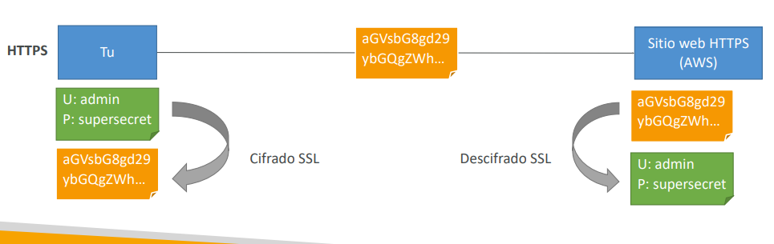

---

## 2. AWS Key Management Service (AWS KMS)

**AWS KMS** es un servicio regional administrado para crear y controlar claves criptográficas. Se integra de forma nativa con IAM y genera registros de auditoría detallados en **AWS CloudTrail**.

### 2.1 Tipos de Claves y Cifrado Simétrico vs Asimétrico
- **Claves Simétricas (AES-256):** Una sola clave cifra y descifra. Son el estándar para todos los servicios de AWS integrados. La clave maestra nunca sale sin cifrar de los módulos de seguridad de KMS.
- **Claves Asimétricas (RSA o ECC):** Par de claves pública y privada. La clave pública se puede descargar para cifrar o verificar firmas fuera de AWS; la clave privada no puede exportarse.

### 2.2 Clasificación de Claves KMS y Rotación

| Tipo de Clave | Creación y Control | Costo Mensual | Rotación Automática |
| :--- | :--- | :--- | :--- |
| **AWS Owned Keys** | Administradas internamente por AWS (ej. clave básica SSE-S3). | Gratis. | Administrada automáticamente por AWS. |
| **AWS Managed Keys** | Creadas automáticamente por servicios AWS (`aws/s3`, `aws/ebs`, `aws/rds`). | Gratis. | Automática cada **1 año** (no configurable). |
| **Customer Managed Keys (CMK)** | Creadas explícitamente por el cliente en KMS. | $1 USD / mes. | Opcional: Automática cada **1 año** (o rotación manual). |
| **Imported Keys (BYOK)** | Material de clave propio importado en una CMK. | $1 USD / mes. | **Solo rotación manual** mediante actualización de alias. |

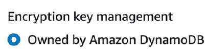
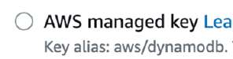

---

### 2.3 Políticas de Claves KMS (*Key Policies*)
A diferencia de S3, **en KMS las políticas de clave son obligatorias**. Si una entidad tiene permiso de administrador en IAM pero la política de clave de KMS no la autoriza (o no delega el control a la cuenta), el acceso es denegado:
- **Default Key Policy:** Otorga control total a la cuenta raíz (`"Principal": {"AWS": "arn:aws:iam::ACCOUNT_ID:root"}`), lo que permite que las políticas IAM de esa cuenta concedan acceso a la clave.
- **Custom Key Policy:** Delimita explícitamente qué usuarios, roles o cuentas externas pueden usar o administrar la clave. Es obligatoria para autorizar **acceso entre cuentas (*Cross-Account*)**.

---

### 2.4 Snapshots Cifrados y Acceso Cross-Account / Cross-Region
- **Copia entre Regiones:** Un snapshot de EBS cifrado con una clave en `eu-west-2` no puede descifrarse en `ap-southeast-2` con esa misma clave (las claves KMS son estrictamente regionales). Durante la copia, AWS descifra los bloques con la clave de origen y los reencripta en destino con una clave KMS de la región destino.
- **Copia entre Cuentas:**
  1. El snapshot debe estar cifrado con una **Customer Managed Key (CMK)** (los recursos cifrados con claves administradas `aws/ebs` por defecto **no se pueden compartir** entre cuentas).
  2. Modificar la **Política de Clave KMS** en la cuenta de origen para autorizar a la cuenta de destino (`kms:CreateGrant`, `kms:DescribeKey`, `kms:Decrypt`).
  3. Compartir el snapshot con la cuenta de destino.
  4. En la cuenta de destino, copiar el snapshot y cifrarlo con una CMK propia de esa cuenta antes de restaurar el volumen EBS.

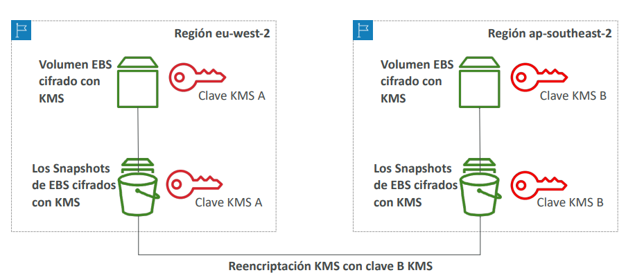

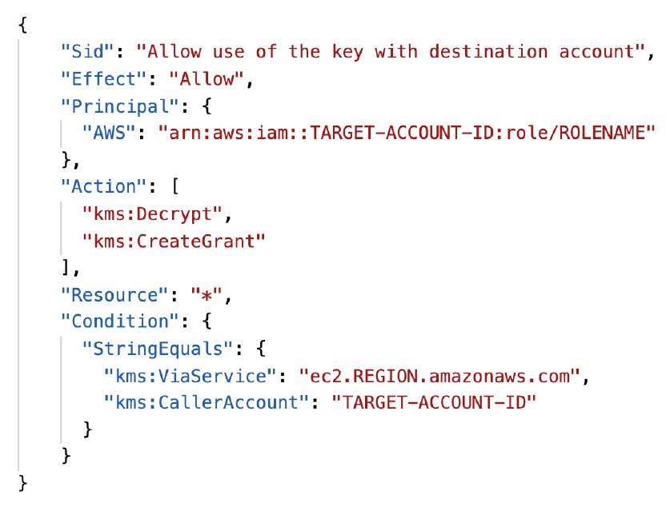

---

### 2.5 Claves Multi-Región de KMS (*Multi-Region Keys - MRK*)
- Permiten tener claves de cifrado con el **mismo ID de clave y material criptográfico** sincronizadas en múltiples regiones de AWS.
- Permiten cifrar datos en `us-east-1` y descifrarlos directamente en `ap-southeast-2` sin realizar llamadas a la API entre regiones ni recifrar los datos.
- **No son claves globales:** Se gestionan como una clave primaria (*Primary Key*) y múltiples réplicas sincronizadas.
- **Casos de Uso Principales:** Cifrado del lado del cliente en **DynamoDB Global Tables** o columnas sensibles en **Aurora Global Databases**.

---

## 3. Comparativa: AWS KMS vs AWS CloudHSM

| Característica | AWS KMS | AWS CloudHSM |
| :--- | :--- | :--- |
| **Arquitectura de Inquilino** | Multitenant (infraestructura compartida segura). | **Dedicado (*Single-Tenant*)** en hardware físico aislado dentro de tu VPC. |
| **Estándar de Cumplimiento** | FIPS 140-2 Nivel 2 (y Nivel 3 en módulos criptográficos clave). | **FIPS 140-2 Nivel 3 estricto** a prueba de manipulaciones físicas (*tamper-resistant*). |
| **Control de las Claves** | AWS administra el software y la disponibilidad; el usuario gestiona políticas IAM. | **El cliente tiene control y posesión exclusiva** de las claves; ni siquiera AWS puede acceder a ellas. |
| **Autenticación y Acceso** | Políticas IAM y Políticas de Claves KMS. | Software y usuarios propios administrados dentro del dispositivo HSM. |
| **Aceleración Criptográfica** | No disponible. | Aceleración por hardware para SSL/TLS y Oracle TDE. |
| **Integración con Servicios AWS** | Nativa y automática con más de 100 servicios. | Requiere configurar KMS Custom Key Store o conectores SDK dedicados. |
| **Costo** | Económico ($1/mes por CMK + llamadas API); incluye capa gratuita. | Costoso (facturación por hora por dispositivo HSM aprovisionado); sin capa gratuita. |

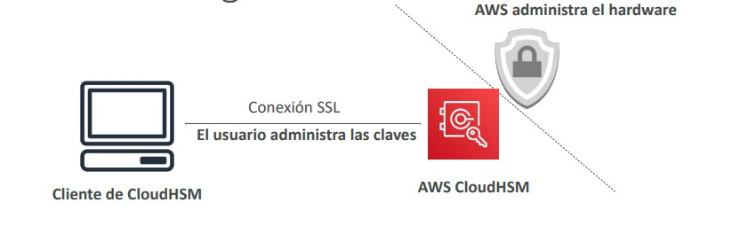

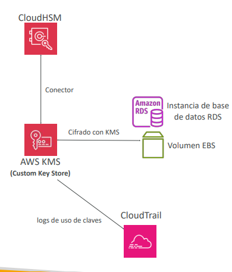

---

## 4. Gestión de Secretos y Parámetros: SSM Parameter Store vs Secrets Manager

### 4.1 AWS Systems Manager Parameter Store
Almacén seguro para cadenas de configuración y credenciales estructuradas jerárquicamente (ej. `/mi-app/prod/db-url`):
- **Parámetros Estándar:** Gratuitos, hasta 10,000 parámetros por región, valor máximo de 4 KB.
- **Parámetros Avanzados:** De pago ($0.05/mes), hasta 100,000 parámetros, valor máximo de 8 KB, y soporte para **Parameter Policies** (asignación de TTL para forzar caducidad y notificaciones vía EventBridge).

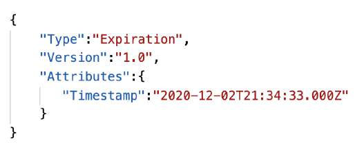
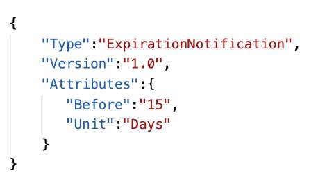
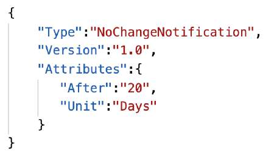

---

### 4.2 AWS Secrets Manager
Servicio especializado para almacenar y rotar secretos empresariales:
- **Rotación Automática:** Capacidad nativa de rotar contraseñas cada X días sin intervención humana mediante funciones **AWS Lambda** preconfiguradas.
- **Integración con Amazon RDS / Aurora:** Puede rotar las credenciales maestras y de usuario de RDS automáticamente sin interrumpir la aplicación.
- **Secretos Multirregión:** Sincroniza réplicas de lectura de un secreto primario en múltiples regiones para arquitecturas globales de Disaster Recovery.

| Criterio | SSM Parameter Store | AWS Secrets Manager |
| :--- | :--- | :--- |
| **Costo** | Estándar: Gratis. Avanzado: $0.05/mes. | $0.40 por secreto/mes + $0.05 por 10,000 llamadas API. |
| **Rotación Automática** | No nativa (requiere automatización personalizada con EventBridge + Lambda). | **Nativa y automatizada** con plantillas Lambda listas para RDS, Redshift, DocumentDB. |
| **Replicación Multi-Región** | No nativa. | **Nativa con sincronización continua**. |
| **Propósito Principal** | Configuración de aplicaciones, rutas y variables. | Secretos críticos, contraseñas de BD y claves API de terceros. |

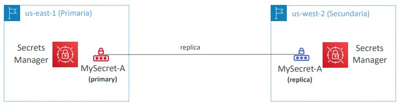

---

## 5. AWS Certificate Manager (ACM): Cifrado TLS/HTTPS

**AWS Certificate Manager (ACM)** simplifica el aprovisionamiento, despliegue y renovación de certificados SSL/TLS para comunicaciones seguras en tránsito.

### 5.1 Características y Despliegue
- **Gratuito para Certificados Públicos:** No tiene costo para certificados solicitados directamente a través de ACM.
- **Renovación Automática:** Los certificados emitidos por ACM se renuevan automáticamente 60 días antes de expirar (validación mediante registro CNAME de Route 53 recomendada sobre validación por correo electrónico).
- **Asociación de Servicios:** Los certificados de ACM se asocian a **Application Load Balancers, Network Load Balancers, CloudFront y API Gateway**.
- **Regla Crítica de Examen:** Los certificados de ACM **NO se pueden exportar ni descargar en instancias EC2**; la terminación TLS debe ocurrir en el balanceador de carga o en CloudFront.
- **Certificados Importados:** Si se importa un certificado externo a ACM, **la renovación automática NO aplica**; se debe monitorear su expiración con EventBridge o AWS Config (`acm-certificate-expiration-check`).

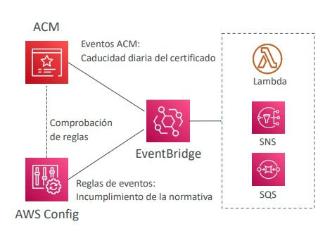

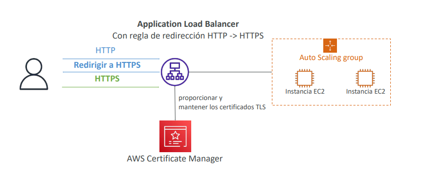

---

### 5.2 Requisito Regional de ACM para CloudFront y API Gateway
- **CloudFront y API Gateway Edge-Optimized:** El certificado ACM **debe solicitarse obligatoriamente en la región `us-east-1` (N. Virginia)** debido a la distribución global en los puntos perimetrales.
- **ALB y API Gateway Regional:** El certificado debe estar en la **misma región de AWS** donde reside el recurso.

---

## 6. Seguridad Perimetral: AWS WAF, Shield y Firewall Manager

### 6.1 AWS WAF (Web Application Firewall - Capa 7)
Filtra peticiones maliciosas HTTP/HTTPS a nivel de capa de aplicación:
- **Protección Frente a Amenazas:** Inyección SQL (SQLi), Cross-Site Scripting (XSS), bloqueo geográfico (*Geo-match*), listas negras de IPs y reglas de limitación de tasa (*Rate-based rules*) para amortiguar ataques de fuerza bruta o abusos HTTP.
- **Asociación:** Se acopla a **Application Load Balancer (ALB)**, **Amazon API Gateway**, **Amazon CloudFront**, **AWS AppSync** y **Cognito User Pools**.
- **NLB y WAF:** WAF **NO es compatible con Network Load Balancer (NLB)** (Capa 4). Si se requiere una IP fija con WAF, el patrón es desplegar **AWS Global Accelerator (con IP estática pública) delante de un ALB con WAF**.

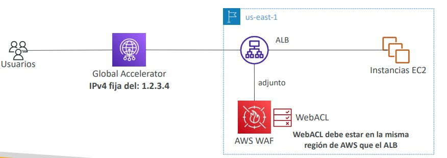

---

### 6.2 AWS Shield: Mitigación DDoS (Capas 3, 4 y 7)
- **AWS Shield Standard:** Habilitado automáticamente y sin costo para todos los clientes; mitiga ataques volumétricos comunes de capas 3 y 4 (SYN/UDP Floods, Reflection attacks).
- **AWS Shield Advanced:** Suscripción mensual ($3,000 USD/organización) que agrega:
  - Mitigación automática de ataques DDoS en capa 7 mediante despliegue autónomo de reglas de AWS WAF.
  - Protección económica contra sobrecostos por picos de escalado durante un ataque DDoS.
  - Soporte 24/7 con el equipo especializado *AWS Shield Response Team (SRT)*.
  - Cobertura sobre EC2, ELB, CloudFront, Global Accelerator y Route 53.

---

### 6.3 AWS Firewall Manager
Servicio de administración de seguridad centralizada para **AWS Organizations**:
- Permite configurar y desplegar de manera unificada reglas de **AWS WAF**, protecciones de **Shield Advanced**, reglas de **Security Groups** y **AWS Network Firewall** en todas las cuentas actuales y futuras de la organización.

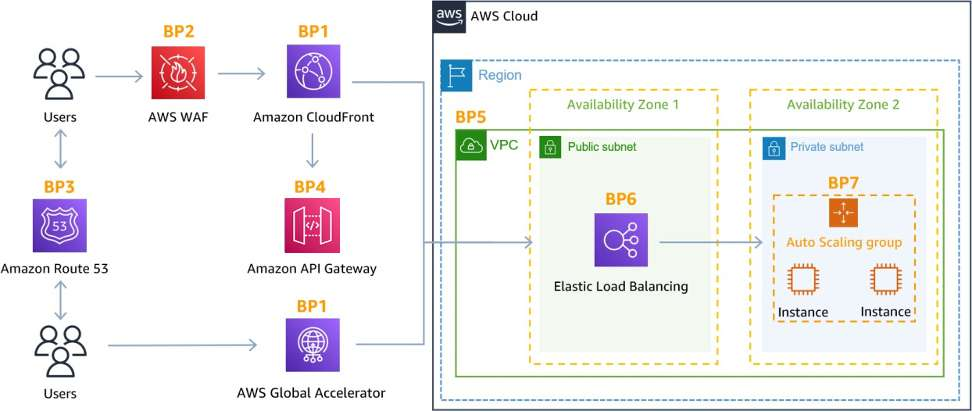

---

## 7. Detección Inteligente: GuardDuty, Inspector y Macie

### 7.1 Amazon GuardDuty (Detección de Amenazas en Tiempo Real)
Servicio continuo de detección inteligente de amenazas basado en Machine Learning y análisis de comportamiento:
- **Fuentes de Datos Ingeridas (sin necesidad de instalar agentes):**
  - **VPC Flow Logs:** Detecta conexiones inusuales a direcciones IP maliciosas externas.
  - **CloudTrail Management & S3 Data Events:** Detecta llamadas atípicas a la API o accesos no autorizados a datos.
  - **DNS Logs:** Detecta instancias comprometidas intentando comunicarse con servidores de mando y control (C&C) mediante exfiltración de datos por consultas DNS.
  - Fuentes opcionales: EKS Audit Logs, RDS Login Activity, Lambda Network Activity.
- Especializado en identificar **minería no autorizada de criptomonedas**. Alerta mediante Amazon EventBridge.

---

### 7.2 Amazon Inspector (Evaluación de Vulnerabilidades)
Servicio automatizado para el análisis de vulnerabilidades de software y exposición no intencionada de red:
- **Ámbito Exclusivo:** Instancias **Amazon EC2** (mediante el agente SSM), imágenes de contenedor en **Amazon ECR** (al ser enviadas / *push*) y funciones **AWS Lambda** (en código y librerías).
- Contrasta paquetes contra bases de datos de vulnerabilidades y exposiciones comunes (**CVE**).

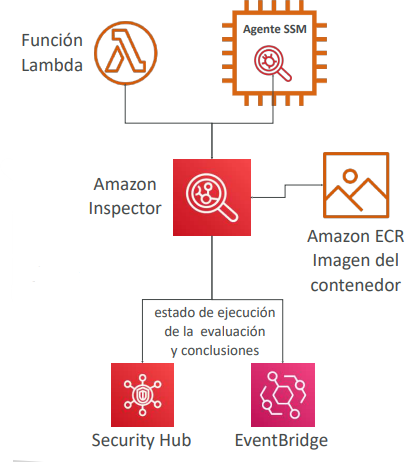

---

### 7.3 Amazon Macie (Protección y Descubrimiento de PII en S3)
Servicio de seguridad de datos que utiliza Machine Learning y correspondencia de patrones para escanear y clasificar datos confidenciales almacenados en **Amazon S3**:
- Detecta **Información de Identificación Personal (PII)** (números de pasaporte, tarjetas de crédito, números de seguridad social) y buckets S3 expuestos accidentalmente a Internet.

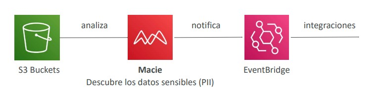

---

## 8. Comparativa: GuardDuty vs Inspector vs Macie

| Servicio | Foco Principal | Fuentes / Ámbito de Análisis | Tipo de Acción |
| :--- | :--- | :--- | :--- |
| **Amazon GuardDuty** | Detección de intrusiones, cuentas comprometidas y minería de cripto. | CloudTrail, VPC Flow Logs, DNS Logs (sin agentes). | Genera hallazgos (*findings*) de amenaza en tiempo real hacia EventBridge. |
| **Amazon Inspector** | Detección de vulnerabilidades de software (CVE) y accesibilidad de red. | Instancias EC2 (SSM Agent), contenedores ECR y código Lambda. | Genera puntuaciones de severidad y reportes de remediación de parches. |
| **Amazon Macie** | Descubrimiento y protección de privacidad / PII. | Objetos y buckets en **Amazon S3**. | Clasifica sensibilidad de datos y alerta sobre riesgos de fuga de PII. |

---

## 9. Escenarios y Consejos de Examen

> **💡 SAA-C03 Exam Tip:**
> 1. **Rotación Automática de Contraseñas de Base de Datos:** Si el enunciado pide almacenar y **rotar automáticamente credenciales de RDS sin cambiar código**, la respuesta indiscutible es **AWS Secrets Manager** (Parameter Store no incluye rotación automática de forma nativa).
> 2. **Instancias EC2 Minando Criptomonedas:** Si se detecta un pico anormal de cómputo en EC2 realizando consultas DNS anómalas o comunicándose con servidores maliciosos de criptomonedas, el servicio de seguridad que lo detecta es **Amazon GuardDuty**.
> 3. **Compartir Snapshots Cifrados entre Cuentas:** No se pueden compartir snapshots cifrados con la clave KMS por defecto `aws/ebs`. La solución exige copiar el snapshot cifrándolo con una **Customer Managed Key (CMK)** y modificar la **Política de Clave KMS** para autorizar a la cuenta destino.
> 4. **IP Estática con WAF:** WAF no se puede adjuntar a un NLB. Para entregar una solución protegida por WAF que exija una IP pública fija para clientes corporativos con firewalls rígidos, implementa **AWS Global Accelerator -> Application Load Balancer -> AWS WAF**.
