# Amazon VPC: Redes Privadas, Seguridad y Conectividad Híbrida

El módulo de **Amazon Virtual Private Cloud (Amazon VPC)** es la columna vertebral de la infraestructura en AWS y uno de los dominios más evaluados en el examen **AWS Certified Solutions Architect - Associate (SAA-C03)**. Un arquitecto debe dominar el direccionamiento CIDR IPv4/IPv6, el diseño de subredes públicas y privadas, tablas de ruteo, componentes de salida a Internet (IGW, NAT Gateway, Egress-Only IGW), mecanismos de defensa en capas (Security Groups, NACLs, Network Firewall), interconexión y conectividad híbrida (VPC Peering, VPC Endpoints/PrivateLink, Site-to-Site VPN, Direct Connect, Transit Gateway) y optimización de costos de transferencia de red.

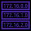

---

## 1. Fundamentos de Red: Direccionamiento CIDR y Subredes

### 1.1 Bloques CIDR IPv4 y Rangos Privados RFC 1918
Un bloque CIDR (*Classless Inter-Domain Routing*) se compone de una dirección IP base y una máscara de subred (`/XX`) que determina cuántos bits están fijados:
- `/32` $\rightarrow$ 1 sola dirección IP ($2^0$).
- `/28` $\rightarrow$ 16 direcciones IP ($2^4$) $\rightarrow$ **Tamaño mínimo de subred en AWS**.
- `/24` $\rightarrow$ 256 direcciones IP ($2^8$).
- `/16` $\rightarrow$ 65,536 direcciones IP ($2^{16}$) $\rightarrow$ **Tamaño máximo típico de bloque CIDR en una VPC**.
- `/0` $\rightarrow$ `0.0.0.0/0` representa la totalidad de las direcciones IPv4 de Internet.

**Rangos Privados Permitidos (RFC 1918):**
- `10.0.0.0/8` (`10.0.0.0` - `10.255.255.255`) $\rightarrow$ Redes corporativas grandes.
- `172.16.0.0/12` (`172.16.0.0` - `172.31.255.255`) $\rightarrow$ Rango asignado a la VPC por defecto de AWS (`172.31.0.0/16`).
- `192.168.0.0/16` (`192.168.0.0` - `192.168.255.255`) $\rightarrow$ Redes de oficina pequeña o domésticas.

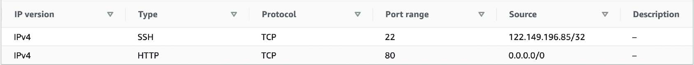

---

### 1.2 Las 5 Direcciones IP Reservadas por AWS en cada Subred
En **cada subred** aprovisionada en AWS, **5 direcciones IP están reservadas** y no se pueden asignar a instancias o interfaces ENI:
- `10.0.0.0`: Dirección de red (*Network address*).
- `10.0.0.1`: Reservada para el Router de la VPC (Gateway local).
- `10.0.0.2`: Servidor DNS asignado por Amazon (Route 53 Resolver / AmazonProvidedDNS).
- `10.0.0.3`: Reservada por AWS para uso futuro.
- `10.0.0.255`: Dirección de difusión (*Broadcast address*). AWS no admite tráfico de difusión en VPC.

> **💡 SAA-C03 Exam Tip:**
> Si un escenario de examen exige desplegar una subred que aloje al menos **29 instancias EC2**, una máscara `/27` **NO es suficiente**:
> - `/27` = 32 IPs teóricas $- 5$ reservadas = **27 IPs disponibles** ($27 < 29$).
> - La respuesta correcta obligatoria es una subred **/26**: 64 IPs teóricas $- 5$ reservadas = **59 IPs disponibles** ($59 \ge 29$).

---

## 2. Enrutamiento, Subredes y Acceso a Internet

### 2.1 Internet Gateway (IGW) y Tablas de Ruteo
- **Internet Gateway (IGW):** Componente administrado por AWS, horizontalmente escalable, redundante y altamente disponible que permite la comunicación bidireccional entre la VPC e Internet.
  - Se vincula a nivel de VPC (relación 1:1 estricta: una VPC solo puede tener un IGW asociado).
- **Subred Pública vs Privada:**
  - *Subred Pública:* Su tabla de rutas asociada tiene una ruta `0.0.0.0/0` apuntando directamente al Internet Gateway (`igw-xxxxxx`). Las instancias requieren una IP pública o Elastic IP (EIP) para navegar.
  - *Subred Privada:* No tiene ruta directa al IGW; el tráfico saliente hacia Internet se enruta hacia un **NAT Gateway** o **Instancia NAT**.

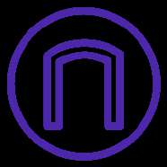

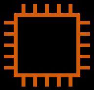

---

### 2.2 Bastion Host (Servidor Bastión)
Instancia EC2 alojada en una **subred pública** con una IP pública / EIP, utilizada como puente seguro (*jump box*) para acceder mediante SSH o RDP a instancias situadas en **subredes privadas**:
- El Security Group del Bastion Host solo debe permitir entrada en el puerto 22/3389 desde la IP pública corporativa del administrador.
- Los Security Groups de las instancias privadas solo deben permitir tráfico en el puerto 22/3389 referenciando el **Security Group ID del Bastion Host**.

---

### 2.3 NAT Gateway vs Instancia NAT

| Característica | AWS NAT Gateway | Instancia NAT (Legacy EC2) |
| :--- | :--- | :--- |
| **Administración** | 100% administrado por AWS (sin parches de SO). | Administrado por el cliente (parcheo de SO, monitoreo). |
| **Ubicación Requerida** | Debe crearse en una **subred pública** con una Elastic IP asociada. | Debe ejecutarse en una **subred pública** con Elastic IP. |
| **Configuración Especial** | Automática. | **Desactivar Source/Destination Check** en la instancia EC2. |
| **Alta Disponibilidad** | Altamente disponible dentro de su Zona de Disponibilidad (AZ). | Requiere scripts manuales de failover y Auto Scaling Groups. |
| **Diseño Multi-AZ** | **Requiere un NAT Gateway en cada AZ** para evitar que la caída de una AZ deje sin salida a las demás. | Complejo de implementar en Multi-AZ. |
| **Rendimiento** | Escala elásticamente de 5 Gbps hasta 100 Gbps. | Limitado por el ancho de banda del tipo de instancia EC2. |
| **Grupos de Seguridad** | No utiliza Security Groups (no se asocian a NAT Gateway). | Requiere configurar reglas de Security Group para entrada y salida. |

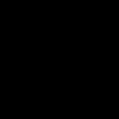

---

## 3. Seguridad de Red: Security Groups vs Network ACLs (NACLs)

La seguridad perimetral dentro de la VPC opera mediante un modelo de defensa en profundidad compuesto por dos capas:

### 3.1 Comparativa Técnica

| Característica | Security Group (SG) | Network ACL (NACL) |
| :--- | :--- | :--- |
| **Nivel de Operación** | A nivel de **Interfaz de Red Elástica (ENI) / Instancia**. | A nivel de **Subred**. |
| **Manejo de Estado** | **Stateful (Con estado):** Si el tráfico entrante está permitido, el tráfico de retorno de salida se permite automáticamente sin importar reglas de salida. | **Stateless (Sin estado):** El tráfico de retorno debe estar explícitamente autorizado en ambas direcciones (entrante y saliente). |
| **Tipos de Reglas** | Solo reglas de **Permitir (*Allow*)**. Denegación implícita. | Reglas de **Permitir (*Allow*) y Denegar (*Deny*)**. |
| **Orden de Evaluación** | Se evalúan **todas las reglas** antes de tomar la decisión. | Se evalúan en **orden numérico estricto (1-32766)**. La primera regla coincidente aplica (*first match wins*). Regla `*` final deniega el resto. |
| **Bloqueo de IPs** | No puede denegar una IP específica (solo permite). | **Herramienta ideal para bloquear una IP o rango CIDR malicioso**. |
| **Puertos Efímeros** | No aplican (automático por ser stateful). | **Requiere abrir puertos efímeros (1024-65535)** en las reglas de salida o entrada para permitir respuestas de clientes. |

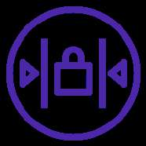

---

## 4. Interconexión entre VPCs: VPC Peering y AWS PrivateLink

### 4.1 VPC Peering
Permite interconectar dos VPCs de forma privada utilizando la red troncal de AWS:
- Las VPCs pueden estar en la misma o diferente cuenta de AWS y en la misma o diferente región (*Inter-Region VPC Peering*).
- **Regla Estricta:** Los bloques CIDR de las dos VPCs **NO deben solaparse**.
- **No Transitividad:** Si la VPC A está emparejada con la VPC B, y la VPC B está emparejada con la VPC C, **la VPC A NO puede comunicarse con la VPC C**. Se debe crear una conexión directa entre A y C.
- **Tablas de Ruta:** Se debe actualizar manualmente la tabla de rutas de cada subred añadiendo el CIDR de la VPC remota apuntando al `pcx-xxxxxx`.
- **Referencias en Security Groups:** En la misma región, un Security Group de una VPC puede referenciar por ID a un Security Group de la VPC emparejada.

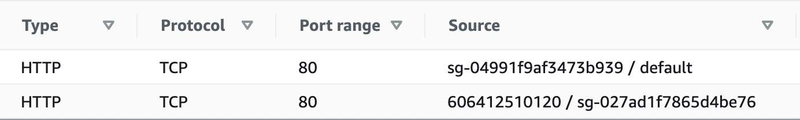

---

### 4.2 VPC Endpoints (AWS PrivateLink)
Permiten conectar instancias privadas en una VPC a servicios compatibles de AWS o aplicaciones propias sin pasar por un Internet Gateway, NAT Gateway o conexión VPN:

| Tipo de Endpoint | Servicios Soportados | Implementación Técnica | Costo |
| :--- | :--- | :--- | :--- |
| **Gateway Endpoint** | **Exclusivamente Amazon S3 y Amazon DynamoDB**. | Se añade como destino en la **Tabla de Rutas** (`pl-xxxxxx` $\rightarrow$ `vpce-xxxxxx`). No utiliza ENIs ni Security Groups. | **Completamente Gratis**. |
| **Interface Endpoint (PrivateLink)** | La gran mayoría de servicios de AWS (SNS, SQS, CloudWatch, SSM, etc.) y endpoints personalizados con NLB. | Despliega una **Elastic Network Interface (ENI)** con una dirección IP privada dentro de la subred. Requiere vincular un **Security Group**. | De pago ($/hora por ENI + $/GB procesado). |

#### ¿Cuándo usar Interface Endpoint para S3 en lugar de Gateway Endpoint?
Aunque el Gateway Endpoint es gratuito y preferido dentro de la VPC, el **Interface Endpoint para S3** es indispensable si se necesita acceder al bucket S3 desde:
1. Una red local (*on-premises*) a través de **AWS Direct Connect** o **Site-to-Site VPN**.
2. Una VPC en otra región o mediante un **Transit Gateway**.

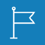

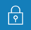

---

## 5. Auditoría y Diagnóstico: VPC Flow Logs

Captura información sobre el tráfico IP que entra y sale de las interfaces de red de la VPC:
- **Niveles de Monitoreo:** A nivel de VPC completa, subred o ENI individual.
- **Destinos de Exportación:** Amazon CloudWatch Logs o Amazon S3 (para análisis forense con Amazon Athena y visualización en QuickSight).
- **Diagnóstico de Conectividad con el campo `ACTION`:**
  - `REJECT` entrante $\rightarrow$ Bloqueado por regla de entrada de SG o NACL.
  - `ACCEPT` entrante y `REJECT` saliente $\rightarrow$ Bloqueado por regla de salida de la **NACL** (el SG es stateful, por lo que nunca bloquearía la salida).

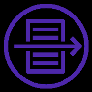

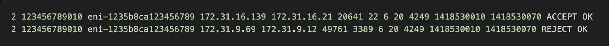

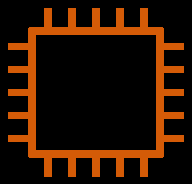

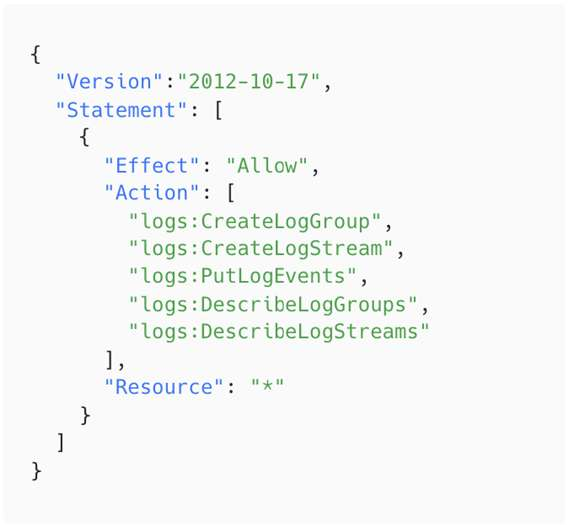
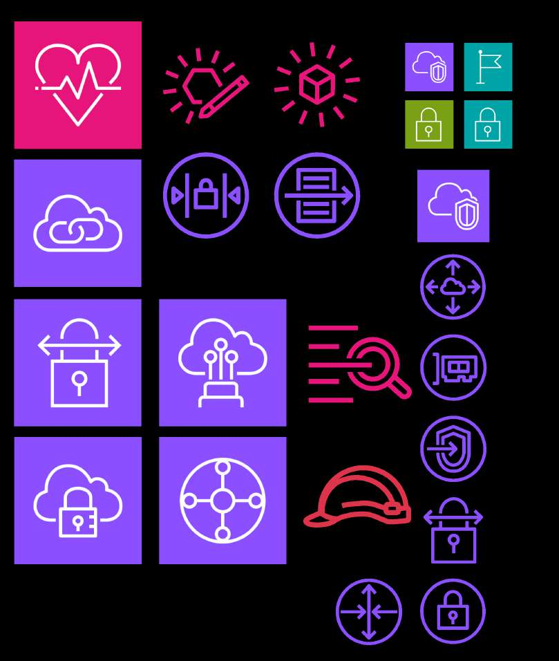

---

## 6. Conectividad Híbrida: VPN, Direct Connect y Transit Gateway

### 6.1 AWS Site-to-Site VPN
Conecta de forma segura el centro de datos local con la VPC a través de túneles IPsec cifrados sobre la Internet pública:
- **Virtual Private Gateway (VGW):** Concentrador VPN en el lado de AWS vinculado a la VPC.
- **Customer Gateway (CGW):** Dispositivo físico o software en el lado del cliente (requiere IP pública enrutable por Internet).
- **Paso Crítico de Configuración:** Habilitar la **propagación de rutas (*Route Propagation*)** en las tablas de ruteo de la VPC para aprender automáticamente las rutas de la red on-premises.

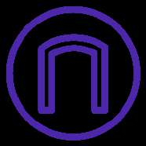

---

### 6.2 AWS Direct Connect (DX)
Proporciona una conexión de red física y privada dedicada desde el centro de datos local hacia AWS sin transitar por Internet:
- **Ventajas:** Rendimiento masivo y predecible (1 Gbps a 100 Gbps dedicados), menor latencia y tarifas reducidas de transferencia de datos salientes (*Data Transfer Out*).
- **Tipos de VIF (Virtual Interfaces):**
  - *Private VIF:* Para conectar a recursos privados en la VPC (instancias EC2).
  - *Public VIF:* Para conectar a servicios públicos de AWS (S3, Glacier) sin usar Internet.
  - *Transit VIF:* Para conectar a un **AWS Transit Gateway**.
- **Cifrado en Direct Connect:** La conexión física es privada pero **NO está cifrada por defecto**. Para lograr cifrado IPsec en tránsito sobre Direct Connect, se debe desplegar una **VPN Site-to-Site sobre la conexión de Direct Connect**.

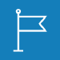

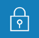

---

### 6.3 AWS Transit Gateway (TGW)
Actúa como un router de red centralizado (*Hub-and-Spoke*) que simplifica la topología de interconexión entre miles de VPCs, conexiones VPN y Direct Connect:
- **Enrutamiento Transitivo:** Resuelve la limitación de VPC Peering permitiendo que todas las redes hablen entre sí a través del concentrador TGW.
- **Soporte de IP Multicast:** Único servicio en AWS que admite distribución de tráfico multicast en la nube.
- **ECMP (Equal-Cost Multi-Path Routing):** Permite agregar el ancho de banda de múltiples túneles VPN activos simultáneamente (cada túnel entrega 1.25 Gbps; con ECMP se escala a múltiplos de 2.5 Gbps, 5 Gbps, etc.).
- **Compartición:** Se comparte entre múltiples cuentas de AWS Organizations usando **AWS RAM (Resource Access Manager)**.

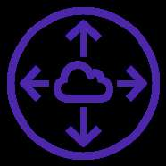

---

## 7. Tráfico Avanzado y Redes IPv6

### 7.1 VPC Traffic Mirroring
Permite duplicar de forma no intrusiva el tráfico de red de interfaces ENI de origen y enviarlo a dispositivos de seguridad dedicados (monitoreo IDS/IPS, analizadores de paquetes) alojados detrás de un **Network Load Balancer** u otra ENI.

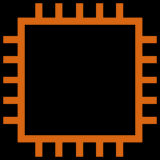

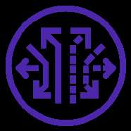

---

### 7.2 Arquitectura IPv6 y Egress-Only Internet Gateway
- Todas las direcciones IPv6 asignadas en AWS son **globalmente enrutables y públicas** (no existe el concepto de IPv6 privada bajo NAT).
- **Dual-Stack:** Las VPCs y subredes operan en modo de pila dual (IPv4 privada + IPv6 pública). No se puede deshabilitar IPv4.
- **Egress-Only Internet Gateway (EIGW):** Componente para IPv6 análogo al NAT Gateway en IPv4. Permite que las instancias de subredes privadas inicien conexiones salientes hacia Internet vía IPv6, **impidiendo que clientes externos inicien conexiones entrantes** hacia dichas instancias.

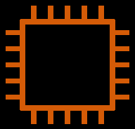

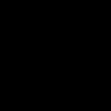

---

## 8. Optimización de Costos de Red en AWS

1. **Tráfico de Entrada (*Ingress*):** Es siempre **gratuito** hacia AWS desde Internet.
2. **Tráfico dentro de la misma AZ:** La transferencia de datos entre instancias en la misma AZ usando **direcciones IP privadas** es **gratuita**. Si se utiliza la IP pública o Elastic IP, se factura $0.01/GB en cada dirección.
3. **Tráfico entre AZs (misma región):** Se factura $0.01/GB por envío y $0.01/GB por recepción.
4. **Tráfico entre Regiones (*Cross-Region*):** Facturación estándar de $0.02/GB.
5. **Gateway Endpoint vs NAT Gateway para S3:** Acceder a Amazon S3 a través de un **Gateway Endpoint es 100% gratuito** (sin costo por hora ni por GB procesado), mientras que acceder a través de un NAT Gateway incurre en $0.045/hora más $0.045 por GB procesado.

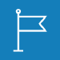
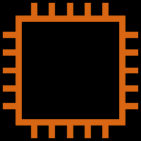

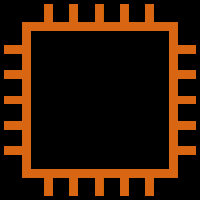

---

## 9. AWS Network Firewall: Inspección Perimetral Avanzada

Servicio de firewall administrado de inspección profunda de paquetes (Capas 3 a 7) para toda la VPC:
- Despliega endpoints de firewall respaldados internamente por **Gateway Load Balancer (GWLB)**.
- Inspecciona tráfico bidireccional: VPC a VPC, salida a Internet, entrada desde Internet, y conexiones Direct Connect / VPN.
- **Reglas con Estado (*Stateful Rules*):** Filtrado por nombres de dominio (FQDN lista blanca como `*.corp.com`), firmas de detección de intrusiones (reglas compatibles con Suricata) e inspección de protocolos.

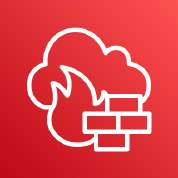

---

## 10. Consejos Clave para el Examen SAA-C03

> **💡 SAA-C03 Exam Tip:**
> 1. **Acceso a S3 desde Subred Privada al Menor Costo:** Si instancias EC2 en una subred privada descargan terabytes de datos desde Amazon S3 y la empresa busca **eliminar costos de procesamiento y transferencias por NAT Gateway**, la solución mandatoria es crear un **VPC Gateway Endpoint para Amazon S3** y asociarlo a la tabla de rutas.
> 2. **Bloqueo Urgente de una Dirección IP Maliciosa:** Los Security Groups no pueden denegar IPs individuales. La acción arquitectónica inmediata para bloquear tráfico malicioso de una IP específica hacia una subred es crear una **regla de denegación (DENY) en la Network ACL (NACL)** con un número de regla inferior a la regla que permite el tráfico.
> 3. **Conexión Direct Connect Cifrada:** Direct Connect por sí solo es una conexión privada sin cifrado. Si los requisitos de cumplimiento corporativo exigen **cifrado estricto en tránsito (IPsec)** sobre una línea Direct Connect, la solución correcta es configurar una **VPN Site-to-Site sobre la conexión de Direct Connect**.
> 4. **Topología Transitiva Compleja (Centenares de VPCs y Red On-Premises):** Cuando el enunciado describa problemas de escalabilidad debido a una malla compleja de decenas o cientos de conexiones VPC Peering y múltiples túneles VPN, la solución de arquitectura centralizada es **AWS Transit Gateway**.
