# Recuperación ante Desastres (DR) y Migraciones en AWS

El diseño de arquitecturas resilientes preparadas para la **Recuperación ante Desastres (*Disaster Recovery - DR*)** y la adopción de estrategias ágiles de migración representan dos de los pilares más relevantes en el examen **AWS Certified Solutions Architect - Associate (SAA-C03)**. Un arquitecto debe ser capaz de evaluar los objetivos de negocio (**RPO y RTO**), equilibrar costos de infraestructura frente al tiempo de recuperación, y seleccionar los servicios adecuados para migrar datos, esquemas de bases de datos y servidores físicos o virtuales hacia la nube.

---

## 1. Fundamentos de Disaster Recovery: RPO y RTO

La planificación ante catástrofes se fundamenta en dos métricas cuantitativas clave:

1. **Recovery Point Objective (RPO - Objetivo de Punto de Recuperación):**
   - Determina la **cantidad máxima de pérdida de datos** tolerable medida en tiempo hacia atrás desde el incidente.
   - Responde a la pregunta: *¿Cuántos minutos u horas de datos estamos dispuestos a perder o recrear?*
   - Define la **frecuencia de copias de seguridad o replicación**.
2. **Recovery Time Objective (RTO - Objetivo de Tiempo de Recuperación):**
   - Determina el **tiempo máximo de inactividad permitido** para restablecer el servicio tras un desastre.
   - Responde a la pregunta: *¿Cuánto tiempo puede estar el sistema caído antes de causar un impacto inaceptable al negocio?*
   - Define la **estrategia de arquitectura y automatización de conmutación por error (*failover*)**.

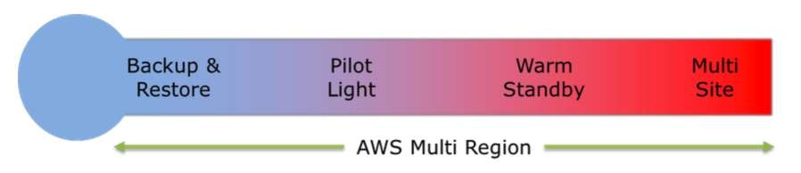

---

## 2. Las Cuatro Estrategias de Disaster Recovery en AWS

A medida que el RTO y el RPO disminuyen (recuperación más rápida con menor pérdida de datos), el costo y la complejidad de la solución se incrementan progresivamente.

### 2.1 Comparativa de Estrategias de DR

| Estrategia | RTO | RPO | Costo Relativo | Descripción de Infraestructura |
| :--- | :--- | :--- | :--- | :--- |
| **Backup & Restore** | Horas a Días | Horas a Días | **$ (El más bajo)** | Sin recursos de cómputo en ejecución. Solo backups en S3/Glacier o snapshots EBS/RDS que se restauran cuando ocurre el desastre. |
| **Pilot Light** | Decenas de Minutos a Horas | Minutos | **$$** | El núcleo crítico de datos está activo (base de datos replicándose en vivo), pero los servidores de cómputo (EC2/ASG) están apagados o solo existen en AMIs/plantillas CloudFormation. |
| **Warm Standby** | Minutos | Segundos a Minutos | **$$$** | Una versión completa del sistema funciona continuamente a escala reducida (*scaled-down*). En caso de desastre, escala elásticamente al 100% de carga. |
| **Multi-Site Active-Active** | Tiempo real (Segundos / 0) | Cero o Subsegundo | **$$$$ (El más alto)** | Carga completa de producción ejecutándose simultáneamente en dos regiones o entornos (on-prem + AWS), con balanceo activo vía Route 53. |

---

### 2.2 Análisis Detallado de Cada Estrategia

#### 1. Copia de Seguridad y Restauración (Backup & Restore)
- Los datos y configuraciones se respaldan periódicamente en **Amazon S3**, **S3 Glacier**, snapshots de Amazon EBS y Amazon RDS.
- Desde entornos locales, se pueden transferir copias masivas mediante **AWS Storage Gateway** o dispositivos de la familia **AWS Snowball**.
- Si ocurre una catástrofe, se aprovisiona la infraestructura desde cero usando plantillas de **AWS CloudFormation**, AMIs preconfiguradas y restauración de snapshots.
- **Caso de Uso:** Cargas no críticas donde se toleran horas de indisponibilidad para ahorrar al máximo en costos operativos.

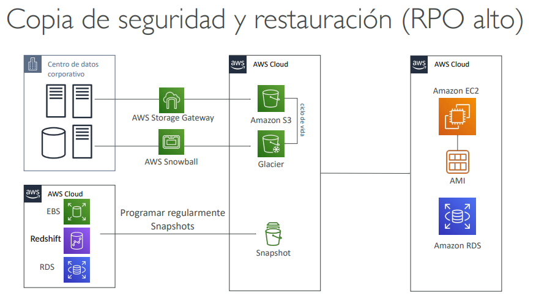

#### 2. Luz Piloto (Pilot Light)
- Análogo a la llama piloto de una caldera: el componente más crítico (la base de datos) está **siempre encendido y sincronizado** en AWS (ej. réplica de RDS activa recibiendo cambios continuos).
- Los servidores de aplicaciones no se están ejecutando; se mantienen como AMIs listas para instanciarse.
- Durante un desastre, la base de datos secundaria se promueve a primaria y se disparan scripts o Auto Scaling Groups para desplegar la flota de servidores EC2 en cuestión de minutos.

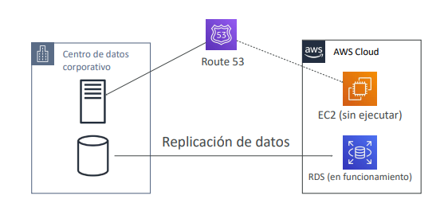

#### 3. Espera Caliente (Warm Standby)
- Todos los niveles de la arquitectura (servidores web, balanceadores de carga y bases de datos) están desplegados y operativos en la región secundaria, pero dimensionados al **mínimo indispensable de capacidad** (ej. 1 o 2 instancias pequeñas en el ASG).
- Puede manejar un tráfico mínimo de pruebas internas o monitoreo.
- Si el sitio principal falla, **Amazon Route 53** conmuta el tráfico DNS al sitio de respaldo y el **Auto Scaling Group** escala horizontalmente hacia la capacidad completa de producción en minutos.

#### 4. Multisitio Activo-Activo (Multi-Site Active-Active)
- Entornos de producción completos y dimensionados al 100% ejecutándose simultáneamente en dos o más regiones de AWS (o híbrido on-premise y AWS).
- El tráfico se distribuye activamente entre ambas ubicaciones utilizando políticas de enrutamiento ponderado (*Weighted*), de latencia o geolocalización en **Amazon Route 53**.
- Emplea bases de datos globales con replicación activa o multimaestro (como **Amazon Aurora Global Database** o **Amazon DynamoDB Global Tables**).

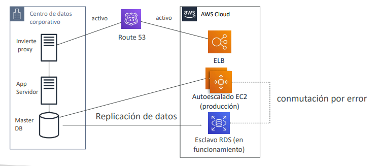

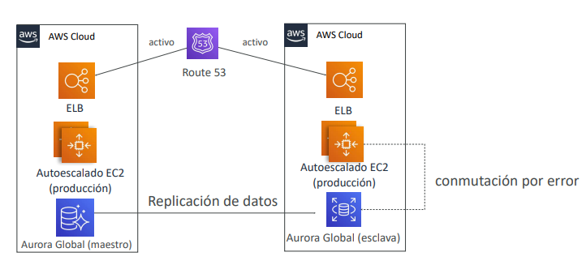

---

## 3. AWS Elastic Disaster Recovery (AWS DRS)

**AWS Elastic Disaster Recovery (AWS DRS)** (sucesor tecnológico de CloudEndure Disaster Recovery) proporciona recuperación ante desastres automatizada para servidores físicos, virtuales (VMware, Hyper-V) o basados en la nube (otras nubes o entre regiones de AWS):
- **Replicación Continua a Nivel de Bloque:** El *AWS Replication Agent* instalado en el sistema operativo replica los cambios en disco en tiempo real (segundos de RPO) hacia un área de ensayo (*Staging Area*) de bajo costo en AWS (instancias EC2 mínimas y volúmenes EBS gp3).
- **Conmutación por Error Rápida (*Failover*):** En caso de desastre o ataque de ransomware, DRS orquesta automáticamente el lanzamiento de instancias EC2 con cómputo de producción en cuestión de minutos (RTO de minutos).
- **Pruebas No Disruptivas:** Permite realizar simulacros frecuentes de recuperación ante desastres sin interrumpir la operación ni la replicación continua.

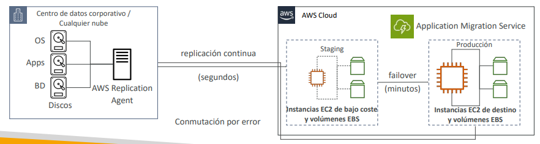

---

## 4. AWS Backup y Backup Vault Lock

### 4.1 AWS Backup
Servicio centralizado y totalmente gestionado para automatizar y coordinar respaldos periódicos a través de los servicios de AWS:
- **Servicios Integrados:** EC2, EBS, S3, RDS, Aurora, DynamoDB, DocumentDB, Neptune, EFS, FSx y AWS Storage Gateway (Volume Gateway).
- **Planes de Copia de Seguridad (*Backup Plans*):** Reglas basadas en etiquetas de asignación (*tag-based policies*) que definen frecuencia de ejecución, ventana de backup, transición al ciclo de vida en almacenamiento frío (*cold storage*) y retención final.
- **Protección entre Cuentas y Regiones:** Admite copias automatizadas de backups hacia otras regiones de AWS y hacia cuentas secundarias aisladas de AWS Organizations para resguardo forense.

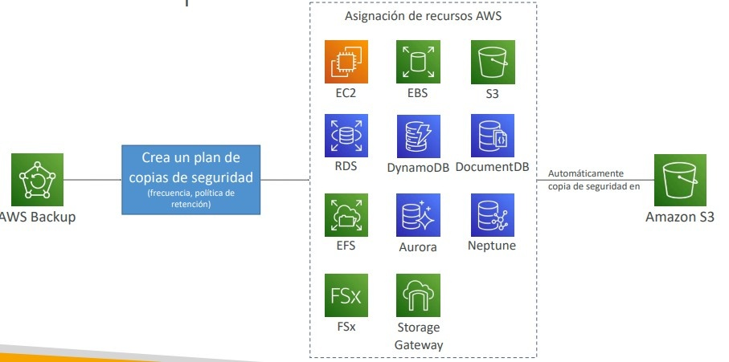

---

### 4.2 AWS Backup Vault Lock
Aplica un modelo de cumplimiento estricto **WORM (*Write Once, Read Many*)** a las bóvedas de respaldos:
- Impide que cualquier entidad (incluido el usuario `root` de la cuenta de AWS) pueda eliminar copias de seguridad o acortar los períodos de retención configurados.
- Esencial para cumplir normativas regulatorias estrictas y proteger la organización contra ataques maliciosos internos o secuestro por **ransomware**.

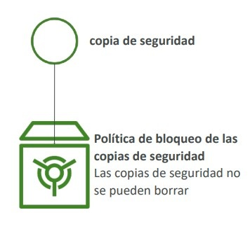

---

## 5. Migración de Bases de Datos: AWS DMS y AWS SCT

La migración de bases de datos hacia AWS requiere distinguir cuándo se trata de una migración homogénea o heterogénea.

### 5.1 AWS Database Migration Service (AWS DMS)
Servicio administrado que migra almacenes de datos relacionales y no relacionales manteniendo la base de datos de origen 100% operativa durante el proceso:
- **Instancia de Replicación de DMS:** Instancia EC2 administrada que ejecuta las tareas de migración en la VPC. Admite despliegue **Multi-AZ** para alta disponibilidad y tolerancia a fallos durante migraciones críticas.
- **Carga Completa + CDC (Change Data Capture):** Extrae el estado inicial de la base de datos y lee los logs de transacciones del motor de origen para replicar continuamente los cambios incrementales hasta el momento del corte definitivo (*cutover*).
- **Fuentes y Destinos Soportados:** Migra desde Oracle, SQL Server, MySQL, Postgres o MongoDB hacia Amazon RDS, Aurora, DynamoDB, Redshift, S3 o DocumentDB.

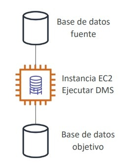

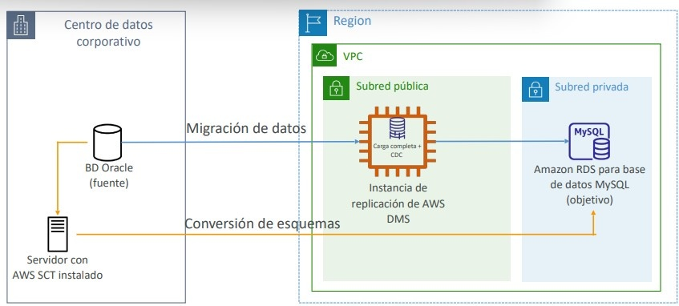

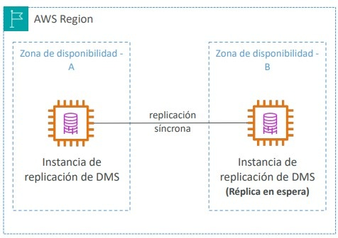

---

### 5.2 AWS Schema Conversion Tool (AWS SCT)
Herramienta que convierte esquemas de bases de datos, vistas, procedimientos almacenados y código SQL de un motor hacia otro diferente:
- **Cuándo es Obligatorio:** En **migraciones heterogéneas** (ej. de Oracle o Microsoft SQL Server a Amazon Aurora PostgreSQL / MySQL, o de Teradata a Amazon Redshift).
- **Cuándo NO se requiere:** En **migraciones homogéneas** (ej. PostgreSQL local a Amazon RDS PostgreSQL), ya que los esquemas son idénticos y el motor de origen coincide con el destino.

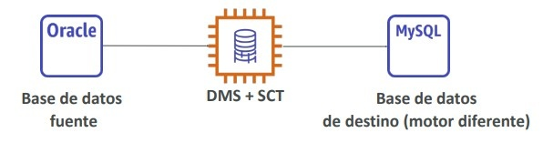

---

### 5.3 Opciones de Migración Directa hacia Amazon Aurora

| Escenario | Método de Migración Recomendado |
| :--- | :--- |
| **RDS MySQL $\rightarrow$ Aurora MySQL** | Crear una **Réplica de Lectura de Aurora** desde la instancia RDS MySQL existente y promoverla a clúster independiente cuando el retraso de replicación sea 0; o restaurar un DB Snapshot de RDS directamente como Aurora. |
| **MySQL Externo (On-Prem) $\rightarrow$ Aurora MySQL** | Realizar backup con **Percona XtraBackup** hacia un bucket de Amazon S3 y restaurar directamente como clúster Aurora MySQL; o utilizar **AWS DMS**. |
| **RDS PostgreSQL $\rightarrow$ Aurora PostgreSQL** | Crear una Réplica de Lectura Aurora o restaurar un snapshot de RDS PostgreSQL en Aurora PostgreSQL. |
| **PostgreSQL Externo $\rightarrow$ Aurora PostgreSQL** | Exportar backup a Amazon S3 e importar utilizando la extensión `aws_s3` de Aurora PostgreSQL; o utilizar **AWS DMS**. |

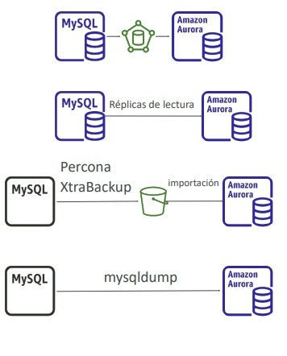

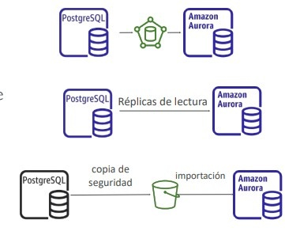

---

## 6. Migración de Servidores y Cargas de Trabajo

### 6.1 AWS Application Discovery Service
Recopila inventario y métricas de rendimiento de servidores locales para planificar proyectos de migración estructurados:
- **Agentless Discovery (Conector sin agente):** Desplegado como máquina virtual en entornos VMware vCenter. Recopila inventario de VMs, utilización promedio de CPU, memoria y asignación de discos.
- **Agent-based Discovery (Agente de software):** Instalado dentro del sistema operativo. Captura información profunda a nivel de procesos en ejecución y **mapas de dependencias de red entre servidores** (esencial para determinar qué servidores deben migrarse juntos en grupos).
- Los datos se visualizan y gestionan en **AWS Migration Hub**.

---

### 6.2 AWS Application Migration Service (AWS MGN)
Solución primaria recomendada por AWS para migraciones masivas de tipo *Lift-and-Shift* de servidores físicos, virtuales o en la nube hacia instancias nativas Amazon EC2:
- Utiliza replicación continua a nivel de bloque en segundo plano sin interrumpir los sistemas en producción.
- Permite realizar pruebas de lanzamiento no disruptivas antes de ejecutar la conmutación final con un tiempo de inactividad mínimo.

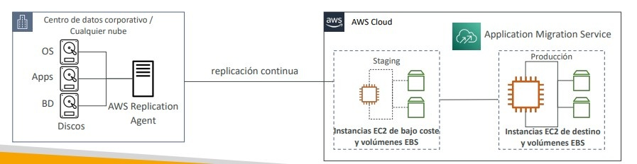

---

### 6.3 VMware Cloud on AWS
Permite extender o migrar centros de datos locales basados en VMware vSphere directamente hacia infraestructura física bare-metal dedicada en AWS:
- Permite operar con las mismas herramientas habituales (vCenter, vSAN, NSX-T) sin necesidad de reescribir aplicaciones ni convertir máquinas virtuales.

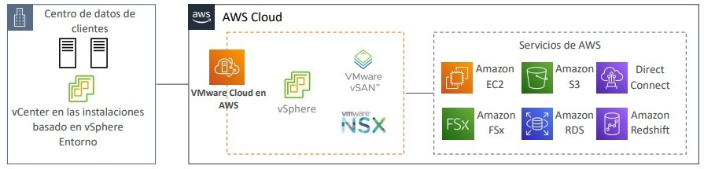

---

## 7. Transferencia Masiva de Datos: Red vs Dispositivos Físicos

Para migrar volúmenes de datos superiores a varias decenas o cientos de terabytes, la limitación física del ancho de banda de red hace inviable la transferencia directa por Internet:
- Si el cálculo de tiempo para transferir los datos por Internet o VPN supera **una o dos semanas**, la mejor práctica arquitectónica es solicitar dispositivos físicos de la familia **AWS Snow Family (AWS Snowball Edge / Snowmobile)**.
- Una vez cargados los datos masivos en S3 mediante Snowball, se puede activar **AWS DMS con CDC** para replicar exclusivamente las mutaciones incrementales ocurridas durante el transporte del dispositivo físico.

---

## 8. Escenarios Típicos y Consejos de Examen

> **💡 SAA-C03 Exam Tip:**
> 1. **DMS vs SCT:**
>    - Si el examen pide migrar una base de datos **Oracle on-premises hacia Amazon Aurora MySQL**, la respuesta correcta exige usar **AWS SCT** (para convertir las tablas y procedimientos almacenados de Oracle a sintaxis MySQL) **Y** **AWS DMS** (para migrar los datos reales con CDC continuo).
>    - Si la migración es de **Oracle on-premises a Amazon RDS Oracle** (homogénea), **NO se utiliza SCT**, únicamente herramientas nativas de Oracle o **AWS DMS**.
> 2. **Identificación de Estrategia de DR por Palabras Clave:**
>    - *"Cómputo apagado, solo la base de datos sincronizada continuamente"* $\rightarrow$ **Pilot Light**.
>    - *"El sistema completo funciona a escala mínima y se escala automáticamente en minutos"* $\rightarrow$ **Warm Standby**.
>    - *"Sin recursos en ejecución en AWS, solo backups y snapshots restaurables"* $\rightarrow$ **Backup & Restore**.
> 3. **Protección Contra Borrado Malicioso de Backups:** Para garantizar que ni administradores ni atacantes con credenciales de `root` puedan borrar copias de seguridad de bases de datos o volúmenes EBS, la solución obligatoria es implementar **AWS Backup con Vault Lock en modo Compliance**.
