# Soluciones de Arquitectura Avanzadas y Patrones de Diseño en AWS

El examen **AWS Certified Solutions Architect - Associate (SAA-C03)** incluye con frecuencia preguntas integradoras que combinan múltiples servicios para resolver problemas específicos de negocio. Estas preguntas evalúan el dominio de patrones de desacoplamiento asíncrono (**Fan-Out, DLQ, EventBridge**), estrategias multinivel de **almacenamiento en caché**, filtrado y bloqueo perimetral de **direcciones IP**, arquitecturas de **Computación de Alto Rendimiento (HPC)** y patrones de **recuperación automática de instancias individuales de EC2** con retención de estado e IP elástica.

---

## 1. Patrones de Integración y Procesamiento de Eventos

### 1.1 Desacoplamiento y Manejo de Errores: SQS, SNS y AWS Lambda
- **SNS + SQS (Patrón Fan-Out):** En lugar de que una aplicación cliente deba iterar para enviar un mismo mensaje a múltiples destinos mediante llamadas sucesivas al SDK, envía un único mensaje a un tema de **Amazon SNS**. El tema distribuye el mensaje en paralelo a múltiples colas **Amazon SQS** suscritas (cada una procesada de manera independiente por diferentes microservicios).
- **Procesamiento de Colas Estándar con Lambda:** Lambda realiza un sondeo continuo (*polling*) de la cola. Si una invocación falla, el mensaje vuelve a estar visible en la cola tras el tiempo de visibilidad (*Visibility Timeout*). Tras alcanzar el número máximo de reintentos (*maxReceiveCount*), el mensaje se desvía a una **Dead Letter Queue (DLQ)** de SQS para su posterior depuración.
- **SQS FIFO + Lambda:** Los mensajes se procesan en estricto orden por grupo de mensajes (*MessageGroupID*). Si un mensaje falla, el procesamiento de ese grupo se bloquea (*head-of-line blocking*) hasta que se resuelva o el mensaje se envíe a la DLQ.

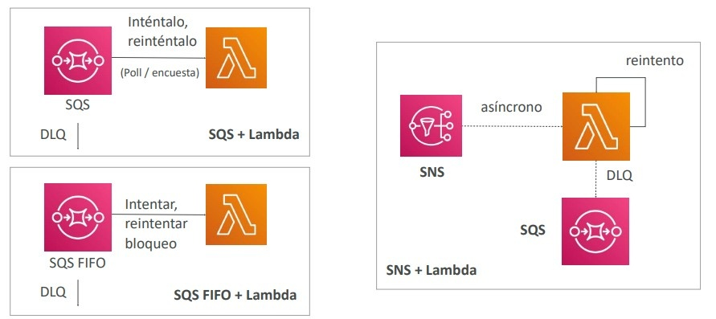

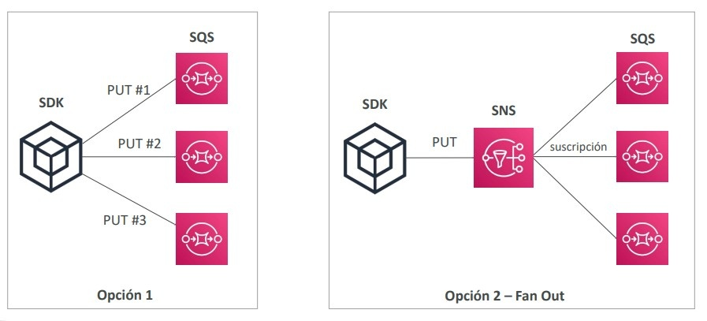

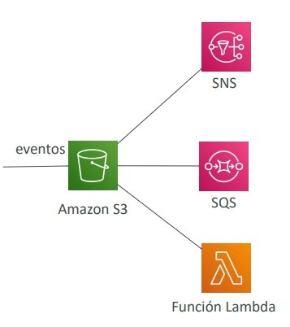

---

### 1.2 Notificaciones de Eventos de Amazon S3: Nativas vs Amazon EventBridge
Amazon S3 puede emitir notificaciones ante mutaciones de objetos (`s3:ObjectCreated:*`, `s3:ObjectRemoved:*`, `s3:ObjectRestore:*`, etc.):

| Característica | Notificaciones Nativas de S3 | S3 Event Notifications con Amazon EventBridge |
| :--- | :--- | :--- |
| **Destinos Soportados** | Únicamente **SNS Topics, SQS Queues y AWS Lambda**. | **Más de 18 servicios de AWS** (Step Functions, Kinesis Streams/Firehose, CodePipeline, SSM, etc.). |
| **Capacidades de Filtrado** | Básico: únicamente por prefijo y sufijo del nombre de la clave (ej. `.jpg`). | **Filtrado JSON avanzado** (por tamaño de objeto, metadatos, tipo de operación, cabeceras). |
| **Gobernanza y Confiabilidad** | Sin capacidades de archivo ni repetición. | **Archive & Replay**, entrega confiable y auditoría de eventos. |

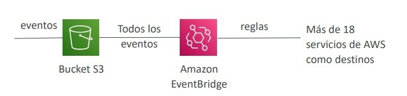

---

### 1.3 Intercepción de Llamadas a la API y Auditoría en Tiempo Real
Un patrón recurrente de seguridad consiste en reaccionar ante acciones destructivas o riesgosas registradas por **AWS CloudTrail** (ej. una llamada a la API `DeleteTable` en DynamoDB o `AuthorizeSecurityGroupIngress` en EC2):
- CloudTrail registra el evento de gestión.
- **Amazon EventBridge** captura la regla del evento y activa una alerta inmediata a un tema de **Amazon SNS** o dispara una función **AWS Lambda** para revertir el cambio.

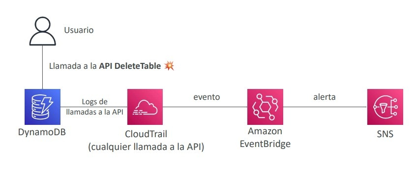

---

### 1.4 API Gateway como Proxy de Ingesta Directa a Servicios AWS
Para ingestar datos masivos en tiempo real (ej. streaming de telemetría IoT o clics web), no es obligatorio interponer una función Lambda entre el cliente y el bus de datos:
- **API Gateway** puede configurarse con una **Integración Directa de Servicio de AWS (*AWS Service Integration*)** hacia **Amazon Kinesis Data Streams** o **Amazon Kinesis Data Firehose**.
- Elimina capas innecesarias de cómputo, reduce la latencia de ingestión y minimiza costos operativos.

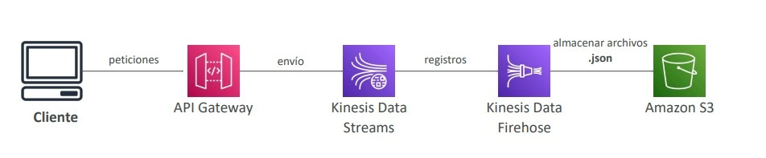

---

## 2. Estrategias de Almacenamiento en Caché en AWS

El examen evalúa con frecuencia la optimización de latencia, cómputo y costos mediante almacenamiento en caché en las distintas capas de una arquitectura:

1. **Borde / Perímetro (Amazon CloudFront):** Almacena en caché contenido estático (HTML, imágenes, vídeos) y respuestas dinámicas con cabeceras `Cache-Control` cerca de los usuarios finales en los Edge Locations mundiales.
2. **Puerta de Enlace de API (API Gateway Caching):** Almacena respuestas HTTP completas de endpoints por un TTL configurable; evita invocar el backend (Lambda o EC2) ante consultas idénticas.
3. **Capa de Aplicación en Memoria (Amazon ElastiCache Redis / Memcached):** Almacena estructuras de datos complejas, sesiones web distribuidas y resultados computados pesados con latencia de submilisegundos.
4. **Capa de Base de Datos NoSQL (DynamoDB Accelerator - DAX):** Clúster de caché en memoria transparente frente a tablas DynamoDB que reduce la latencia de lectura de milisegundos a microsegundos.

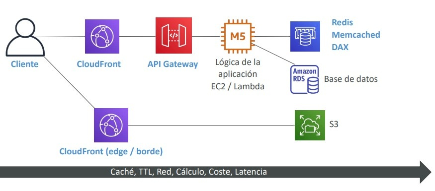

---

## 3. Bloqueo de Direcciones IP Maliciosas: Comparativa de Arquitecturas

Una de las preguntas clásicas del examen SAA-C03 presenta un ataque proveniente de un conjunto de direcciones IP maliciosas y pregunta en qué capa de la arquitectura deben bloquearse para proteger el backend.

### 3.1 Escenarios de Bloqueo de IP

1. **Instancia EC2 Directa en Subred Pública:**
   - **Network ACL (NACL):** Regla de denegación (`DENY`) a nivel de subred para la IP o rango CIDR específico.
   - *Nota:* Los Security Groups **no pueden** bloquear IPs (solo admiten reglas de permiso).
2. **Instancias detrás de un Application Load Balancer (ALB):**
   - El ALB termina la conexión TCP del cliente en la subred pública y abre una nueva conexión con la instancia EC2.
   - La IP que ve el Security Group de la instancia EC2 es la IP privada del ALB, mientras que la IP real del cliente se preserva en la cabecera HTTP `X-Forwarded-For`.
   - **Mecanismos de Bloqueo:**
     - A nivel de subred mediante la **NACL** de la subred donde reside el ALB.
     - A nivel de capa 7 vinculando **AWS WAF** al ALB con una regla de coincidencia de IP (*IP Set*).
3. **Instancias detrás de un Network Load Balancer (NLB):**
   - El NLB preserva la dirección IP de origen del cliente a nivel de capa 4.
   - El bloqueo se puede implementar en la **NACL** de la subred pública o en el **Security Group del propio NLB / instancias**.
4. **Arquitectura con CloudFront + ALB:**
   - Si una distribución de CloudFront está situada frente al ALB, la NACL del ALB solo ve las direcciones IP públicas de los Edge Locations de CloudFront (**bloquear IPs en la NACL del ALB bloquearía a CloudFront entero**).
   - **Solución Obligatoria:** Implementar **AWS WAF acoplado a la distribución de CloudFront** (o usar la función de restricción geográfica de CloudFront) para descartar el tráfico malicioso en el borde antes de que ingrese a la red de AWS.

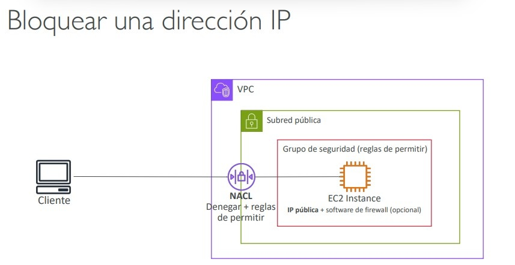

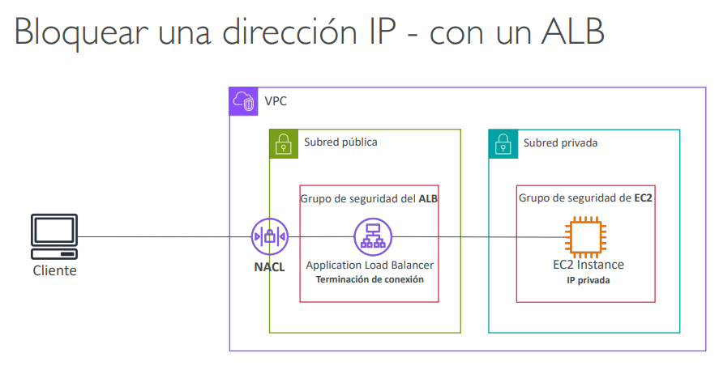

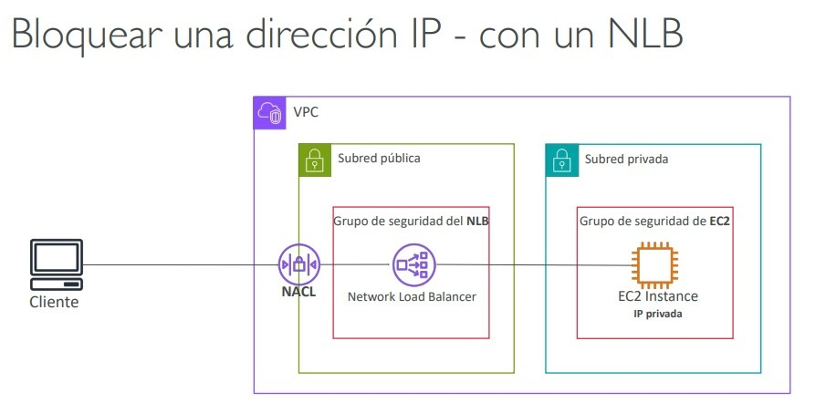

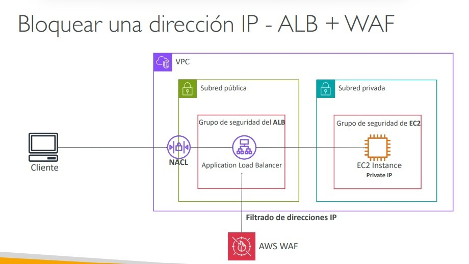

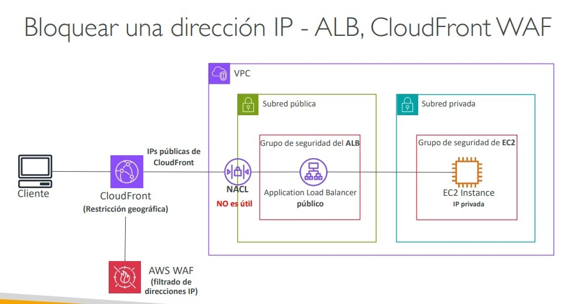

---

## 4. Computación de Alto Rendimiento (High Performance Computing - HPC)

Las cargas de trabajo de HPC (simulaciones científicas, modelos de riesgo financiero, aprendizaje profundo, renderizado genómico) requieren un cómputo masivo, interconexiones de ultra baja latencia y almacenamiento de altísimo rendimiento.

### 4.1 Redes de Alto Rendimiento en EC2
- **Placement Group en Modo Cluster:** Empaqueta instancias dentro del mismo rack físico en una única Zona de Disponibilidad, entregando la menor latencia de red posible y velocidades de hasta 100 Gbps.
- **Elastic Network Adapter (ENA):** Controlador de red mejorado estándar (SR-IOV) que proporciona hasta 100 Gbps de ancho de banda.
- **Elastic Fabric Adapter (EFA):** Dispositivo de red especializado para sistemas Linux que optimiza aplicaciones HPC y Machine Learning estrechamente acopladas (*tightly-coupled*).
  - Utiliza el protocolo **Message Passing Interface (MPI)**.
  - **Bypasea el kernel del sistema operativo Linux** (acceso directo al hardware de red), reduciendo la latencia de comunicación entre nodos a valores cercanos a cero.

### 4.2 Almacenamiento y Orquestación para HPC
- **Amazon FSx para Lustre:** Sistema de archivos distribuido paralelo optimizado para cómputo masivo; escala a millones de IOPS con latencia de submilisegundos y se sincroniza directamente con Amazon S3.
- **AWS Batch:** Planificador de trabajos (*job scheduler*) serverless para cargas por lotes en contenedores o instancias EC2 que admite **trabajos paralelos multinodo (*multi-node parallel jobs*)**.
- **AWS ParallelCluster:** Herramienta de código abierto para desplegar clústeres HPC completos y elásticos mediante archivos de configuración de texto, integrando soporte nativo para EFA y Slurm.

---

## 5. Patrones de Alta Disponibilidad para Instancias Únicas de EC2

Cuando una aplicación heredada no puede ejecutarse en múltiples instancias simultáneas debido a licencias de software monolíticas o almacenamiento no compartido, se implementan patrones para garantizar **alta disponibilidad automática para una sola instancia**:

### 5.1 Patrón 1: Alarma de CloudWatch + EventBridge
- Se monitorea la instancia mediante una alarma de CloudWatch (`StatusCheckFailed_System`).
- En caso de fallo, una automatización o función Lambda inicia una instancia secundaria de respaldo en espera y le **reasigna la Elastic IP (EIP)** de la instancia dañada.

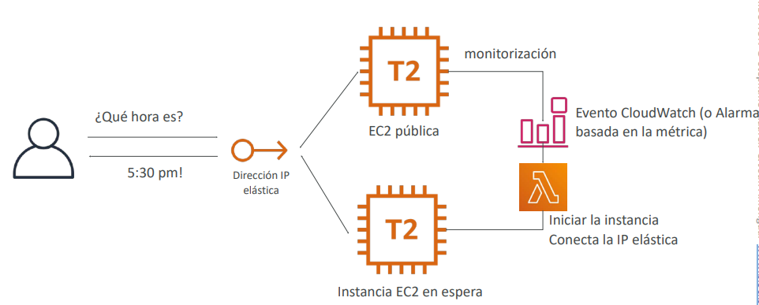

---

### 5.2 Patrón 2: Auto Scaling Group de Tamaño Fijo (1-1-1)
- Se configura un Auto Scaling Group con:
  - Capacidad Mínima = 1.
  - Capacidad Máxima = 1.
  - Capacidad Deseada = 1.
  - Configurado en múltiples Zonas de Disponibilidad ($\ge 2$ AZs).
- Si la instancia falla o la Zona de Disponibilidad se degrada, el ASG termina automáticamente la instancia no saludable y lanza una nueva instancia en una AZ sana.
- **Asignación de IP:** Mediante un script en los datos de usuario de EC2 (*User Data*) y un rol IAM con permisos `ec2:AssociateAddress`, la nueva instancia se autoasigna la Elastic IP fija en el arranque.

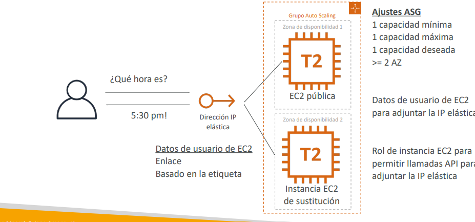

---

### 5.3 Patrón 3: ASG de Tamaño Fijo con Persistencia de EBS y Lifecycle Hooks
Para preservar los datos en un volumen EBS cuando la instancia se reemplaza en otra Zona de Disponibilidad (los volúmenes EBS están bloqueados a su AZ de creación):
1. **Terminación:** Se configura un **ASG Lifecycle Hook** en el evento de terminación. Un script o función Lambda genera un **Snapshot del volumen EBS** y le asigna una etiqueta identificadora antes de destruir la instancia.
2. **Lanzamiento:** Durante el lanzamiento de la nueva instancia en otra AZ, otro Lifecycle Hook restaura el volumen EBS a partir del último snapshot etiquetado en la nueva AZ y lo adjunta a la instancia antes de que comience a procesar tráfico.

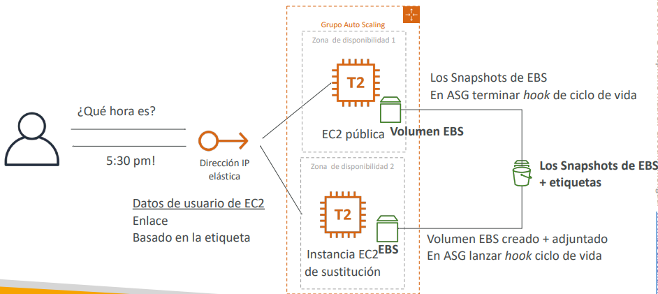

---

## 6. Escenarios de Decisión y Consejos de Examen

> **💡 SAA-C03 Exam Tip:**
> 1. **Bloqueo de IPs detrás de CloudFront:** Si la arquitectura utiliza **CloudFront delante de un Application Load Balancer**, recuerda que el ALB solo recibe conexiones de las direcciones IP de CloudFront. Intentar bloquear una IP maliciosa en la NACL o SG del ALB es inútil o romperá el tráfico legítimo. La solución correcta es configurar una regla de bloqueo de IP en **AWS WAF vinculado a la distribución de CloudFront**.
> 2. **HPC con Comunicación Inter-Nodo Estrechamente Acoplada:** Cuando una pregunta mencione cómputo científico, simulaciones de fluidos o entrenamiento de IA distribuido con **baja latencia entre nodos usando Message Passing Interface (MPI)**, la respuesta arquitectónica obligatoria es **Elastic Fabric Adapter (EFA) dentro de un Placement Group en modo Cluster**.
> 3. **Ingesta Masiva de Streaming sin Servidores:** Para recibir millones de eventos HTTP concurrentes y volcarlos directamente a un flujo de Kinesis sin incurrir en cuellos de botella ni pagar por cómputo de ejecución Lambda, utiliza **API Gateway con integración nativa de servicio AWS a Kinesis Data Streams**.
