# Otros Servicios Especializados de AWS para SAA-C03

En el examen **AWS Certified Solutions Architect - Associate (SAA-C03)**, es común encontrar preguntas que involucran servicios complementarios pero cruciales para la automatización de infraestructura, gestión de costos, comunicaciones empresariales, integración de datos SaaS, entornos híbridos y administración operativa de instancias sin exponer puertos de gestión.

---

## 1. Automatización e Infraestructura como Código: AWS CloudFormation

**AWS CloudFormation** permite modelar, aprovisionar y gestionar recursos de AWS de forma declarativa mediante plantillas en formato JSON o YAML (*Infrastructure as Code - IaC*).

### 1.1 Características y Principios de Diseño
- **Orquestación Declarativa:** El arquitecto declara el estado final deseado (ej. una VPC, un balanceador ALB, un grupo ASG y una base de datos RDS); CloudFormation deduce el orden de dependencias, paraleliza la creación y enlaza los identificadores dinámicamente (`!Ref`, `!GetAtt`).
- **Gobernanza y Costos:** Cada recurso desplegado recibe automáticamente etiquetas de pila (*Stack tags*), lo que simplifica la auditoría de costos en **AWS Cost Explorer**.
- **Service Roles en CloudFormation:** Permite asociar un **IAM Service Role** a la pila para que CloudFormation cree, actualice o elimine recursos en nombre del usuario.
  - **Principio de Mínimo Privilegio:** Permite a los desarrolladores desplegar pilas sin necesidad de tener permisos directos de administración en su usuario IAM, requiriendo únicamente el permiso `iam:PassRole` sobre el rol del servicio de CloudFormation.

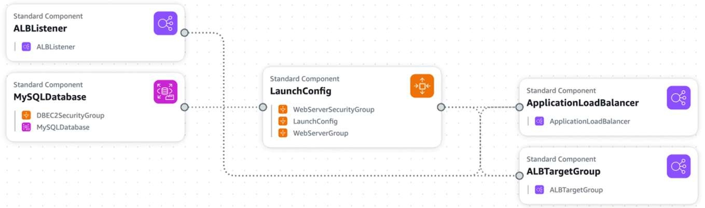

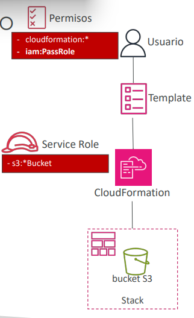

---

## 2. Comunicaciones Masivas: Amazon SES vs Amazon Pinpoint

| Característica | Amazon Simple Email Service (SES) | Amazon Pinpoint |
| :--- | :--- | :--- |
| **Canales Soportados** | **Exclusivamente Correo Electrónico** (entrante y saliente). | **Omnicanal:** Correo electrónico, SMS, notificaciones Push móviles, mensajes de voz y mensajería in-app. |
| **Audiencia y Segmentación** | No gestiona audiencias; la aplicación debe enviar la lista de destinatarios vía API o SMTP. | **Segmentación avanzada de usuarios**, creación de perfiles dinámicos y seguimiento de comportamiento. |
| **Gestión de Campañas** | Envío transaccional puro. | **Campañas de marketing completas**, pruebas A/B, plantillas visuales y flujos de automatización (*Journeys*). |
| **Autenticación** | Soporte nativo para DKIM, SPF, DMARC e IPs dedicadas. | Construido sobre la infraestructura de entrega de SES y SNS. |

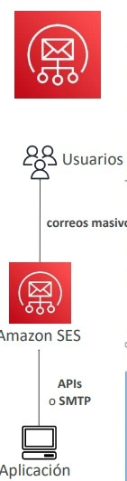

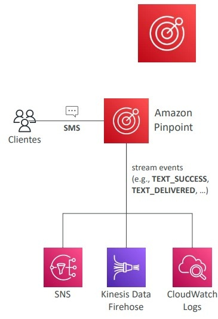

---

## 3. Administración Operativa: AWS Systems Manager (SSM)

**AWS Systems Manager** proporciona una consola unificada para auditar, administrar y aplicar parches en flotas de servidores EC2 y máquinas físicas/virtuales on-premises mediante el **SSM Agent**.

### 3.1 SSM Session Manager (Acceso a Shell Seguro sin SSH)
Permite abrir una terminal interactiva (Bash / PowerShell) en instancias EC2 o servidores locales directamente desde el navegador o la AWS CLI:
- **Cero Exposición de Red:** **NO requiere abrir el puerto 22 (SSH) ni el puerto 3389 (RDP)** en los Security Groups ni asignar direcciones IP públicas.
- **Sin Gestión de Claves SSH:** El acceso se controla estrictamente mediante políticas **AWS IAM**.
- **Auditoría Forense:** Registra cada comando ejecutado en la sesión y retransmite los logs completos hacia **Amazon S3** o **Amazon CloudWatch Logs**.

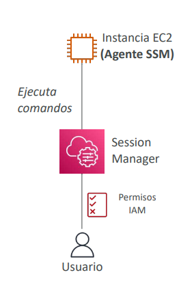

---

### 3.2 SSM Run Command y Maintenance Windows
- **Run Command:** Ejecuta scripts o comandos de configuración de manera controlada y a escala masiva sobre flotas completas de instancias (agrupadas por etiquetas o Resource Groups) sin iniciar sesión interactiva en cada una. Emite el estado a CloudWatch, S3 y SNS.
- **Maintenance Windows (Ventanas de Mantenimiento):** Define calendarios recurrentes (expresiones cron o rate) para ejecutar tareas de mantenimiento programadas (ej. reinicios, instalación de software o parches) limitando el impacto en la disponibilidad mediante umbrales de concurrencia y tolerancia a errores (*Concurrency and Error Thresholds*).

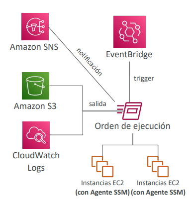

---

### 3.3 SSM Patch Manager y SSM Automation
- **Patch Manager:** Automatiza el escaneo y despliegue de parches del sistema operativo y aplicaciones de seguridad sobre flotas de Linux, Windows y macOS. Utiliza **Líneas Base de Parches (*Patch Baselines*)** para aprobar parches críticos tras un número de días determinado.
- **SSM Automation:** Orquesta flujos de trabajo operativos complejos definidos en **Automation Runbooks** (documentos JSON/YAML). Puede ejecutarse manualmente, programado, mediante eventos de EventBridge, o como acción de remediación automática desde **AWS Config**.

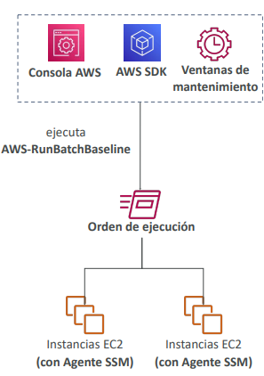

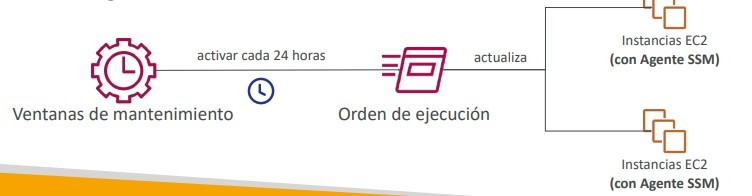

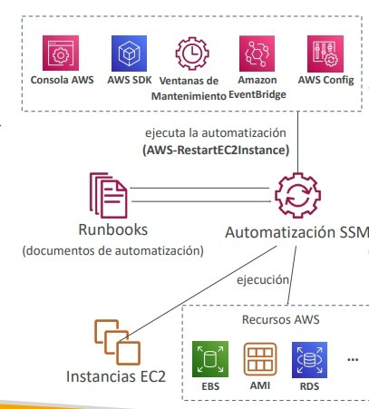

---

## 4. Gestión y Optimización Financiera: Cost Explorer y Anomaly Detection

### 4.1 AWS Cost Explorer
Herramienta de análisis financiero para visualizar, desglosar y proyectar gastos en AWS:
- Muestra el gasto histórico a nivel de servicio, cuenta de AWS Organizations, región o etiqueta de asignación de costos (*Cost Allocation Tags*).
- Granularidad mensual, diaria o por horas.
- Genera recomendaciones de compra para **Savings Plans** e **Instancias Reservadas (RI)** y proyecta gastos hasta 12 meses hacia el futuro.

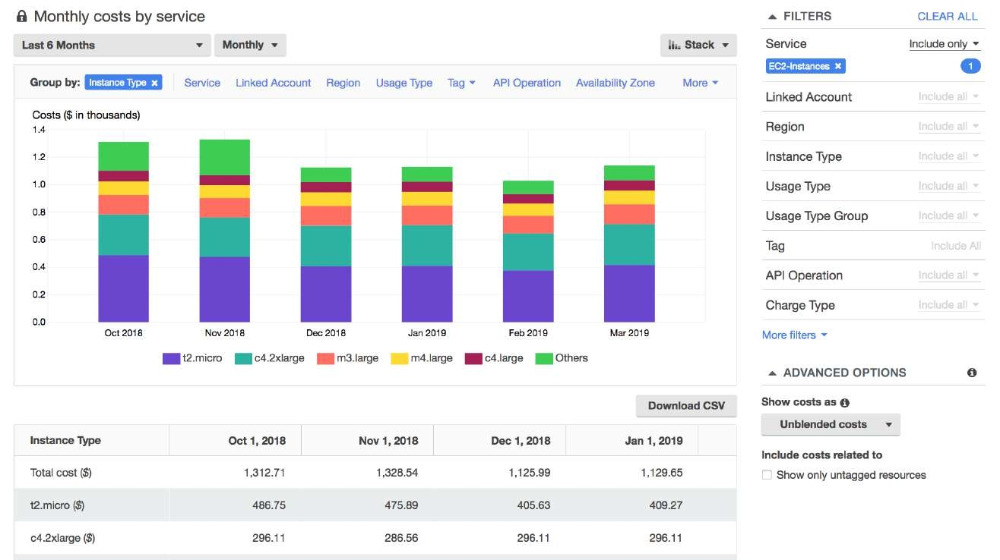

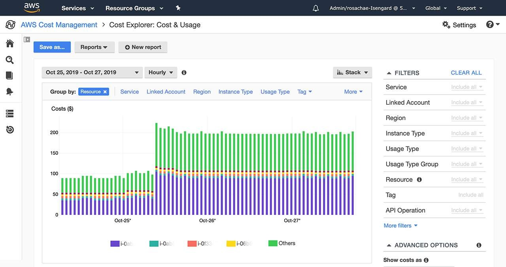

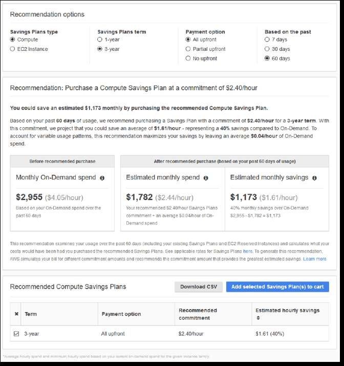

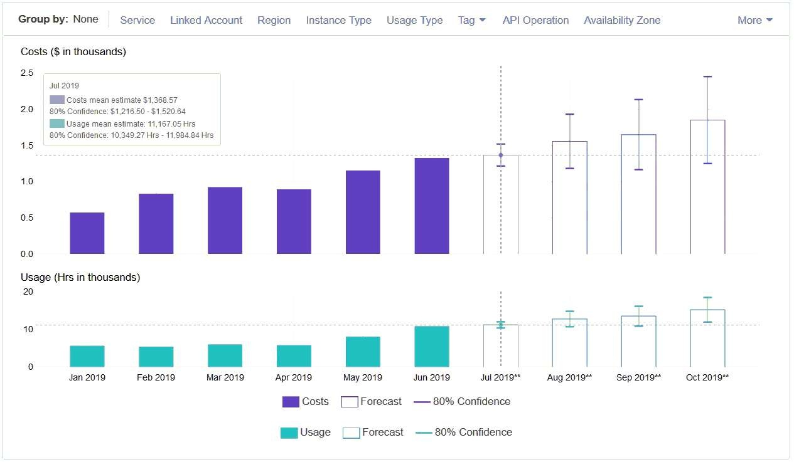

---

### 4.2 AWS Cost Anomaly Detection
Servicio basado en modelos de Machine Learning avanzados que monitorea continuamente patrones de facturación para detectar gastos anómalos o inesperados:
- No requiere que el administrador defina umbrales estáticos arbitrarios; el algoritmo aprende los ciclos habituales de consumo.
- Identifica picos atípicos (ej. un bucle infinito en Lambda o una base de datos mal configurada) y proporciona un **análisis de causa raíz (*Root Cause Analysis*)**.
- Envía alertas inmediatas a través de **Amazon SNS** o resúmenes periódicos por correo electrónico.

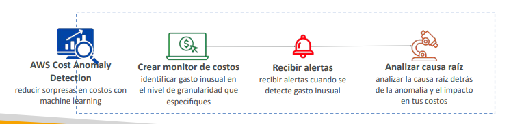

---

## 5. Cómputo Especializado e Híbrido: Outposts, Batch y AppFlow

### 5.1 AWS Outposts: Nube Híbrida Real en el Centro de Datos
Racks físicos de hardware de AWS instalados dentro del centro de datos local del cliente:
- Ejecutan servicios nativos de AWS (**EC2, EBS, S3, EKS, ECS, RDS**) en local con las mismas APIs, consola y herramientas de gestión que en la nube.
- **Casos de Uso Evaluados en SAA-C03:**
  - **Latencia de un solo dígito de milisegundo** hacia sistemas de fabricación industrial o equipos hospitalarios locales.
  - **Residencia estricta y soberanía de datos** donde las regulaciones legales prohíben transferir datos fuera del edificio o país.

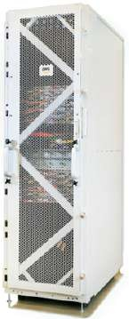

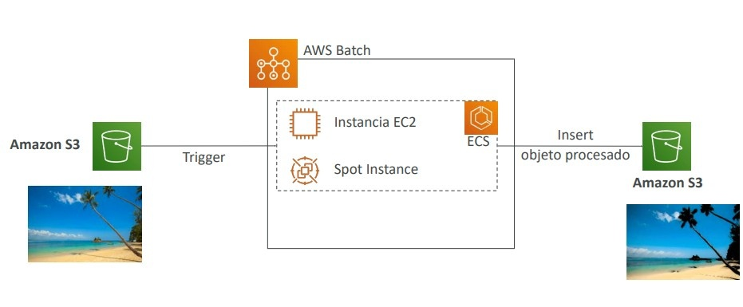

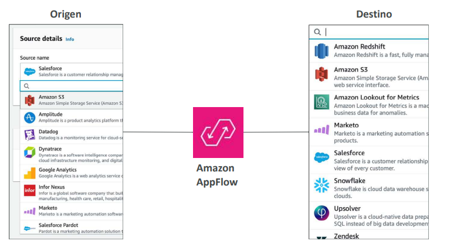

---

### 5.2 AWS Batch vs AWS Lambda

| Criterio | AWS Lambda | AWS Batch |
| :--- | :--- | :--- |
| **Límite de Tiempo** | **Máximo 15 minutos (900 segundos)** por ejecución. | **Sin límite de tiempo** (puede ejecutarse por horas o días). |
| **Modelo de Ejecución** | Serverless puro por eventos. | Administra colas de trabajos y orquesta instancias EC2 / Spot / Fargate. |
| **Empaquetado** | Código postal o imágenes de contenedor (< 10 GB). | **Cualquier imagen Docker** ejecutada sobre Amazon ECS. |
| **Almacenamiento Temporal** | Disco efímero `/tmp` de 512 MB a 10 GB. | Espacio elástico con volúmenes **EBS** o **Instance Store** masivos. |
| **Optimización de Costos** | Pago por milisegundo de ejecución y memoria. | Puede aprovisionar automáticamente **Instancias Spot** para reducir costos hasta un 90%. |

---

### 5.3 Amazon AppFlow: Integración Sin Servidor con Plataformas SaaS
Servicio de integración completamente administrado para transferir datos bidireccionalmente entre aplicaciones SaaS y la nube de AWS:
- **Fuentes Soportadas:** Salesforce, SAP, Zendesk, ServiceNow, Slack, Snowflake.
- **Destinos en AWS:** Amazon S3, Amazon Redshift, Amazon DynamoDB.
- **Seguridad en Tránsito:** Puede configurarse para transferir datos de forma privada a través de **AWS PrivateLink** sin exponer el tráfico a la Internet pública.

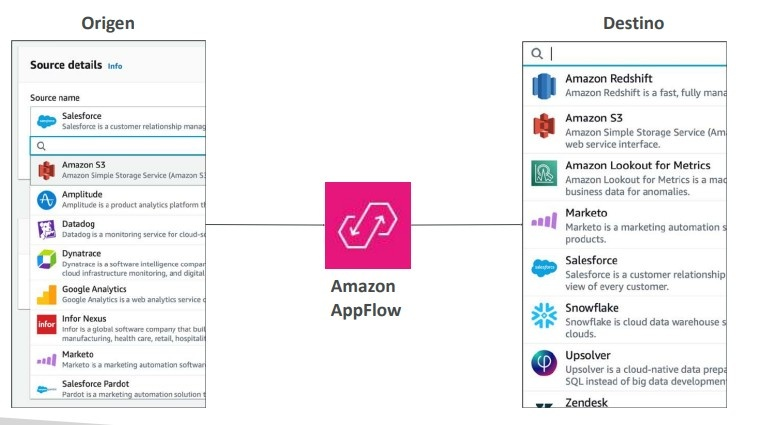

---

## 6. AWS Amplify e Instance Scheduler

### 6.1 AWS Amplify
Plataforma completa para desarrolladores front-end web y móviles que acelera la creación y despliegue de aplicaciones full-stack:
- Integra de forma nativa autenticación (**Cognito**), persistencia (**DynamoDB**), APIs (**AppSync GraphQL y API Gateway REST**), alojamiento estático y CI/CD global (**CloudFront + S3**).

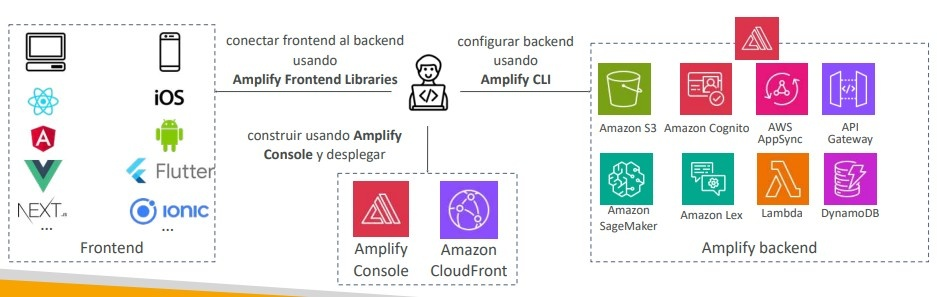

---

### 6.2 Instance Scheduler on AWS
Solución prediseñada de referencia basada en CloudFormation que inicia y detiene automáticamente instancias **Amazon EC2, Amazon RDS y Auto Scaling Groups** en horarios no laborales:
- Permite ahorrar hasta un 70% en costos de desarrollo y pruebas.
- Utiliza etiquetas de recursos y una tabla de **Amazon DynamoDB** para almacenar los horarios de apagado y encendido ejecutados por **AWS Lambda**.

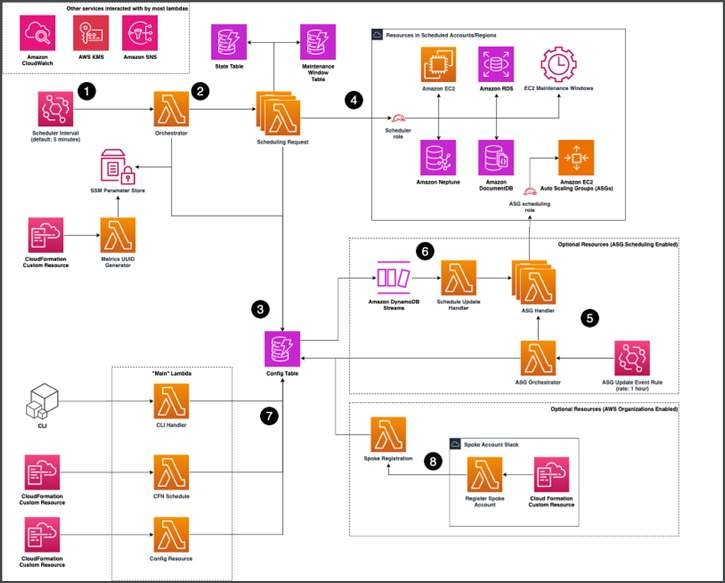

---

## 7. Consejos de Examen y Trampas Clásicas

> **💡 SAA-C03 Exam Tip:**
> 1. **Acceso Seguro a Instancias sin Puerto 22:** Si una pregunta exige conectarse a servidores Linux o Windows en subredes privadas **sin abrir puertos entrantes en los Security Groups, sin Bastion Hosts y sin gestionar pares de claves SSH**, la respuesta correcta es **AWS Systems Manager Session Manager**.
> 2. **Trabajos por Lotes Largos (> 15 Minutos):** Si un proceso por lotes (*batch*) requiere horas de ejecución o depende de dependencias personalizadas empaquetadas en Docker sobre instancias Spot, **descarta AWS Lambda** (límite de 15 minutos) y elige **AWS Batch**.
> 3. **Conexión Privada entre Salesforce y Redshift:** Para sincronizar datos entre Salesforce y Amazon Redshift o S3 con validaciones en vuelo y sin transitar por Internet pública, la solución administrada nativa es **Amazon AppFlow a través de AWS PrivateLink**.
> 4. **Residencia Local de Datos y Latencia Ultrabaja:** Cuando el escenario exija ejecutar instancias EC2 o bases de datos RDS dentro de un centro de datos corporativo por normativas de soberanía de datos, el servicio a seleccionar es **AWS Outposts**.
