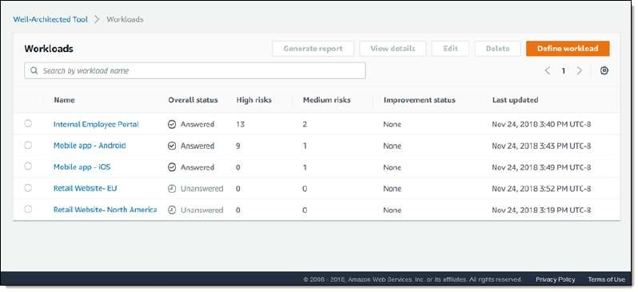
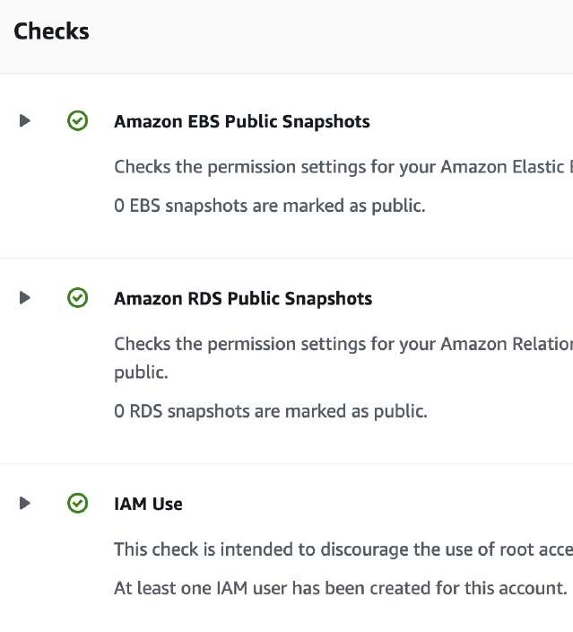

# White Papers y AWS Well-Architected Framework

Para el examen **AWS Certified Solutions Architect - Associate (SAA-C03)**, los principios de diseño y los pilares del **AWS Well-Architected Framework** constituyen la filosofía fundamental sobre la que se construyen todas las preguntas de diseño. Un arquitecto no solo debe memorizar servicios individuales, sino entender cómo combinarlos de forma sinérgica para cumplir con los estándares de excelencia operativa, seguridad estricta, alta fiabilidad, rendimiento eficiente, optimización financiera y sostenibilidad ambiental.

---

## 1. Principios Generales de Diseño en la Nube

El Well-Architected Framework define directrices estratégicas que transforman la forma tradicional de construir infraestructura de TI:

1. **Dejar de adivinar las necesidades de capacidad (*Stop guessing your capacity needs*):** En lugar de aprovisionar hardware para el pico estimado de 3 años, utilizar elasticidad automática (**Auto Scaling**) para ajustar recursos en tiempo real según la demanda.
2. **Probar sistemas a escala de producción (*Test systems at production scale*):** En la nube es posible crear un entorno idéntico a producción mediante **AWS CloudFormation**, ejecutar pruebas de carga masivas a escala real y destruirlo al finalizar, pagando únicamente por las horas de prueba.
3. **Automatizar para facilitar la experimentación (*Automate to make architectural experimentation easier*):** La infraestructura como código permite automatizar despliegues repetibles, reduciendo el costo y riesgo de probar nuevas tecnologías o arquitecturas.
4. **Permitir arquitecturas evolutivas (*Allow for evolutionary architectures*):** Diseñar sistemas modulares desacoplados (microservicios, colas SQS, buses de eventos EventBridge) que puedan evolucionar orgánicamente sin requerir rediseños monolíticos traumáticos.
5. **Impulsar arquitecturas utilizando datos (*Drive architectures using data*):** Recopilar telemetría de rendimiento y costos a través de **CloudWatch, VPC Flow Logs y CloudTrail** para tomar decisiones basadas en métricas empíricas.
6. **Mejorar mediante simulacros (*Improve through game days*):** Simular fallos operativos y picos de tráfico en eventos programados (*GameDays*) para validar la respuesta del equipo y la resiliencia automatizada de la infraestructura.

---

## 2. Los 6 Pilares del AWS Well-Architected Framework

Los pilares no deben verse como compensaciones aisladas (*trade-offs*), sino como dimensiones interdependientes que deben optimizarse en sinergia continua:

| Pilar | Enfoque Central | Servicios Clave de AWS | Mejores Prácticas SAA-C03 |
| :--- | :--- | :--- | :--- |
| **1. Excelencia Operativa (*Operational Excellence*)** | Ejecutar y monitorear sistemas, y mejorar continuamente los procesos de soporte. | CloudFormation, CloudWatch, Systems Manager, EventBridge. | Realizar cambios pequeños y reversibles; definir infraestructura como código; anticipar fallos operativos. |
| **2. Seguridad (*Security*)** | Proteger la información, los sistemas y los activos mediante evaluaciones de riesgo. | IAM, KMS, Shield, WAF, GuardDuty, Macie, Security Hub. | Implementar el principio de mínimo privilegio; cifrar datos en tránsito y en reposo; automatizar la respuesta de seguridad. |
| **3. Fiabilidad (*Reliability*)** | Recuperarse de interrupciones de infraestructura y satisfacer dinámicamente la demanda. | Multi-AZ, Auto Scaling, Route 53, SQS, Aurora Global DB, AWS DRS. | Probar procedimientos de recuperación; escalar horizontalmente para mitigar fallas en hosts individuales; conmutación automática. |
| **4. Eficiencia del Rendimiento (*Performance Efficiency*)** | Utilizar los recursos informáticos de forma eficiente para cumplir con los requisitos. | Auto Scaling, ElastiCache, CloudFront, EFA, Graviton, Lambda. | Adoptar tecnologías avanzadas (Serverless/contenedores); usar motores adecuados al patrón de acceso; almacenar en caché en múltiples niveles. |
| **5. Optimización de Costos (*Cost Optimization*)** | Evitar gastos innecesarios y entender dónde se originan los costos del negocio. | Cost Explorer, Compute Optimizer, Savings Plans, Spot Instances, S3 Lifecycle. | Adoptar un modelo de consumo; medir la eficiencia en función del retorno; desmantelar recursos ociosos. |
| **6. Sostenibilidad (*Sustainability*)** | Minimizar el impacto ambiental de ejecutar cargas de trabajo en la nube. | AWS Graviton (chips ARM eficientes), Serverless, S3 Glacier Flexible/Deep Archive. | Maximizar la utilización de hardware; reducir el movimiento innecesario de datos; elegir regiones con menor huella de carbono. |

---

## 3. Herramientas de Revisión y Asesoramiento

### 3.1 AWS Well-Architected Tool
Servicio de auditoría gratuito disponible en la consola de AWS que permite a los arquitectos evaluar sus cargas de trabajo frente a las mejores prácticas de los 6 pilares:
- **Flujo de Trabajo:** Se define la carga de trabajo (*Workload*), se responden cuestionarios específicos sobre cada pilar y se genera un reporte con planes de acción correctiva y recomendaciones guiadas por video y documentación.
- **Hitos (*Milestones*):** Permite registrar instantáneas en el tiempo para rastrear cómo madura la arquitectura a medida que se mitigan los riesgos altos (*High Risk Issues - HRIs*).

---

### 3.2 AWS Trusted Advisor
Herramienta automatizada de inspección en tiempo real que evalúa la cuenta de AWS frente a las mejores prácticas de la industria en **5 categorías fundamentales**:

1. **Optimización de Costes (*Cost Optimization*):** Identifica instancias EC2 con bajo uso de CPU, volúmenes EBS inactivos/desasociados, direcciones Elastic IP no asignadas y balanceadores de carga ociosos.
2. **Rendimiento (*Performance*):** Detecta cuellos de botella en rendimiento, instancias con alto uso persistente de CPU o reglas deficientes en CloudFront.
3. **Seguridad (*Security*):** Revisa el uso de MFA en la cuenta `root`, puertos de gestión abiertos a `0.0.0.0/0` en Security Groups (puerto 22 o 3389), permisos públicos en buckets de S3 y rotación de claves IAM.
4. **Tolerancia a Fallos (*Fault Tolerance*):** Verifica si las bases de datos RDS están desplegadas en Multi-AZ, si los respaldos de EBS/RDS están activos y si las zonas de disponibilidad están distribuidas en los balanceadores de carga.
5. **Límites de Servicio (*Service Quotas*):** Monitorea el uso de recursos frente a las cuotas máximas de la cuenta (ej. número de VPCs, instancias EC2 o certificados ACM), alertando cuando el consumo supera el 80% del límite permitido.

---

## 4. Comparativa: AWS Trusted Advisor vs AWS Well-Architected Tool

| Criterio | AWS Trusted Advisor | AWS Well-Architected Tool |
| :--- | :--- | :--- |
| **Naturaleza del Servicio** | **Automatizado en tiempo real** (escanea la infraestructura activa de la cuenta). | **Manual / Guiado por cuestionario** (evaluación arquitectónica de diseño). |
| **Categorías de Análisis** | **5 Categorías:** Costo, Rendimiento, Seguridad, Tolerancia a Fallos y Límites de Servicio. | **6 Pilares:** Excelencia Operativa, Seguridad, Fiabilidad, Rendimiento, Costo y Sostenibilidad. |
| **Niveles de Acceso** | **Plan Basic/Developer:** Conjunto limitado de verificaciones básicas (MFA en root, puertos abiertos, cuotas principales). **Plan Business/Enterprise:** Acceso completo a todas las verificaciones y soporte programático vía **AWS Support API**. | **100% Gratuito y completo** para todas las cuentas de AWS. |
| **Resultado** | Alertas operativas de recursos específicos (*Checks* en verde, amarillo o rojo). | Reporte formal de gobernanza con planes de mitigación de riesgos (HRI/MRI). |

---

## 5. Escenarios de Decisión y Consejos de Examen

> **💡 SAA-C03 Exam Tip:**
> 1. **Detección de Recursos Ociosos y Puertos Inseguros:** Si el enunciado pide una herramienta nativa para **identificar volúmenes EBS sin asociar, instancias EC2 subutilizadas y Security Groups con puertos 22/3389 abiertos a todo Internet**, la respuesta correcta es **AWS Trusted Advisor**.
> 2. **Evaluación Formal de Buenas Prácticas:** Cuando la empresa requiere realizar una **revisión integral de una arquitectura frente a las mejores prácticas oficiales de diseño cloud** y generar un plan de acción para los líderes técnicos, el servicio a seleccionar es **AWS Well-Architected Tool**.
> 3. **Pilares vs Categorías de Trusted Advisor:** Recuerda que **Sostenibilidad** y **Excelencia Operativa** son **Pilares del Well-Architected Framework**, mientras que **Límites de Servicio (*Service Limits*)** es una **Categoría exclusiva de Trusted Advisor**.
